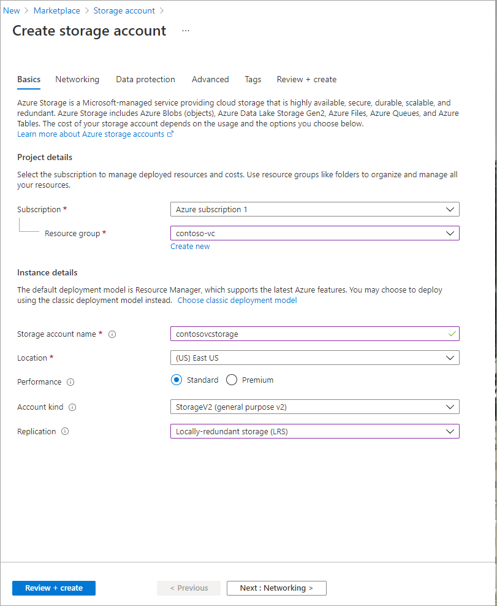
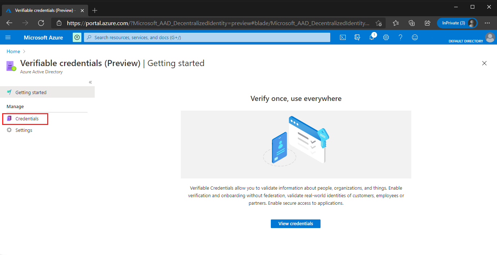
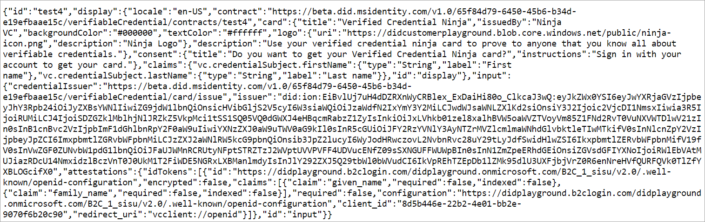
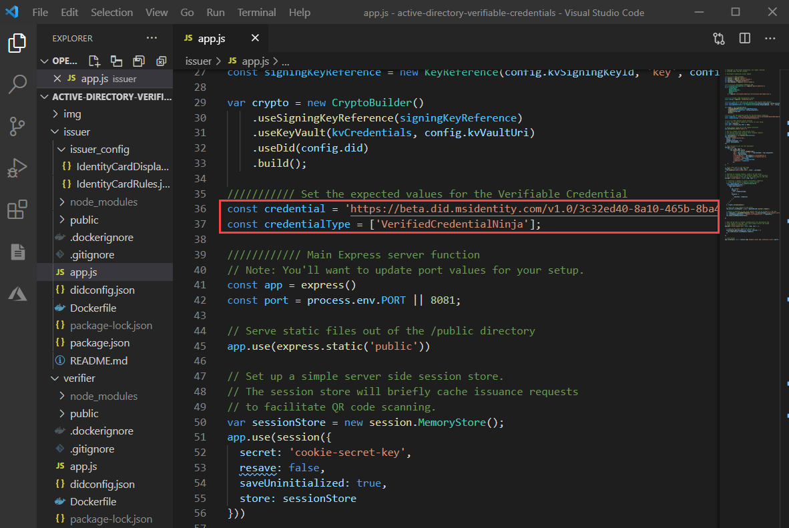
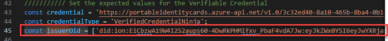

# Tutorial: Modify the sample app to issue verifiable credentials using your tenant (preview)

In the previous tutorial, we enabled verifiable credentials in your tenant using the rule and display files included with our sample app.  In this tutorial, we will take the sample app code running on our test system and make the necessary changes to get it working with your issuer and issue a verifiable credential(vc).

> [!IMPORTANT]
> Verifiable credentials is currently in public preview.
> This preview version is provided without a service level agreement, and it's not recommended for production workloads. Certain features might not be supported or might have constrained capabilities.
> For more information, see [Supplemental Terms of Use for Microsoft Azure Previews](https://azure.microsoft.com/support/legal/preview-supplemental-terms/).

In this article:

> [!div class="checklist"]
> * Create a storage account and a container to store verifiable credentials keys.
> * Make permission changes to allow your account to connect to storage blob.
> * Create rules and display files.
> * Go to  https://aka.ms/vcpreviewportal

## Prerequisites

- Before you can continue, you must complete [the first tutorial](enable-your-tenant-verifiable-credentials.md) and have access to the environment you used.
- You also need the user name and password that you used while completing the [get started](get-started-verifiable-credentials.md) article.


## Create a storage account

We need a storage account to hold the two files we created in the previous step. 

1. Create a storage account using the options shown below. For detailed steps review the [Create a storage account](../../storage/common/storage-account-create.md?tabs=azure-portal) article. 

    - **Subscription:** Choose the subscription that we are using for these tutorials.
    - **Resource group:** Choose the same resource group we used in earlier tutorials (**vc-resource-group**).
    - **Name:**  A unique name.
    - **Location:** (US) EAST US.
    - **Performance:** Standard.
    - **Account kind:** Storage V2.
    - **Replication:** Locally redundant.
 
   

2. After creating the storage account, we need to create a container. Create a container using the values provided below:

    - **Name:** vc-container
    - **Public access level:** Private (no anonymous access)

   

3. Now select your new container and upload both the rules and display files from ```sample app download location\issuer\issuer_config\```

   

## Assign the storage blob role data reader role to your account

Before creating the credential, we need to first give the signed in user the correct role assignment so that they can access the files in Storage Blob.

1. Navigate to **Storage** > **Container**.
2. Choose **Access Control (IAM)** from the menu on the left.
3. Choose **Role Assignments**.
4. Select **Add**.
5. In the **Role** section, choose **Storage Blob Data Reader**.
6. Under **Assign access to** choose **User, group, or service principle**.
7. In **Select**: Choose the account that you are using to perform these steps.
8. Select **Save** to complete the role assignment.


   

  >[!IMPORTANT]
  >By default, container creators get the **Owner** role assigned. Even if you created the container with the account you are using, the **Owner** role is not enough on its own. For more information review [Use the Azure portal to assign an Azure role for access to blob and queue data](../../storage/common/storage-auth-aad-rbac-portal.md) Your account needs  the **Storage Blob Data Reader** role.

At this point, we have taken all necessary steps to start transitioning the sample app from working with our hosted Azure Active Directory environment to yours.

## Create the Ninja Credential VC

In this section, we use the environment we built in your tenant and the rules and display files from the sample app to create a new vc.

1. Copy both the rules and display json files to a temporary folder and rename them **display-example.json** and **sample-ninja-rules.json** respectively. You can find both files under **issuer\issuer_config**

   

   

2. On the Azure portal, navigate to the verifiable credentials preview portal.
3. Select **Credentials** from the verifiable credentials preview page.

   

4. Choose **Create a credential**
5. Under Credential Name, add the name **ninjaCredential**. This name is used in the portal to identify your verifiable credentials and it is included as part of the verifiable credentials contract.

   

6. In the **Display file** section choose **Configure display file**
7. In the **Storage accounts** section, select **contosovcstorage**.
8. From the list of available containers choose **vc-container**.
9. Choose **display-example.json**.
10. From the **Create a new credential** in the **Rules file** section choose **Configure rules file**
11. In the **Storage accounts** section, select **contosovcstorage**
12. Choose **vc-container**.
13. Select **sample-ninja-rules.json**
14. From the **Create a new credential** screen choose **Create**.

### Credential URL

Now that you have a new credential, copy the credential URL.

   

>[!WARNING]
If you try browsing the URL immediately after completing these steps you may receive an unauthorized error message. This is expected and the error clears within five minutes.

## Update the sample app

Now we make modifications to the sample app's issuer code to update it with your verifiable credential URL. This allows you to issue verifiable credentials using your own tenant.

1. Open your Issuer Sample code app.js file.
2. Update the constant 'credential' with your new credential URL and save the file.

    

3. Open a command prompt and open the issuer folder.
4. Run the updated node app.

    ```cmd
    node ./app.js
    ```
5. Using a different command prompt run ngrok to set up a URL on 8081

    ```cmd
    ngrok http 8081
    ```
    
    >[!IMPORTANT]
    > Delete or archive the verifiable credential in your wallet before you issue a credential to yourself. At this time, there is a limitation in Authenticator preventing two verifiable credentials of the same type in Authenticator at the same time. You may also notice a warning about your issuer not yet having [DNS binding](how-to-dnsbind.md) configured. The message is expected at this time.
    
6. Open the HTTPS URL generated by ngrok and test issuing the VC to yourself.

    


## Test verifying the VC using the sample app

Now that we've issued the verifiable credential from our own tenant, let's verify it using our Sample app.

>[!IMPORTANT]
> When testing, use the same email and password that you used during the [get started](get-started-verifiable-credentials.md) article. You need that information because while you are issuing the vc authentication is still handled by the same Azure AD tenant that handled authentication while completing the first tutorial.

1. Open up **Settings** in the verifiable credentials blade in Azure portal. Copy the Issuer identifier.

   

2. Now open up your app.js file in your Verifier Sample code. Set the constant issuerDid to your issuer identifier. 

   

3. Now run your verifier app and present the VC.

4. Stop running your issuer ngrok service.

    ```cmd
    control-c
    ```

5. Now run ngrok with the verifier port 8082.

    ```cmd
    ngrok http 8082
    ```

6. In another terminal window, navigate to the verifier app and run it similarly to how we ran the issuer app.

    ```cmd
    cd ..
    cd verifier
    node app.js
    ```

## Next steps

Now that you have the sample code issuing a VC from your issuer, lets continue o the next section where you use your own identity provider to authenticate users trying to get verifiable credentials.

> [!div class="nextstepaction"]
> [Tutorial - Configure your identity provider using the verifiable credentials sample app](tutorial-03-sample-app-your-idp.md)