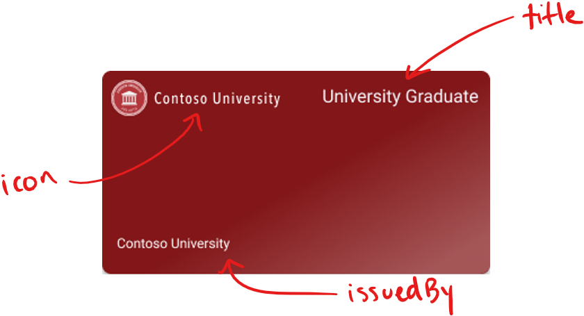
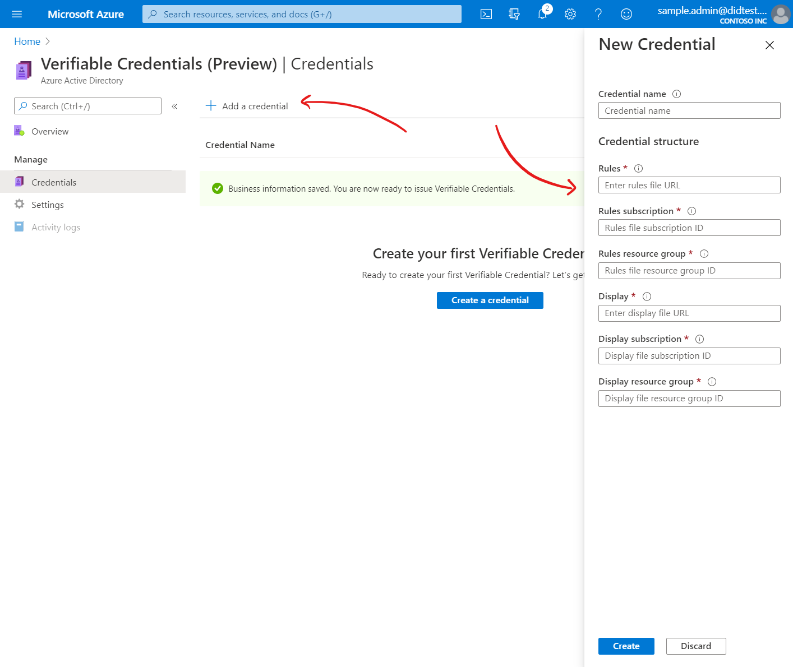
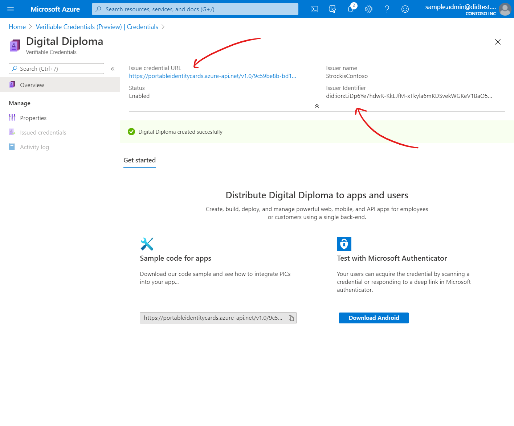

# How to customize your verifiable credentials (preview)

> [!IMPORTANT]
> Azure Verifiable Credentials is currently in public preview.
> This preview version is provided without a service level agreement, and it's not recommended for production workloads. Certain features might not be supported or might have constrained capabilities.
> For more information, see [Supplemental Terms of Use for Microsoft Azure Previews](https://azure.microsoft.com/support/legal/preview-supplemental-terms/).

Verifiable Credentials are made up of two components, the rules and display files. The Rules file determines what the user needs to do in order to receive a Verifiable Credential and the Display File controls the branding of the credential and styling of the claims. In this guide, we will explain how to modify both files to meet the requirements of your organization. 

## Rules File: Requirements from the user

There are currently 4 inputs that that are available in order for the Verifiable Credential Issuing service to insert a claim and sign it with your DID. 

- ID Token
- Verifiable Credentials 
- Self Issued Claims
- Hard Coded Claims

**ID Token:** The Sample App and Tutorial use the ID Token. When this option is selected, you will need to provide an Open ID Connect configuration URI and include the claims that should be included in the VC. The user will be promoted to 'Sign In' on the Authenticator app in order to meet this requirement and add the associated claims from their account. 

// insert image 

**Verifiable Credentials:** The end result of an issuance flow is to produce a Verifiable Credential but you may also ask the user to Present a Verifiable Credential in order to issue one. The Rules File is able to take specific claims from the presented Verifiable Credential and include those claims in the newly issued Verifiable Credential from your organization. 

// insert image 

**Self Issued Claims:** When this option is selected, the user will be able to directly type information into Authenticator 

// insert image 

The rules file is a simple JSON file that describes important properties of verifiable credentials. In particular it describes how claims are used to populate your Verifiable Credentials. The rules file has the following structure.


    ```json
    {
      "attestations": {
        "idTokens": [
          {
            "mapping": {
              "firstName": { "claim": "given_name" },
              "lastName": { "claim": "family_name" }
            },
            "configuration": "https://dIdPlayground.b2clogin.com/dIdPlayground.onmicrosoft.com/B2C_1_sisu/v2.0/.well-known/openid-configuration",
            "client_id": "8d5b446e-22b2-4e01-bb2e-9070f6b20c90",
            "redirect_uri": "vcclient://openid/",
             "scope": "openid profile"
          }
        ]
      },
      "validityInterval": 2592000,
      "vc": {
        "type": ["VerifiedCredentialNinja"]
      }
    }
    ```

| Property | Description |
| -------- | ----------- |
| `vc.type` | An array of strings indicating the schema(s) that your Verifiable Credential satisfies. See the section below. |
| `validityInterval` | A time duration, in seconds, representing the lifetime of your Verifiable Credentials. After this time period elapses, the Verifiable Credential will no longer be valid. Omitting this value means that each Verifiable Credential will remain valid until is it explicitly revoked. |
| `attestations.idTokens` | An array of OpenID Connect identity providers that are supported for sourcing user information. |
| `...mapping` | An object that describes how claims in each ID token are mapped to attributes in the resulting Verifiable Credential. |
| `...mapping.{attribute-name}` | The attribute that should be populated in the resulting Verifiable Credential. |
| `...mapping.{attribute-name}.claim` | The claim in ID tokens whose value should be used to populate the attribute. |
| `...configuration` | The location of your identity provider's configuration document. This URL must adhere to the [OpenID Connect standard for identity provider metadata](https://openid.net/specs/openid-connect-discovery-1_0.html#ProviderMetadata). The configuration document must include the `issuer`, `authorization_endpoint`, `token_endpoint`, and `jwks_uri` fields. |
| `...client_id` | The client ID obtained during the client registration process. |
| `...scopes` | A space delimited list of scopes the IDP needs to be able to return the correct claims in the ID token. |
| `...redirect_uri` | Must always use the value `portableidentity://verify`. |


To issue verifiable credentials, you need to construct your own rules file. Begin with the example given above, and change the following values.

1. Modify the `credentialIssuer` value to use your Azure AD tenant ID.

2. Modify the `vc.type` value to reflect the type of your credential. See the section below.

3. Modify the `mapping` section, so that claims from your identitiy provider are mapped to attributes of your Verifiable Credential.

4. Modify the `configuration` and `client_id` values to the values you prepared in the section above.

## Choose credential type(s)

All Verifiable Credentials must declare their "type" in their rules file. The type of a credential distinguishes your Verifiable Credentials from credentials issued by other organizations and ensures interoperability between issuers and verifiers. To indicate a credential type, you must provide one or more credential types that the credential satisfies. Each type is represented by a unique string - often a URI will be used to ensure global uniqueness. The URI does not need to be addressable; it is treated as a string. 

As an example, a diploma credential issued by Contoso University might declare the following types:

| Type | Purpose |
| ---- | ------- |
| `https://schema.org/EducationalCredential` | Declares that diplomas issued by Contoso University contain attributes defined by schema.org's `EducationaCredential` object. |
| `https://schemas.ed.gov/universityDiploma2020` | Declares that diplomas issued by Contoso University contain attributes defined by the United States department of education. |
| `https://schemas.contoso.edu/diploma2020` | Declares that diplomas issued by Contoso University contain attributes defined by Contoso University. |

By declaring all three types, Contoso University's diplomas can be used to satisfy different requests from verifiers. A bank can request a set of `EducationCredential`s from a user, and the diploma can be used to satisfy the request. But the Contoso University Alumni Association can request a credential of type `https://schemas.contoso.edu/diploma2020`, and the diploma will also satisfy the request.

To ensure interoperability of your credentials, it's recommended that you work closely with related organizations to define credential types, schemas, and URIs for use in your industry. Many industry bodies provide guidance on the structure of official documents that can be repurposed for defining the contents of Verifiable Credentials. You should also work closely with the verifiers of your credentials to understand how they intend to request and consume your Verifiable Credentials.


## Cards in Microsoft Authenticator

Verifiable Credentials offer a limited set of options that can be used to reflect your brand. This article provides instructions how to customize your credentials, and best practices for designing credentials that look great once issued to users.

Verifiable Credentials issued to users are displayed as cards in Microsoft Authenticator. As the administrator, you may choose card color, icon, and text strings to match your organization's brand.



Cards also contain customizable fields that you can use to let users know the purpose of the card, the attributes it contains, and more.

## Create a credential display file

Much like the rules file, the display file is a simple JSON file that describes how the contents of your Verifiable Credentials should be displayed in the Microsoft Authenticator app. 

>[!NOTE]
> At this time, this display model is only used by Microsoft Authenticator.

The display file has the following structure.

```json
{
    "default": {
      "locale": "en-US",
      "card": {
        "title": "University Graduate",
        "issuedBy": "Contoso University",
        "backgroundColor": "#212121",
        "textColor": "#FFFFFF",
        "logo": {
          "uri": "https://contoso.edu/images/logo.png",
          "description": "Contoso University Logo"
        },
        "description": "This digital diploma is issued to students and alumni of Contoso University."
      },
      "consent": {
        "title": "Do you want to get your digital diploma from Contoso U?",
        "instructions": "Please log in with your Contoso U account to receive your digital diploma."
      },
      "claims": {
        "vc.credentialSubject.name": {
          "type": "String",
          "label": "Name"
        },
        "vc.credentialSubject.major": {
            "type": "String",
            "label": "Major"
          },
          "vc.credentialSubject.date": {
            "type": "String",
            "label": "Date Issued"
          },
          "vc.credentialSubject.studentId": {
            "type": "String",
            "label": "Student ID Number"
          }
      }
    }
}
```

| Property | Description |
| -------- | ----------- |
| `locale` | The language of the Verifiable Credential. Reserved for future use. | 
| `card.title` | Displays the type of credential to the user. Recommended maximum length of 25 characters. | 
| `card.issuedBy` | Displays the name of the issuing organization to the user. Recommended maximum length of 40 characters. |
| `card.backgroundColor` | Determines the background color of the card, in hex format. A subtle gradient will be applied to all cards. |
| `card.textColor` | Determines the text color of the card, in hex format. Recommended to use black or white. |
| `card.logo` | A logo that is displayed on the card. The URL provided must be publicly addressable. Recommended maximum height of 50 px, and maximum width of 200 px. | 
| `card.description` | Supplemental text displayed alongside each card. Can be used for any purpose. Recommended maximum length of 100 characters. |
| `consent.title` | Supplemental text displayed when a card is being issued. Used to provide details about the issuance process. Recommended length of 100 characters. |
| `consent.instructions` | Supplemental text displayed when a card is being issued. Used to provide details about the issuance process. Recommended length of 100 characters. |
| `claims` | Allows you to provide labels for attributes included in each credential. |
| `claims.{attribute}` | Indicates the attribute of the credential to which the label applies. |
| `claims.{attribute}.label` | The value that should be used as a label for the attribute. Recommended maximum length of 40 characters. |

To issue verifiable credentials, you need to construct your own display file. Begin with the example given above, and change the following values.

1. Modify all values in the `card` and `consent` sections to your desired values.
2. For each attribute you declared in the `mapping` section of your rules file, add an entry in the `claims` section of your display file. Each entry provides a label that should be used for the corresponding attribute in your Verifiable Credential.
3. Provide a temporary value for the `contract`. After creating your credential in the Azure portal, you will need to replace this value with the **Issue Credential URL** generated by the Azure portal.

## Upload the display file

Once you've constructed your display file, you must upload the file to your Azure Blob Storage account to be used by the issuer service when issuing Verifiable Credentials.

1. Upload your rules file with a `.json` extension to the same Azure Storage container where you uploaded your rules file. Once uploaded, copy the URL to your display file blob from the Azure portal. The URL should be similar to `https://mystorage.blob.core.windows.net/mycontainer/MyCredentialDisplayFile.json`, without any spaces or special characters.

2.  In the Azure portal, navigate to the **Verifiable Credentials (Preview)** blade in your Azure AD tenant. In the same **Add a credential** step, paste the URL to your display file in the **Card Structure** section. You must also provide the subscription ID for your Azure subscription, and the resource group in which you created your Azure Blob Storage account.

  

3. Select **Create** to finish creating your Verifiable Credential. Once you've created the credential, locate the **Issue credential URL** and the **Issuer Identifier** for your credential. Copy their values - you'll need them later in the tutorial.

   

You've now successfully defined the properties and contents of your Verifiable Credential. If you'd like to reference a working example of a display file, see our [code sample on GitHub](https://github.com/Azure-Samples/active-directory-verifiable-credentials).

To check if your rules and display file have been uploaded correctly, you can click on the Issuer credential URL link that will open a JSON file in a new tab if successful. If the issuer service cannot access your files, you should receive an error message.

## Next steps

- When your credential has been created and you've copied the necessary values, you can continue to review [manage credential revocation](credential-revoke.md).
