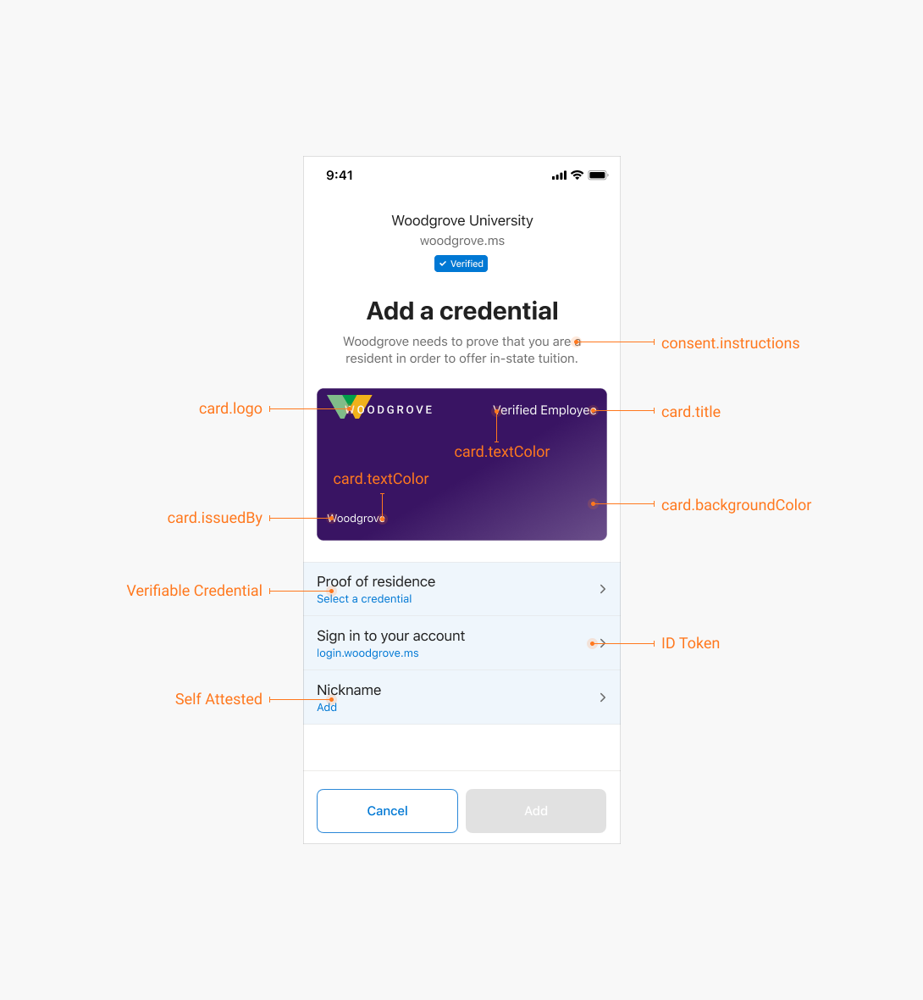

# Customize your verifiable credentials (preview)

[!INCLUDE [verifiable credentials announcement](../../../includes/verifiable-credentials-brand.md)]

Verifiable credentials are made up of two components, *rules* definitions and *display* definitions. A rules definition determines what users need to provide before they receive a verifiable credential. A display definition controls the branding of the credential and styling of the claims. 

This article explains how to modify both types of files to meet the requirements of your organization. 

> [!IMPORTANT]
> Microsoft Entra Verified ID is currently in preview. This preview version is provided without a service-level agreement, and it's not recommended for production workloads. Certain features might not be supported or might have constrained capabilities.
> For more information, see [Supplemental Terms of Use for Microsoft Azure Previews](https://azure.microsoft.com/support/legal/preview-supplemental-terms/).

## Rules definition: Requirements from the user

The rules definition is a simple JSON document that describes important properties of verifiable credentials. In particular, it describes how claims are used to populate your verifiable credential.

### User-input types

The following four user-input types are currently available to be configured in the rules definition. They're used by the verifiable credential issuing service to insert claims into a verifiable credential and attest to that information with your decentralized identifier (DID).

* **ID token**: When this option is configured, you'll need to provide an Open ID Connect configuration URI and include the claims that should be included in the verifiable credential. Users are prompted to 'Sign in' on the Authenticator app to meet this requirement and add the associated claims from their account. 

* **ID token hint**: The sample App and Tutorial use the ID token Hint. When this option is configured, the relying party app will need to provide claims that should be included in the verifiable credential in the Request Service API issuance request. Where the relying party app gets the claims from is up to the app, but it can come from the current sign-in session, from backend CRM systems or even from self asserted user input. 

* **Verifiable credentials**: The end result of an issuance flow is to produce a verifiable credential but you may also ask the user to Present a verifiable credential in order to issue one. The rules definition is able to take specific claims from the presented verifiable credential and include those claims in the newly issued verifiable credential from your organization. 

* **Self-attested claims**: When this option is selected, the user can type information directly into Authenticator. At this time, strings are the only supported input for self attested claims. 

    

### Static claims

Additionally, you can declare a static claim in the rules definition, but this input doesn't come from the user. The issuer defines a static claim in the rules definition, and it looks like any other claim in the verifiable credential. You add credentialSubject after vc.type and declare the attribute and the claim. 

```json
"vc": {
    "type": [ "StaticClaimCredential" ],
    "credentialSubject": {
      "staticClaim": true,
      "anotherClaim": "Your Claim Here"
    },
  }
}
```

## Input type: ID token

To get an ID token as input, the rules definition needs to configure the well-known endpoint of the OpenID Connect (OIDC)-compatible identity system. In that system you need to register an application with the correct information from the [Issuer service communication examples](issuer-openid.md). Additionally, you need to put client_id in the rules definition and fill in a scope parameter with the correct scopes. For example, Azure Active Directory needs the email scope if you want to return an email claim in the ID token.

```json
  {
      "attestations": {
        "idTokens": [
          {
            "mapping": [
              { 
                "outputClaim": "firstName", 
                "inputClaim": "given_name",
                "required": true,
                "indexed": false                 
              },
              { 
                "outputClaim": "lastName", 
                "inputClaim": "family_name",
                "required": true,
                "indexed": true                 
              }
            ],
            "configuration": "https://dIdPlayground.b2clogin.com/dIdPlayground.onmicrosoft.com/B2C_1_sisu/v2.0/.well-known/openid-configuration",
            "client_id": "8d5b446e-22b2-4e01-bb2e-9070f6b20c90",
            "redirect_uri": "vcclient://openid/",
            "scope": "openid profile"
          }
        ]
      },
      "validityInterval": 2592000,
      "vc": {
        "type": ["https://schema.org/EducationalCredential", "https://schemas.ed.gov/universityDiploma2020", "https://schemas.contoso.edu/diploma2020" ]
      }
    }
```

For more information about properties, see [idTokenAttestation type](rules-and-display-definitions-model.md#idtokenattestation-type).

## Input type: ID token hint

To get an ID token hint as input, the rules definition shouldn't contain configuration for an OIDC identity system. Instead, it should have the special value `https://self-issued.me` for the configuration property. The claims mappings are the same as for the ID token type, but the difference is that the claim values need to be provided by the issuance relying party app in the Request Service API issuance request.

```json
  {
      "attestations": {
        "idTokenHints": [
          {
            "configuration": "https://self-issued.me",
            "mapping": [
              { 
                "outputClaim": "firstName", 
                "inputClaim": "given_name",
                "required": true,
                "indexed": false                 
              },
              { 
                "outputClaim": "lastName", 
                "inputClaim": "family_name",
                "required": true,
                "indexed": true                 
              }
            ]
          }
        ]        
      },
      "validityInterval": 2592000,
      "vc": {
        "type": ["VerifiedCredentialExpert" ]
      }
    }
```

For more information about properties, see [idTokenHintAttestation type](rules-and-display-definitions-model.md#idtokenhintattestation-type).

### vc.type: Choose credential types 

All verifiable credentials must declare their *type* in their rules definition. The credential type distinguishes your verifiable credentials from credentials that are issued by other organizations, and it ensures interoperability between issuers and verifiers. 

To indicate a credential type, provide one or more credential types that the credential satisfies. Each type is represented by a unique string. Often, a URI is used to ensure global uniqueness. The URI doesn't need to be addressable. It's treated as a string. 

As an example, a diploma credential issued by Contoso University might declare the following types:

| Type | Purpose |
| ---- | ------- |
| `https://schema.org/EducationalCredential` | Declares that diplomas issued by Contoso University contain attributes defined by the schema.org `EducationaCredential` object. |
| `https://schemas.ed.gov/universityDiploma2020` | Declares that diplomas issued by Contoso University contain attributes defined by the U.S. Department of Education. |
| `https://schemas.contoso.edu/diploma2020` | Declares that diplomas issued by Contoso University contain attributes defined by Contoso University. |

By declaring three types of diplomas, Contoso can issue credentials that satisfy different requests from verifiers. A bank can request a set of `EducationCredential`s from a user, and the diploma can be used to satisfy the request. Or the Contoso University Alumni Association can request a credential of type `https://schemas.contoso.edu/diploma2020`, and the diploma can also satisfy the request.

To ensure interoperability of your credentials, we recommend that you work closely with related organizations to define credential types, schemas, and URIs for use in your industry. Many industry bodies provide guidance on the structure of official documents that can be repurposed for defining the contents of verifiable credentials. You should also work closely with the verifiers of your credentials to understand how they intend to request and consume your verifiable credentials.

## Input type: Verifiable credential

> [!NOTE]
> Rules definitions that ask for a verifiable credential don't use the presentation exchange format for requesting credentials. This approach will be updated when the issuing service supports the standard, Credential Manifest. 

```json
{
    "attestations": {
      "presentations": [
        {
            "mapping": [
              { 
                "outputClaim": "first_name", 
                "inputClaim": "$.vc.credentialSubject.firstName ",
                "required": true,
                "indexed": false                 
              },
              { 
                "outputClaim": "last_name", 
                "inputClaim": ""$.vc.credentialSubject.lastName ",
                "required": true,
                "indexed": true                 
              },
          "credentialType": "VerifiedCredentialNinja",
          "contracts": [
            "https://beta.did.msidentity.com/v1.0/3c32ed40-8a10-465b-8ba4-0b1e86882668/verifiableCredential/contracts/VerifiedCredentialNinja"
          ],
          "issuers": [
            {
              "iss": "did:ion:123"
            }
          ]
        }
      ]
    },
    "validityInterval": 25920000,
    "vc": {
      "type": [
        "ProofOfNinjaNinja"
      ]
    }
}
```

For more information about properties, see [verifiablePresentationAttestation type](rules-and-display-definitions-model.md#verifiablepresentationattestation-type).

## Input type: Self-attested claims

During the issuance flow, users can be asked to input some self-attested information. As of now, the only input type is 'string'. 

```json
{
  "attestations": {
    "selfIssued" :
    {
            "mapping": [
              { 
                "outputClaim": "firstName", 
                "inputClaim": "firstName",
                "required": true,
                "indexed": false                 
              },
              { 
                "outputClaim": "lasttName", 
                "inputClaim": "lastName",
                "required": true,
                "indexed": true                 
              }


    }
  },
  "validityInterval": 2592001,
  "vc": {
    "type": [ "VerifiedCredentialExpert" ]
  }
}
```

For more information about properties, see [selfIssuedAttestation type](rules-and-display-definitions-model.md#selfissuedattestation-type).

## Display definition: Verifiable credentials in Microsoft Authenticator

Verifiable credentials offer a limited set of options that can be used to reflect your brand. This article provides instructions how to customize your credentials, and best practices for designing credentials that look great after they're issued to users.

Authenticator displays verifiable credentials that are issued to users as cards. As an administrator, you can choose card colors, icons, and text strings to match your organization's brand.

 

Cards also contain customizable fields. You can use these fields to let users know the purpose of the card, the attributes it contains, and more.

## Create a credential display definition

Much like the rules definition, the display definition is a simple JSON document that describes how the Authenticator app should display the contents of your verifiable credentials.

>[!NOTE]
> This display model is currently used only by Microsoft Authenticator.

The display definition has the following structure:

```json
{
    "default": {
      "locale": "en-US",
      "card": {
        "title": "University Graduate",
        "issuedBy": "Contoso University",
        "backgroundColor": "#212121",
        "textColor": "#FFFFFF",
        "logo": {
          "uri": "https://contoso.edu/images/logo.png",
          "description": "Contoso University Logo"
        },
        "description": "This digital diploma is issued to students and alumni of Contoso University."
      },
      "consent": {
        "title": "Do you want to get your digital diploma from Contoso U?",
        "instructions": "Please log in with your Contoso U account to receive your digital diploma."
      },
      "claims": [
        {
          "claim": "vc.credentialSubject.name",
          "type": "String",
          "label": "Name"
        }
      ]
    }
}
```

For more information about properties, see [displayModel type](rules-and-display-definitions-model.md#displaymodel-type).

## Next steps

Now that you have a better understanding of verifiable credential design and how to create your own, see:

- [Issuer service communication examples](issuer-openid.md)
- [Rules and display definition reference](rules-and-display-definitions-model.md)
