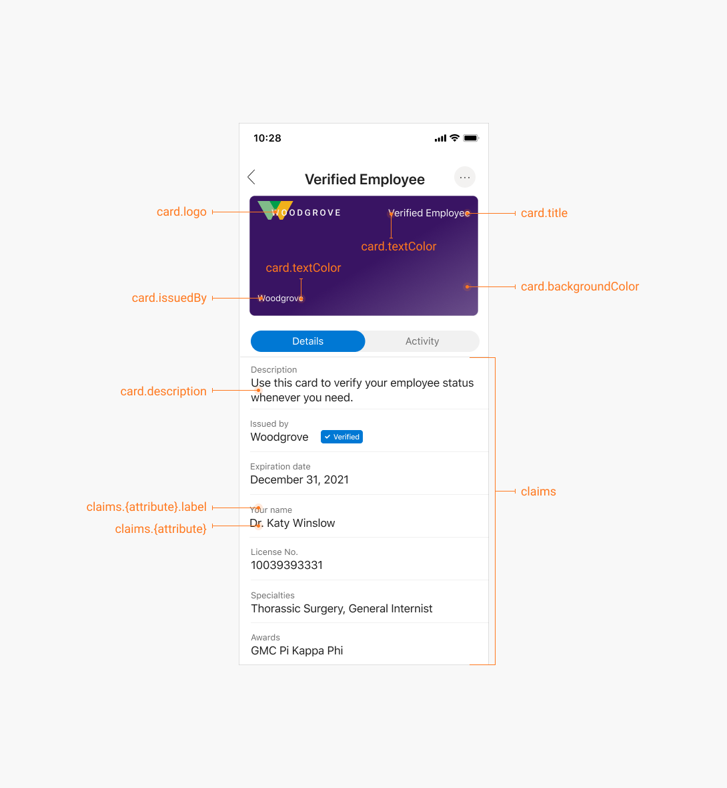

# Customize your verifiable credentials

[!INCLUDE [verifiable credentials announcement](../../../includes/verifiable-credentials-brand.md)]

Verifiable credentials definitions are made up of two components, *display* definitions and *rules* definitions. A display definition controls the branding of the credential and styling of the claims. A rules definition determines what users need to provide before they receive a verifiable credential.  

This article explains how to modify both types of definitions to meet the requirements of your organization. 

## Display definition: wallet credential visuals

Microsoft Entra Verified ID offer a limited set of options that can be used to reflect your brand. This article provides instructions how to customize your credentials, and best practices for designing credentials that look great after they're issued to users.

Microsoft Authenticator, being a decentralized identities wallet, displays verifiable credentials that are issued to users as cards. As a VC administrator, you can choose card colors, icons, and text strings to match your organization's brand.

 

Cards also contain customizable fields. You can use these fields to let users know the purpose of the card, the attributes it contains, and more.

## Create a credential display definition

The display definition is a simple JSON document that describes how the wallet app should display the contents of your verifiable credentials.

>[!NOTE]
> This display model is currently used only by Microsoft Authenticator.

The display definition has the following structure:

```json
{
    "locale": "en-US",
    "card": {
      "title": "Verified Credential Expert",
      "issuedBy": "Microsoft",
      "backgroundColor": "#000000",
      "textColor": "#ffffff",
      "logo": {
        "uri": "https://didcustomerplayground.blob.core.windows.net/public/VerifiedCredentialExpert_icon.png",
        "description": "Verified Credential Expert Logo"
      },
      "description": "Use your verified credential to prove to anyone that you know all about verifiable credentials."
    },
    "consent": {
      "title": "Do you want to get your Verified Credential?",
      "instructions": "Sign in with your account to get your card."
    },
    "claims": [
      {
        "claim": "vc.credentialSubject.firstName",
        "label": "First name",
        "type": "String"
      },
      {
        "claim": "vc.credentialSubject.lastName",
        "label": "Last name",
        "type": "String"
      }
    ]
}
```

For more information about properties, see [displayModel type](rules-and-display-definitions-model.md#displaymodel-type).

## Rules definition: Requirements from the user

The rules definition is a simple JSON document that describes important properties of verifiable credentials. In particular, it describes how claims are used to populate your verifiable credential and the credential type.

```json
{
  "attestations": {
      ...
  },
  "validityInterval":  2592000,
  "vc": {
    "type": [
      "VerifiedCredentialExpert"
    ]
  }
}
```

### Attestations

The following four attestation types are currently available to be configured in the rules definition. They are different ways of providing claims used by the Microsoft Entra Verified ID issuing service to be inserted into a verifiable credential and attest to that information with your decentralized identifier (DID). Multiple attestation types can be used in the rules definition. 

* **ID token**: When this option is configured, you'll need to provide an OpenID Connect configuration URI and include the claims that should be included in the verifiable credential. Users are prompted to 'Sign in' on the Authenticator app to meet this requirement and add the associated claims from their account. To configure this option, see this [how to guide](how-to-use-quickstart-idtoken.md)


* **ID token hint**: The sample App and Tutorial use the ID token Hint. When this option is configured, the relying party app will need to provide claims that should be included in the verifiable credential in the Request Service API issuance request. Where the relying party app gets the claims from is up to the app, but it can come from the current sign-in session, from backend CRM systems or even from self asserted user input. To configure this option, please see this [how to guide](how-to-use-quickstart.md)

* **Verifiable credentials**: The end result of an issuance flow is to produce a verifiable credential but you may also ask the user to Present a verifiable credential in order to issue one. The rules definition is able to take specific claims from the presented verifiable credential and include those claims in the newly issued verifiable credential from your organization.  To configure this option, please see this [how to guide](how-to-use-quickstart-presentation.md)

* **Self-attested claims**: When this option is selected, the user can type information directly into Authenticator. At this time, strings are the only supported input for self attested claims. To configure this option, please see this [how to guide](how-to-use-quickstart-selfissued.md)

For more information about the rules JSON model, see [rulesModel type](rules-and-display-definitions-model.md#rulesmodel-type).

### Credential Types 

All verifiable credentials must declare their *type* in their [rules definition](rules-and-display-definitions-model.md#rulesmodel-type). The credential type distinguishes a verifiable credentials schema from other credentials and it ensures interoperability between issuers and verifiers. To indicate a credential type, provide one or more credential types that the credential satisfies. Each type is represented by a unique string. Often, a URI is used to ensure global uniqueness. The URI doesn't need to be addressable. It's treated as a string. As an example, a diploma credential issued by Contoso University might declare the following types:

| Type | Purpose |
| ---- | ------- |
| `https://schema.org/EducationalCredential` | Declares that diplomas issued by Contoso University contain attributes defined by the schema.org `EducationaCredential` object. |
| `https://schemas.ed.gov/universityDiploma2020` | Declares that diplomas issued by Contoso University contain attributes defined by the U.S. Department of Education. |
| `https://schemas.contoso.edu/diploma2020` | Declares that diplomas issued by Contoso University contain attributes defined by Contoso University. |

By declaring three types of diplomas, Contoso can issue credentials that satisfy different requests from verifiers. A bank can request a set of `EducationCredential`s from a user, and the diploma can be used to satisfy the request. Or the Contoso University Alumni Association can request a credential of type `https://schemas.contoso.edu/diploma2020`, and the diploma can also satisfy the request.

To ensure interoperability of your credentials, we recommend that you work closely with related organizations to define credential types, schemas, and URIs for use in your industry. Many industry bodies provide guidance on the structure of official documents that can be repurposed for defining the contents of verifiable credentials. You should also work closely with the verifiers of your credentials to understand how they intend to request and consume your verifiable credentials.

## Next steps

Now that you have a better understanding of verifiable credential design and how to create your own, see:

- [Issuer service communication examples](issuer-openid.md)
- [Rules and display definition reference](rules-and-display-definitions-model.md)
