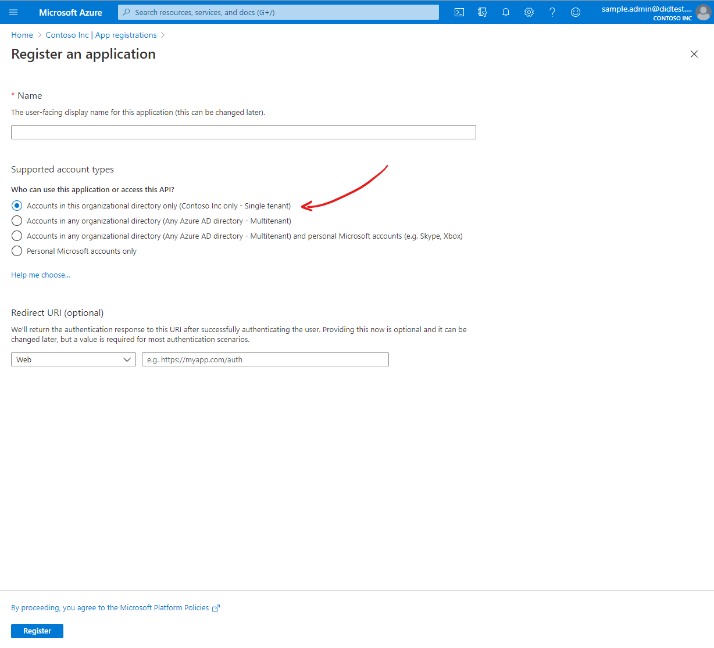
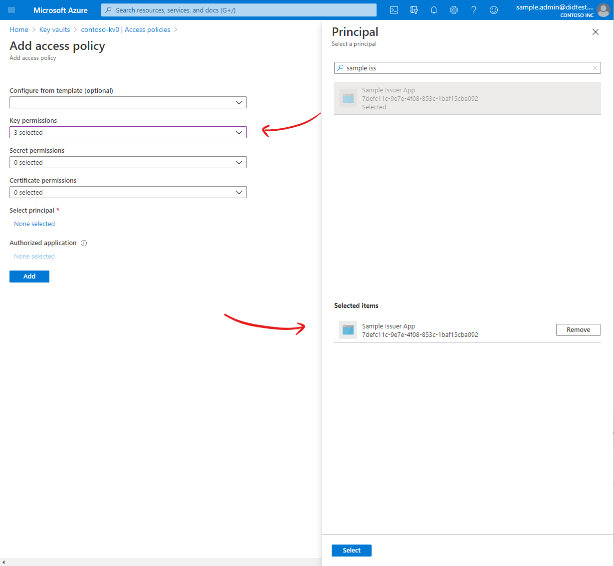
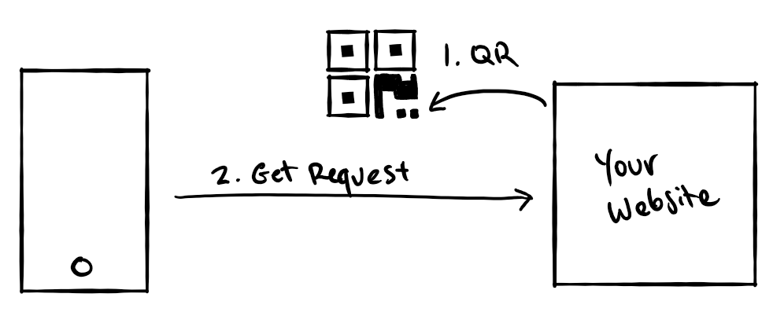

# Building an issuer website

Updated: September 25, 2020

This article describes how to get your NodeJS app or website configured to issue Verifiable Credentials VC using a verifiable credentials NPM package. A [code sample](https://github.com/Azure-Samples/active-directory-verifiable-credentials) is also available on GitHub for your reference.

## Set up access to Azure Key Vault

To authenticate a credential issuance request to the user, the issuer website will use your cryptographic keys in Azure Key Vault. To access Azure Key Vault, your website will need a client ID and client secret that can be used to authenticate to Azure Key Vault.

1 - To get a client ID and client secret, [register an application in Azure AD](https://docs.microsoft.com/azure/active-directory/develop/quickstart-register-app). When registering your application, we recommend the following details:


| Detail | Recommended |
|--------|---------------|
| Supported account types | This organization only. |
| Client secret | Create a new client secret in the Certificates & Secrets configuration section.  |

  

 After creating your application in Azure AD, you need to grant the application permission to perform operations on your Key Vault. This step enables the website to access and use the private keys stored in Key Vault.

2 - In the Azure portal, navigate to your Azure Key Vault, and open the **Access Policies** section. Add a new access policy, using the following details:

| Detail | Required |
|--------|---------------|
| Principal| Your Azure AD application, created above. |
| Permissions | At a minimum, permit the `Key Create`, `Key Get`, and `Key Sign` operations. |



At this point, you should have a Key Vault and an application with a client ID and client secret. Your application has been granted access to your Azure Key Vault.

## Install the Verifiable Credentials SDK

During the Verifiable Credentials preview, you must issue credentials using the Verifiable Credentials NPM package. Source code for the Verifiable Credentials SDK can be found [on GitHub](https://github.com/microsoft/VerifiableCredentials-Verification-SDK-Typescript).

Install the package into your NodeJS project using NPM. We'll also be using the Azure Identity SDK to communicate and authenticate to Azure Key Vault.

```bash
npm install verifiablecredentials-verification-sdk-typescript@0.10.0-preview.29
npm install @azure/identity@1.1.0
```

## Use the VC SDK

The VC SDK must be used in a NodeJS server. You can use the SDK to send a credential issuance request to Microsoft Authenticator by following the steps below:

1. Issuance requests are sent by displaying a QR code and/or a deep link, which the user can open using Microsoft Authenticator.
2. When the QR code or deep link is opened, Authenticator will send an `HTTP GET` request to your server to retrieve the details of an issuance request. This helps keep the size of the QR code relatively small so it can be easily scanned.
3. After retrieving an issuance request, Authenticator will execute a Verifiable Credential issuance process according to the rules described in your rules file. When credential issuance completes, Authenticator will receive and store the new verifiable credential.



The APIs used to implement each of these steps are described in the sections below.

## Display a QR code and deep link

To initiate an issuance flow, you first need to display a QR code and/or a deep link on your website. On a desktop browser, the user can scan the QR code using Microsoft Authenticator to request a credential. On mobile, tapping a deep link will open Authenticator and initiate the request automatically. 

Display a QR code and/or a deep link with the following contents:


```
openid://vc/?request_uri=https%3A%2F%2Fmyserver.com%2Fissue-request
```

| Parameter | Description |
| --------- | ----------- |
| `request_uri` | A URL that points to your server, where an issuance request can be retrieved. The example given here is `https://myserver.com/issue-request`. |

You don't need the VC SDK to construct this string. Use an open-source QR code generator to convert the request into a QR code. This can be done on the server or in client side using JavaScript in the browser.

## Generate the issuance request

Authenticator sends an `HTTP GET` to the provided `request_uri` to retrieve the issuance request. Your server needs to respond with an issuance request as a JWT.

```HTTP
GET /issue-request HTTP/1.1
Host: www.myserver.com
Accept-Language: en-us
Connection: Keep-Alive

HTTP/1.1 200 OK
Content-Length: 88
Content-Type: application/jwt
Connection: Closed

eyJhbGciOiJSUzI1NiIsImtpZCI6IjFlOWdkazcifQ.ewogImlzcyI6ICJ...
```

To generate this response, you can use the VC SDK to construct a properly formatted issuance request. Follow the steps below to construct an issuance request in the JWT format.

1 - First, import the necessary packages to generate an issuance request.

```js
   var { ClientSecretCredential } = require('@azure/identity');
   var { CryptoBuilder, 
         LongFormDid, 
         RequestorBuilder,
         KeyReference,
         KeyUse
       } = require('verifiablecredentials-verification-sdk-typescript');
```

2 - Next, set up the VC SDK by providing access to cryptographic keys that will be used to digitally sign the issuance request. In this case, we'll generate a new set of cryptographic keys in Azure Key Vault.

```js
// Provide authentication details for Azure Key Vault
const kvCredentials = new ClientSecretCredential('Azure Tenant Id', 'Client ID', 'Client Secret');

// Setup the website connection to Azure Key Vault
const signingKeyReference = new KeyReference('issuer-signing-key', 'key');
const recoveryKeyReference = new KeyReference('issuer-signing-key', 'key');
var crypto = new CryptoBuilder()
    .useSigningKeyReference(signingKeyReference)
    .useRecoveryKeyReference(recoveryKeyReference)
    .useKeyVault(kvCredentials, 'https://myvault.vault.azure.net/')
    .build();

// BUGBUG: This website current does not use the same issuer DID that was 
// generated in Azure Portal. Instead, it generates a new set of keys 
// in Key Vault and a new DID. This will be updated soon.
crypto = await crypto.generateKey(KeyUse.Signature, 'signing');
crypto = await crypto.generateKey(KeyUse.Signature, 'recovery');
const did = await new LongFormDid(crypto).serialize();
crypto.builder.useDid(did);
```

<div class="step" style="margin-bottom:10px">
<div class="numberCircle">3</div>
<div class="multiline-step">
Once you've created a `crypto` object, you can create your issuance request using the `RequestorBuilder` API. When using this API, be sure to modify all values to reflect appropriate values for your Verifiable Credentials. In particular, be sure to modify the `credentialType` to the value you chose in your rules file, and the `contracts` value to the **Issue credential URL** for your credential.
</div>
</div> 

```js
const requestBuilder = new RequestorBuilder({
    presentationDefinition: {
      input_descriptors: [{
          schema: {
              uri: ['https://schemas.contoso.edu/credentials/schemas/diploma2020'],
          },
          issuance: [{
              manifest: 'https://portableidentitycards.azure-api.net/v1.0/9c59be8b-bd18-45d9-b9d9-082bc07c094f/portableIdentities/contracts/Diploma2020'
          }]
      }]
  }
}, crypto).allowIssuance();

var issueRequest = await requestBuilder.build().create();
var jwt = issueRequest.request;
```

| Parameter | Description |
| --------- | ----------- |
| `crypto` | The crypto object created above. |
| `...schema.uri` | The `type` of your Verifiable Credential you are going to issue that you added to your rules file. | 
| `...manifest` | The **Issue credential URL** for your credential, which you copied from the Azure portal in previous steps. |
| `.allowIssuance()` | Include credential issuance requests. |

Once you've implemented the steps above, you're ready to issue yourself a Verifiable Credential. You are now well on your way to building a more trustworthy internet. [Continue onto the next article to use Microsoft Authenticator to get your Verifiable Credential](credential-authenticator.md).
