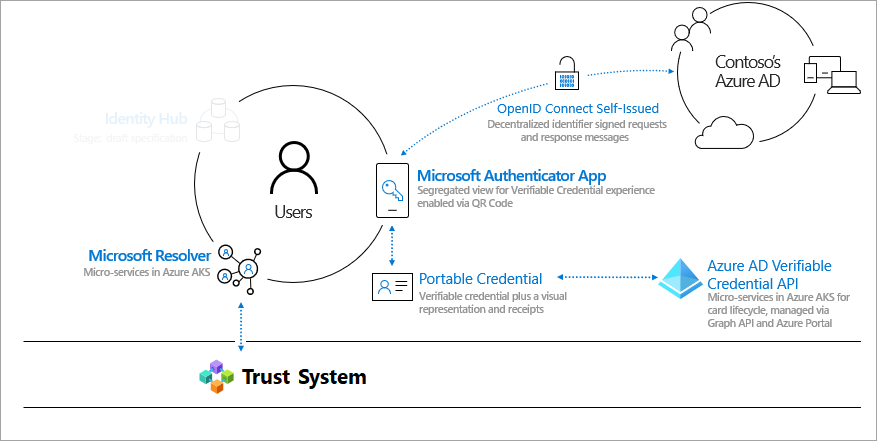
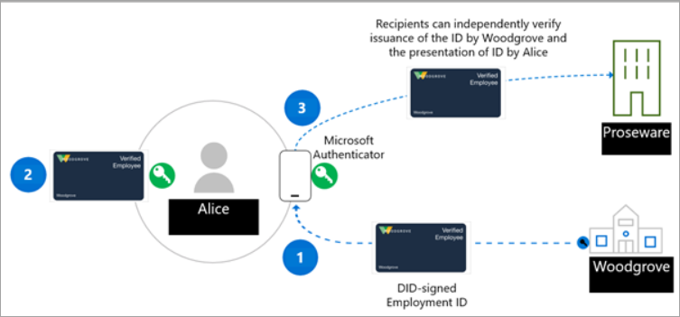
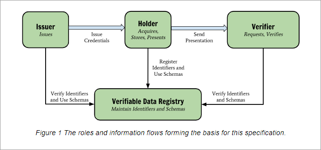

# Introduction to Azure Active Directory Verifiable Credentials 

Our digital and physical lives are increasingly linked to the apps, 
services, and devices we use to access a rich set of experiences. 
This digital transformation allows us to interact with hundreds 
of companies and thousands of other users in ways that were 
previously unimaginable. 

But identity data has too often been exposed in breaches, affecting our social, professional, and financial lives. Microsoft believes that there’s a better way. Every person has a right to an identity that they own and control, one that securely stores elements of their digital identity and preserves privacy. This primer explains how we are joining hands with a diverse community to build an open, trustworthy, interoperable, and standards-based Decentralized Identity (DID) solution for individuals and organizations.

## Why we need Decentralized Identity 

Today we use our digital identity at work, at home, and across every 
app, service, and device we engage with. It’s made up of everything 
we say, do, and experience in our lives—purchasing tickets for an 
event, checking into a hotel, or even ordering lunch. Currently, our 
identity and all our digital interactions are owned and controlled by 
other parties, some of whom we aren’t even aware of.

The status quo for users is to grant consent to numerous apps and devices, which warrants a high degree of vigilance of tracking who has access to what information. On the enterprise front, collaboration with consumers and partners requires high-touch orchestration to securely exchange data in a way that maintains privacy and security for all involved. 

We believe a standards-based Decentralized Identity system can unlock 
a new set of experiences that empowers users and organizations to have greater control over their data—and deliver a higher degree of trust and security for apps, devices, and service providers

## Lead with open standards 

We’re committed to working closely with customers, partners, and the community to unlock the next generation of Decentralized 
Identity–based experiences, and we’re excited to partner with the individuals and organizations that are making incredible contributions in this space. If the DID ecosystem is to grow, standards, technical components, and code deliverables must be open source and accessible to all.

Microsoft is actively collaborating with members of the Decentralized Identity Foundation (DIF), the W3C Credentials Community Group, and the wider identity community. We’re worked with these groups to identify and develop critical standards, and the following standards have been implemented in our services.

* [W3C Decentralized Identifiers](https://www.w3.org/TR/did-core/)
* [W3C Verifiable Credentials](https://www.w3.org/TR/vc-data-model/)
* [DIF Sidetree](https://identity.foundation/sidetree/spec/)
* [DIF Well Known DID Configuration](https://identity.foundation/specs/did-configuration/)
* [DIF DID-SIOP](https://identity.foundation/did-siop/)
* [DIF Presentation Exchange](https://identity.foundation/presentation-exchange/)


## How does Decentralized Identity work? 

A new form of identity is needed, one that weaves together technologies and standards to deliver key identity attributes—such as self-ownership and censorship resistance that are difficult to achieve with existing systems. 

To deliver on these promises, we need a technical foundation made up of seven key innovations—most notably, identifiers that are owned by the user, a user agent to manage keys associated with such identifiers, and encrypted, user-controlled datastores.



**1. W3C Decentralized Identifiers (DIDs)** 
IDs users create, own, and control independently of any organization or government. DIDs are globally unique identifiers linked to Decentralized Public Key Infrastructure (DPKI) metadata composed of JSON documents that contain public key material, authentication descriptors, and service endpoints.

**2. Decentralized system: ION (Identity Overlay Network)**
ION is a Layer 2 open, permissionless network based on the purely deterministic Sidetree protocol, which requires no special tokens, trusted validators, or additional consensus mechanisms; the linear progression of Bitcoin's timechain is all that's required for its operation. We have [open sourced a npm package](https://www.npmjs.com/package/@decentralized-identity/ion-tools) to make working with the ION network easy to integrate into your apps and services. Libraries include creating a new DID, generating keys and anchoring your DID on the bitcoin blockchain. 

**3. DID User Agents: Microsoft Authenticator App**
Enables real people to use decentralized identities and Verifiable Credentials. Authenticator creates DIDs, facilitates issuance and presentation requests for Verifiable Credentials and manage the back up of your DID's seed through an encrypted wallet file. 

**4. Microsoft Resolver**
An API that connects to our ION node to look up and resolve DID's using the did:ion method and return the DID Document Object (DDO). The DDO includes DPKI metdata associated with the DID such as public keys and service endpoints. In the future, this resolver could include drivers for other DID methods we choose to support. 

**5. Azure Active Directory Verified Credentials Service**
An issuance and verification API and open source SDK for [W3C Verifiable Credentials](https://www.w3.org/TR/vc-data-model/) that are signed with the did:ion method. They enable identity owners to generate, present, and verify claims. This 
forms the basis of trust between users of the systems.

## A sample scenario

The scenario we use to explain how VCs work involves Alice, an employee at Woodgrove, Inc. who wants to get a discount from Proseware, a company that offers Woodgrove employees discounts. Currently, Alice provides a username and password to log onto Woodgrove’s networked environment. 

Woodgrove is establishing a VC solution to provide a more manageable way for Alice to prove she is an employee of Woodgrove. Proseware is using a VC solution compatible with the solution Woodgrove is using and will accept credentials issued by Woodgrove as proof of employment. 

The issuer of the credential, Woodgrove Inc., creates a public key and a private key. The public key is stored on ION. When the key is added to the infrastructure, the entry is recorded in a blockchain-based decentralized ledger. The issuer provides Alice the private key that is stored in a wallet application. Each time Alice successfully uses the private key the transaction is logged in the wallet application.   


## Roles in a verifiable credential solution 

There are three primary actors in the verifiable credential solution. In the following diagram, during Step 1 the user requests a verifiable credential from an issuer. Step 2, the issuer of the credential attests that the proof the user provided is accurate and creates a public and private key pair. The public key is placed on the DPKI and transmits the private key portion of the VC to the user. In Step 3, the user presents the private key to a verifier. The verifier then verifies the validity of the credential by matching with the public key placed in the DPKI. The roles in this scenario are:



The **issuer** – The issuer is an organization that creates an issuance solution which requests information from a user. The information is used to verify the user’s identity. For example, Woodgrove, Inc. has an issuance solution that enables them to create and distribute verifiable credentials (VCs) to all their employees. The employee fills out an online form providing the required information. Once Woodgrove, Inc. validates the information, they send the employee a link to access and download their credential. The issuance solution creates a VC that uses public key encryption and blockchain technology to ensure the credential is authentic and valid. The employee stores the credential in their electronic wallet.  

The **user** – The user is the person or entity that is requesting a VC. For example, Alice is a new employee of Woodgrove, Inc. Alice provides the information the company requires as proof of Alice’s identity, and then Alice uses a provided link to access and download the credential. When Alice needs to provide proof of employment, she can grant access to the credential in her electronic wallet. The verifier validates the credential was issued by Woodgrove, Inc. 

The **verifier** – The verifier is a company or entity that creates a validation solution to accept VCs from one or more issuers they trust to validate the identity of users. For example, Proseware trusts Woodgrove, Inc. does an adequate job of verifying their employees’ identity and issuing authentic and valid VCs. When Alice tries to order the equipment she needs for her job, Proseware provides a way for her to submit the credential from Woodgrove, Inc. that is stored in her electronic wallet. For example, Proseware might provide Alice a link to a website with a QR code she scans with her phone camera. This initiates her VC being sent to Proseware, which verifies the decentralized identifier using the public key infrastructure and gives Alice the discount. If other companies and organizations know that Woodgrove, Inc. issues VCs to their employees, they can also create a verifier solution and use the Woodgrove, Inc. verifiable credential to provide special offers reserved for Woodgrove, Inc. employees. 

## What are DIDs 

To understand DIDs, it helps to compare them with current identity systems. Email addresses and social network IDs were created as human-friendly aliases for collaboration but are now overloaded to serve as the control points for data access across many scenarios beyond collaboration. This poses a potential problem, given that access to these IDs can be removed at any time by the email 
provider, social network provider, or other external parties.

Decentralized Identifiers (DIDs) are different. DIDs are user-generated, self-owned, globally unique identifiers rooted in decentralized systems like ION. They possess unique characteristics, like greater assurance of immutability, censorship resistance, and 
tamper evasiveness. These are critical attributes for any ID system that is intended to provide self-ownership and user control. 

Microsoft’s verifiable credential solution uses decentralized credentials (DIDs) to cryptographically sign as proof that a relying party (verifier) is attesting to information or proving they are the owners of a verifiable credential. Therefore, a basic understanding of decentralized identifiers is recommended for anyone creating a verifiable credential solution based on the Microsoft offering. In a subsequent article we will do a deeper dive into how Microsoft has implemented Decentralized Identifiers. 

## What are Verifiable Credentials 

Verifiable credentials provide an alternative to traditional mechanisms used to present information meant as proof of an assertion. From [Verifiable Credentials Data Model 1.0](https://www.w3.org/TR/vc-data-model/) “Credentials are a part of our daily lives; driver's licenses are used to assert that we are capable of operating a motor vehicle, university degrees can be used to assert our level of education, and government-issued passports enable us to travel between countries. This specification provides a mechanism to express these sorts of credentials on the Web in a way that is cryptographically secure, privacy respecting, and machine-verifiable".  

Verifiable Credentials are a data object that consist of claims by the issuer that attest to information about a subject. These claims are identified by schema and include the DID the issuer and subject. The issuer's DID creates a digital signature as proof that they attest to this information. 

In a subsequent article we will do a deeper dive into how Microsoft has implemented Verifiable Credentials. 

<!-- 
 -->

<!-- ```json
{
  "alg": "ES256K",
  "kid": "did:ion:123",
  "typ": "JWT"
}.{
  "vc": {
    "@context": [
      "https://www.w3.org/2018/credentials/v1",
      "https://beta.did.msidentity.com/v1.0/96e93203-0285-41ef-88e5-a8c9b7a33457/verifiableCredential/contracts/WoodgroveEmployee"
    ],
    "type": [
      "VerifiableCredential",
      "https://schema.org/employee"
    ],
    "credentialSubject": {
      "firstName": "Satoshi",
      "lastName": "Nakamoto",
      "employeeId": "1971",
      "employeeType": "ft"
    },
    "credentialStatus": {
      "id": "https://portableidentitycards.azure-api.net/v1.0/7952032d-d1f3-4c65-993f-1112dab7e191/portableIdentities/card/status",
      "type": "PortableIdentityCardServiceCredentialStatus2020"
    }
  },
  "exp": 1609378524,
  "jti": "urn:pic:583cf164187d4707b02b7b6243365b08",
  "iss": "did:ion:123",
  "iat": 1606786543
}.[Signature]
``` -->

