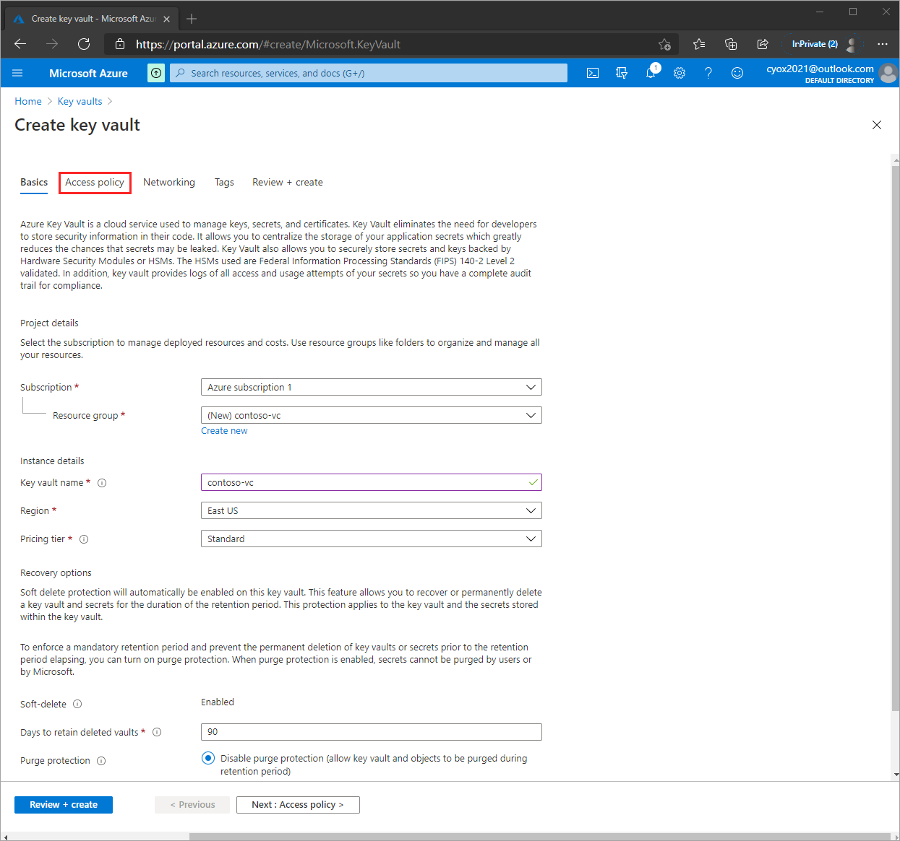

# Tutorial: Configure your Azure Active Directory to issue verifiable credentials (Preview)

In this tutorial, we build on the work done in the [get started](get-started-verifiable-credentials.md) article and we get your Azure Active Directory (AAD) set up with its own [distributed identifier](https://www.microsoft.com/security/business/identity-access-management/decentralized-identity-blockchain?rtc=1#:~:text=Decentralized%20identity%20is%20a%20trust,protect%20privacy%20and%20secure%20transactions.) (DID).

> [!IMPORTANT]
> Azure verifiable credentials is currently in public preview.
> This preview version is provided without a service level agreement, and it's not recommended for production workloads. Certain features might not be supported or might have constrained capabilities. 
> For more information, see [Supplemental Terms of Use for Microsoft Azure Previews](https://azure.microsoft.com/support/legal/preview-supplemental-terms/).

In this article:

> [!div class="checklist"]
> * You create the necessary services to onboard your Azure Active Directory (AAD) for verifiable credentials 
> * Configure verifiable credentials in AAD.
> * Go to  https://aka.ms/vcpreviewportal

## Prerequisites

Before you can successfully complete this tutorial, you must first:

- Complete the [Get started](get-started-verifiable-credentials.md).
- Have an Azure account with an active subscription. [Create an account for free](https://azure.microsoft.com/free/?WT.mc_id=A261C142F).
- Azure AD with a P2 [license](https://azure.microsoft.com/pricing/details/active-directory/).
- An instance of [Azure Key Vault](../../key-vault/general/overview.md) where you have rights to create keys and secrets.

## Azure Active Directory

Before we can start, we need an Azure AD tenant. When your tenant is enabled for verifiable credentials, it is assigned a decentralized identifier (DID) and it is enabled with an issuer service for issuing verifiable credentials. Any verifiable credential you issue is issued by your tenant and its DID. The DID is also used when verifying verifiable credentials.
If you just created a test Azure subscription, your tenant does not need to be populated with user accounts but you will need to have at least one user test account to complete later tutorials.

## Create a Key Vault

When working with verifiable credentials, you have complete control and management of the cryptographic keys your tenant uses to digitally sign verifiable credentials. To issue and verify credentials, you must provide Azure AD with access to your own instance of Azure Key Vault.

1. From the Azure portal menu, or from the **Home** page, select **Create a resource**.
2. In the Search box, enter **Key Vault**.
3. From the results list, choose **Key Vault**.
4. On the Key Vault section, choose **Create**.
5. On the **Create key vault** section provide the following information:
    - **Subscription**: Choose a subscription.
    - Under **Resource Group**, choose **Create new** and enter a resource group name such as **vc-resource-group**. We are using the same resource group name across multiple articles.
    - **Name**: A unique name is required. We use **Contoso-VC-Vault** so replace this value with your own unique name.
    - In the **Location** pull-down menu, choose a location.
    - Leave the other options to their defaults.
6. After providing the information above, select **Access Policy**

    

7. In the Access Policy screen, choose **Add Access Policy**

    >[!NOTE]
    > By default the account that creates the key vault is the only one with access. The verifiable credential service needs access to key vault to get started. The key vault used needs an access policy allowing the Admin to **create keys***, have the ability to **delete keys** if you opt out, and **sign** to create the domain binding for verifiable credential. If you are using the same account while testing make sure to modify the default policy to grant the account **sign** in addition to the default permissions granted to vault creators.

8. In the key permissions section choose **Create**, **Delete**, and **Sign**.

    

9. Select **Review + create**.
10. Select **Create**.
11. Go to the vault and take note of the vault name and URI

Take note of the two properties listed below:

- **Vault Name**: In the example, the value name is **Contoso-VC-vault**. You use this name for other steps.
- **Vault URI**: In the example, this value is https://contoso-vc.vault.azure.net/. Applications that use your vault through its REST API must use this URI.

>[!NOTE]
> Each Key Vault transaction results in additional Azure subscription costs. Review the [Key Vault pricing page](https://azure.microsoft.com/pricing/details/key-vault/) for more details.

>[!IMPORTANT]
> During the verifiable credentials preview, keys and secrets created in your vault should not be modified once created. Deleting, disabling, or updating your keys and secrets invalidates any issued credentials. Do not modify your keys or secrets during the preview.

## Set up verifiable credentials Preview

Now we need to take the last step to set up your tenant for verifiable credentials.

1. From the Azure portal, search for **verifiable credentials**. 
2. To get started with the verifiable credentials service, we need to set up your organization and provide the organization name, domain, and key vault. Let's look at each one.

      - **organization name**: This name is how you reference your business within the Verifiable Credential service. This value is not customer facing.
      - **Domain:** The domain entered is added to a service endpoint in your DID document. [Microsoft Authenticator](../user-help/user-help-auth-app-download-install.md) and other wallets use this information to validate that your DID is linked to your domain. If the wallet can verify the DID, it displays a verified symbol. If the wallet is unable to verify the DID, it informs the user that the credential was issued by an organization it could not validate. The domain is what binds your DID to something tangible that the user may know about your business. See the example Presentation screen below.
      - **Key vault:** Provide the name of the Key Vault that we created earlier.

 
   >[!IMPORTANT]
   > The domain can not be a redirect, otherwise the DID and domain cannot be linked. Make sure to use https://www.domain.com format.
    
3. Choose **Save and create credential**

    

## Next Steps

When we started, we could issue and verify credentials using the sample app and the test Azure tenant. At the end of this tutorial, your tenant is enabled for the verifiable credentials preview. In later tutorials, we take the steps needed to get your tenant issuing and verifying credentials.

> [!div class="nextstepaction"]
> [Create Sample Ninja Credential in your Issuer](create-sample-card-your-issuer.md)
