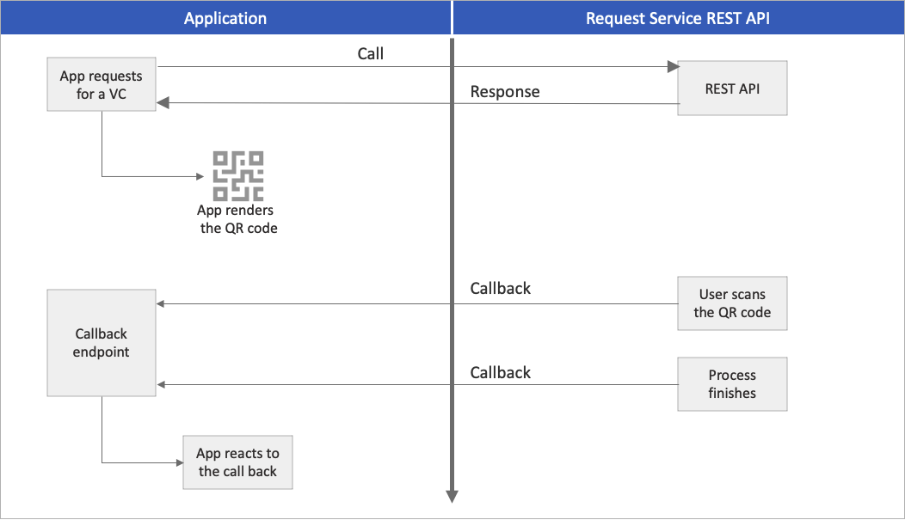

# Request Service REST API

[!INCLUDE [Verifiable Credentials announcement](../../../includes/verifiable-credentials-brand.md)]

Microsoft Entra Verified ID includes the Request Service REST API. This API allows you to issue and verify credentials. This article shows you how to start using the Request Service REST API.

## API access token

Your application needs to include a valid access token with the required permissions so that it can access the Request Service REST API. Access tokens issued by the Microsoft identity platform contain information (scopes) that the Request Service REST API uses to validate the caller. An access token ensures that the caller has the proper permissions to perform the operation they're requesting.

To get an access token, your app must be registered with the Microsoft identity platform, and be authorized by an administrator for access to the Request Service REST API. If you haven't registered the *verifiable-credentials-app* application, see [how to register the app](verifiable-credentials-configure-tenant.md#register-an-application-in-azure-ad) and then [generate an application secret](verifiable-credentials-configure-issuer.md#configure-the-verifiable-credentials-app).

### Get an access token

Use the [OAuth 2.0 client credentials grant flow](../../active-directory/develop/v2-oauth2-client-creds-grant-flow.md) to acquire the access token by using the Microsoft identity platform. Use a trusted library for this purpose. In this tutorial, we use the Microsoft Authentication Library [MSAL](../../active-directory/develop/msal-overview.md). MSAL simplifies adding authentication and authorization to an app that can call a secure web API.

# [HTTP](#tab/http)

```http
POST /{tenant}/oauth2/v2.0/token HTTP/1.1           //Line breaks for clarity
Host: login.microsoftonline.com
Content-Type: application/x-www-form-urlencoded

client_id=535fb089-9ff3-47b6-9bfb-4f1264799865
&scope=3db474b9-6a0c-4840-96ac-1fceb342124f/.default
&client_secret=sampleCredentia1s
&grant_type=client_credentials
```

# [C#](#tab/csharp)

```csharp
// Initialize MSAL library by using the following code
ConfidentialClientApplicationBuilder.Create(AppSettings.ClientId)
    .WithClientSecret(AppSettings.ClientSecret)
    .WithAuthority(new Uri(AppSettings.Authority))
    .Build();

// Acquire an access token
result = await app.AcquireTokenForClient(AppSettings.Scopes)
                .ExecuteAsync();
```

# [Node.js](#tab/nodejs)

```nodejs
// Initialize MSAL library by using the following code
const msalConfig = {
  auth: {
      clientId: config.azClientId,
      authority: `https://login.microsoftonline.com/${config.azTenantId}`,
      clientSecret: config.azClientSecret,
  },
  system: {
      loggerOptions: {
          loggerCallback(loglevel, message, containsPii) {
              console.log(message);
          },
          piiLoggingEnabled: false,
          logLevel: msal.LogLevel.Verbose,
      }
  }
};
const cca = new msal.ConfidentialClientApplication(msalConfig);
const msalClientCredentialRequest = {
  scopes: ["3db474b9-6a0c-4840-96ac-1fceb342124f/.default"],
  skipCache: false, 
};
module.exports.msalCca = cca;
module.exports.msalClientCredentialRequest = msalClientCredentialRequest;

// Acquire an access token
const result = await mainApp.msalCca.acquireTokenByClientCredential(mainApp.msalClientCredentialRequest);
    if ( result ) {
      accessToken = result.accessToken;
    }
```

# [Python](#tab/python)

```python
# Initialize MSAL library by using the following code
msalCca = msal.ConfidentialClientApplication( config["azClientId"], 
    authority="https://login.microsoftonline.com/" + config["azTenantId"],
    client_credential=config["azClientSecret"],
    )

# Acquire an access token
accessToken = ""
result = msalCca.acquire_token_for_client( scopes="3db474b9-6a0c-4840-96ac-1fceb342124f/.default" )
if "access_token" in result:
    accessToken = result['access_token']
```

# [Java](#tab/java)

```java
// Initialize MSAL library by using the following code
ConfidentialClientApplication app = ConfidentialClientApplication.builder(
                clientId,
                ClientCredentialFactory.createFromSecret(clientSecret))
                .authority(authority)
                .build();

// Acquire an access token
ClientCredentialParameters clientCredentialParam = ClientCredentialParameters.builder(
                Collections.singleton(scope))
                .build();
CompletableFuture<IAuthenticationResult> future = app.acquireToken(clientCredentialParam);
IAuthenticationResult result = future.get();
return result.accessToken();
```

---

In the preceding code, provide the following parameters:

| Parameter | Condition | Description |
| --- | --- | --- |
| Authority | Required | The directory tenant the application plans to operate against. For example: `https://login.microsoftonline.com/{your-tenant}`. (Replace `your-tenant` with your [tenant ID or name](/azure/active-directory-b2c/tenant-management-read-tenant-name).) |
| Client ID | Required | The application ID that's assigned to your app. You can find this information in the Azure portal, where you registered your app. |
| Client secret | Required | The client secret that you generated for your app.|
| Scopes | Required | Must be set to `3db474b9-6a0c-4840-96ac-1fceb342124f/.default`. This will produce an access token with a **roles** claim of `VerifiableCredential.Create.All`. |

For more information about how to get an access token by using a console app's identity, see one of the following articles: [C#](../develop/quickstart-v2-netcore-daemon.md), [Python](../develop/quickstart-v2-python-daemon.md), [Node.js](../develop/quickstart-v2-nodejs-console.md), or [Java](../develop/quickstart-v2-java-daemon.md).

You can also [access a token request with a certificate](../develop/v2-oauth2-client-creds-grant-flow.md) instead of client secret.

# [HTTP](#tab/http)

```http
POST /{tenant}/oauth2/v2.0/token HTTP/1.1   //Line breaks for clarity
Host: login.microsoftonline.com
Content-Type: application/x-www-form-urlencoded

client_id=12345678-0000-0000-00000000000000000
&scope=3db474b9-6a0c-4840-96ac-1fceb342124f/.default
&client_assertion_type=urn%3Aietf%3Aparams%3Aoauth%3Aclient-assertion-type%3Ajwt-bearer
&client_assertion=eyJhbGciOiJSUzI1NiIsIng1dCI6Imd4OHRHeXN5amNScUtqRlBuZDdSRnd2d1pJMCJ9.eyJ{a lot of characters here}M8U3bSUKKJDEg
&grant_type=client_credentials
```

# [C#](#tab/csharp)

```csharp
// Initialize MSAL library by using the following code
X509Certificate2 certificate = AppSettings.ReadCertificate(AppSettings.CertificateName);
    app = ConfidentialClientApplicationBuilder.Create(AppSettings.ClientId)
        .WithCertificate(certificate)
        .WithAuthority(new Uri(AppSettings.Authority))
        .Build();

// Acquire an access token
result = await app.AcquireTokenForClient(AppSettings.Scopes)
                .ExecuteAsync();
```

# [Node.js](#tab/nodejs)

```nodejs
// Initialize MSAL library by using the following code
const msalConfig = {
  auth: {
      clientId: config.azClientId,
      authority: `https://login.microsoftonline.com/${config.azTenantId}`,
      clientCertificate: {
            thumbprint: "CERT_THUMBPRINT", // a 40-digit hexadecimal string
            privateKey: "CERT_PRIVATE_KEY"
        }
  },
  system: {
      loggerOptions: {
          loggerCallback(loglevel, message, containsPii) {
              console.log(message);
          },
          piiLoggingEnabled: false,
          logLevel: msal.LogLevel.Verbose,
      }
  }
};
const cca = new msal.ConfidentialClientApplication(msalConfig);
const msalClientCredentialRequest = {
  scopes: ["3db474b9-6a0c-4840-96ac-1fceb342124f/.default"],
  skipCache: false, 
};
module.exports.msalCca = cca;
module.exports.msalClientCredentialRequest = msalClientCredentialRequest;

// Acquire an access token
const result = await mainApp.msalCca.acquireTokenByClientCredential(mainApp.msalClientCredentialRequest);
    if ( result ) {
      accessToken = result.accessToken;
    }
```

# [Python](#tab/python)

```python
# Initialize MSAL library by using the following code
with open(config["azCertificatePrivateKeyLocation"], "rb") as file:
    private_key = file.read()
with open(config["azCertificateLocation"]) as file:
    public_certificate = file.read()
cert = load_pem_x509_certificate(data=bytes(public_certificate, 'UTF-8'), backend=default_backend())
thumbprint = (cert.fingerprint(hashes.SHA1()).hex())
msalCca = msal.ConfidentialClientApplication( config["azClientId"], 
    authority="https://login.microsoftonline.com/" + config["azTenantId"],
    client_credential={
        "private_key": private_key,
        "thumbprint": thumbprint,
        "public_certificate": public_certificate
    }
)    
# Acquire an access token
accessToken = ""
result = msalCca.acquire_token_for_client( scopes="3db474b9-6a0c-4840-96ac-1fceb342124f/.default" )
if "access_token" in result:
    accessToken = result['access_token']
```

# [Java](#tab/java)

```java
// Initialize MSAL library by using the following code
PKCS8EncodedKeySpec spec = new PKCS8EncodedKeySpec(Files.readAllBytes(Paths.get(certKeyLocation)));
PrivateKey key = KeyFactory.getInstance("RSA").generatePrivate(spec);
java.io.InputStream certStream = (java.io.InputStream)new ByteArrayInputStream(Files.readAllBytes(Paths.get(certLocation)));
X509Certificate cert = (X509Certificate) CertificateFactory.getInstance("X.509").generateCertificate(certStream);
ConfidentialClientApplication app = ConfidentialClientApplication.builder(
                clientId,
                ClientCredentialFactory.createFromCertificate(key, cert))
                .authority(authority)
                .build();
// Acquire an access token
ClientCredentialParameters clientCredentialParam = ClientCredentialParameters.builder(
                Collections.singleton(scope))
                .build();
CompletableFuture<IAuthenticationResult> future = app.acquireToken(clientCredentialParam);
IAuthenticationResult result = future.get();
return result.accessToken();
```

---

## Call the API

To issue or verify a verifiable credential, follow these steps:

1. Construct an HTTP POST request to the Request Service REST API. The `tenantId` is not needed in the URL anymore as it is present as a claim in the `access_token`.

    **Issue**
    ```http
    POST https://verifiedid.did.msidentity.com/v1.0/verifiableCredentials/createIssuanceRequest
    ```

    **Verify**
    ```http
    POST https://verifiedid.did.msidentity.com/v1.0/verifiableCredentials/createPresentationRequest
    ```

1. Attach the access token as a bearer token to the authorization header in an HTTP request.

    ```http
    Authorization: Bearer <token>
    ```

1. Set the `Content-Type` header to `Application/json`.

1. Prepare and attach the [issuance](issuance-request-api.md#issuance-request-payload) or [presentation](presentation-request-api.md#presentation-request-payload) request payload to the request body.

1. Submit the request to the Request Service REST API.

The Request Service API returns an HTTP Status Code `201 Created` on a successful call. If the API call returns an error, please check the [error reference documentation](error-codes.md).

## Issuance request example

The following example demonstrates a verifiable credentials issuance request. For information about the payload, see [Request Service REST API issuance specification](issuance-request-api.md).

```http
POST https://verifiedid.did.msidentity.com/v1.0/verifiableCredentials/createIssuanceRequest
Content-Type: application/json
Authorization: Bearer  <token>

{
    "includeQRCode": true,
    "callback": {
        "url": "https://www.contoso.com/api/issuer/issuanceCallback",
        "state": "de19cb6b-36c1-45fe-9409-909a51292a9c",
        "headers": {
            "api-key": "OPTIONAL API-KEY for CALLBACK EVENTS"
        }
    },
    "authority": "did:ion:EiCLL8lzCqlGLYTGbjwgR6SN6OkIjO6uUKyF5zM7fQZ8Jg:eyJkZWx0YSI6eyJwYXRjaGVzIjpbeyJhY3Rpb24iOiJyZXBsYWNlIiwiZG9jdW1lbnQiOnsicHVibGljS2V5cyI6W3siaWQiOiJzaWdfOTAyZmM2NmUiLCJwdWJsaWNLZXlKd2siOnsiY3J2Ijoic2VjcDI1NmsxIiwia3R5IjoiRUMiLCJ4IjoiTEdUOWk3aFYzN1dUcFhHcUg5c1VDek...",
    "registration": {
        "clientName": "Verifiable Credential Expert Sample"
    },
    "type": "VerifiedCredentialExpert",
    "manifestUrl": "https://verifiedid.did.msidentity.com/v1.0/12345678-0000-0000-0000-000000000000/verifiableCredentials/contracts/VerifiedCredentialExpert1",
    "pin": {
        "value": "3539",
        "length": 4
    },
    "claims": {
        "given_name": "Megan",
        "family_name": "Bowen"
    }
}
```  

For the complete code, see one of the following code samples:

- [C#](https://github.com/Azure-Samples/active-directory-verifiable-credentials-dotnet/blob/main/1-asp-net-core-api-idtokenhint/IssuerController.cs)
- [Node.js](https://github.com/Azure-Samples/active-directory-verifiable-credentials-node/blob/main/1-node-api-idtokenhint/issuer.js)
- [Python](https://github.com/Azure-Samples/active-directory-verifiable-credentials-python/blob/main/1-python-api-idtokenhint/issuer.py)
- [Java](https://github.com/Azure-Samples/active-directory-verifiable-credentials-java/blob/main/1-java-api-idtokenhint/src/main/java/com/verifiablecredentials/javaaadvcapiidtokenhint/controller/IssuerController.java)

## Presentation request example

The following example demonstrates a verifiable credentials presentation request. For information about the payload, see [Request Service REST API presentation specification](presentation-request-api.md).

```http
POST https://verifiedid.did.msidentity.com/v1.0/verifiableCredentials/createPresentationRequest
Content-Type: application/json
Authorization: Bearer  <token>

{
  "includeQRCode": true,
  "callback": {
    "url": "https://www.contoso.com/api/verifier/presentationCallback",
    "state": "92d076dd-450a-4247-aa5b-d2e75a1a5d58",
    "headers": {
      "api-key": "OPTIONAL API-KEY for CALLBACK EVENTS"
    }
  },
  "authority": "did:ion:EiCLL8lzCqlGLYTGbjwgR6SN6OkIjO6uUKyF5zM7fQZ8Jg:eyJkZWx0YSI6eyJwYXRjaGVzIjpbeyJhY3Rpb24iOiJyZXBsYWNlIiwiZG9jdW1lbnQiOnsicHVibGljS2V5cyI6W3siaWQiOiJzaWdfOTAyZmM2NmUiLCJwdWJsaWNLZXlKd2siOnsiY3J2Ijoic2VjcDI1NmsxIiwia3R5IjoiRUMiLCJ4IjoiTEdUOWk3aFYzN1dUcFhHcUg5c1VDekxTVlFWcVl3S2JNY1Fsc0RILUZJUSIsInkiOiJiRWo5MDY...",
  "registration": {
    "clientName": "Veritable Credential Expert Verifier"
  },
  "includeReceipt": true,
  "requestedCredentials": [
    {
      "type": "VerifiedCredentialExpert",
      "purpose": "So we can see that you a veritable credentials expert",
      "acceptedIssuers": [
        "did:ion:EiCLL8lzCqlGLYTGbjwgR6SN6OkIjO6uUKyF5zM7fQZ8Jg:eyJkZWx0YSI6eyJwYXRjaGVzIjpbeyJhY3Rpb24iOiJyZXBsYWNlIiwiZG9jdW1lbnQiOnsicHVibGljS2V5cyI6W3siaWQiOiJzaWdfOTAyZmM2NmUiLCJwdWJsaWNLZXlKd2siOnsiY3J2Ijoic2VjcDI1NmsxIiwia3R5IjoiRUMiLCJ4IjoiTEdUOWk3aFYzN1dUcFhHcUg5c1VDekxTVlFWcVl3S2JNY1Fsc0RILUZJUSIsInkiO..."
      ],
      "configuration": {
        "validation": {
          "allowRevoked": true,
          "validateLinkedDomain": true
        }
      }
    }
  ]
}
```

For the complete code, see one of the following code samples:

- [C#](https://github.com/Azure-Samples/active-directory-verifiable-credentials-dotnet/blob/main/1-asp-net-core-api-idtokenhint/VerifierController.cs) 
- [Node.js](https://github.com/Azure-Samples/active-directory-verifiable-credentials-node/blob/main/1-node-api-idtokenhint/verifier.js)
- [Python](https://github.com/Azure-Samples/active-directory-verifiable-credentials-python/blob/main/1-python-api-idtokenhint/verifier.py)
- [Java](https://github.com/Azure-Samples/active-directory-verifiable-credentials-java/blob/main/1-java-api-idtokenhint/src/main/java/com/verifiablecredentials/javaaadvcapiidtokenhint/controller/VerifierController.java)

## Callback events

The request payload contains the [issuance](issuance-request-api.md#callback-events) and [presentation](presentation-request-api.md#callback-events) callback endpoint. The endpoint is part of your web application, and should be publicly available via the HTTPS protocol. The Request Service API calls your endpoint to inform your app on certain events. For example, such events might be when a user scans the QR code, uses the deep link the authenticator app, or finishes the presentation process.

The following diagram describes the call your app makes to the Request Service REST API, and the callbacks to your application.



Configure your endpoint to listen to incoming HTTP POST requests. The following code snippet demonstrates how to handle the issuance callback HTTP request, and how to update the UI accordingly:

# [HTTP](#tab/http)

Not applicable. Choose one of the other programming languages.

# [C#](#tab/csharp)

```csharp
[HttpPost]
public async Task<ActionResult> IssuanceCallback()
{
try
{
    string content = new System.IO.StreamReader(this.Request.Body).ReadToEndAsync().Result;
    _log.LogTrace("callback!: " + content);
    JObject issuanceResponse = JObject.Parse(content);
    
    // More code here
    if (issuanceResponse["code"].ToString() == "request_retrieved")
    {
        var cacheData = new
        {
            status = "request_retrieved",
            message = "QR Code is scanned. Waiting for issuance...",
        };
        _cache.Set(state, JsonConvert.SerializeObject(cacheData));

        // More code here
    }
}
```

For the complete code, see the [issuance](https://github.com/Azure-Samples/active-directory-verifiable-credentials-dotnet/blob/main/1-asp-net-core-api-idtokenhint/IssuerController.cs) and [presentation](https://github.com/Azure-Samples/active-directory-verifiable-credentials-dotnet/blob/main/1-asp-net-core-api-idtokenhint/IssuerController.cs) code on the GitHub repo.

# [Node.js](#tab/nodejs)

```nodejs
mainApp.app.post('/api/issuer/issuance-request-callback', parser, async (req, res) => {
  var body = '';
  req.on('data', function (data) {
    body += data;
  });
  req.on('end', function () {
    requestTrace( req );
    console.log( body );
    var issuanceResponse = JSON.parse(body.toString());
    var message = null;
    
    if ( issuanceResponse.code == "request_retrieved" ) {
      message = "QR Code is scanned. Waiting for issuance to complete...";
    }
    if ( issuanceResponse.code == "issuance_successful" ) {
      message = "Credential successfully issued";
    }
    if ( issuanceResponse.code == "issuance_error" ) {
      message = issuanceResponse.error.message;
    }
    
    // More code here
    res.send()
  });  
  res.send()
})
```

# [Python](#tab/python)

```python
@app.route("/api/issuer/issuance-request-callback", methods = ['POST'])
def issuanceRequestApiCallback():
    if request.headers['api-key'] != apiKey:
        return Response( jsonify({'error':'api-key wrong or missing'}), status=401, mimetype='application/json')

    issuanceResponse = request.json
    if issuanceResponse["code"] == "request_retrieved":
        cacheData = {
            "status": issuanceResponse["code"],
            "message": "QR Code is scanned. Waiting for issuance to complete..."
        }
        cache.set( issuanceResponse["state"], json.dumps(cacheData) )
        return ""

    if issuanceResponse["code"] == "issuance_successful":
        cacheData = {
            "status": issuanceResponse["code"],
            "message": "Credential successfully issued"
        }
        cache.set( issuanceResponse["state"], json.dumps(cacheData) )
        return ""

    if issuanceResponse["code"] == "issuance_error":
        cacheData = {
            "status": issuanceResponse["code"],
            "message": issuanceResponse["error"]["message"]
        }
        cache.set( issuanceResponse["state"], json.dumps(cacheData) )
        return ""

    return ""
```

# [Java](#tab/java)

```java
@RequestMapping(value = "/api/issuer/issue-request-callback", method = RequestMethod.POST, produces = "application/json", consumes = "application/json")
    public ResponseEntity<String> issueRequestCallback( HttpServletRequest request
                                                      , @RequestHeader HttpHeaders headers
                                                      , @RequestBody String body ) {
        ObjectMapper objectMapper = new ObjectMapper();
        try {
            if ( !request.getHeader("api-key").equals(apiKey) ) {
                lgr.info( "api-key wrong or missing" );
                return ResponseEntity.status(HttpStatus.UNAUTHORIZED).body( "api-key wrong or missing" );
            }
            JsonNode presentationResponse = objectMapper.readTree( body );
            String code = presentationResponse.path("code").asText();
            ObjectNode data = null;
            if ( code.equals( "request_retrieved" )  ) {
                data = objectMapper.createObjectNode();
                data.put("message", "QR Code is scanned. Waiting for issuance to complete..." );
            }
            if ( code.equals("issuance_successful") ) {
                data = objectMapper.createObjectNode();
                data.put("message", "Credential successfully issued" );
            }
            if ( code.equals( "issuance_error" ) ) {
                data = objectMapper.createObjectNode();
                data.put("message", presentationResponse.path("error").path("message").asText() );
            }
            if ( data != null ) {
                data.put("status", code );
                cache.put( presentationResponse.path("state").asText(), objectMapper.writerWithDefaultPrettyPrinter().writeValueAsString(data) );
            }
        } catch (java.io.IOException ex) {
            ex.printStackTrace();
            return ResponseEntity.status(HttpStatus.BAD_REQUEST).body( "Technical error" );
        }
        return ResponseEntity.ok().body( "{}" );
    }
```

For the complete code, see the [issuance](https://github.com/Azure-Samples/active-directory-verifiable-credentials-node/blob/main/1-node-api-idtokenhint/issuer.js) and [presentation](https://github.com/Azure-Samples/active-directory-verifiable-credentials-node/blob/main/1-node-api-idtokenhint/verifier.js) code on the GitHub repo.

---

## Next steps

Learn more about these specifications:

- [Issuance API specification](issuance-request-api.md)
- [Presentation API specification](presentation-request-api.md)
