#  Tutorial - Get started with Azure Active Directory Verifiable Credentials using a sample app (preview)

In this tutorial, we go over the steps needed to issue your first verifiable credential: a Verified Credential expert card. You can then use this card to prove to a verifier that you are a verified credential expert, mastered in the art of digital credentialing. Get started with Azure Active Directory Verifiable Credentials by using the Verifiable Credentials sample app to issue your first verifiable credential.

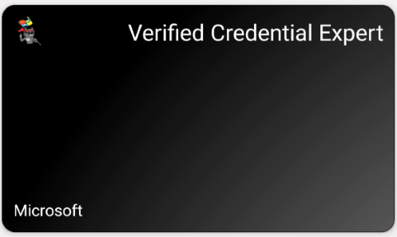

> [!IMPORTANT]
> Azure Active Directory Verifiable Credentials is currently in public preview.
> This preview version is provided without a service level agreement, and it's not recommended for production workloads. Certain features might not be supported or might have constrained capabilities. 
> For more information, see [Supplemental Terms of Use for Microsoft Azure Previews](https://azure.microsoft.com/support/legal/preview-supplemental-terms/).

## Prerequisites

- [NodeJS](https://nodejs.org/en/download/) version 10.14 or higher installed on our test system.
- You need [GIT](https://git-scm.com/downloads) installed If you want to clone the repository that hosts the sample app,
- [Visual Studio Code](https://code.visualstudio.com/Download)
- A system to host our sample site.
- A mobile device with Microsoft Authenticator version 6.2005.3599 or higher installed.
- [NGROK](https://ngrok.com/) free.

## Download the sample code

To issue yourself a Verified Credential Expert Card, you need to run a website on your local machine. The website is used to initiate a verifiable credential issuance process. We've provided a simple website, written in NodeJS, that we use throughout this tutorial.

First, download our sample code from GitHub [here](https://github.com/Azure-Samples/active-directory-verifiable-credentials), or clone the repository to your local machine:

```terminal
git clone https://github.com/Azure-Samples/active-directory-verifiable-credentials.git
```

You may want to familiarize yourself with the code in the sample websites. The `issuer` folder contains all code used to issue a verifiable credential. More details are available in the sample's [readme](https://github.com/Azure-Samples/active-directory-verifiable-credentials).

## Run the issuer website

You can run the steps from within Visual Studio Code or any command line available in your operating system. 

1. Navigate to the `issuer` folder. 

    ```terminal
    cd issuer
    ```

2. Once there we need to install all required packages and start the site.

   ```terminal
    npm install
    node app.js
    ```

3. In the terminal, you will now see that your issuer app is listening on port 8081. Now let's set up a reverse proxy with Ngrok so Authenticator can communicate with your app. 

## Creating a reverse proxy with Ngrok

When you run the sample website, your device needs to communicate with the Node server running on your local machine. We recommend using [ngrok](https://ngrok.com/) as an easy way to make your local development server available over the internet.

1.  After you download and extract **ngrok**, we need to run:

    ```terminal
     ngrok http 8081
    ```

By default the sample website runs on port `8081`. **Ngrok** outputs two forwarding URLs for your server. Copy the URL with the `https://` prefix.


>[!NOTE] 
> If you are using PowerShell you may need to type `./ngrok` for the command to be recognized.

Now that your local port is exposed to the internet using ngrok, the sample site automatically uses the host name generated by ngrok. Open your browser and navigate to the ngrok https forwarding URL. You should be able to successfully visit the sample site's homepage. If the page opens, your device can communicate with the sample app running on your local server. You're now ready to issue yourself a verified credential expert card.

## Issue a credential

1. Install Authenticator on your mobile device. Microsoft Authenticator is used to receive, store, and present your verifiable credentials to interested parties.

2. Next, issue yourself a verifiable credential. **Click** the **Get Credential** button. When you click the **Get Credential** button, the sample website displays a QR code, that you can be scan using Authenticator. If you view the site from the browser on your mobile device, clicking the **Get Credential** button triggers a deep link that opens the authenticator app and does not require the scanning of a QR code.

   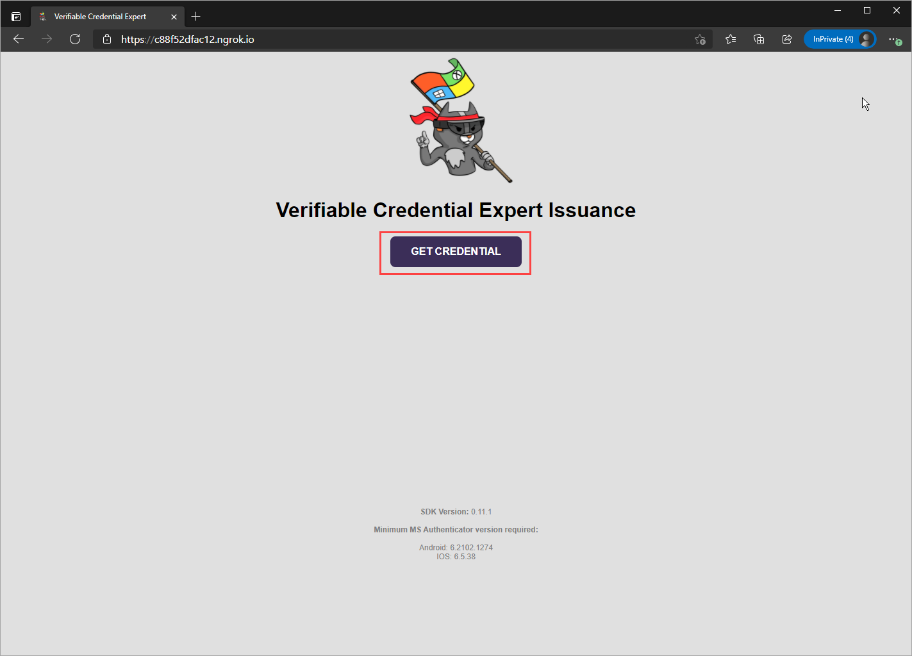

3. Scan the website's QR code using Authenticator, or if you are accessing the website via a mobile click the Get credential button to trigger the deep link. 

   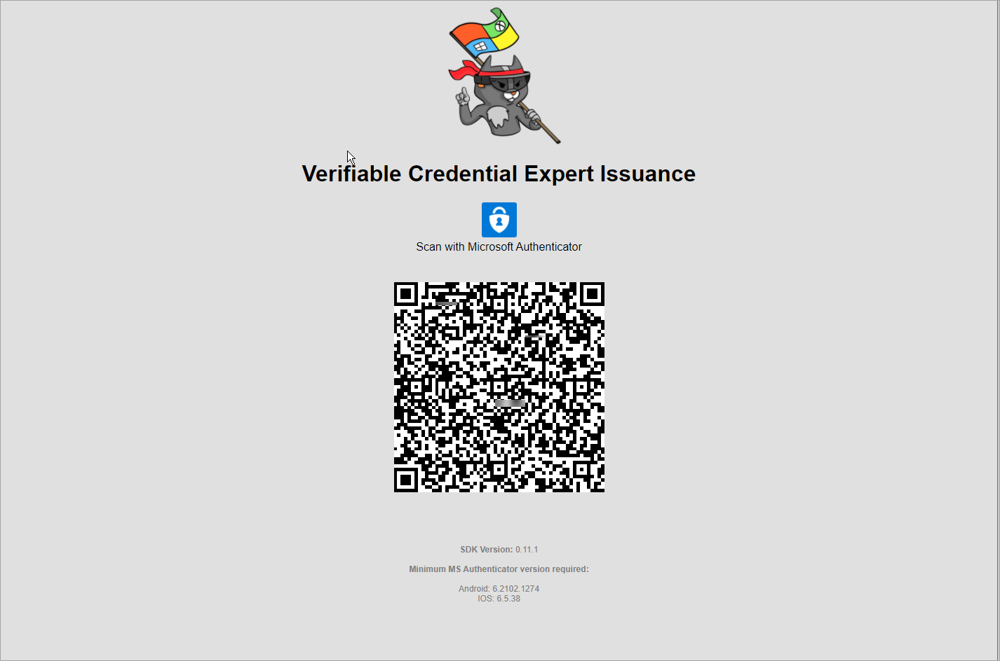

4. Notice that the **Add** button is greyed out at this time. Choose **Sign in to your account** below the card image.

   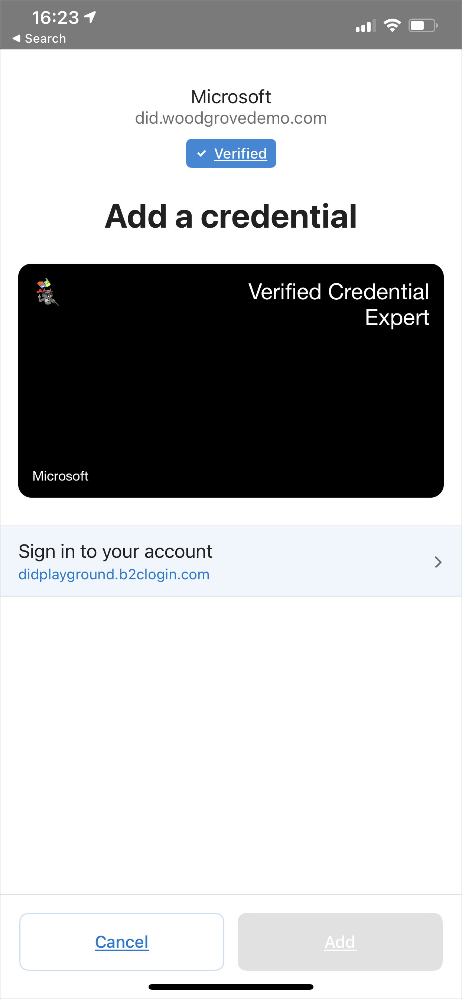

5. Before you get your Credential expert card, the tenant we are using requires that you provide authentication information. If this is your first time going through tutorial you don't have a credential expert account, create a new user account in our B2C tenant.

   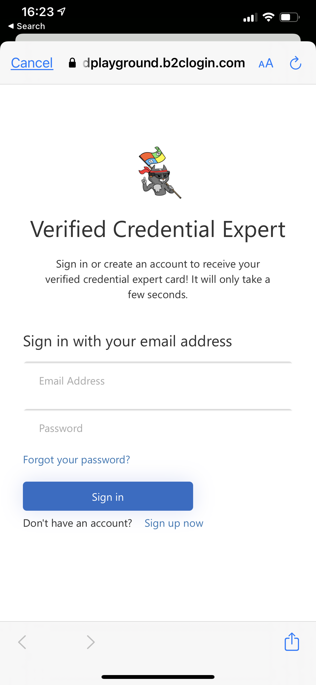

6. After you are signed in, the **Add** button is no longer greyed out. Choose **Add** to accept your new VC.

   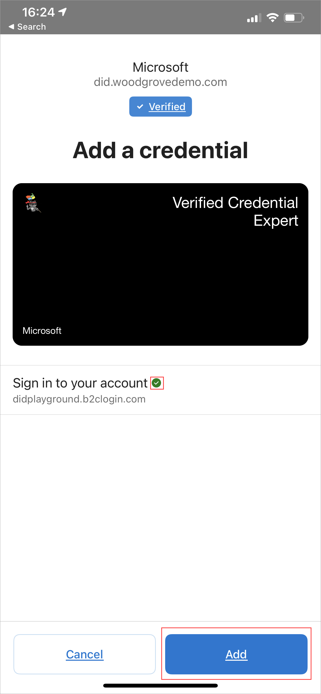 


7. Congratulations! You now have a verified credential expert VC.

   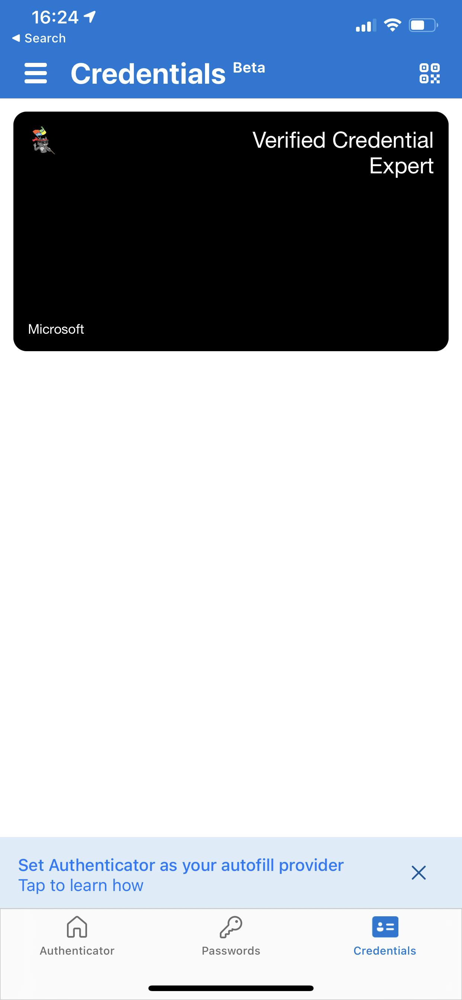 
 
Next, it is time to verify your credential.

## Validate credentials

Now that you have completed the issuance portion of the tutorial and you have a verifiable credential in Authenticator, it is time to validate it in your own verifier app.

1.  Stop running your issuer ngrok service.

    ```terminal
     control+c
    ```


2. In another terminal window, open the Verifier app folder and run it similarly to how we ran the issuer app.

    ```terminal
     cd verifier
     npm install
     node app.js
    ```

3. Now run ngrok with the verifier port 8082.

    ```terminal
    ngrok http 8082
    ```

4. Open the ngrok https forwarding url in your browser and tap on the **VERIFY CREDENTIAL** button.  

   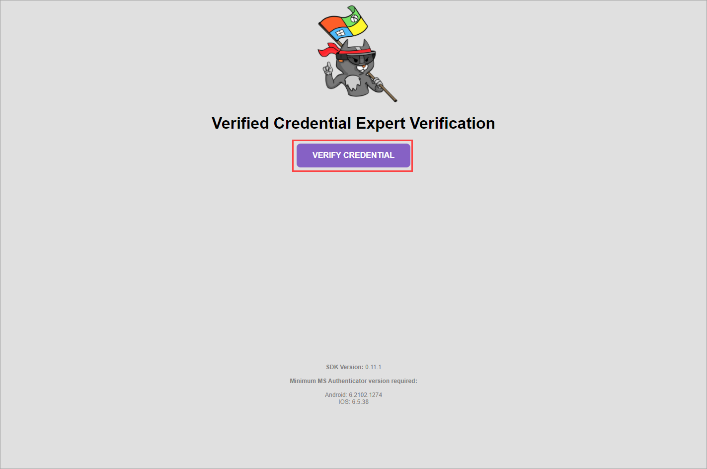

5. Open Authenticator and scan the QR code.

   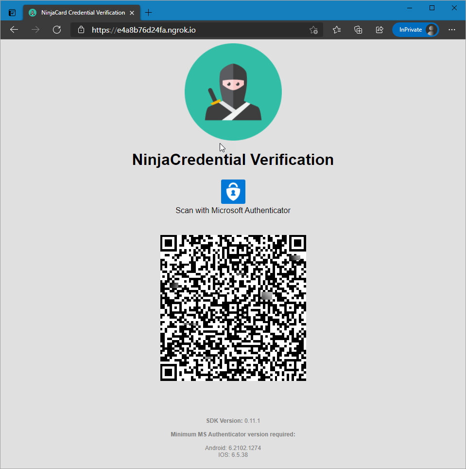

  > [!IMPORTANT]
  > On iOS, it is the top right and on Android it is the bottom right. Scan the QR code.

6. Choose **Allow** on the new permission request screen in Authenticator. By pressing allow, you are signing a verifiable presentation with your DID (Decentralized Identifier) to prove you in fact control this Verifiable Credential.

   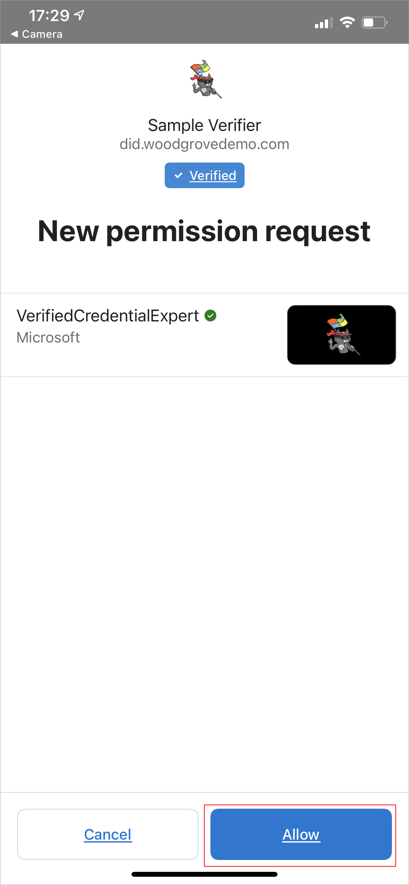

    After a successful presentation three things should have been updated:

   1. The webpage should now display "Congratulations, Your name" + is a Verified Credential Expert!".
   
    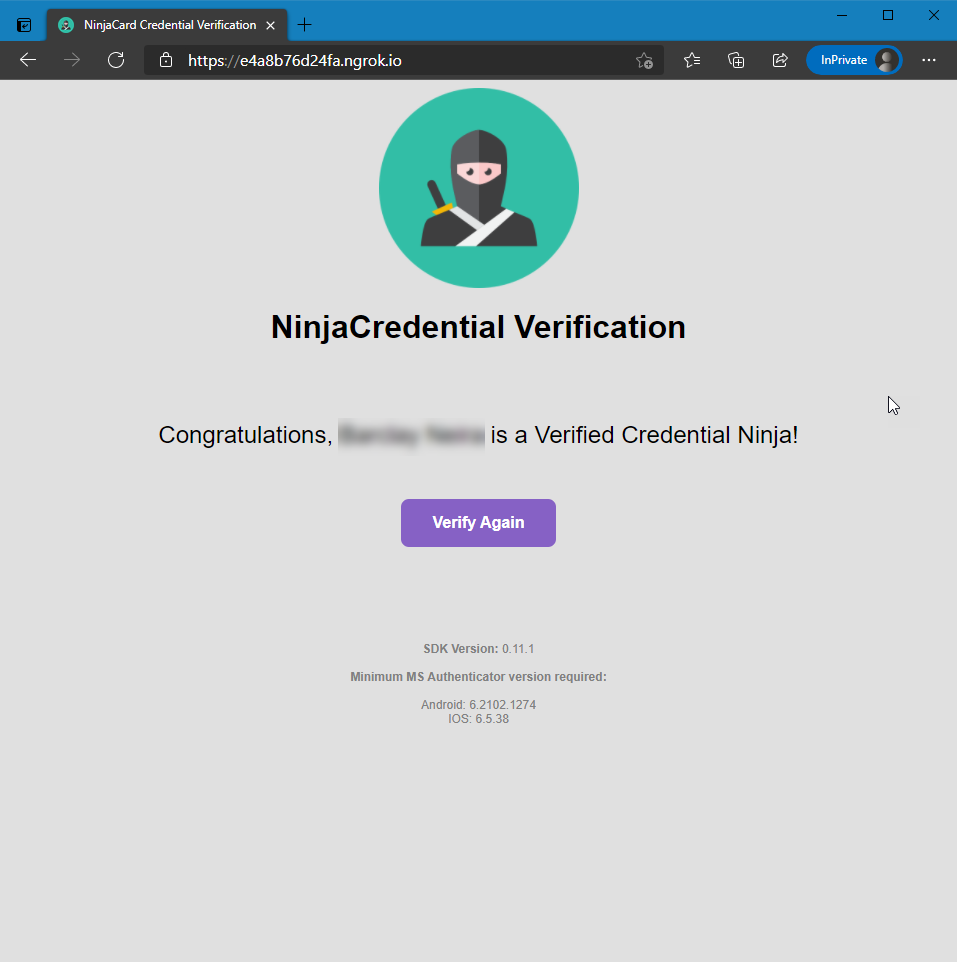


   2. Your verifier app terminal should also display the same message from the logs.
   
    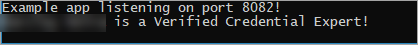

   3. In Authenticator, there should be an entry for recent activity of this presentation.

    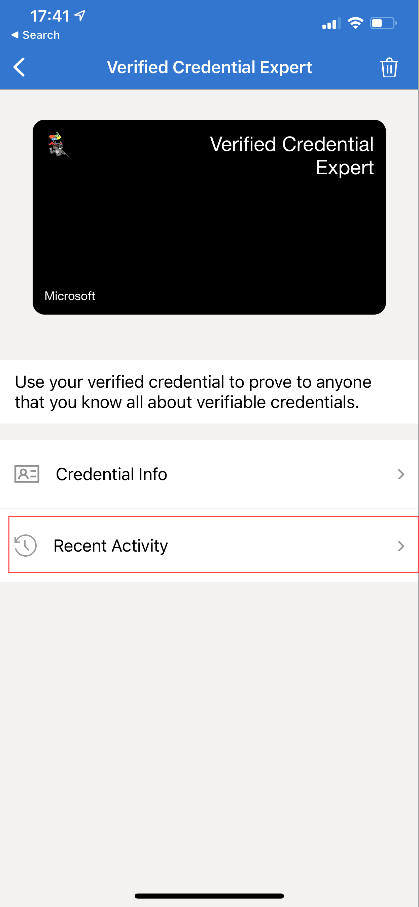

   
>[!NOTE]
> While running the verifier app, ngrok may stop working and display an error that there are too many connections. We've found this can be avoided by registering your account with ngrok. 

## Next steps

Now that you have successfully completed the quick start guide, it's time to create your own Decentralized identifier in the Azure AD verifiable credentials service and issue your own verifiable credential.

>[!div class="nextstepaction"] 
>[Configure your own issuer using the verifiable credentials sample app](./enable-your-tenant-verifiable-credentials.md)
