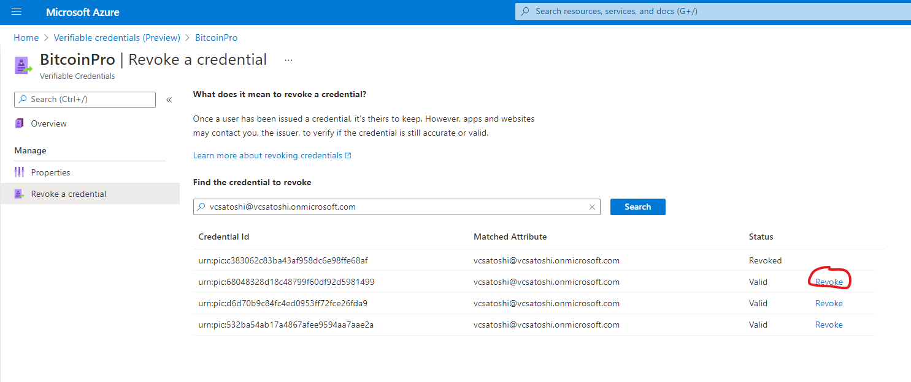

# Revoke a previously issued Verifiable Credential 

In this article:
- Status in Verifiable Credentials spec
- How status works 
- Why you may want to revoke
- How to set up a Verifiable Credential with the ability to revoke
- How to revoke a Verifiable Credential 
- Data and privacy implications 
- Next Steps 

## Status in Verifiable Credentials spec 

Before we can understand the implications of revoking a verifiable credential, it may help to know what the **status check** is and how it works today.

The [W3C Verifiable Credentials spec](https://www.w3.org/TR/vc-data-model/) references the Status property in section [4.9:](https://www.w3.org/TR/vc-data-model/#status)

"This specification defines the following credentialStatus property for the discovery of information about the current status of a verifiable credential, such as whether it is suspended or revoked."

However, the W3C specification does not define a format on how Status check should be implemented.

"Defining the data model, formats, and protocols for status schemes are out of scope for this specification. A Verifiable Credential Extension Registry [VC-EXTENSION-REGISTRY] exists that contains available status schemes for implementers who want to implement verifiable credential status checking."

For now, the status check we have implemented is proprietary but Microsoft is actively working with the DID community to align on a standard.

## How status works

In every Microsoft issued Verifiable Credential, there is an attribute called credentialStatus. It's populated with a status API that Microsoft manages on your behalf. Here is an example of what it looks like.

```json
    "credentialStatus": {
      "id": "https://portableidentitycards.azure-api.net/v1.0/7952032d-d1f3-4c65-993f-1112dab7e191/portableIdentities/card/status",
      "type": "PortableIdentityCardServiceCredentialStatus2020"
    }
```

The open source Verifiable Credentials SDK will currently handle calling the status API and providing the necessary data. If you would like to call the status API from your own verifiable credential service, follow this documentation here <add docs>. 

Once the API is called and provided the right information, the API will return either a True or False. True being the Verifiable Credential is still active with the Issuer and False signifying the Verifiable Credential has been actively revoked by the Issuer. 

## Why you may want to revoke

Each customer will have their own unique reason's for wanting to revoke a Verifiable Credential, but here are some of the common themes we have heard thus far. 

- Student ID: the student is no longer an active student at the University. 
- Employee ID: the employee is no longer an active employee.
- State Drivers License: the driver no longer lives in that state.

## How to set up a Verifiable Credential with the ability to revoke

All Verifiable Credential data is not stored with Microsoft by default. Therefore, we do not have any data to reference in order to revoke a specific Verifiable Credential ID. The issuer needs to specify a specific field from the Verifiable Credential attribute for Microsoft to index and subsequently salt and hash. 

>[!NOTE]
>Hashing is a one way cryptographic operation that turns an input, called a preimage, and produces an output called a hash that has a fixed length. It is not computationally feasible at this time to reverse a hash operation.

You can tell Microsoft what attribute of the Verifiable Credential you would like to index, meaning what value do you want to search for in the future to find the Verifiable Credential you want to revoke. 

Example: Alice is a Woodgrove employee. Alice left Woodgrove to work at Contoso. Jane, the IT admin for Woodgrove, searches for Alice's email in the Verifiable Credentials Revoke search query. In this example, Jane, indexed the email field of the Woodgrove Verified Employee credential. 

See below for an example of how the Rules file is modified to include the index. 

```json
{
  "attestations": {
    "idTokens": [
      { 
        "mapping": {
          "Name": { "claim": "name" },
          "email": { "claim": "email", "indexed": true}
        },
        "configuration": "https://login.microsoftonline.com/tenant-id-here7/v2.0/.well-known/openid-configuration",
        "client_id": "c0d6b785-7a08-494e-8f63-c30744c3be2f",
        "redirect_uri": "vcclient://openid"
      }
    ]
  },
  "validityInterval": 25920000,
  "vc": {
    "type": ["WoodgroveEmployee"]
  }
}
```

>[!NOTE]
>Only one attribute can be indexed from a Rules file.  

## How to revoke a Verifiable Credential 

Once an index claim has been set and Verifiable Credentials have been issued to your users, it's time to see how you can revoke a Verifiable Credential in the VC blade. 

1. Navigate to the Verifiable Credentials blade in AAD.
1. Choose the Verifiable Credential where you've previously set up the index claim and also issued Verifiable Credential to a user. 
1. Left hand menu choose 'Revoke a credential'
    
1. Search for the index attribute of the user you want to revoke. In the example of Alice, the Woodgrove employee recently took a new job, the IT Admin indexed the email attribute. 
   

>[!NOTE]
>Since we are only storing a hash of the indexed claim from the Verifiable Credential, only an exact match will populate the search results. We take the input as searched by the IT Admin and we use the same hashing algorithm to see if we have a hash match in our database.

1. Once you've found a match, select the revoke button.
    
1. After successful revocation you see the status update and a green banner will appear at the top of the page. 
1.  

Now whenever a Relying Party calls to check the status of this specific Verifiable Credential, Microsoft's status API which is acting on behalf of the tenant, will return a 'false' response.

## Next Steps

Test out the functionality on your own with a test credential to get used to the flow.