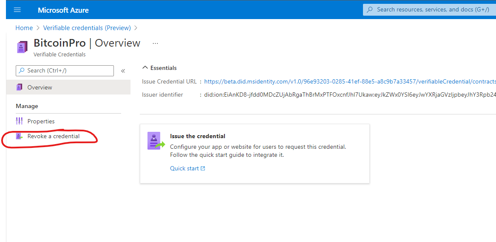
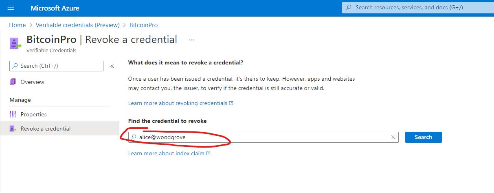
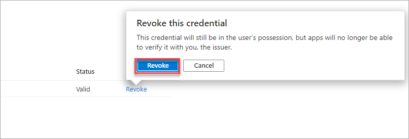
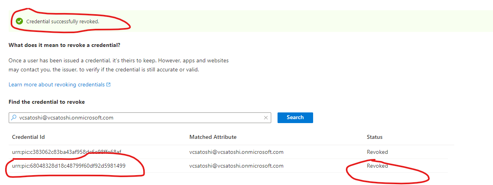

# Revoke a previously issued verifiable credential

[!INCLUDE [Verifiable Credentials announcement](../../../includes/verifiable-credentials-brand.md)]

As part of the process of working with verifiable credentials (VCs), you not only have to issue credentials, but sometimes you also have to revoke them. In this article, we go over the **Status** property part of the VC specification and take a closer look at the revocation process, why we may want to revoke credentials and some data and privacy implications.

## Why you may want to revoke a verifiable credential?

Each customer will have their own unique reason's for wanting to revoke a verifiable credential, but here are some of the common themes we've heard thus far. 

- Student ID: the student is no longer an active student at the University.
- Employee ID: the employee is no longer an active employee.
- State Drivers License: the driver no longer lives in that state.

## How do I revoke a verifiable credential

Using the indexed claim in verifiable credentials, you can search for issued verifiable credentials by that claim in the portal and revoke it.

1. Navigate to the Verified ID blade in the Azure portal as an admin user with sign key permission on Azure KeyVault.
1. Select the verifiable credential type
1. On the left-hand menu, choose **Revoke a credential**
    
1. Search for the index claim of the user you want to revoke. If you haven't indexed a claim, search will not work, and you will not be able to revoke the verifiable credential.

   

    >[!NOTE]
    >Since only a hash of the indexed claim from the verifiable credential is stored, only an exact match will populate the search results. What is entered in the textbox is hashed using the same algorithm and used as a search criteria to match the stored, hashed, value.
    
1. When a match is found, select the **Revoke** option to the right of the credential you want to revoke. 
 
    >[!NOTE]
    >The admin user performing the revoke operation needs to have **sign** key permission on Azure KeyVault or you will get error message ***Unable to access KeyVault resource with given credentials***.

    

1. After successful revocation, you see the status update and a green banner will appear at the top of the page. 
   
    

Now whenever a presentation is sent to the Request Service API it will check if the VC has been revoked.

## How to set up a verifiable credential with the ability to revoke

Verifiable credential data isn't stored by Microsoft. Therefore, the issuer needs to make one claim, the indexed claim, before the VC is searchable. There can be only one claim that is indexed and if there is none, you won't be able to revoke credentials. The selected claim to index is then salted and hashed and isn't stored as its original value.

>[!NOTE]
>Hashing is a one way cryptographic operation that turns an input, called a ```preimage```, and produces an output called a hash that has a fixed length. It is not computationally feasible at this time to reverse a hash operation.

**Example:** In the below example, the displayName is the index claim and searching can be done via the users full name and nothing else. 

```json
{
  "attestations": {
    "idTokens": [
      {
        "clientId": "8d5b446e-22b2-4e01-bb2e-9070f6b20c90",
        "configuration": "https://didplayground.b2clogin.com/didplayground.onmicrosoft.com/B2C_1_sisu/v2.0/.well-known/openid-configuration",
        "redirectUri": "vcclient://openid",
        "scope": "openid profile email",
        "mapping": [
          {
            "outputClaim": "displayName",
            "required": true,
            "inputClaim": "$.name",
            "indexed": true
          },
          {
            "outputClaim": "firstName",
            "required": true,
            "inputClaim": "$.given_name",
            "indexed": false
          },
          {
            "outputClaim": "lastName",
            "required": true,
            "inputClaim": "$.family_name",
            "indexed": false
          }
        ],
        "required": false
      }
    ]
  },
  "validityInterval": 2592000,
  "vc": {
    "type": [
      "VerifiedCredentialExpert"
    ]
  }
}
```

>[!NOTE]
>Only one claim can be indexed from a rules claims mapping. If you accidentally have no indexed claim in your rules definition, and you later correct this, already issued verifiable credentials will not be searchable since they were issued when no index existed. 


## How does revocation work?

Microsoft Entra Verified ID implements the [W3C StatusList2021](https://github.com/w3c/vc-status-list-2021/tree/343b8b59cddba4525e1ef355356ae760fc75904e). When presentation to the Request Service API happens, the API will do the revocation check for you. The revocation check happens over an anonymous API call to Identity Hub and does not contain any data who is checking if the verifiable credential is still valid or revoked. With the **statusList2021**, Microsoft Entra Verified ID just keeps a flag by the hashed value of the indexed claim to keep track of the revocation status. 

### Verifiable credential data 

In every Microsoft issued verifiable credential, there is a claim called `credentialStatus`. This data is a navigational map to where in a block of data this VC has its revocation flag.

>[!NOTE]
>If the verifiable credential is old and was issued during the preview period, this claim may not exist. Revocation will not work for this credential and you have to reissue it.

```json
...
"credentialStatus": { 
    "id": "urn:uuid:625dfcad-0000-1111-2222-333444445555?bit-index=31", 
    "type": "RevocationList2021Status", 
    "statusListIndex": 31, 
    "statusListCredential": "did:ion:EiDR0Y6zfvnUy2NjO293XNfe9AOL...<SNIP>...?service=IdentityHub&queries=...data..." 
...
```

### Issuers Identity Hub API endpoint

In the issuing party's DID document, the Identity Hub's endpoint is available in the `service` section. 

```json
didDocument": {
    "id": "did:ion:EiD...<SNIP>",
    "@context": [
        "https://www.w3.org/ns/did/v1",
        {
            "@base": "did:ion:EiD...<SNIP>..."
        }
     ],
     "service": [
         {
             "id": "#linkeddomains",
             "type": "LinkedDomains",
             "serviceEndpoint": {
             "origins": [
                "https://contoso.com/"
                ]
             }
         },
         {
             "id": "#hub",
             "type": "IdentityHub",
             "serviceEndpoint": {
                "instances": [
                   "https://verifiedid.hub.msidentity.com/v1.0/11111111-2222-3333-4444-000000000000"
                ],
                "origins": [ ]
             }
         }
    ],
```

## Next steps

- [How to customize your Microsoft Entra Verified ID](credential-design.md)
