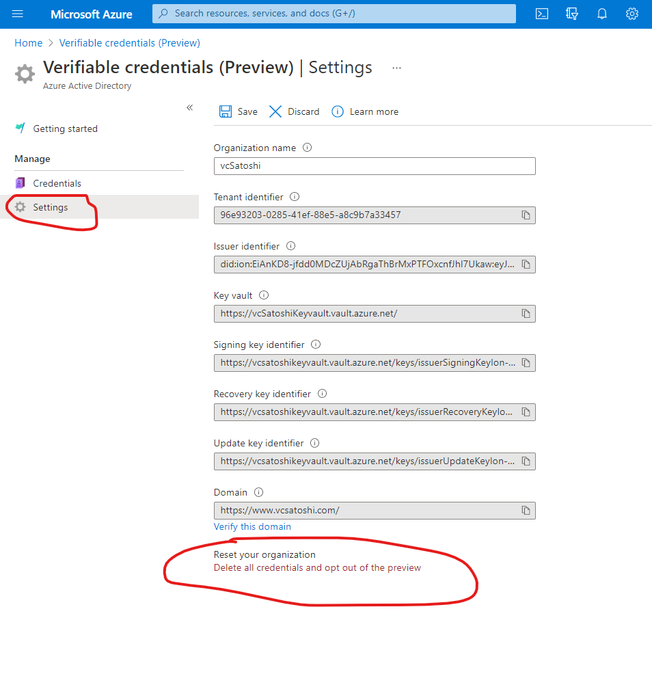

# Opt out of the verifiable credentials (Preview)

In this article:

- The reason why you may need to opt out.
- The steps required.
- What happens to your data?
- Effect on existing verifiable credentials.

## Prerequisites

- Complete verifiable credentials onboarding.

## Potential reasons for opting out

At this time, we don't have the ability to make modifications to the domain information. As a result, if you make a mistake or decide that you want to make a change, there is no other option available besides opting out and starting again.

## The steps required

1. From the Azure portal search for verifiable credentials.
2. Choose **Settings** from the left side menu.
3. Under the section, **Reset your organization**, select **Delete all credentials, and opt out of preview**.

   

4. Read the warning message and to continue select **Delete and opt out**.

   

You have now opted out of the Verifiable Credentials Preview. Keep reading to understand what is happening under the hood.

## What happens to your data?

When you complete opting out of the AAD Verifiable Credentials service, the following actions will take place:

- The DID keys in Key Vault will be [soft deleted](../../key-vault/general/soft-delete-overview.md).
- The issuer object will be deleted from our database.
- The tenant identifer will be deleted from our database. 
- All of the contracts objects will be deleted from our database.

Once an opt-out takes place, you will not be able to recover your DID or conduct any operations on your DID. This step is a one-way operation, and you need to opt in again, which results in a new DID being created.  

## Effect on existing verifiable credentials.

All verifiable credentials already issued will continue to exist. They will not be cryptographically invalidated as your DID will remain resolvable through ION.
However, when relying parties call the status API, they will always receive back a failure message.

## Next steps

- Set up verifiable credentials on your [Azure tenant](get-started-verifiable-credentials.md)