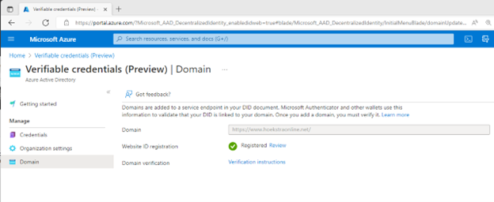
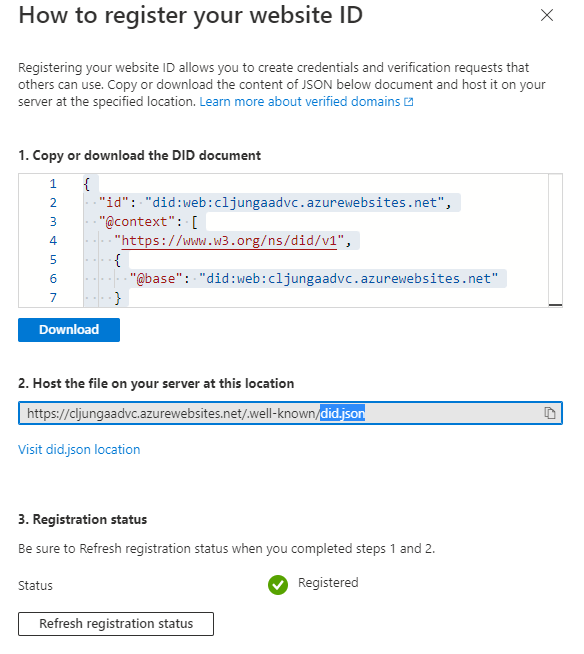

# How to register your decentralized ID for did:web

[!INCLUDE [Verifiable Credentials announcement](../../../includes/verifiable-credentials-brand.md)]

## Prerequisites

- Complete verifiable credentials onboarding with Web as the selected trust system.
- Complete the Linked Domain setup. Without completing this step, you can't perform this registration step.

## Why do I need to register my decentralized ID?

If your trust system for the tenant is Web, you need register your decentralized ID to be able to issue and verify your credentials. When the trust system is Web, you have to make this information available on your website and complete this registration. Otherwise your public key isn't made public. When you use the ION based trust system, information like your issuers' public keys are published to blockchain and you don't need to complete this step.

## How do I register my decentralized ID?

1. Navigate to the VerifiedID in the Azure portal.
1. From the left menu, select **Setup**.
1. From the middle menu, select Update under **Register decentralized ID**

   
1. Copy or download the DID document being displayed in the box.

   
1. Upload the file to your webserver. The DID document JSON file needs to be uploaded to location `/.well-known/did.json` on your webserver.
1. Once the file is available on your webserver, you need to select the **Refresh registration status** button to verify that the system can request the file.

## When is the DID document in the did.json file used?

The DID document contains the public keys for your issuer and is used during both issuance and presentation. An example of how the public keys are used is when Authenticator, as a wallet, validates the signature of an issuance or presentation request.

## When does the did.json file need to be republished to the webserver?

The DID document in the `did.json` file needs to be republished if you changed the Linked Domain or if you rotate your signing keys.

## How can I verify that the registration is working?

The portal verifies that the `did.json` is reachable and correct when you click the **Refresh registration status** button. You should also consider verifying that you can request that URL in a browser to avoid errors like not using https, a bad SSL certificate or the URL not being public. If the `did.json` file cannot be requested anonymously in a browser or via tools such as `curl`, without warnings or errors, the portal will not be able to complete the **Refresh registration status** step either. 

>[!NOTE]
> If you are experiencing problems refreshing your registration status, you can troubleshoot it via running `curl -Iv https://yourdomain.com/.well-known/did.json` on an machine with Ubuntu OS. Windows Subsystem for Linux with Ubuntu will work too. If curl fails, refreshing the registration status will not work.

## Next steps

- [Tutorial for issue a verifiable credential](verifiable-credentials-configure-issuer.md)