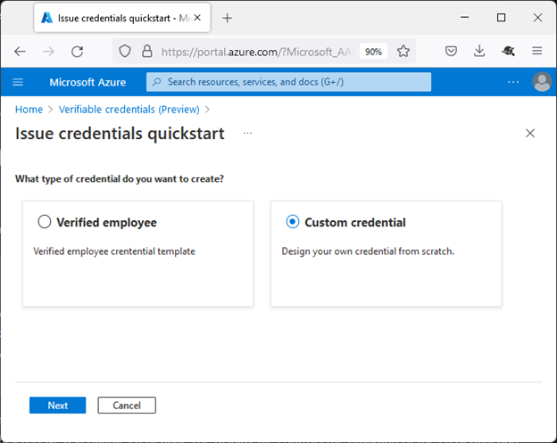
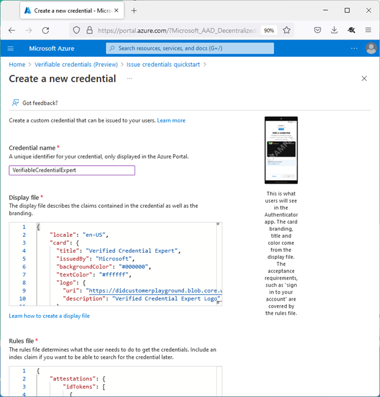
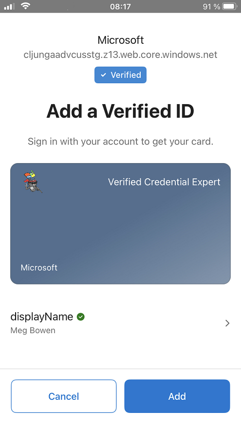
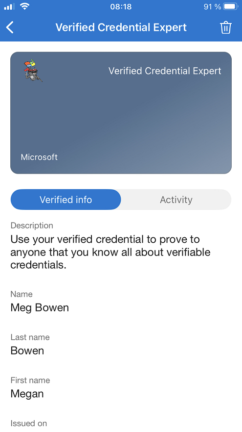
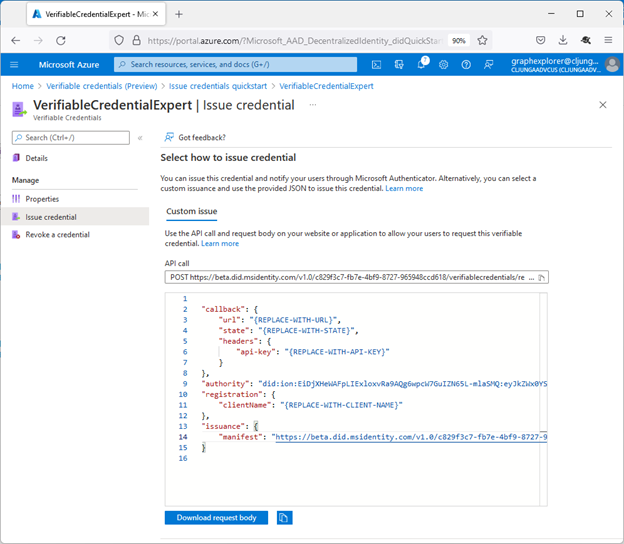

# Create verifiable credentials with multiple attestations

[!INCLUDE [Verifiable Credentials announcement](../../../includes/verifiable-credentials-brand.md)]


A [rules definition](rules-and-display-definitions-model.md#rulesmodel-type) that uses multiple attestations types produces an issuance flow where claims come from more than one source. For instance you may be required to present an existing credential and also manually enter values for claims in Microsoft Authenticator.  

In this how-to guide, we will extend the [ID token hint attestation](how-to-use-quickstart-idtoken.md) example by adding a self attested claim that the user has to enter in the Authenticator during issuance. The issuance request to Verified ID will contain an ID token hint with the claim values for `given_name` and `family_name` and a self issued attestation type for claim `displayName` that the user enters themselves.
  
## Create a custom credential with multiple attestation types

In the Azure portal, when you select **Add credential**, you get the option to launch two quickstarts. Select **custom credential**, and then select **Next**. 



On the **Create a new credential** page, enter the JSON code for the display and the rules definitions. In the **Credential name** box, give the credential a type name. To create the credential, select **Create**.



## Sample JSON display definitions

The JSON display definition has one extra claim named **displayName** compared to the [ID token hint display definition](how-to-use-quickstart-idtoken.md#sample-json-display-definitions). 

```json
{
    "locale": "en-US",
    "card": {
      "title": "Verified Credential Expert",
      "issuedBy": "Microsoft",
      "backgroundColor": "#507090",
      "textColor": "#ffffff",
      "logo": {
        "uri": "https://didcustomerplayground.blob.core.windows.net/public/VerifiedCredentialExpert_icon.png",
        "description": "Verified Credential Expert Logo"
      },
      "description": "Use your verified credential to prove to anyone that you know all about verifiable credentials."
    },
    "consent": {
      "title": "Do you want to get your Verified Credential?",
      "instructions": "Sign in with your account to get your card."
    },
    "claims": [
      {
        "claim": "vc.credentialSubject.displayName",
        "label": "Name",
        "type": "String"
      },
      {
        "claim": "vc.credentialSubject.firstName",
        "label": "First name",
        "type": "String"
      },
      {
        "claim": "vc.credentialSubject.lastName",
        "label": "Last name",
        "type": "String"
      }
    ]
}
```

## Sample JSON rules definitions

The JSON rules definition contains two different attestations that instruct the Authenticator to get claim values from two different sources. The issuance request to the Request Service API provides the values for the claims **given_name** and **family_name** to satisfy the **idTokenHints** attestation. The user will be requested to enter the claim value for **displayName** in the Authenticator during issuance. 

```json
{
  "attestations": {
    "idTokenHints": [
        {
        "mapping": [
            {
            "outputClaim": "firstName",
            "required": true,
            "inputClaim": "$.given_name",
            "indexed": false
            },
            {
            "outputClaim": "lastName",
            "required": true,
            "inputClaim": "$.family_name",
            "indexed": false
            }
        ],
        "required": false
        }
    ],
    "selfIssued": {
      "mapping": [
        {
          "outputClaim": "displayName",
          "required": true,
          "inputClaim": "displayName",
          "indexed": false
        }
      ],
      "required": false
    }
  },
  "validityInterval": 2592000,
  "vc": {
    "type": [
      "VerifiedCredentialExpert"
    ]
  }
}
```

## Claims input during issuance

During issuance, Authenticator prompts the user to enter values for the specified claims. User input isn't validated.



## Claims in issued credential

The issued credential will have three claims in total, where the `First` and `Last name` came from the **id token hint** attestation and the `Name` came from the **self issued** attestation.




## Configure the samples to issue and verify your custom credential

To configure your sample code to issue and verify your custom credential, you need:

- Your tenant's issuer decentralized identifier (DID)
- The credential type
- The manifest URL to your credential 

The easiest way to find this information for a custom credential is to go to your credential in the Azure portal. Select **Issue credential**. Then you have access to a text box with a JSON payload for the Request Service API. Replace the placeholder values with your environment's information. The issuer’s DID is the authority value.



## Next steps

See the [Rules and display definitions reference](rules-and-display-definitions-model.md).
