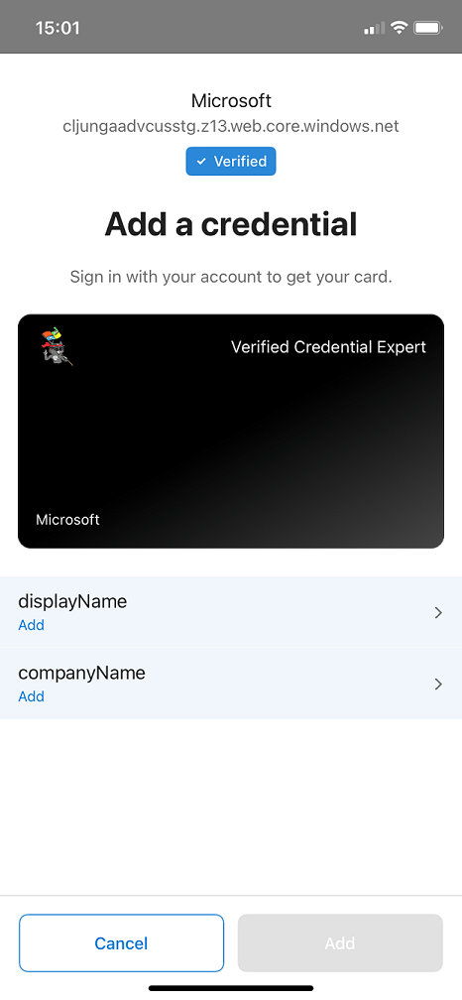

# Create verifiable credentials for self-asserted claims

[!INCLUDE [Verifiable Credentials announcement](../../../includes/verifiable-credentials-brand.md)]


A [rules definition](rules-and-display-definitions-model.md#rulesmodel-type) that uses the [selfIssued attestation](rules-and-display-definitions-model.md#selfissuedattestation-type) type produces an issuance flow where you're required to manually enter values for the claims in Microsoft Authenticator.  

## Create a custom credential with the selfIssued attestation type

In the Azure portal, when you select **Add credential**, you get the option to launch two quickstarts. Select **custom credential**, and then select **Next**. 


On the **Create a new credential** page, enter the JSON code for the display and the rules definitions. In the **Credential name** box, give the credential a type name. To create the credential, select **Create**.


## Sample JSON display definitions

The JSON display definition is nearly the same, regardless of attestation type. You only have to adjust the labels according to the claims that your verifiable credential has. The expected JSON for the display definitions is the inner content of the displays collection. The JSON is a collection, so if you want to support multiple locales, add multiple entries with a comma as separator. 

```json
{
    "locale": "en-US",
    "card": {
      "title": "Verified Credential Expert",
      "issuedBy": "Microsoft",
      "backgroundColor": "#000000",
      "textColor": "#ffffff",
      "logo": {
        "uri": "https://didcustomerplayground.blob.core.windows.net/public/VerifiedCredentialExpert_icon.png",
        "description": "Verified Credential Expert Logo"
      },
      "description": "Use your verified credential to prove to anyone that you know all about verifiable credentials."
    },
    "consent": {
      "title": "Do you want to get your Verified Credential?",
      "instructions": "Sign in with your account to get your card."
    },
    "claims": [
      {
        "claim": "vc.credentialSubject.displayName",
        "label": "Name",
        "type": "String"
      },
      {
        "claim": "vc.credentialSubject.companyName",
        "label": "Company",
        "type": "String"
      }
    ]
}
```

## Sample JSON rules definitions

The JSON attestation definition should contain the **selfIssued** name and the claims mapping section. Because the claims are self issued, the value is the same for **outputClaim** and **inputClaim**. The expected JSON for the rules definitions is the inner content of the rules attribute, which starts with the attestation attribute. 

```json
{
  "attestations": {
    "selfIssued": {
      "mapping": [
        {
          "outputClaim": "displayName",
          "required": true,
          "inputClaim": "displayName",
          "indexed": false
        },
        {
          "outputClaim": "companyName",
          "required": true,
          "inputClaim": "companyName",
          "indexed": false
        }
      ],
      "required": false
    }
  },
  "validityInterval": 2592000,
  "vc": {
    "type": [
      "VerifiedCredentialExpert"
    ]
  }
}
```

## Claims input during issuance

During issuance, Authenticator prompts you to enter values for the specified claims. User input isn't validated.



## Configure the samples to issue and verify your custom credential

To configure your sample code to issue and verify your custom credential, you need:

- Your tenant's issuer decentralized identifier (DID)
- The credential type
- The manifest URL to your credential 

The easiest way to find this information for a custom credential is to go to your credential in the Azure portal. Select **Issue credential**. Then you have access to a text box with a JSON payload for the Request Service API. Replace the placeholder values with your environment's information. The issuer’s DID is the authority value.


## Next steps

See the [Rules and display definitions reference](rules-and-display-definitions-model.md).
