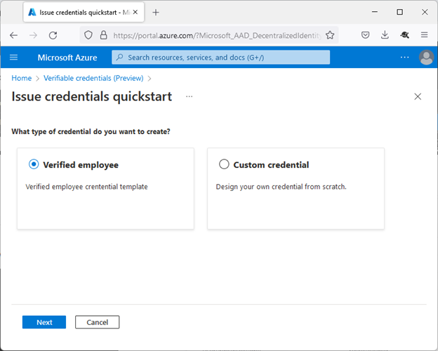
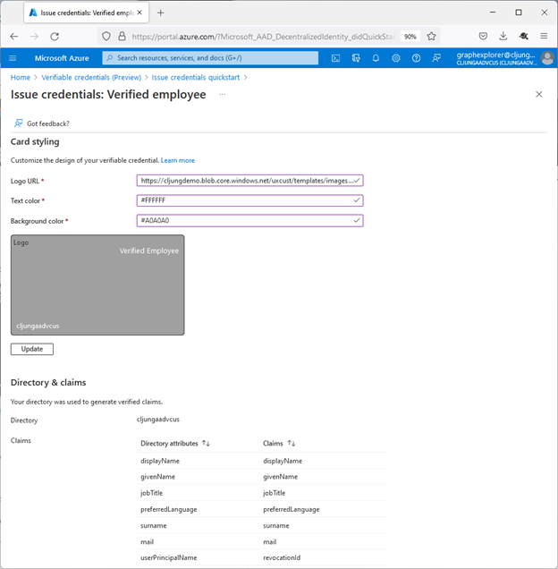
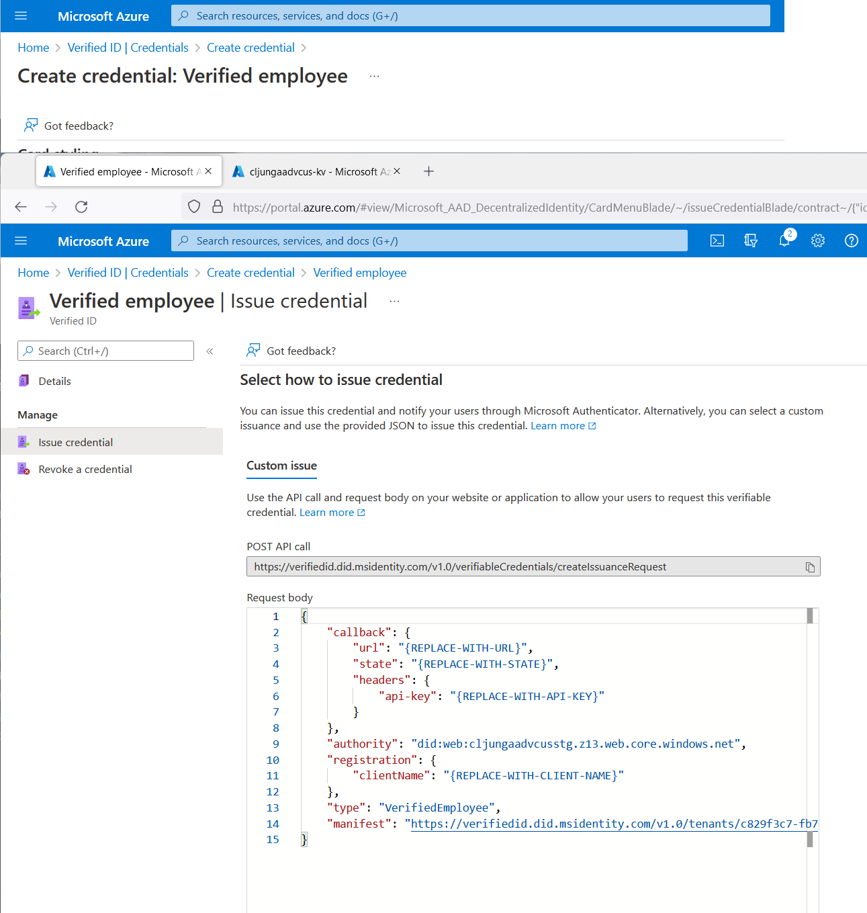

# Issue a Verifiable Credential for directory based claims 

[!INCLUDE [Verifiable Credentials announcement](../../../includes/verifiable-credentials-brand.md)]

In this guide, you'll create a credential where the claims come from a user profile in the directory of the Microsoft Entra tenant. With directory based claims you can create Verifiable Credentials of type VerifiedEmployee, if the users in the directory are employees.

In this article, you learn how to:

> [!div class="checklist"]
>
> - Create a user in the directory
> - Setup the user for Microsoft Authenticator
> - Create a Verified employee credential
> - Configure the samples to issue and verify your VerifiedEmployee credential

## Prerequisites

- [Set up a tenant for Microsoft Entra Verified ID Credentials](verifiable-credentials-configure-tenant.md).
- Complete the tutorial for [issuance](verifiable-credentials-configure-issuer.md) and [verification](verifiable-credentials-configure-verifier.md) of verifiable credentials.
- A mobile phone with Microsoft Authenticator that can be used as the test user account.

## Create a user in the directory

If you already have a test user, you can skip this section. If you want to create a test user, follow the steps below:

1. As an **User Admin**, navigate to the Microsoft Entra ID in the [Azure portal](https://portal.azure.com/#view/Microsoft_AAD_IAM/UsersManagementMenuBlade/~/MsGraphUsers)
1. Select **Users** and **+ New user**, then keep selection on [x] Create user
1. Fill in **User name**, **Name**, **First name** and **Last name**. 
1. Check **[x] Show Password** and copy the temporary password to somewhere, like Notepad, then select the Create button
1. Find the new user, select to **view profile** and select **Edit**. Update the following attributes then select Save:
    - Job Title
    - Email (in the Contact Info section. Doesn't have to be an existing email address) 
    - Photo (select JPG file with low, thumbnail like, resolution. Maximum size is 2MB.)
1. Open a new, private, browser window and navigate to page like [https://myapps.microsoft.com/](https://myapps.microsoft.com/) and sign in with your new user. The user name would be something like meganb@yourtenant.onmicrosoft.com. You'll be prompted to change your password

## Set up the user for Microsoft Authenticator

Your test user needs to have Microsoft Authenticator setup for the account. To enable Authenticator on the test user account, follow these steps:

1. On your mobile test device, open Microsoft Authenticator, go to the Authenticator tab at the bottom and tap **+**  sign to **Add account**. Select **Work or school account** 
1. At the prompt, select **Sign in**. Don't select “Scan QR code”
1. Sign in with the test user’s credentials in the Microsoft Entra tenant
1. Authenticator will launch [https://aka.ms/mfasetup](https://aka.ms/mfasetup) in the browser on your mobile device.   need to sign in again with your test users credentials.
1. In the **Set up your account in the app**, select **Pair your account to the app by clicking this link**. The Microsoft Authenticator app and opens and you see your test user as an added account

If [https://aka.ms/mfasetup](https://aka.ms/mfasetup) launches without prompting you to sign in, that means you have already set up authenticator for another user on this device. When already configured with a user, Authenticator signs you in automatically. Sign out the browser's currently logged in user and then repeat the steps above. If you zoom in on the page, you find the **Sign out** button at the top right corner

## Create a Verified employee credential

When you select + Add credential in the portal, you get the option to launch two Quickstarts. Select **Verified employee** and select Next. 

In the next screen, you enter some of the Display definitions, like logo url, text and background color. Since the credential is a managed credential with directory based claims, rules definitions are predefined and can't be changed. You don't need to enter rule definition details. The credential type will be **VerifiedEmployee** and the claims from the user’s profile are pre-set. Select Create to create the credential.

## Claims schema for Verified employee credential

All of the claims in the Verified employee credential come from attributes in the [user's profile](/graph/api/resources/user) in Microsoft Entra ID for the issuing tenant. You can't modify the set of claims. All claims, except photo, come from the Microsoft Graph Query [https://graph.microsoft.com/v1.0/me](/graph/api/user-get). The photo claim comes from the value returned from the Microsoft Graph Query [https://graph.microsoft.com/v1.0/me/photo/$value.](/graph/api/profilephoto-get)

| Claim | Directory attribute | Value  |
|---------|---------|---------|
| `revocationId` | `userPrincipalName`| The UPN of the user is added as a claim named `revocationId` and gets indexed.|
| `displayName` | `displayName` | The displayName of the user |
| `givenName` | `givenName` | First name of the user |
| `surname` | `surname` | Last name of the user |
| `jobTitle` | `jobTitle` | The user's job title. This attribute doesn't have a value by default in the user's profile. If the user's profile has no value specified, there's no `jobTitle` claim in the issued VC. |
| `preferredLanguage` | `preferredLanguage` | Should follow [ISO 639-1](https://en.wikipedia.org/wiki/ISO_639-1) and contain a value like `en-us`. There's no default value specified. If there's no value, no claim  is included in the issued VC. |
| `mail` | `mail` | The user's email address. The `mail` value isn't the same as the UPN. It's also an attribute that doesn't have a value by default. 
| `photo` | `photo` | The uploaded photo for the user. The image type should be JPEG and the maximum size is 2MB. When presenting the photo claim to a verifier, the photo claim is in the UrlEncode(Base64Encode(photo)) format. To use the photo, the verifier application has to Base64Decode(UrlDecode(photo)).

See full Microsoft Entra user profile [properties reference](/graph/api/resources/user).

If attribute values change in the user's Microsoft Entra profile, the VC isn't automatically reissued. You must reissue it manually. Issuance would be the same as the issuance process when working with the samples.

## Configure the samples to issue and verify your VerifiedEmployee credential

Verifiable Credentials for directory based claims can be issued and verified just like any other credentials you create. All you need is your issuer DID for your tenant, the credential type and the manifest url to your credential. The easiest way to find these values for a Managed Credential is to view the credential in the portal, select **Issue credential** and you will get a header named **Custom issue**. These steps bring up a textbox with a skeleton JSON payload for the Request Service API.

In this screen, you have values that you can copy and paste to your sample deployment’s configuration files. Issuer’s DID is the authority value.

- **authority** - Issuer's DID
- **type** - the credential type is always `VerifiedEmployee` when looking at a verified employee credential
- **manifest** - the credential manifest URL

The configuration file depends on the sample in-use.

- **Dotnet** - [appsettings.json](https://github.com/Azure-Samples/active-directory-verifiable-credentials-dotnet/blob/main/1-asp-net-core-api-idtokenhint/appsettings.json)
- **node** - [config.json](https://github.com/Azure-Samples/active-directory-verifiable-credentials-node/blob/main/1-node-api-idtokenhint/config.json)
- **python** - [config.json](https://github.com/Azure-Samples/active-directory-verifiable-credentials-python/blob/main/1-python-api-idtokenhint/config.json)
- **Java** - values are set as environment variables in [run.cmd](https://github.com/Azure-Samples/active-directory-verifiable-credentials-java/blob/main/1-java-api-idtokenhint/run.cmd) and [run.sh](https://github.com/Azure-Samples/active-directory-verifiable-credentials-java/blob/main/1-java-api-idtokenhint/run.sh) or docker-run.cmd/docker-run.sh when using docker.

## Remarks

>[!NOTE]
> This schema is fixed and it is not supported to add or remove claims in the schema. The attestation flow for directory based claims is also fixed and it is unsupported to try and change it to become a custom credential with id token hint attestation flow, for example.

## Next steps

Learn [how to customize your verifiable credentials](credential-design.md).
