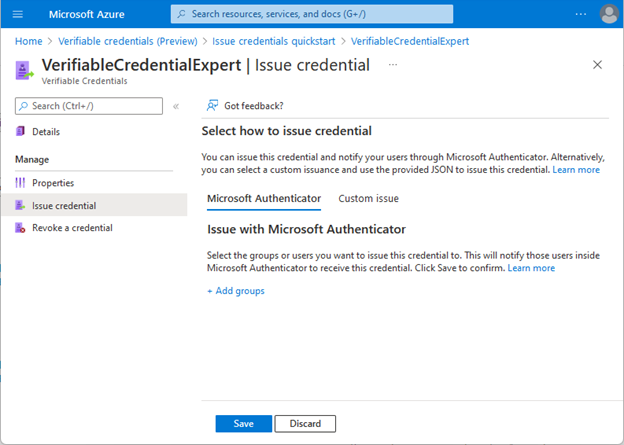

# How to create credentials using the Quickstart

[!INCLUDE [Verifiable Credentials announcement](../../../includes/verifiable-credentials-brand.md)]

> [!IMPORTANT]
> Azure Active Directory Verifiable Credentials is currently in public preview.
> This preview version is provided without a service level agreement, and it's not recommended for production workloads. Certain features might not be supported or might have constrained capabilities.
> For more information, see [Supplemental Terms of Use for Microsoft Azure Previews](https://azure.microsoft.com/support/legal/preview-supplemental-terms/).

## Prerequisites

To use the Azure Active Directory Verifiable Credentials QuickStart, you only need to complete verifiable credentials onboarding.

## What is the QuickStart?

Azure AD verifiable Credentials now come with a QuickStart in the portal for creating custom credentials. When using the QuickStart, you don't need to edit and upload of display and rules files to Azure Storage. Instead you enter all details in the portal and create the credential in one page. 

>[!NOTE]
>When working with custom credentials, you provide display and rules definitions in JSON documents. These definitions are now stored together with the credential's details.

## Create a Custom credential

When you select + Add credential in the portal, you get the option to launch two Quickstarts. Select [x] Custom credential and select Next. 


In the next screen, you enter JSON for the Display and the Rules definitions and give the credential a type name. Select Create to create the credential.


## Sample JSON Display definitions

The expected JSON for the Display definitions is the inner content of the displays collection. The JSON is a collection, so if you want to support multiple locales, you add multiple entries with a comma as separator.

```json
{
    "locale": "en-US",
    "card": {
      "title": "Verified Credential Expert",
      "issuedBy": "Microsoft",
      "backgroundColor": "#000000",
      "textColor": "#ffffff",
      "logo": {
        "uri": "https://didcustomerplayground.blob.core.windows.net/public/VerifiedCredentialExpert_icon.png",
        "description": "Verified Credential Expert Logo"
      },
      "description": "Use your verified credential to prove to anyone that you know all about verifiable credentials."
    },
    "consent": {
      "title": "Do you want to get your Verified Credential?",
      "instructions": "Sign in with your account to get your card."
    },
    "claims": [
      {
        "claim": "vc.credentialSubject.firstName",
        "label": "First name",
        "type": "String"
      },
      {
        "claim": "vc.credentialSubject.lastName",
        "label": "Last name",
        "type": "String"
      }
    ]
}
```

## Sample JSON Rules definitions

The expected JSON for the Rules definitions is the inner content of the rules attribute, which starts with the attestation attribute.

```json
{
      "attestations": {
        "idTokenHints": [
          {
            "mapping": [
              {
                "outputClaim": "firstName",
                "required": true,
                "inputClaim": "$.given_name",
                "indexed": false
              },
              {
                "outputClaim": "lastName",
                "required": true,
                "inputClaim": "$.family_name",
                "indexed": false
              }
            ],
            "required": false
          }
        ]
      }
}
```

## Configure the samples to issue and verify your Custom credential

To configure your sample code to issue and verify using custom credentials, you need:

- Your tenant's issuer DID
- The credential type
- The manifest url to your credential. 

The easiest way to find this information for a Custom Credential is to go to your credential in the portal, select **Issue credential** and switch to Custom issue.



After switching to custom issue, you have access to a textbox with a JSON payload for the Request Service API. Replace the place holder values with your environment's information. The issuer’s DID is the authority value.


## Next steps

- Reference for [Rules and Display definitions model](rules-and-display-definitions-model.md)