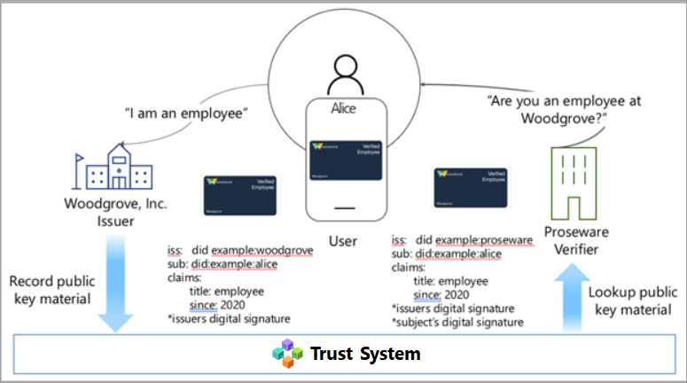
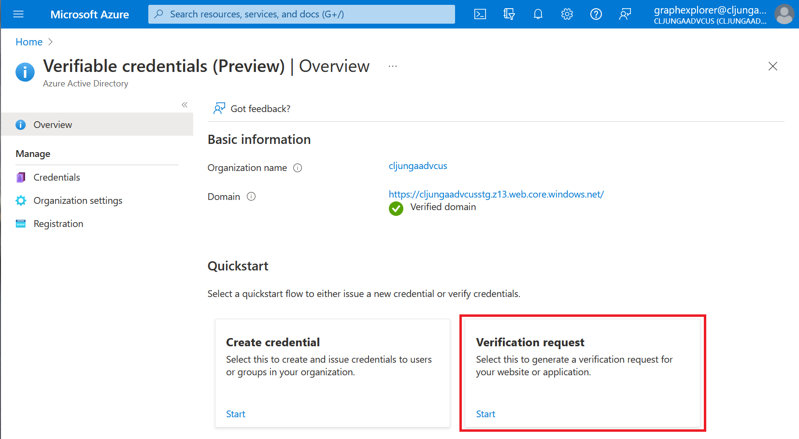
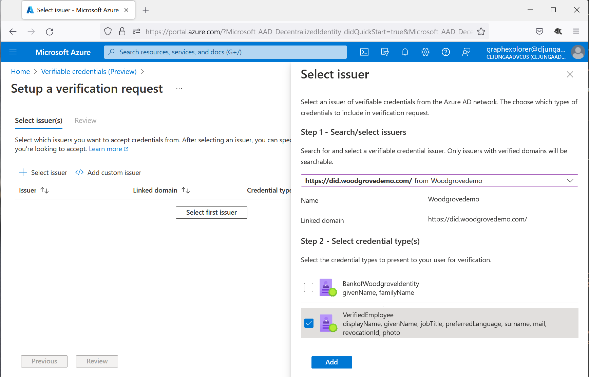
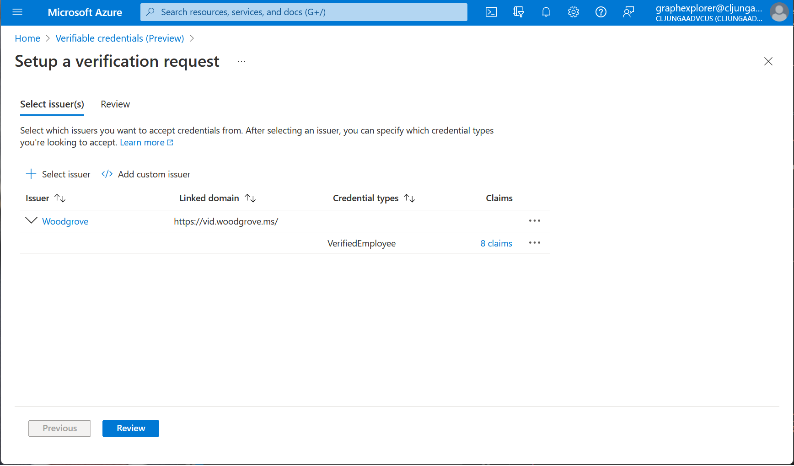

# Verifying credentials using the Microsoft Entra Verified ID Network

[!INCLUDE [Verifiable Credentials announcement](../../../includes/verifiable-credentials-brand.md)]

> [!IMPORTANT]
> Microsoft Entra Verified ID is currently in preview. This preview version is provided without a service-level agreement, and it's not recommended for production workloads. Certain features might not be supported or might have constrained capabilities.
> For more information, see [Supplemental Terms of Use for Microsoft Azure Previews](https://azure.microsoft.com/support/legal/preview-supplemental-terms/).

## Prerequisites

To use the Microsoft Entra Verified ID Network, you need to have completed the following.

- Complete the [Getting Started](get-started-verifiable-credentials.md) and subsequent [tutorial set](enable-your-tenant-verifiable-credentials.md).

## What is the Microsoft Entra Verified ID Network?

In the below scenario, Proseware is a verifier and needs to know Woodgrove's issuer DID and the credential type that represents Woodgrove employees in order to create a presentation request for a verified credential for an employee from Woodgrove. That can come from some kind of manual exchange of information between the companies, but that would be both a manual and a complex task. The Microsoft Entra Verified ID Network makes this process much easier where Woodgrove, as an issuer, can publish credentials types to the Microsoft Entra Verified ID Network and Proseware can search for published credential types and schemas in the Microsoft Entra Verified ID Network. Using this information, you can create a [presentation request](presentation-request-api.md#presentation-request-payload) and easily invoke the Request Service API. 
  

## How do I use the Microsoft Entra Verified ID Network?

1. In the start page of Microsoft Entra Verified ID in the Azure portal, you have a Quickstart named **Verification request**. Clicking on **start** will take you to a page where you can browse the Verifiable Credentials Network

    

1. When you click on the **Select first issuer**, a panel opens on the right side of the screen where you can search for issuers by their linked domains. So if you are looking for something from Woodgrove, you just type `woodgrove` in the search textbox. When you select an issuer in the list, the available credential types will show in the lower part labeled Step 2. Check the type you want to use and click the Add button to get back to the first screen. If the linked domain you expect to see isn't in the list it means that the linked domain isn't verified yet. If the list of credentials is empty, it means that the issuer has verified the linked domain but haven't published any credential types yet.

    

1. In the first screen we now have Woodgrove in the issuer list and the next step is to click the **Review** button. 

    

1. The Review screen displays a skeleton presentation request JSON payload for the Request Service API. The important pieces of information are the DID inside the **acceptedIssuers** collection and the **type** value. This is the information you need to create a presentation request that asks the user for a credential of a certain type issued by the organization you trust

    

## How do I make my linked domain searchable?

Linked domains that are verified will be searchable. Unverified domains will not be searchable.

## How do I make my credential types visible in the list?

Each credential type that is created has an attribute named `availableInVcDirectory` that makes it visible in the list. You can update this attribute to make the credential type visible or not. Please see [Admin API reference](admin-api.md#contract-type).

## What is public when a credential type is made visible?

When you make a credential type available in the VC Network, only the **issuing DID**, the credential **type** and its **schema** are made public. Important to note is that this information was already public before making it visible due to how decentralized identities work. Making the credential type visible is just making it searchable in the VC Network.  

## Next steps

For more information, see:

- [Learn how to verify Microsoft Entra Verified ID credentials](verifiable-credentials-configure-verifier.md).
- [Presentation API specification](presentation-request-api.md)