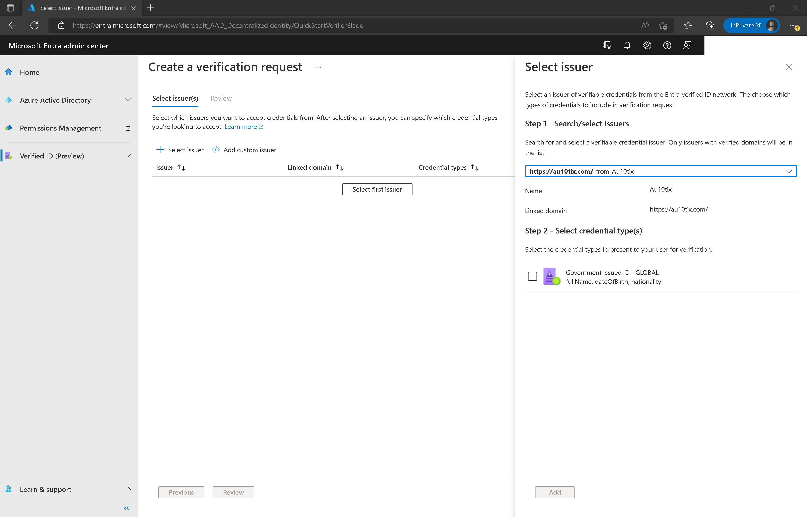

# Configure Verified ID by AU10TIX as your Identity Verification Partner

In this article, we cover the steps needed to integrate Microsoft Entra Verified ID with [AU10TIX](https://www.au10tix.com/). AU10TIX is a global leader in identity verification enabling companies to scale up their business by accelerating onboarding scenarios and ongoing verification throughout the customer lifecycle. It is an automated solution for the verification of ID documents + biometrics in 8 seconds or less. AU10TIX supports the verification of documents in over 190 countries/regions reading documents in their regional languages.

To learn more about AU10TIX and its complete set of solutions, visit https://www.au10tix.com/.

## Prerequisites

Before you can continue with the steps below you need to meet the following requirements:

- A tenant [configured](verifiable-credentials-configure-tenant.md) for Microsoft Entra Verified ID service.
    - If you don't have an existing tenant, you can [create an Azure account for free](https://azure.microsoft.com/free/?WT.mc_id=A261C142F).
- You need to have completed the onboarding process with Au10tix.
    - To create a AU10TIX account, submit the form on this [page](https://www.au10tix.com/solutions/microsoft-azure-active-directory-verifiable-credentials-program/).

>[!IMPORTANT]
> Before you proceed, you must have received the URL from Au10Tix for users to be issued Verified IDs. If you have not yet received it, follow up with Au10Tix before you attempt following the steps documented below.

## Scenario description

When onboarding users you can remove the need for error prone manual onboarding steps by using Verified ID with A10TIX account onboarding. Verified IDs can be used to digitally onboard employees, students, citizens, or others to securely access resources and services. For example, rather than an employee needing to go to a central office to activate an employee badge, they can use a Verified ID to verify their identity to activate a badge that is delivered to them remotely. Rather than a citizen receiving a code they must redeem to access governmental services, they can use a Verified ID to prove their identity and gain access. Learn more about [account onboarding](./plan-verification-solution.md#account-onboarding).

:::image type="content" source="media/verified-id-partner-au10tix/vc-solution-architecture-diagram.png" alt-text="Diagram of the verifiable credential solution.":::

## Configure your Application to use AU10TIX Verified ID

For incorporating identity verification into your Apps, using AU10TIX  “Government Issued ID -Global” Verified ID follow these steps:

### Part 1

As a developer you can share these steps with your tenant administrator to obtain the verification request URL, and body for your application or website to request Verified IDs from your users.

1. Go to [Microsoft Entra admin center -> Verified ID](https://entra.microsoft.com/#view/Microsoft_AAD_DecentralizedIdentity/ResourceOverviewBlade). 

   >[!NOTE]
   > Make sure this is the tenant you set up for Verified ID per the pre-requisites.

1. Go to QuickStart > Verification Request > [Start](https://entra.microsoft.com/#view/Microsoft_AAD_DecentralizedIdentity/QuickStartVerifierBlade)
1. Choose **Select Issuer**.
1. Look for AU10TIX in the **Search/select issuers** drop-down.

   
1. Check the **Government Issued ID – Global** or other credential type.
1. Select **Add** and then select **Review**.
1. Download the request body and Copy/paste POST API request URL.

### Part 2

As a developer you now have the request URL and body from your tenant admin, follow these steps to update your application or website:

1. Add the request URL and body to your application or website to request Verified IDs from your users. 
   >[!Note]
   >If you are using [one of the sample apps](https://aka.ms/vcsample), you'll need to replace the contents of the `presentation_request_config.json` with the request body obtained in [Part 1](#part-1). The sample code overwrites the `trustedIssuers` values with `IssuerAuthority` value from `appsettings.json`. Copy the `trustedIssuers` value from the payload to `IssuerAuthority` in `appsettings.json` file.
1. Be sure to replace the values for the "url", "state", and "api-key" with your respective values.
1. [Grant permissions](verifiable-credentials-configure-tenant.md#grant-permissions-to-get-access-tokens) to your app to obtain access token for the Verified ID service request service principal.

## Test the user flow

User flow is specific to your application or website. However if you are using one of the sample apps follow the steps outlined as part of the [sample app's documentation](https://aka.ms/vcsample).

## Next steps

- [Verifiable credentials admin API](admin-api.md)
- [Request Service REST API issuance specification](issuance-request-api.md)
