# Tutorial - Issue and verify verifiable credentials using your tenant (preview)

> [!IMPORTANT]
> Azure Active Directory Verifiable Credentials is currently in public preview.
> This preview version is provided without a service level agreement, and it's not recommended for production workloads. Certain features might not be supported or might have constrained capabilities. 
> For more information, see [Supplemental Terms of Use for Microsoft Azure Previews](https://azure.microsoft.com/support/legal/preview-supplemental-terms/).

Now that you have your Azure tenant set up with the Verifiable Credential service, we walk through the steps necessary to enable your Azure Active Directory (Azure AD) to issue verifiable credentials using the sample app.

In this article you:

> [!div class="checklist"]
> * Register the sample app in your Azure AD
> * Create a Rules and Display File
> * Upload Rules and Display files
> * Set up your Verifiable Credentials Issuer service to use Azure Key Vault
> * Update Sample Code with your tenant's information.

Our sample code requires users to authenticate to an identity provider, specifically Azure AD B2C, before the Verified Credential Expert VC can be issued. Not all verifiable credential issuers require authentication before issuing credentials.

Authenticating ID Tokens allows users to prove who they are before receiving their credential. When users successfully log in, the identity provider returns a security token containing claims about the user. The issuer service then transforms these security tokens and their claims into a verifiable credential. The verifiable credential is signed with the issuer's DID.

Any identity provider that supports the OpenID Connect protocol is supported. Examples of supported identity providers include [Azure Active Directory](../fundamentals/active-directory-whatis.md), and [Azure AD B2C](../../active-directory-b2c/overview.md). In this tutorial we are using AAD.

## Prerequisites

This tutorial assumes you've already completed the steps in the [previous tutorial](enable-your-tenant-verifiable-credentials.md) and have access to the environment you used.

## Register an app to enable DID wallets to sign in users

To issue a verifiable credential, you need to register an app so Authenticator, or any other verifiable credential wallet, is allowed to sign in users.  

Register an application called 'VC Wallet App' in Azure AD and obtain a client ID.

1. Follow the instructions for registering an application with [Azure AD](../develop/quickstart-register-app.md) When registering, use the values below.

   - Name: "VC Wallet App"
   - Supported account types: Accounts in this organizational directory only
   - Redirect URI: vcclient://openid/

   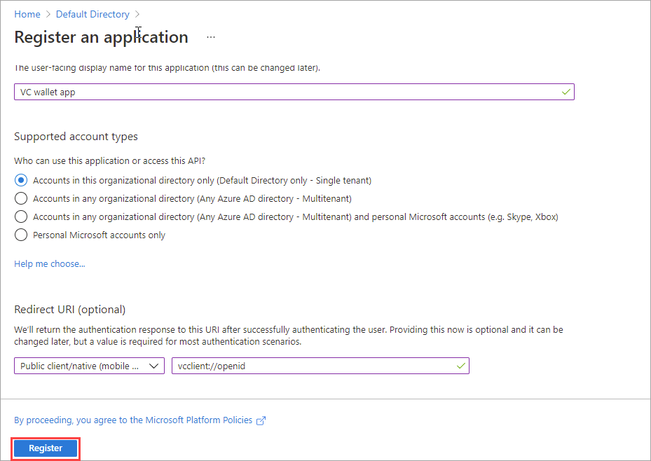

2. After you register the application, write down the Application (client) ID. You need this value later.

   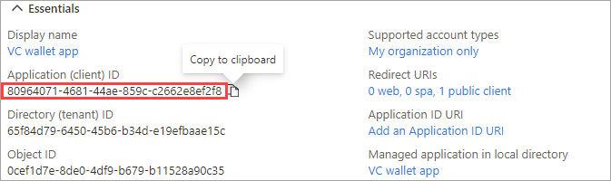

3. Select the **Endpoints** button and copy the OpenID Connect metadata document URI. You need this information for the next section. 

   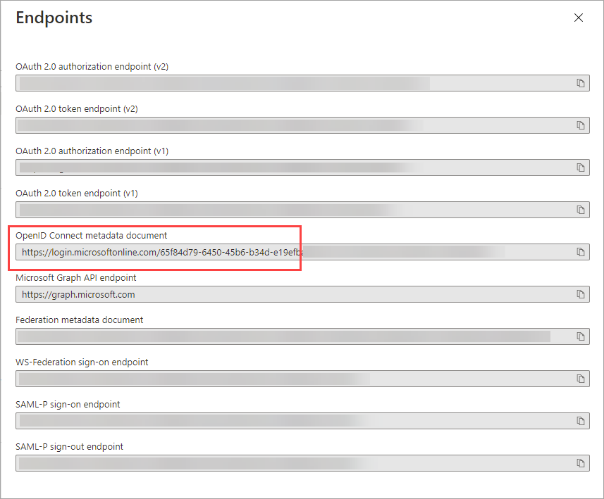

## Set up your node app with access to Azure Key Vault

To authenticate a user's credential issuance request, the issuer website uses your cryptographic keys in Azure Key Vault. To access Azure Key Vault, your website needs a client ID and client secret that can be used to authenticate to Azure Key Vault.

1. While viewing the VC wallet app overview page select **Certificates & secrets**.
    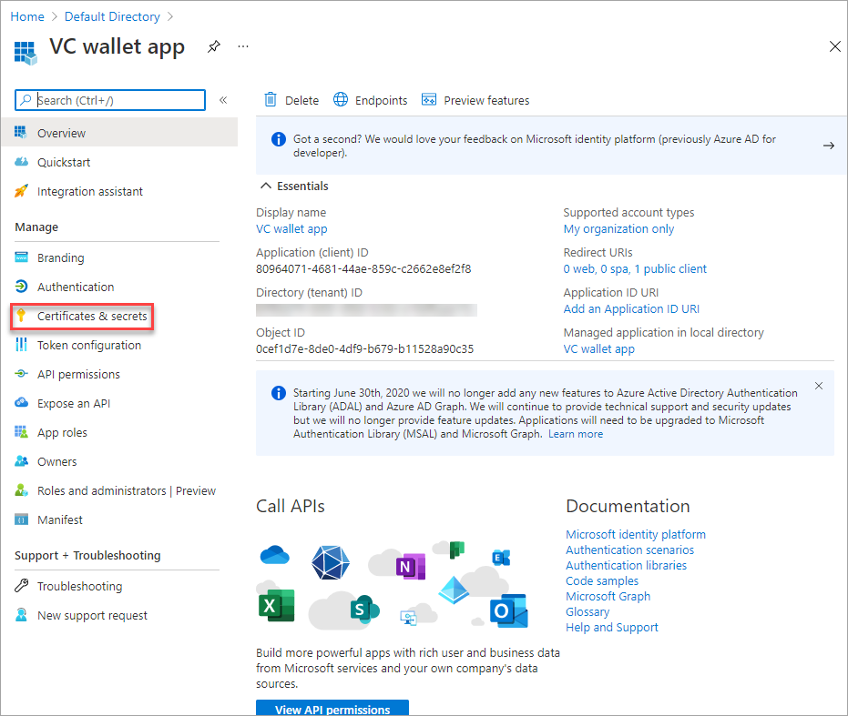
1. In the **Client secrets** section choose **New client secret**
    1. Add a description like "Node VC client secret"
    1. Expires: in one year.
  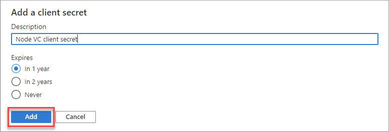
1. Copy down the SECRET. You need this information to update your sample node app.

>[!WARNING]
> You have one chance to copy down the secret. The secret is one way hashed after this. Do not copy the ID. 

After creating your application and client secret in Azure AD, you need to grant the application the necessary permissions to perform operations on your Key Vault. Making these permission changes is required to enable the website to access and use the private keys stored there.

1. Go to Key Vault.
2. Select the key vault we are using for these tutorials.
3. Choose **Access Policies** on left nav
4. Choose **+Add Access Policy**.
5. In the **Key permissions** section choose **Get**, and **Sign**.
6. Select **Principal** and use the application ID to search for the application we registered earlier. Select it.
7. Select **Add**.
8. Choose **SAVE**.

For more information about Key Vault permissions and access control read the [key vault RBAC guide](../../key-vault/general/rbac-guide.md)

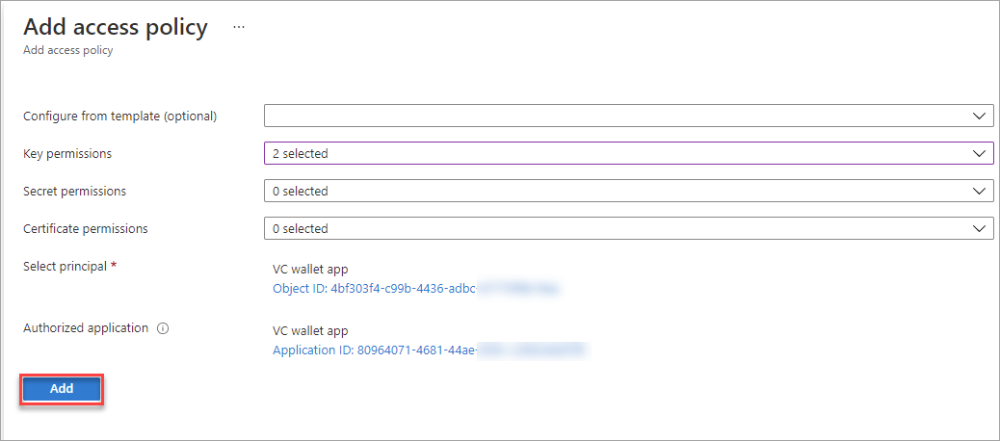
## Make changes to match your environment

So far, we have been working with our sample app. The app uses [Azure Active Directory B2C](../../active-directory-b2c/overview.md) and we are now switching to use Azure AD so we need to make some changes not just to match your environment but also to support additional claims that were not used before.

1. Copy the rules file below and save it to **modified-expertRules.json**. 

    > [!NOTE]
    > **"scope": "openid profile"** is included in this Rules file and was not included in the Sample App's Rules file. The next section will explain how to enable the optional claims in your Azure Active Directory tenant. 
    
    ```json
    {
      "attestations": {
        "idTokens": [
          {
            "mapping": {
              "firstName": { "claim": "given_name" },
              "lastName": { "claim": "family_name" }
            },
            "configuration": "https://dIdPlayground.b2clogin.com/dIdPlayground.onmicrosoft.com/B2C_1_sisu/v2.0/.well-known/openid-configuration",
            "client_id": "8d5b446e-22b2-4e01-bb2e-9070f6b20c90",
            "redirect_uri": "vcclient://openid/",
             "scope": "openid profile"
          }
        ]
      },
      "validityInterval": 2592000,
      "vc": {
        "type": ["VerifiedCredentialExpert"]
      }
    }
    ```

2. Open the file and replace the **client_id** and **configuration** values with the two values we copied in the previous section.

    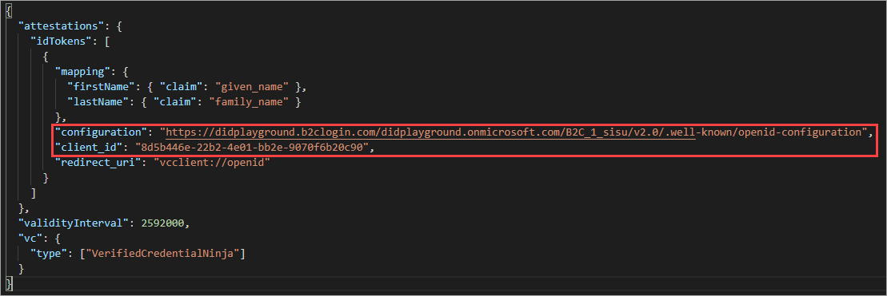

  The value **Configuration** is the OpenID Connect metadata document URI.

  Since the Sample Code is using Azure Active Directory B2C and we are using Azure Active Directory, we need to add optional claims via scopes in order for these claims to be included in the ID Token to be written into the Verifiable Credential. 

3. Back in the Azure portal, open Azure Active Directory.
4. Choose **App registrations**.
5. Open the VC Wallet App we created earlier.
6. Choose **Token configuration**.
7. Choose **+ Add optional claim**

     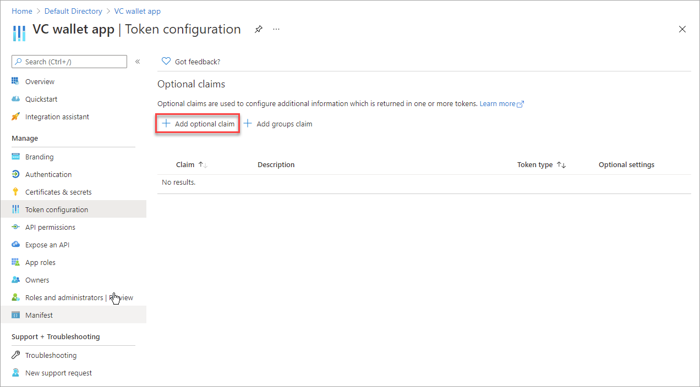

8. From **Token type** choose **ID** and from the list of available claims choose **given_name** and **family_name**

     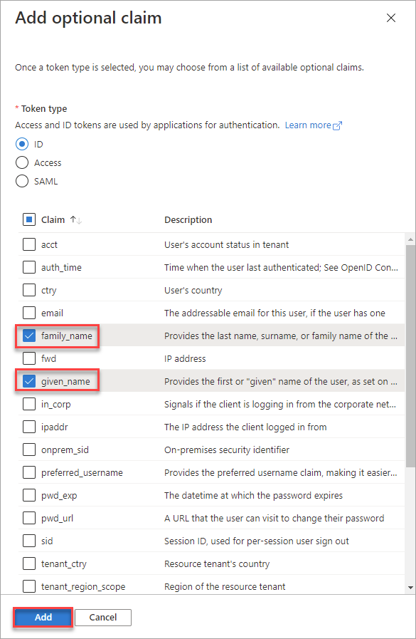

9. Press **Add**.
10. If you get a permissions warning as shown below, check the box and select **Add**.

     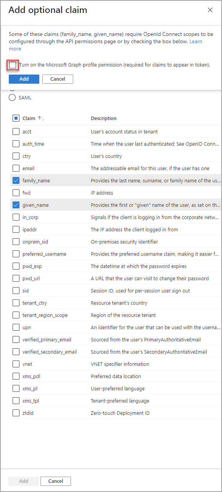

Now when a user is presented with the "sign in" to get issued your verifiable credential, the VC Wallet App knows to include the specific claims via the scope parameter to be written in to the Verifiable Credential.

## Create new VC with this rules file and the old display file

1. Upload the new rules file to our container
1. From the verifiable credentials page create a new credential called **modifiedCredentialExpert** using the old display file and the new rules file (**modified-credentialExpert.json**).
1. After the credential creation process completes from the **Overview** page copy the **Issue Credential URL** and save it because we need it in the next section.

## Before we continue

We need to put a few values together before we can make the necessary code changes. We use these values in the next section to make the sample code use your own keys stored in your vault. So far we should have the following values ready.

- **Contract URI** from the credential that we just created(Issue Credential URL)
- **Application Client ID** We got this when we registered the Node app.
- **Client secret** We created this earlier when we granted your app access to key vault.

There are a few other values we need to get before we can make the changes one time in our sample app. Let's get those now!

### Verifiable Credentials Settings

1. Navigate to the Verifiable Credentials page and choose **Settings**.  
1. Copy down the following values:

    - Tenant identifier 
    - Issuer identifier (your DID)
    - Key vault (uri)

1. Under the Signing key identifier, there is a URI but we only need a portion of it. Copy from the part that says **issuerSigningKeyION** as highlighted by the red rectangle in the image below.

   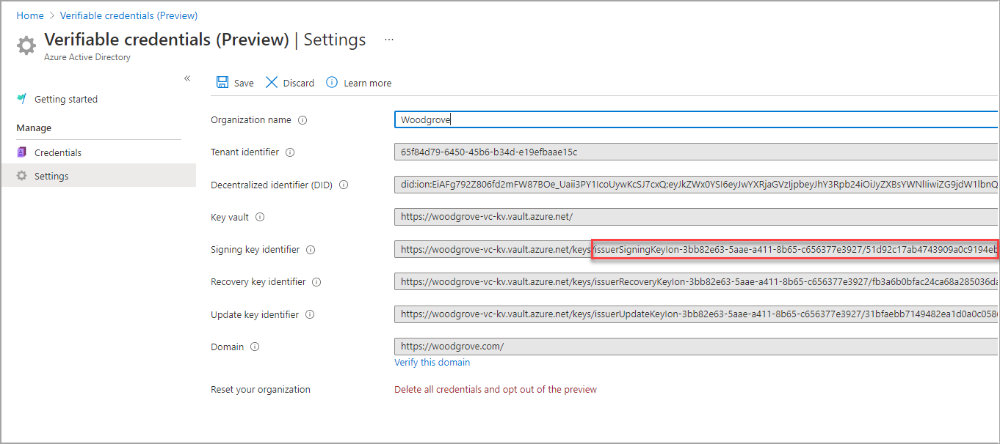

### DID document

1. Open the [DIF ION Network Explorer](https://identity.foundation/ion/explorer/)

2. Paste your DID in the search bar.

4. From the formatted response find the section called **verificationMethod**
5. Under "verificationMethod" copy the id and label it as the kvSigningKeyId
    
    ```json=
    "verificationMethod": [
          {
            "id": "#sig_25e48331",
    ```

Now we have everything we need to make the changes in our sample code.

- **Issuer:** app.js update const credential with your new contract uri
- **Verifier:** app.js update the issuerDid with your Issuer Identifier
- **Issuer and Verifier** update the didconfig.json with the following values:


```json=
{
    "azTenantId": "Your tenant ID",
    "azClientId": "Your client ID",
    "azClientSecret": "Your client secret",
    "kvVaultUri": "your keyvault uri",
    "kvSigningKeyId": "The verificationMethod ID from your DID Document",
    "kvRemoteSigningKeyId" : "The snippet of the issuerSigningKeyION we copied ",
    "did": "Your DID"
}
```

>[!IMPORTANT]
>This is a demo application and you should normally never give your application the secret directly.


Now you have everything in place to issue and verify your own Verifiable Credential from your Azure Active Directory tenant with your own keys. 

## Issue and verify the VC

Follow the same steps we followed in the previous tutorial to issue the verifiable credential and validate it with your app. Once that you successfully complete the verification process you are now ready to continue learning about verifiable credentials.

1. Open a command prompt and open the issuer folder.
2. Run the updated node app.

    ```terminal
    node app.js
    ```

3. Using a different command prompt run ngrok to set up a URL on 8081

    ```terminal
    ngrok http 8081
    ```
    
    >[!IMPORTANT]
    > You may also notice a warning that this app or website may be risky. The message is expected at this time because we have not yet linked your DID to your domain. Follow the [DNS binding](how-to-dnsbind.md) instructions to configure this.

    
4. Open the HTTPS URL generated by ngrok.

    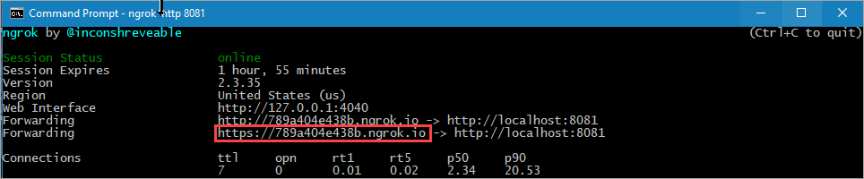

5. Choose **GET CREDENTIAL**
6. In Authenticator scan the QR code.
7. At **This app or website may be risky** warning message choose **Advanced**.

  

8. At the risky website warning choose **Proceed anyways (unsafe)**

  


9. At the **Add a credential** screen notice a few things: 
    1. At the top of the screen you can see a red **Not verified** message
    1. The credential is customized based on the changes we made to the display file.
    1. The **Sign in to your account** option is pointing to your Azure AD sign in page.
    
   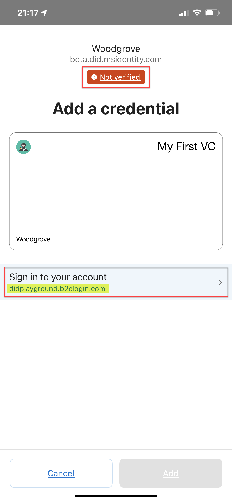

10. Choose **Sign in to your account** and authenticate using a User in your Azure AD tenant.
11. After successfully authenticating the **Add** button is no longer greyed out. Choose **Add**.

  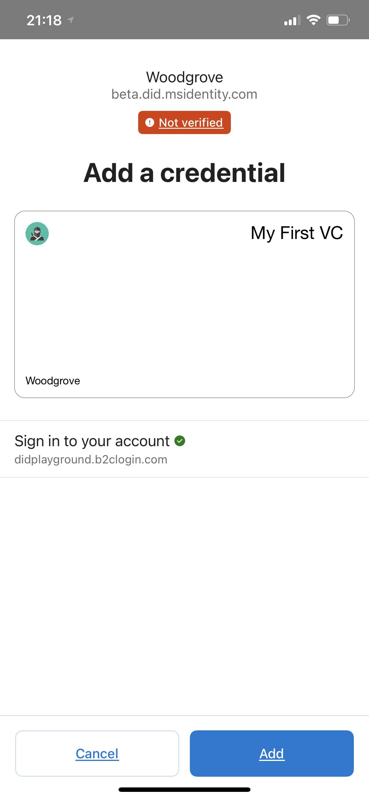

We have now issued a verifiable credential using your tenant to generate your vc while still using the original B2C tenant for authentication.

  


## Test verifying the VC using the sample app

Now that we've issued the verifiable credential from your own tenant with claims from your Azure AD, let's verify it using the sample app.

1. Stop running your issuer ngrok service.

    ```cmd
    control-c
    ```

2. Now run ngrok with the verifier port 8082.

    ```cmd
    ngrok http 8082
    ```

3. In another terminal window, navigate to the verifier app and run it similarly to how we ran the issuer app.

    ```cmd
    cd ..
    cd verifier
    node app.js
    ```

4. Open the ngrok url in your browser and scan the QR code using Authenticator in your mobile device.
5. On your mobile device, choose **Allow** at the **New permission request** screen.

   >[!IMPORTANT]
    > Since the Sample App is also using your DID to sign the presentation request, you will notice a warning that this app or website may be risky. The message is expected at this time because we have not yet linked your DID to your domain. Follow the [DNS binding](how-to-dnsbind.md) instructions to configure this.
    
   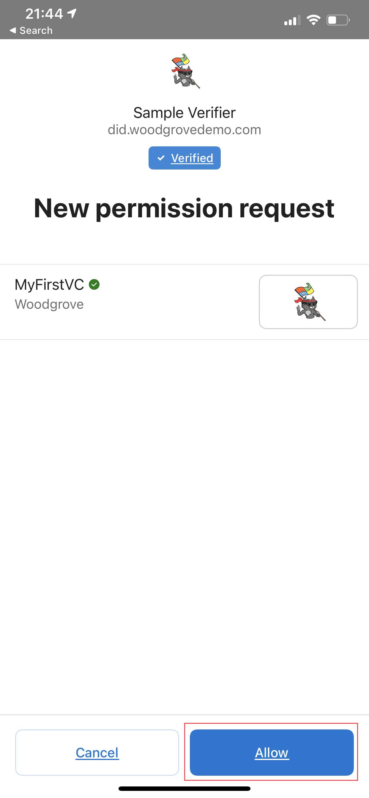

8. You have now successfully verified your credential and the website should display your first and last name from your Azure AD's user account. 

You have now completing the tutorial and are officially a Verified Credential Expert! Your sample app is using your DID for both issuing and verifying, while writing claims into a verifiable credential from your Azure AD. 

## Next steps

- Learn how to create [custom credentials](credential-design.md)
- Issuer service communication [examples](issuer-openid.md)
