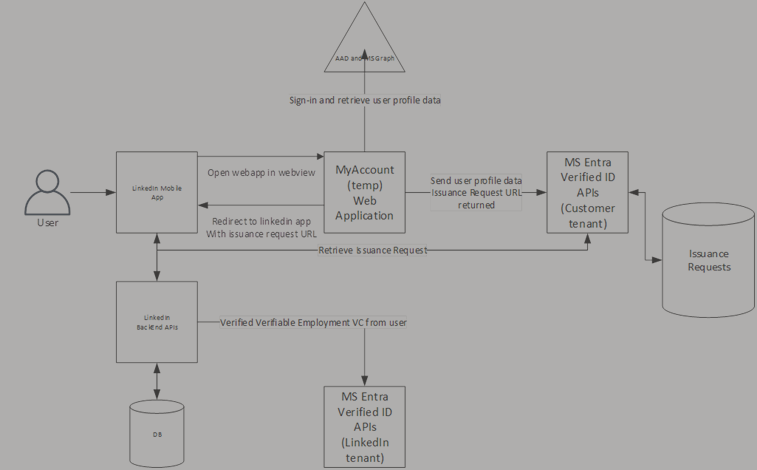

# Setting up place of work verification on LinkedIn

If your organization wants its employees to get their place of work verified on LinkedIn, you need to follow these few steps:

1. Setup your Microsoft Entra Verified ID service by following these [instructions](verifiable-credentials-configure-tenant.md).
1. [Create](how-to-use-quickstart-verifiedemployee.md#create-a-verified-employee-credential) a Verified ID Employee credential.
1. Deploy the custom webapp from [GitHub](https://github.com/Azure-Samples/VerifiedEmployeeIssuance).
1. Configure the LinkedIn company page  with your organization DID (decentralized identity) and URL of the custom Webapp. You cannot self-service the LinkedIn company page. Today, you need to fill in [this form](https://aka.ms/enablelinkedin) and we can enable your organization.
1. Once you deploy the updated LinkedIn mobile app your employees can get verified.

>[!IMPORTANT]
> The app version required is Android **4.1.813** or newer, or IOS we require **9.27.2173** or newer. Keep in mind that inside the app, the version number shows **9.27.2336**, but in the App store the version number would be **9.1.312** or higher.

>[!NOTE]
> Review LinkedIn's documentation for information on [verifications on LinkedIn profiles.](https://www.linkedin.com/help/linkedin/answer/a1359065).

## Deploying custom Webapp

Deploying this custom webapp from [GitHub](https://github.com/Azure-Samples/VerifiedEmployeeIssuance) allows an administrator to have control over who can get verified and change which information is shared with LinkedIn.
There are two reasons to deploy the custom webapp for LinkedIn Employment verification.

1. You need control over who can get verified on LinkedIn. The webapp allows you to use user assignments to grant access.
1. You want more control over the issuance of the Verified Employee ID. By default, the Employee Verified ID contains a few claims:

   - ```firstname```
   - ```lastname```
   - ```displayname```
   - ```jobtitle```
   - ```upn```
   - ```email```
   - ```photo```

>[!NOTE]
>The web app can be modified to remove claims, for example, you may choose to remove the photo claim.

Installation instructions for the Webapp can be found in the [GitHub repository](https://github.com/Azure-Samples/VerifiedEmployeeIssuance/blob/main/ReadmeFiles/Deployment.md)

## Architecture overview

Once the administrator configures the company page on LinkedIn, employees can get verified. Below are the high-level steps for LinkedIn integration:

1. User starts the LinkedIn mobile app. 
1. The mobile app retrieves information from the LinkedIn backend and checks if the company is enabled for employment verification and it retrieves a URL to the custom Webapp.
1. If the company is enabled, the user can tap on the verify employment link, and the user is sent to the Webapp in a web view.
1. The user needs to provide their corporate credentials to sign in.
1. The Webapp retrieves the user profile from Microsoft Graph including, ```firstname```, ```lastname```, ```displayname```, ```jobtitle```, ```upn```, ```email``` and ```photo``` and call the Microsoft Entra Verified ID service with the profile information.
1. The Microsoft Entra Verified ID service creates a verifiable credentials issuance request and returns the URL of that specific request.
1. The Webapp redirects back to the LinkedIn app with this specific URL.
1. LinkedIn app wallet communicates with the Microsoft Entra Verified ID services to get the Verified Employment VC issued in their wallet, which is part of the LinkedIn mobile app.
1. The LinkedIn app then verifies the received verifiable credential.
1. If the verification is completed, they change the status to ‘verified’ in their backend system and is visible to other users of LinkedIn.
 
The diagram below shows the dataflow of the entire solution.

   


## Frequently asked questions

### Can I use Microsoft Authenticator to store my Employee Verified ID and use it to get verified on LinkedIn?

Currently the solution works through the embedded webview. In the future LinkedIn allows us to use Microsoft authenticator or any compatible custom wallet to verify employment. The myaccount page will also be updated to allow issuance of the verified employee ID to Microsoft Authenticator.

### How do users sign-in?

The Webapp is protected using Microsoft Entra ID. Users sign-in according to the administrator's policy, either with passwordless, regular username and password, with or without MFA, etc. This is proof a user is allowed to get issued a verified employee ID.

### What happens when an employee leaves the organization?

Nothing by default. You can choose the revoke the Verified Employee ID but currently LinkedIn isn't checking for that status.

### What happens when my Verified Employee ID expires?

LinkedIn asks you again to get verified, if you don’t, the verified checkmark is removed from your profile.

### Can former employees use this feature to get verified?

Currently this option only verifies current employment.
