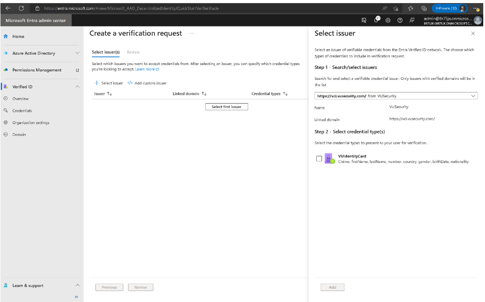

# Configure Verified ID by VU Identity Card as your Identity Verification Partner

In this article, we cover the steps needed to integrate Microsoft Entra Verified ID with VU Identity Card, a product of [VU Security](https://www.vusecurity.com/). VU Identity Card creates secure and frictionless digital experiences that enhance
biometric onboarding and verification scenarios throughout the lifecycle
of citizens and organizations.

VU Identity Card provides flexible and simple onboarding, authentication and
verification processes on any device. It focuses on user experience and
security without impacting the business.

To learn more about VU Security and its complete set of solutions, visit
<https://www.vusecurity.com>

## Prerequisites

To get started with the VU Identity Card, ensure the following prerequisites are met:

- A tenant [configured](./verifiable-credentials-configure-tenant.md)
  for Microsoft Entra Verified ID service.

  - If you don\'t have an existing tenant, you can [create an Azure
        account](https://azure.microsoft.com/free/?WT.mc_id=A261C142F)
        for free.

- The tenant must complete the VU Identity Card onboarding process.

  - To create an account, [contact VU Security](https://landings.vusecurity.com/microsoft-verifiable-credentials/).

>[!Important]
>Before you proceed, you must have received the URL from VU Security for users to be issued Verified IDs. If you have not yet received it, follow up with VU Security before you attempt following the steps documented in this article.

## Scenario description

VU Identity Card works as a link between users who need to access an application and applications that require secure access control, regardless of how users access the system.

Verifiable credentials can be used to enable faster and easier user onboarding by replacing some human interactions. For example, a user or employee who wants to create or remotely access an account can use a Verified ID through VU Identity Card to verify their identity without using vulnerable or overly complex passwords or the requirement to be on-site.

Learn more about [account onboarding](./plan-verification-solution.md#account-onboarding).

In this account onboarding scenario, Vu plays the Trusted ID proofing issuer role.

:::image type="content" source="media/partner-vu/vc-solution-architecture-diagram.png" alt-text="Diagram of the verifiable credential solution.":::

## Configure your application to use VU Identity Card

Follow these steps to incorporate VU Identity Card solution into your Apps.

### Part 1

As a developer you can share these steps with your tenant administrator to obtain the verification request URL, and body for your application or website to request Verified IDs from your users.

1. Go to Microsoft Entra admin center - [**Verified ID**](https://entra.microsoft.com/#view/Microsoft_AAD_DecentralizedIdentity/ResourceOverviewBlade)

   >[!NOTE]
   >Verify that the tenant configured for Verified ID meets the  prerequisites.

2. Go to **Quickstart** > **Verification Request** >
    [**Start**](https://entra.microsoft.com/#view/Microsoft_AAD_DecentralizedIdentity/QuickStartVerifierBlade)

3. Choose **Select Issuer**.

4. Look for **VUSecurity** in the Search/select issuers
   drop-down.

   

5. Check the **VUIdentityCard** credential with the attributes
   such as firstname, lastname, number, country/region, gender, birth-date, and nationality or any other credential type.
   >[!NOTE]
   >Number attribute refers to National ID. For example, DNI-National Identification Number in Argentina.

6. Select **Add** and then select **Review**.

7. Download the request body and Copy/paste POST API request URL.

### Part 2

As a developer you now have the request URL and body from your tenant admin, follow these steps to update your application or website:

1. Add the request URL and body to your application or website to request Verified IDs from your users.
   >[!Note]
   >If you are using [one of the sample apps](https://aka.ms/vcsample), you'll need to replace the contents of the `presentation_request_config.json` with the request body obtained in [Part 1](#part-1). The sample code overwrites the `trustedIssuers` values with `IssuerAuthority` value from `appsettings.json`. Copy the `trustedIssuers` value from the payload to `IssuerAuthority` in `appsettings.json` file.

1. Be sure to replace the values for the **url**, **state**, and **api-key** with your respective values.

1. [Grant permissions](verifiable-credentials-configure-tenant.md#grant-permissions-to-get-access-tokens) to your app to obtain access token for the Verified ID service request service principal.

## Test the user flow

User flow is specific to your application or website. However if you are using one of the sample apps follow the steps outlined as part of the [sample app's documentation](https://aka.ms/vcsample).

## Next steps

- [Verifiable credentials admin API](admin-api.md)
- [Request Service REST API issuance specification](issuance-request-api.md)
