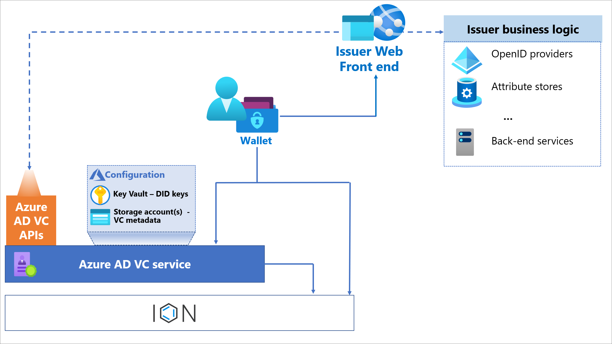
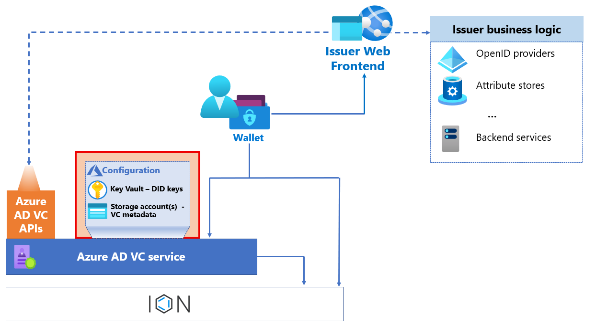
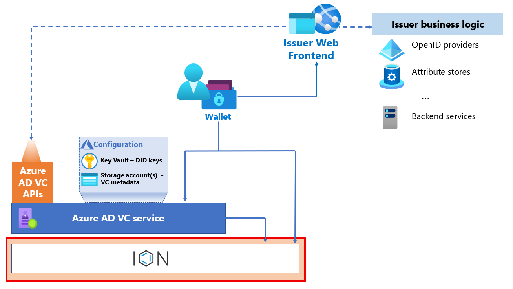
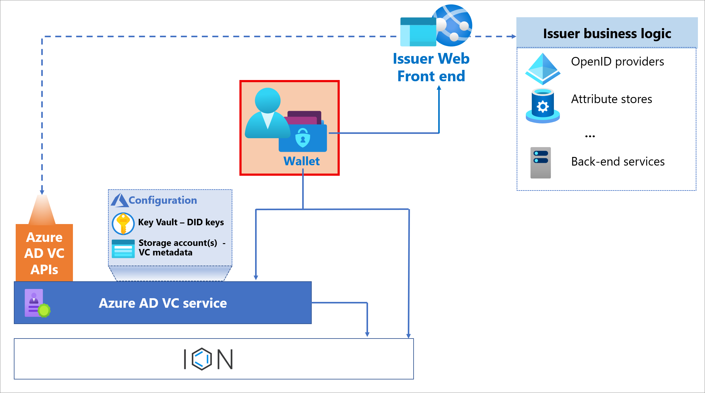
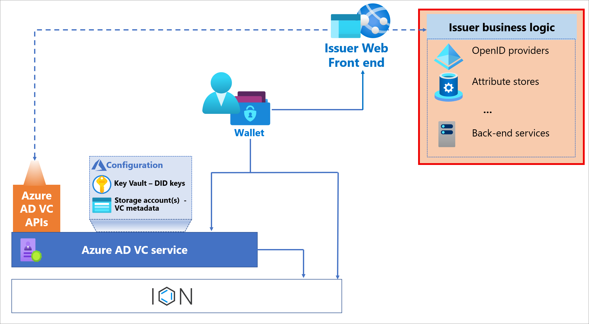
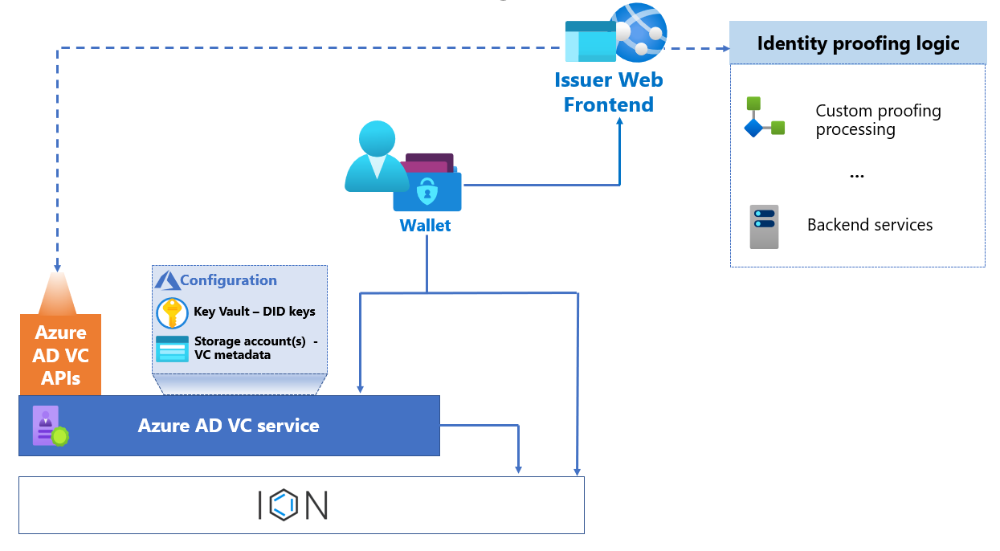
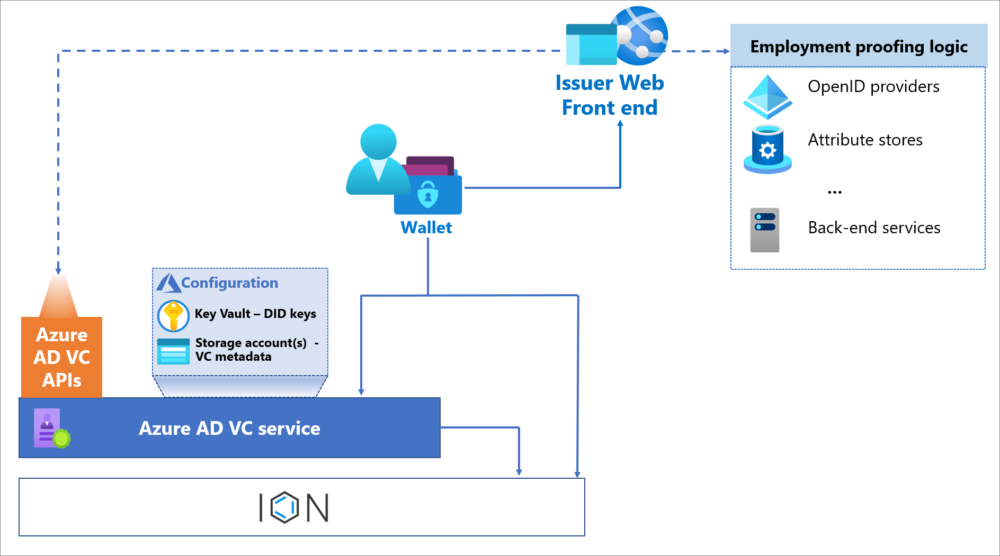

# Plan your Microsoft Entra Verified ID issuance solution

[!INCLUDE [Verifiable Credentials announcement](../../../includes/verifiable-credentials-brand.md)]

It’s important to plan your issuance solution so that in addition to issuing credentials, you have a complete view of the architectural and business impacts of your solution. If you haven’t done so, we recommend you view the [Microsoft Entra Verified ID architecture overview](introduction-to-verifiable-credentials-architecture.md) for foundational information.

## Scope of guidance

This article covers the technical aspects of planning for a verifiable credential issuance solution. The Microsoft solution for verifiable credentials follows the World Wide Web Consortium (W3C) [Verifiable Credentials Data Model 1.0](https://www.w3.org/TR/vc-data-model/) and [Decentralized Identifiers (DIDs) V1.0](https://www.w3.org/TR/did-core/) standards so can interoperate with non-Microsoft services. However, the examples in this content reflect the Microsoft solution stack for verifiable credentials. 

Out of scope for this content is articles covering supporting technologies that aren't specific to issuance solutions. For example, websites are used in a verifiable credential issuance solution but planning a website deployment isn't covered in detail.

## Components of the solution

As part of your plan for an issuance solution, you must design a solution that enables the interactions between the issuer, the user, and the verifier. You may issue more than one verifiable credential. The following diagram shows the components of your issuance architecture.

### Microsoft VC issuance solution architecture

### Microsoft Entra tenant

A prerequisite for running the Microsoft Entra Verified ID service is that it's hosted in a Microsoft Entra tenant. The Microsoft Entra tenant provides an Identity and Access Management (IAM) control plane for the Azure resources that are part of the solution.

Each tenant uses the multi-tenant Microsoft Entra Verified ID service, and has a decentralized identifier (DID). The DID provides proof that the issuer owns the domain incorporated into the DID. The DID is used by the subject and the verifier to validate the issuer. 

### Microsoft Azure services

The **Azure Key Vault** service stores your issuer keys, which are generated when you initiate the Microsoft Entra Verified ID issuance service. The keys and metadata are used to execute credential management operations and provide message security.

Each issuer has a single key set used for signing, updating, and recovery. This key set is used for every issuance of every verifiable credential you produce. 

**Microsoft Entra Verified ID Service** is used to store credential metadata and definitions; specifically, the rules and display definitions for your credentials.

* Display definitions determine how claims are displayed in the holder’s wallet and also includes branding and other elements. The Display definition can be localized into multiple languages. See [How to customize your verifiable credentials](../verifiable-credentials/credential-design.md).

* Rules are an issuer-defined model that describes the required inputs of a verifiable credential. Rules also defined trusted input sources, and the mapping of input claims to output claims stored in the VC. Depending on the type of attestation defined in the rules definition, the input claims can come from different providers. Input claims may come from an OIDC Identity Provider, from an id_token_hint or they may be self asserted during issuance via user input in the wallet.

   * **Input** – Are a subset of the model in the rules file for client consumption. The subset must describe the set of inputs, where to obtain the inputs and the endpoint to call to obtain a verifiable credential.

### Microsoft Entra Verified ID service

The Microsoft Entra Verified ID service enables you to issue and revoke VCs based on your configuration. The service:

* Provisions the decentralized identifier (DID). Each issuer has a single DID per tenant.   

* Provisions key sets to Key Vault. 

* Stores the configuration metadata used by the issuance service and Microsoft Authenticator.

* Provides REST APIs interface for issuer and verifier web front ends

### Trust System

Microsoft Entra Verified ID currently supports two trust system. One is the [Identity Overlay Network (ION)](https://identity.foundation/ion/), [a Sidetree-based network](https://identity.foundation/sidetree/spec/) that uses Bitcoin’s blockchain for decentralized identifier (DID) implementation. The DID document of the issuer is stored in ION and is used to perform cryptographic signature checks by parties to the transaction. The other alternative for trust system is [DID Web](https://w3c-ccg.github.io/did-method-web/), where the DID document is hosted on the issuers webserver.

### Microsoft Authenticator application

Microsoft Authenticator is the mobile application that orchestrates the interactions between the user, the Microsoft Entra Verified ID service, and dependencies that are described in the contract used to issue VCs. It acts as a digital wallet in which the holder of the VC stores the VC, including the private key of the subject of the VC. Authenticator is also the mechanism used to present VCs for verification.

### Issuance business logic 

Your issuance solution includes a web front end where users request a VC, an identity store and or other attribute store to obtain values for claims about the subject, and other backend services. 

A web front end serves issuance requests to the subject’s wallet by generating deep links or QR codes. Based on the configuration of the contract, other components might be required to satisfy the requirements to create a VC.

These services provide supporting roles that don't necessarily need to integrate with ION or Microsoft Entra Verified ID issuance service. This layer typically includes:

* **OpenID Connect (OIDC)-compliant service or services** are used to obtain id_tokens needed to issue the VC. Existing identity systems such as Microsoft Entra ID or Azure AD B2C can provide the OIDC-compliant service, as can custom solutions such as Identity Server.

* **Attribute stores** – These might be outside of directory services and provide attributes needed to issue a VC. For example, a student information system might provide claims about degrees earned. 

* **Additional middle-tier services** that contain business rules for lookups, validating, billing, and any other runtime checks and workflows needed to issue credentials.

For more information on setting up your web front end, see the tutorial [Configure your Microsoft Entra ID to issue verifiable credentials](./verifiable-credentials-configure-tenant.md). 

## Credential Design Considerations

Your specific use cases determine your credential design. The use case will determine:

* the interoperability requirements

* the way users will need to prove their identity to get their VC

* the claims that are needed in the credentials

* if credentials will ever need to be revoked

### Credential Use Cases

With Microsoft Entra Verified ID, the most common credential use cases are:

**Identity Verification**: a credential is issued based on multiple criteria. This may include verifying the authenticity of government-issued documents like a passport or driver’s license and corelating the information in that document with other information such as:

* a user’s selfie 

* verification of liveness

This kind of credential is a good fit for identity onboarding scenarios of new employees, partners, service providers, students, and other instances where identity verification is essential.

**Proof of employment/membership**: a credential is issued to prove a relationship between the user and an institution. This kind of credential is a good fit to access loosely coupled business-to-business applications, such as retailers offering discounts to employees or students. One main value of VCs is their portability: Once issued, the user can use the VC in many scenarios. 

For more use cases, see [Verifiable Credentials Use Cases (w3.org)](https://www.w3.org/TR/vc-use-cases/).

### Credential interoperability

As part of the design process, investigate industry-specific schemas, namespaces, and identifiers to which you can align to maximize interoperability and usage. Examples can be found in [Schema.org](https://schema.org/) and the [DIF - Claims and Credentials Working Group.](https://identity.foundation/working-groups/claims-credentials.html)

Common schemas are an area where standards are still emerging. One example of such an effort is the [Verifiable Credentials for Education Task Force](https://github.com/w3c-ccg/vc-ed). We encourage you to investigate and contribute to emerging standards in your organization's industry.

### Credential Type and Attributes 

After establishing the use case for a credential, you need to decide the credential type and what attributes to include in the credential. Verifiers can read the claims in the VC presented by the users.

All verifiable credentials must declare their *type* in their [rules definition](rules-and-display-definitions-model.md#rulesmodel-type). The credential type distinguishes a verifiable credentials schema from other credentials and it ensures interoperability between issuers and verifiers. To indicate a credential type, provide one or more credential types that the credential satisfies. Each type is represented by a unique string. Often, a URI is used to ensure global uniqueness. The URI doesn't need to be addressable. It's treated as a string. As an example, a diploma credential issued by Contoso University might declare the following types:

| Type | Purpose |
| ---- | ------- |
| `https://schema.org/EducationalCredential` | Declares that diplomas issued by Contoso University contain attributes defined by the schema.org `EducationaCredential` object. |
| `https://schemas.ed.gov/universityDiploma2020` | Declares that diplomas issued by Contoso University contain attributes defined by the U.S. Department of Education. |
| `https://schemas.contoso.edu/diploma2020` | Declares that diplomas issued by Contoso University contain attributes defined by Contoso University. |

In addition to the industry-specific standards and schemas that might be applicable to your scenarios, consider the following aspects:

* **Minimize private information**: Meet the use cases with the minimal amount of private information necessary. For example, a VC used for e-commerce websites that offers discounts to employees and alumni can be fulfilled by presenting the credential with just the first and last name claims. Additional information such as hiring date, title, department, aren't needed.

* **Favor abstract claims**: Each claim should meet the need while minimizing the detail. For example, a claim named “ageOver” with discrete values such as “13”,”21”,”60”, is more abstract than a date of birth claim.

* **Plan for revocability**: We recommend you define an index claim to enable mechanisms to find and revoke credentials. You are limited to defining one index claim per contract. It is important to note that values for indexed claims aren't stored in the backend, only a hash of the claim value. For more information, see [Revoke a previously issued verifiable credential](../verifiable-credentials/how-to-issuer-revoke.md).

For other considerations on credential attributes, refer to the [Verifiable Credentials Data Model 1.0 (w3.org)](https://www.w3.org/TR/vc-data-model/) specification.

## Plan quality attributes

### Plan for performance

As with any solution, you must plan for performance. The key areas to focus on are latency and scalability. During initial phases of a release cycle, performance shouldn't be a concern. However, when adoption of your issuance solution results in many verifiable credentials being issued, performance planning might become a critical part of your solution.

The following provides areas to consider when planning for performance:

* The Microsoft Entra Verified ID issuance service is deployed in West Europe, North Europe, West US 2, and West Central US Azure regions. If your Microsoft Entra tenant resides within EU, the Microsoft Entra Verified ID service will be in EU too. 

* To limit latency, deploy your issuance frontend website and key vault in the region listed above that is closest to where requests are expected to originate.

Model based on throughput:
* The Issuer service is subject to [Azure Key Vault service limits](../../key-vault/general/service-limits.md). 

*  For Azure Key Vault, there are three signing operations involved in each a VC issuance:

      * One for issuance request from the website

      * One for the VC created

      * One for the contract download

* You can't control throttling; however, we recommend you read [Azure Key Vault throttling guidance](../../key-vault/general/overview-throttling.md). 

* If you are planning a large rollout and onboarding of VCs, consider batching VC creation to ensure you don't exceed limits.

As part of your plan for performance, determine what you will monitor to better understand the performance of the solution. In addition to application-level website monitoring, consider the following as you define your VC issuance monitoring strategy:

For scalability, consider implementing metrics for the following:

   * Define the logical phases of your issuance process. For example:

   * Initial request 

   * Servicing of the QR code or deep link

   * Attribute lookup

   * Calls to Microsoft Entra Verified ID issuance service

   * Credential issued

   * Define metrics based on the phases:

      * Total count of requests (volume)

      * Requests per unit of time (throughput)

      * Time spent (latency)

* Monitor Azure Key Vault using the following:

   * [Azure Key Vault monitoring and alerting](../../key-vault/general/alert.md)

* Monitor the components used for your business logic layer. 

### Plan for reliability

To plan for reliability, we recommend:

* After you define your availability and redundancy goals, use the following guides to understand how to achieve your goals:

   * [Azure Key Vault availability and redundancy - Azure Key Vault](../../key-vault/general/disaster-recovery-guidance.md)

* For frontend and business layer, your solution can manifest in an unlimited number of ways. As with any solution, for the dependencies you identify, ensure that the dependencies are resilient and monitored. 

If the rare event that the Microsoft Entra Verified ID issuance service or Azure Key Vault services become unavailable, the entire solution will become unavailable.

### Plan for compliance

Your organization may have specific compliance needs related to your industry, type of transactions, or country/region of operation. 

**Data residency**: The Microsoft Entra Verified ID issuance service is deployed in a subset of Azure regions. The service is used for compute functions only. We don't store values of verifiable credentials in Microsoft systems. However, as part of the issuance process, personal data is sent and used when issuing VCs. Using the VC service shouldn't impact data residency requirements. If, as a part of identity verification you store any personal information, that should be stored in a manner and region that meets your compliance requirements. For Azure-related guidance, visit the Microsoft Trust Center website. 

**Revoking credentials**: Determine if your organization will need to revoke credentials. For example, an admin may need to revoke credentials when an employee leaves the company. Or if a credential is issued for a driver’s license, and the holder is caught doing something that would cause the driver’s license to be suspended, the VC might need to be revoked. For more information, see [Revoke a previously issued verifiable credential](how-to-issuer-revoke.md).

**Expiring credentials**: Determine if you will expire credentials, and if so under what circumstances. For example, if you issue a VC as proof of having a driver’s license, it might expire after a few years. If you issue a VC as a verification of an association with a user, you may want to expire it annually to ensure users come back annually to get the most updated version of the VC.

## Plan for operations

When planning for operations, it is critical you develop a schema to use for troubleshooting, reporting and distinguishing various customers you support. Additionally, if the operations team is responsible for executing VC revocation, that process must be defined. Each step in the process should be correlated so that you can determine which log entries can be associated with each unique issuance request. For auditing, we recommend you capture each attempt of credential issuing individually. Specifically:

* Generate unique transaction IDs that customers and support engineers can refer to as needed.

* Devise a mechanism to correlate the logs of Azure Key Vault transactions to the transaction IDs of the issuance portion of the solution.

* If you are an identity verification service issuing VCs on behalf of multiple customers, monitor and mitigate by customer or contract ID for customer-facing reporting and billing.

* If you are an identity verification service issuing VCs on behalf of multiple customers, use the customer or contract ID for customer-facing reporting and billing, monitoring, and mitigating. 

## Plan for security

As part of your design considerations focused on security, we recommend the following:

* For key management:

   * Create a dedicated Key Vault for VC issuance. Limit Azure Key Vault permissions to the Microsoft Entra Verified ID issuance service and the issuance service frontend website service principal. 

   * Treat Azure Key Vault as a highly privileged system - Azure Key Vault issues credentials to customers. We recommend that no human identities have standing permissions over the Azure Key Vault service. Administrators should have only just I time access to Key Vault. For more best practices for Azure Key Vault usage, refer to [Azure Security Baseline for Key Vault](/security/benchmark/azure/baselines/key-vault-security-baseline).

* For service principal that represents the issuance frontend website:

   * Define a dedicated service principal to authorize access Azure Key Vault. If your website is on Azure, we recommend that you use an [Azure Managed Identity](../managed-identities-azure-resources/overview.md). 

   * Treat the service principal that represents the website and the user as a single trust boundary. While it is possible to create multiple websites, there is only one key set for the issuance solution. 

For security logging and monitoring, we recommend the following:

* Enable logging and alerting of Azure Key Vault to track credential issuance operations, key extraction attempts, permission changes, and to monitor and send alert for configuration changes. More information can be found at [How to enable Key Vault logging](../../key-vault/general/howto-logging.md). 

* Archive logs in a security information and event management (SIEM) systems, such as [Microsoft Sentinel](https://azure.microsoft.com/services/azure-sentinel) for long-term retention.

* Mitigate spoofing risks by using the following

   * DNS verification to help customers identify issuer branding.

   * Domain names that are meaningful to end users.

   * Trusted branding the end user recognizes.

* Mitigate distributed denial of service (DDOS) and Key Vault resource exhaustion risks. Every request that triggers a VC issuance request generates Key Vault signing operations that accrue towards service limits. We recommend protecting traffic by incorporating authentication or captcha before generating issuance requests.

For guidance on managing your Azure environment, we recommend you review the [Microsoft cloud security benchmark](/security/benchmark/azure/) and [Securing Azure environments with Microsoft Entra ID](https://aka.ms/AzureADSecuredAzure). These guides provide best practices for managing the underlying Azure resources, including Azure Key Vault, Azure Storage, websites, and other Azure-related services and capabilities.

## Additional considerations

When you complete your POC, gather all the information and documentation generated, and consider tearing down the issuer configuration. This will help avoid issuing verifiable credentials after your POC timeframe expires. 

For more information on Key Vault implementation and operation, refer to [Best practices to use Key Vault](../../key-vault/general/best-practices.md). For more information on Securing Azure environments with Active Directory, refer to [Securing Azure environments with Microsoft Entra ID](https://aka.ms/AzureADSecuredAzure). 

## Next steps

[Read the architectural overview](introduction-to-verifiable-credentials-architecture.md)

[Plan your verification solution](plan-verification-solution.md)

[Get started with verifiable credentials](./verifiable-credentials-configure-tenant.md)
