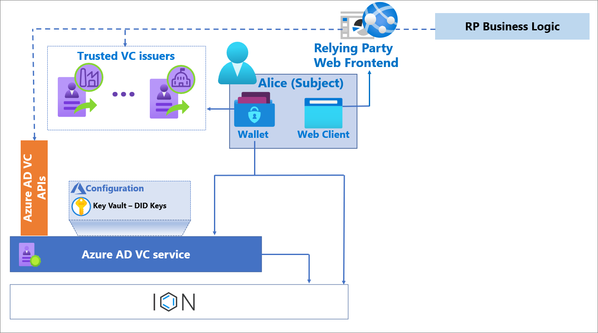
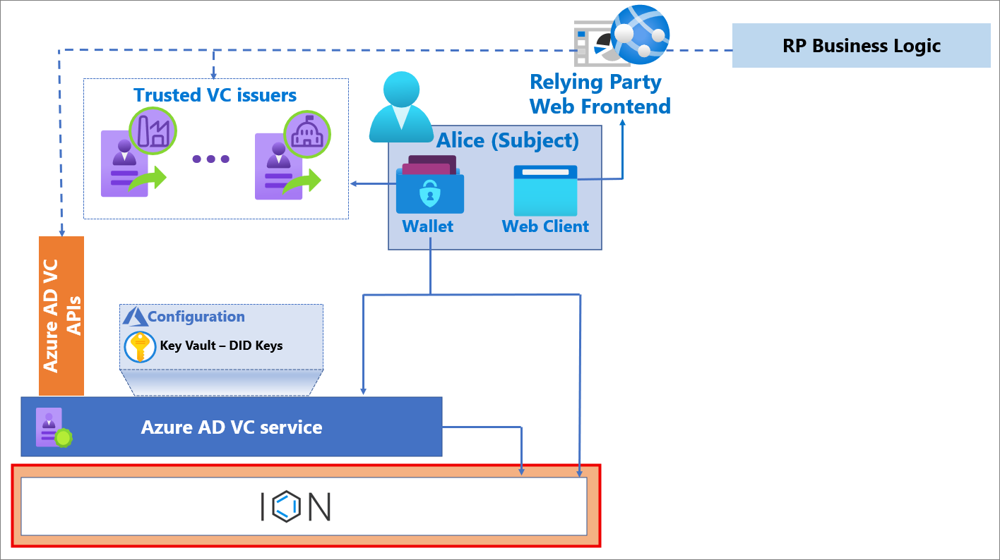
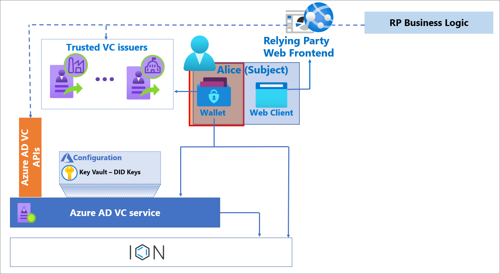
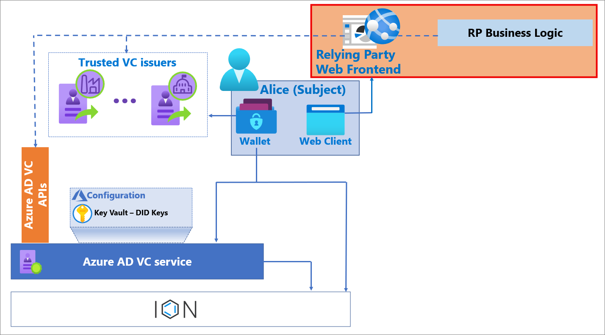
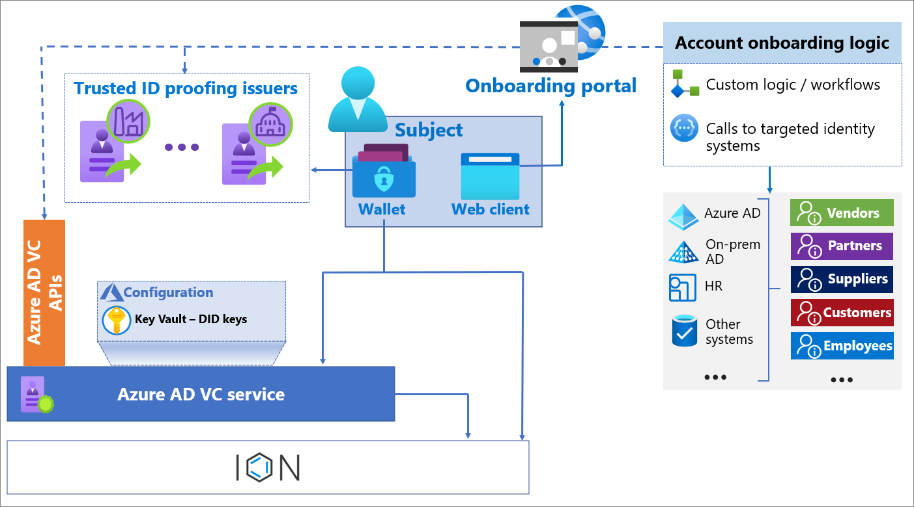
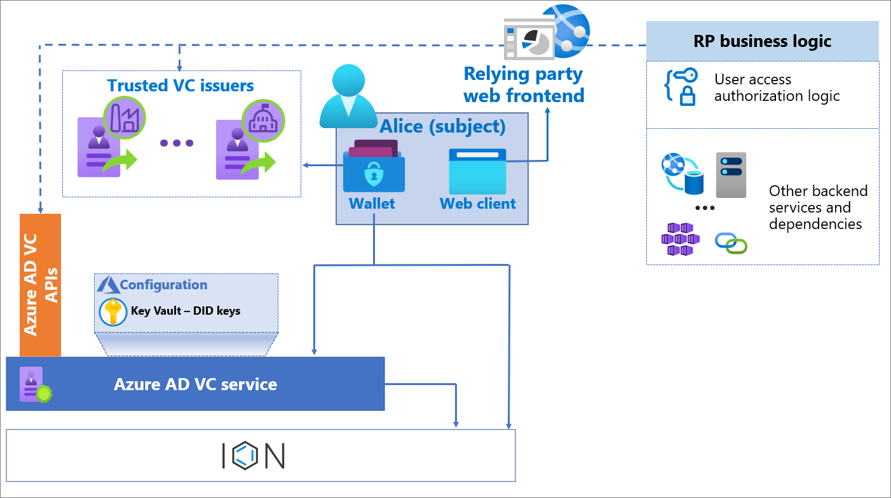
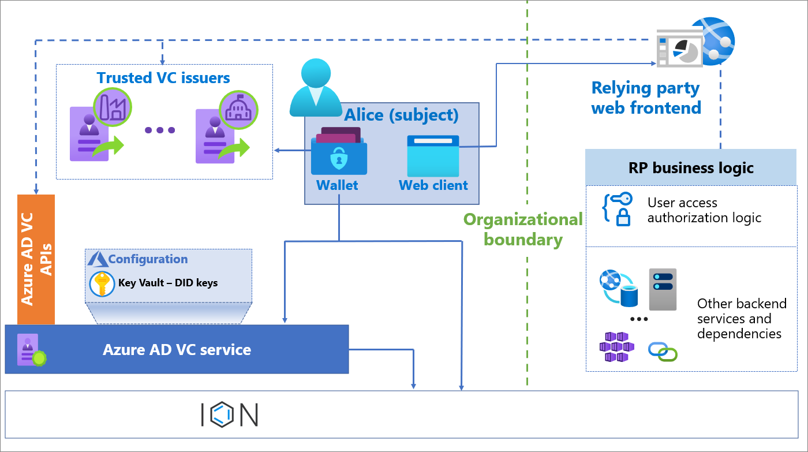
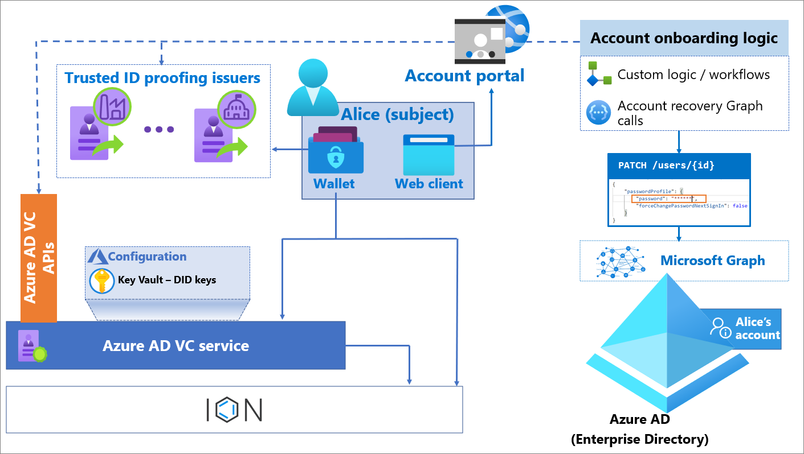

# Plan your Microsoft Entra Verified ID  verification solution

[!INCLUDE [Verifiable Credentials announcement](../../../includes/verifiable-credentials-brand.md)]

Microsoft’s Microsoft Entra Verified ID (Microsoft Entra VC) service enables you to trust proofs of user identity without expanding your trust boundary. With Microsoft Entra VC, you create accounts or federate with another identity provider. When a solution implements a verification exchange using verifiable credentials, it enables applications to request credentials that aren't bound to a specific domain. This approach makes it easier to request and verify credentials at scale.

If you haven’t already, we suggest you review the [Microsoft Entra Verified ID architecture overview](introduction-to-verifiable-credentials-architecture.md). You may also want to review [Plan your Microsoft Entra Verified ID issuance solution](plan-issuance-solution.md).

## Scope of guidance

This content covers the technical aspects of planning for a verifiable credential verification solution using Microsoft products and services. The solution interfaces with a trust system, where currently DID Web is supported. DID Web is a centralized public key infrastructure.

Supporting technologies that aren't specific to verification solutions are out of scope. For example, websites are used in a verifiable credential verification solution but planning a website deployment isn't covered in detail.

As you plan your verification solution, you must consider what business capability is being added or modified. You must also consider what IT capabilities can be reused, and what capabilities must be added to create the solution. Also consider what training is needed for the people involved in the business process and the people that support the end users and staff of the solution. These articles aren't covered in this content. We recommend reviewing the [Microsoft Azure Well-Architected Framework](/azure/architecture/framework/) for information covering these articles.

## Components of the solution

As part of your plan for a verification solution, you must enable the interactions between the verifier, the subject, and the issuer. In this article, the terms relying party and verifier are used interchangeably. The following diagram shows the components of your verification architecture.

### Microsoft Entra Verified ID service

In the context of a verifier solution, the Microsoft Entra Verified ID service is the interface between the Microsoft components of the solution and the trust system. The service provisions the key set to Key Vault, provisions the decentralized identifier (DID).

### Microsoft Entra tenant 

The service requires a Microsoft Entra tenant that provides an Identity and Access Management (IAM) control plane for the Azure resources that are part of the solution. Each Microsoft Entra tenant uses the multi-tenant Microsoft Entra Verified ID service, and it issues a single DID document representing the verifier. If you have multiple relying parties using your verification service, they all use the same verifier DID. The verifier DID provides pointers to the public key that allows subjects and issuers to validate messages that come from the relying party.

### Azure Key Vault

The Azure Key Vault service stores your verifier keys, which are generated when you enable the Microsoft Entra Verified ID issuance service. The keys are used to provide message security. Each verifier has a single key set used for signing, updating, and recovering VCs. This key set is used each time you service a verification request. Microsoft key set currently uses Elliptic Curve Cryptography (ECC) [SECP256k1](https://en.bitcoin.it/wiki/Secp256k1). We're exploring other cryptographic signature schemas that will be adopted by the broader DID community.

### Request Service API

Application programming interfaces (APIs) provide developers a method to abstract interactions between components of the solution to execute verification operations. 

### Trust System 

Microsoft Entra Verified ID currently supports [DID Web](https://w3c-ccg.github.io/did-method-web/) as a trust system, where the DID document is hosted on the issuers webserver.

### Microsoft Authenticator application

Microsoft Authenticator is the mobile application that orchestrates the interactions between the relying party, the user, the Microsoft Entra Verified ID issuance service, and dependencies described in the contract used to issue VCs. Microsoft Authenticator acts as a digital wallet in which the holder of the VC stores the VC. It's also the mechanism used to present VCs for verification.

### Relying party (RP) 

#### Web front end

The relying party web front end uses the Request Service API to verify VCs by generating deep links or QR codes that are consumed by the subject’s wallet. Depending on the scenario, the front end can be a publicly accessible or internal website to enable end-user experiences that require verification. However, the endpoints that the wallet accesses must be publicly accessible. Specifically, it controls redirection to the wallet with specific request parameters. This is accomplished using the Microsoft-provided APIs.

#### Business logic 

You can create new logic or use existing logic that is specific to the relying party and enhance that logic with the presentation of VCs.

## Scenario-specific designs

The following are examples of designs to satisfy specific use cases. The first is for account onboarding, used to reduce the time, cost, and risk associated with onboarding new employees. The second is for account recovery, which enables an end user to recover or unlock their account using a self-service mechanism. The third is for accessing high-value applications and resources, specifically for business-to-business use cases where access is given to people that work for other companies. 

### Account onboarding

Verifiable credentials can be used to enable faster onboarding by replacing some human interactions. VCs can be used to onboard employees, students, citizens, or others to access services. For example, rather than an employee needing to go to a central office to activate an employee badge, they can use a VC to verify their identity to activate a badge that is delivered to them remotely. Rather than a citizen receiving a code they must redeem to access governmental services, they can use a VC to prove their identity and gain access. 

#### Other elements 

**Onboarding portal**:  A web front end that orchestrates the Request Service API calls for VC presentation and validation, and the logic to onboard accounts.

**Custom logic / workflows**: Specific logic with organization-specific steps before and after updating the user account. Examples might include approval workflows, other validations, logging, notifications, and so on.

**Target identity systems**: Organization-specific identity repositories that the onboarding portal needs to interact with while onboarding subjects. The systems to integrate are determined based on the kinds of identities you want to onboard with VC validation. Common scenarios of identity verification for onboarding include:

* External Identities such as vendors, partners, suppliers, and customers, which in centralized identity systems onboard to Microsoft Entra ID using APIs to issue business-to-business (B2B) invitations, or entitlement management assignment to packages. 

* Employee identities, which in centralized identity systems are already onboarded through human resources (HR) systems. In this case, the identity verification might be integrated as part of existing stages of HR workflows. 

#### Design Considerations

* **Issuer**: Account onboarding is a good fit for an external identity-proofing service as the issuer of the VCs. Examples of checks for onboarding include: liveness check, government-issued document validation, address, or phone number confirmation, and so on.

* **Storing VC Attributes**: Where possible don't store attributes from VCs in your app-specific store. Be especially careful with personal data. If this information is required by specific flows within your applications, consider asking for the VC to retrieve the claims on demand. 

* **VC Attribute correlation with back-end systems**: When defining the attributes of the VC with the issuer, establish a mechanism to correlate information in the back-end system after the user presents the VC. The mechanism typically uses a time-bound, unique identifier in the context of your RP in combination with the claims you receive. Some examples:

   * **New employee**: When the HR workflow reaches the point where identity proofing is required, the RP can generate a link with a time-bound unique identifier. The RP then sends it to the candidate’s email address on the HR system. This unique identifier should be sufficient to correlate information such as firstName, lastName from the VC verification request to the HR record or underlying data. The attributes in the VC can be used to complete user attributes in the HR system, or to validate accuracy of user attributes about the employee.

   * **External identities** - invitation: When an existing user in your organization invites an external user to be onboarded in the target system, the RP can generate a link with a unique identifier that represents the invitation transaction and sends it to the external user’s email address. This unique identifier should be sufficient to correlate the VC verification request to the invitation record or underlying data and continue the provisioning workflow. The attributes in the VC can be used to validate or complete the external user attributes.

   * **External identities** - self-service: When external identities sign up to the target system through self-service (for example, a B2C application) the attributes in the VC can be used to populate the initial attributes of the user account. The VC attributes can also be used to find out if a profile already exists.

* **Interaction with target identity systems**: The service-to-service communication between the web front end and your target identity systems needs to be secured as a highly privileged system, because it can create accounts. Grant the web front end the least privileged roles possible. Some examples include:

   * To create a new user in Microsoft Entra ID, the RP website can use a service principal that is granted the MS Graph scope of `User.ReadWrite.All` to create users, and the scope `UserAuthenticationMethod.ReadWrite.All` to reset their authentication method.

   * To invite users to Microsoft Entra ID using B2B collaboration, the RP website can use a service principal that is granted the MS Graph scope of `User.Invite.All` to create invitations.

   * If your RP is running in Azure, use Managed Identities to call Microsoft Graph. Using managed identities removes the risks of managing service principal credentials in code or configuration files. To learn more about Managed identities, go to [Managed identities for Azure resources.](../managed-identities-azure-resources/overview.md)

### Accessing high-value applications inside organizations 

Verifiable credentials can be used as other proof to access to sensitive applications inside the organization. For example, VCs can also be used to provide employees with access to line-of-business applications based on achieving specific criteria, such as a certification.

#### Other elements 

**Relying party web frontend**: This is the web frontend of the application that is enhanced through Request Service API calls for VC presentation and validation, based on your business requirements.

**User access authorization logic**: Logic layer in the application that authorizes user access and is enhanced to consume the user attributes inside the VC to make authorization decisions. 

**Other backend services and dependencies**: Represents the rest of the logic of the application, which typically is unchanged by the inclusion of identity proofing through VCs.

#### Design Considerations

* **Goal**: The goal of the scenario determines what kind of credential and issuer is needed. Typical scenarios include:

   * **Authorization**: In this scenario, the user presents the VC to make an authorization decision. VCs designed for proof of completion of a training or holding a specific certification, are a good fit for this scenario. The VC attributes should contain fine-grained information conducive to authorization decisions and auditing. For example, if the VC is used to certify the individual is trained and can access sensitive financial apps, the app logic can check the department claim for fine-grained authorization, and use the employee ID for audit purposes. 

   * **Confirmation of identity verification**: In this scenario, the goal is to confirm that the same person who initially onboarded is indeed the one attempting to access the high-value application. A credential from an identity verification issuer would be a good fit and the application logic should validate that the attributes from the VC align with the user who logged in the application. 

* **Check Revocation**: When using VCs to access sensitive resources, it is common to check the status of the VC with the original issuer and deny access for revoked VCs. When working with the issuers, ensure that revocation is explicitly discussed as part of the design of your scenario. 

* **User Experience**: When using VCs to access sensitive resources, there are two patterns you can consider. 

   * **Step-up authentication**: users start the session with the application with existing authentication mechanisms. Users must present a VC for specific high-value operations within the application such as approvals of business workflows. This is a good fit for scenarios where such high-value operations are easy to identify and update within the application flows.

   * **Session establishment**: Users must present a VC as part of initiating the session with the application. This is a good fit when the nature of the entire application is high-value. 

### Accessing applications outside organization boundaries

Verifiable credentials can also be used by relying parties that want to grant access or benefits based on membership or employment relationship of a different organization. For example, an e-commerce portal can offer benefits such as discounts to employees of a particular company, students of a given institution, etc. 

The decentralized nature of verifiable credentials enables this scenario without establishing federation relationships. 

#### Other elements 

**Relying party web frontend**: This is the web frontend of the application that is enhanced through Request Service API calls for VC presentation and validation, based on your business requirements.

**User access authorization logic**: Logic layer in the application that authorizes user access and is enhanced to consume the user attributes inside the VC to make authorization decisions.

**Other backend services and dependencies**: Represents the rest of the logic of the application, which typically is unchanged by the inclusion of identity proofing through VCs.

#### Design Considerations

* **Goal**: The goal of the scenario determines what kind of credential and issuer is needed. Typical scenarios include:

   * **Authentication**: In this scenario, a user must have possession of VC to prove employment or relationship to a particular organization(s). In this case, the RP should be configured to accept VCs issued by the target organizations. 

   * **Authorization**: Based on the application requirements, the applications might consume the VC attributes for fine-grained authorization decisions and auditing. For example, if an e-commerce website offers discounts to employees of the organizations in a particular location, they can validate this based on the country/region claim in the VC (if present).

* **Check Revocation**: When using VCs to access sensitive resources, it is common to check the status of the VC with the original issuer and deny access for revoked VCs. When working with the issuers, ensure that revocation is explicitly discussed as part of the design of your scenario. 

* **User Experience**: Users can present a VC as part of initiating the session with the application. Typically, applications also provide an alternative method to start the session to accommodate cases where users don’t have VCs. 

### Account recovery

Verifiable credentials can be used as an approach to account recovery. For example, when a user needs to recover their account, they might access a website that requires them to present a VC and initiate a Microsoft Entra credential reset by calling MS Graph APIs as shown in the following diagram.

Note: While the scenario we describe in this section is specific to recover Microsoft Entra accounts, this approach can also be used to recover accounts in other systems.

#### Other Elements

**Account portal**: This is a web front end that orchestrates the API calls for VC presentation and validation. This orchestration can include Microsoft Graph calls to recover accounts in Microsoft Entra ID.

**Custom logic or workflows**: Logic with organization-specific steps before and after updating the user account. This might include approval workflows, other validations, logging, notifications, etc.

**Microsoft Graph**: Exposes representational state transfer (REST) APIs and client libraries to access Microsoft Entra data that is used to perform account recovery. 

**Microsoft Entra enterprise directory**: This is the Microsoft Entra tenant that contains the accounts that are being created or updated through the account portal.

#### Design considerations

**VC Attribute correlation with Microsoft Entra ID**: When defining the attributes of the VC in collaboration with the issuer, establish a mechanism to correlate information with internal systems based on the claims in the VC and user input. For example, if you have an identity verification provider (IDV) verify identity prior to onboarding employees, ensure that the issued VC includes claims that would also be present in an internal system such as a human resources system for correlation. This might be a phone number, address, or date of birth. In addition to claims in the VC, the RP can ask for some information such as the last four digits of their social security number (SSN) as part of this process.

**Role of VCs with Existing Microsoft Entra Credential Reset Capabilities**: Microsoft Entra ID has a built-in self-service password reset (SSPR) capability. Verifiable Credentials can be used to provide another way to recover, particularly in cases where users do not have access to or lost control of the SSPR method, for example they’ve lost both computer and mobile device. In this scenario, the user can reobtain a VC from an identity proof issuer and present it to recover their account. 

Similarly, you can use a VC to generate a temporary access pass that will allow users to reset their MFA authentication methods without a password. 

**Authorization**: Create an authorization mechanism such as a security group that the RP checks before proceeding with the credential recovery. For example, only users in specific groups might be eligible to recover an account with a VC.

**Interaction with Microsoft Entra ID**: The service-to-service communication between the web front end and Microsoft Entra ID must be secured as a highly privileged system because it can reset employees’ credentials. Grant the web front end the least privileged roles possible. Some examples include:

* Grant the RP website the ability to use a service principal granted the MS Graph scope `UserAuthenticationMethod.ReadWrite.All` to reset authentication methods. Don’t grant `User.ReadWrite.All`, which enables the ability to create and delete users.

* If your RP is running in Azure, use Managed Identities to call Microsoft Graph. This removes the risks around managing service principal credentials in code or configuration files. For more information, see [Managed identities for Azure resources.](../managed-identities-azure-resources/overview.md)

## Plan for identity management 

Below are some IAM considerations when incorporating VCs to relying parties. Relying parties are typically applications. 

### Authentication

* The subject of a VC must be a human. 

* Presentation of VCs must be interactively performed by a human VC holder, who holds the VC in their wallet. Non-interactive flows such as on-behalf-of are not supported. 

### Authorization 

* A successful presentation of the VC can be considered a coarse-grained authorization gate by itself. The VC attributes can also be consumed for fine-grained authorization decisions.

* Determine if an expired VC has meaning in your application; if so check the value of the `exp` claim (the expiration time) of the VC as part of the authorization checks. One example where expiration is not relevant is requiring a government-issued document such as a driver’s license to validate if the subject is older than 18. The date of birth claim is valid, even if the VC is expired. 

* Determine if a revoked VC has meaning to your authorization decision. 

   * If it is not relevant, then skip the call to check status API (which is on by default). 

   * If it is relevant, add the proper handling of exceptions in your application.

### User Profiles

You can use information in presented VCs to build a user profile. If you want to consume attributes to build a profile, consider the following.

* When the VC is issued, it contains a snapshot of attributes as of issuance. VCs might have long validity periods, and you must determine the age of attributes that you will accept as sufficiently fresh to use as a part of the profile. 

* If a VC needs to be presented every time the subject starts a session with the RP, consider using the output of the VC presentation to build a non-persistent user profile with the attributes. This helps to reduce privacy risks associated with storing user properties at rest. If the subject’s attributes need to be persisted locally by the application, only store the minimal set of claims required by your application (as opposed to store the entire content of the VC).

* If the application requires a persistent user profile store:

   * Consider using the `sub` claim as an immutable identifier of the user. This is an opaque unique attribute that will be constant for a given subject/RP pair. 

   * Define a mechanism to deprovision the user profile from the application. Due to the decentralized nature of the Microsoft Entra Verified ID system, there is no application user provisioning lifecycle.

   * Do not store personal data claims returned in the VC token.

   * Only store claims needed for the logic of the relying party. 

## Plan for performance

As with any solution, you must plan for performance. Focus areas include latency, throughput, and scalability. During initial phases of a release cycle, performance shouldn't be a concern. However, when adoption of your solution results in many verifiable credentials being verified, performance planning might become a critical part of your solution.

The following provides areas to consider when planning for performance:

* The Microsoft Entra Verified ID issuance service is deployed in West Europe, North Europe, West US 2, and West Central US Azure regions. To limit latency, deploy your verification front end (website) and key vault in the region listed above that is closest to where requests are expected to originate from.

* Model based on throughput:

   * VC verification capacity is subject to [Azure Key Vault service limits](../../key-vault/general/service-limits.md). 

   * Each verification of a VC requires one Key Vault signature operation.

   * You can't control throttling; however, we recommend you read [Azure Key Vault throttling guidance](../../key-vault/general/overview-throttling.md) so that you understand how throttling might impact performance. 

## Plan for reliability

To best plan for high availability and disaster recovery, we suggest the following:

* Microsoft Entra Verified ID service is deployed in the West Europe, North Europe, West US 2, and West Central US Azure regions. Consider deploying your supporting web servers and supporting applications in one of those regions, specifically in the ones from which you expect most of your validation traffic to originate. 

* Review and incorporate best practices from [Azure Key Vault availability and redundancy](../../key-vault/general/disaster-recovery-guidance.md) as you design for your availability and redundancy goals.

## Plan for security

As you are designing for security, consider the following:

* All relying parties (RPs) in a single tenant have the same trust boundary since they share the same DID.

* Define a dedicated service principal for a website accessing the Key Vault.

* Only the Microsoft Entra Verified ID service and the website service principals should have permissions to use Key Vault to sign messages with the private key. 

* Don't assign any human identity administrative permissions to the Key Vault. For more information on Key Vault best practices, see [Azure Security Baseline for Key Vault](../../key-vault/general/security-baseline.md).

* Review [Securing Azure environments with Microsoft Entra ID](https://azure.microsoft.com/resources/securing-azure-environments-with-azure-active-directory/) for best practices for managing the supporting services for your solution. 

* Mitigate spoofing risks by:

   * Implementing DNS verification to help customers identify issuer branding.

   * Use domains that are meaningful to end users.

* Mitigate distributed denial of service (DDOS) and Key Vault resource throttling risks. Every VC presentation request generates Key Vault signing operations that accrue towards service limits. We recommend protecting traffic by incorporating alternative authentication or captcha before generating issuance requests.

## Plan for operations

As you plan for operations, we recommend plan that you capture each attempt of credential validation as part of your auditing. Use that information for auditing and troubleshooting. Additionally, consider generating unique transaction identifiers (IDs) that customers and support engineers can refer to if needed. 

As part of your operational planning, consider monitoring the following:

* **For scalability**:

   * Monitor failed VC validation as a part of end-to-end security metrics of applications.

   * Monitor end-to-end latency of credential verification.

* **For reliability and dependencies**:

   * Monitor underlying dependencies used by the verification solution. 

   * Follow [Azure Key Vault monitoring and alerting](../../key-vault/general/alert.md).

* **For security**:

   * Enable logging for Key Vault to track signing operations, and to monitor and alert on configuration changes. Refer to [How to enable Key Vault logging](../../key-vault/general/howto-logging.md) for more information.

   * Archive logs in a security information and event management (SIEM) systems, such as [Microsoft Sentinel](https://azure.microsoft.com/services/azure-sentinel/) for long-term retention.

 

## Next steps

Learn more about architecting VC solutions

   * [Microsoft Entra Verified ID overview](introduction-to-verifiable-credentials-architecture.md)

   * [Plan your Microsoft Entra Verified ID issuance solution](plan-issuance-solution.md)

Implement Verifiable Credentials

   * [Introduction to Microsoft Entra Verified ID](decentralized-identifier-overview.md) 

   * [Get started with Verifiable Credentials](./verifiable-credentials-configure-tenant.md)

[FAQs](verifiable-credentials-faq.md)
