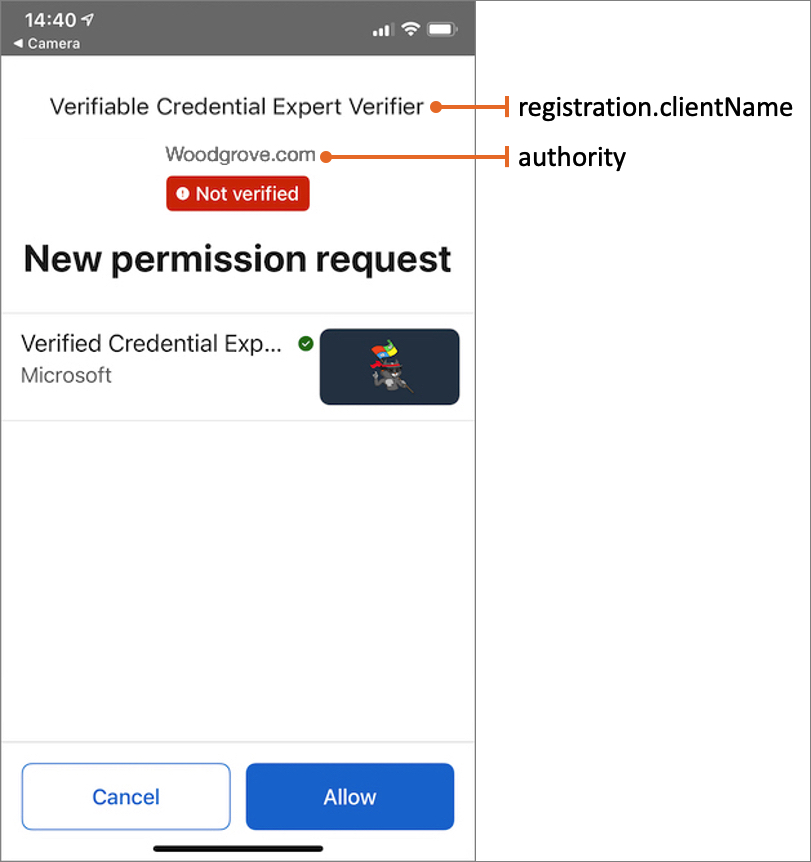

# Request Service REST API presentation specification

[!INCLUDE [Verifiable Credentials announcement](../../../includes/verifiable-credentials-brand.md)]

Microsoft Entra Verified ID includes the Request Service REST API. This API allows you to issue and verify a credential. This article specifies the Request Service REST API for a presentation request. The presentation request asks the user to present a verifiable credential, and then verify the credential.
Another article describes [how to call the Request Service REST API](get-started-request-api.md).

## HTTP request

The Request Service REST API presentation request supports the following HTTP method:

| Method |Notes  |
|---------|---------|
|POST | With JSON payload as specified in this article. |

The Request Service REST API presentation request requires the following HTTP headers:

| Method |Value  |
|---------|---------|
|`Authorization`| Attach the access token as a bearer token to the authorization header in an HTTP request. For example, `Authorization: Bearer <token>`.|
|`Content-Type`| `Application/json`|

Construct an HTTP POST request to the Request Service REST API. The `tenantId` isn't needed in the URL anymore since it is present as a claim in the `access_token`.

```http
https://verifiedid.did.msidentity.com/v1.0/verifiableCredentials/createPresentationRequest
```

The following HTTP request demonstrates a presentation request to the Request Service REST API:

```http
POST https://verifiedid.did.msidentity.com/v1.0/verifiableCredentials/createPresentationRequest
Content-Type: application/json
Authorization: Bearer  <token>

{
    "includeQRCode": true,
    "callback": {
      "url": "https://www.contoso.com/api/verifier/presentationCallback",
      "state": "11111111-2222-2222-2222-333333333333",
      "headers": {
        "api-key": "an-api-key-can-go-here"
      }
    },
    ...
}
```

The following permission is required to call the Request Service REST API. For more information, see [Grant permissions to get access tokens](verifiable-credentials-configure-tenant.md#grant-permissions-to-get-access-tokens).

| Permission type | Permission  |
|---------|---------|
| Application | 3db474b9-6a0c-4840-96ac-1fceb342124f/.default |

## Presentation request payload

The presentation request payload contains information about your verifiable credentials presentation request. The following example demonstrates a presentation request from a specific issuer. The result of this request returns a QR code with a link to start the presentation process.

```json
{
  "includeQRCode": true,
  "includeReceipt": true,
  "authority": "did:ion:EiCLL8lzCqlGLYTGbjwgR6SN6OABCO6uUKyF5zM7fQZ8Jg:eyJ...<SNIP>...",
  "registration": {
    "clientName": "Veritable Credential Expert Verifier"
  },
  "callback": {
    "url": "https://www.contoso.com/api/verifier/presentationCallback",
    "state": "92d076dd-450a-4247-aa5b-d2e75a1a5d58",
    "headers": {
      "api-key": "OPTIONAL API-KEY for CALLBACK EVENTS"
    }
  },
  "requestedCredentials": [
    {
      "type": "VerifiedCredentialExpert",
      "purpose": "So we can see that you a veritable credentials expert",
      "acceptedIssuers": [
        "did:ion:EiCLL8lzCqlGLYTGbjwgR6SN6OABCO6uUKyF5zM7fQZ8Jg:eyJ...<SNIP>..."
      ],
      "configuration": {
        "validation": {
          "allowRevoked": false,
          "validateLinkedDomain": false
        }
      }
    }
  ]
}
```

The payload contains the following properties.

|Parameter |Type  | Description |
|---------|---------|---------|
| `includeQRCode` |  Boolean | Optional. Determines whether a QR code is included in the response of this request. Present the QR code and ask the user to scan it. Scanning the QR code launches the authenticator app with this presentation request. Possible values are `true` (default) or `false`. When you set the value to `false`, use the return `url` property to render a deep link.  |
| `includeReceipt` |  Boolean | Optional. Determines whether a receipt should be included in the response of this request. Possible values are `true` or `false` (default). The receipt contains the original payload sent from the authenticator to the Verifiable Credentials service. The receipt is useful for troubleshooting or if you have the need to ge the full details of the payload. There's otherwise no need be set this value to `true `by default. In the `OpenId Connect SIOP` request, the receipt contains the ID token from the original request. |
| `authority` | string|  Your decentralized identifier (DID) of your verifier Azure AD tenant. For more information, see [Gather tenant details to set up your sample application](verifiable-credentials-configure-verifier.md#gather-tenant-details-to-set-up-your-sample-application).|
| `registration` | [RequestRegistration](#requestregistration-type)|  Provides information about the verifier. |
|`callback`|  [Callback](#callback-type)| Mandatory. Allows the developer to update the UI during the verifiable credential presentation process. When the user completes the process, continue the process after the results are returned to the application.|
| `requestedCredentials` | collection| A collection of [RequestCredential](#requestcredential-type) objects.|


### RequestRegistration type

The `RequestRegistration` type provides information registration for the issuer. The `RequestRegistration` type contains the following properties:

|Property |Type |Description |
|---------|---------|---------|
| `clientName` | string|  A display name of the verifier of the verifiable credential. This name will be presented to the user in the authenticator app. |
| `purpose` | string|  Optional. A string that is displayed to inform the user why the verifiable credentials are being requested. |
| `logoUrl` | URL|  Optional. A URL for a logotype of the verifier. This is not used by the Authenticator app. |
| `termsOfServiceUrl` | URL|  Optional. A URL to the terms of service for the verifier. This is not used by the Authenticator app. |

The following screenshot shows the `clientName` property and the display name of the `authority` (the verifier) in the presentation request.



### Callback type

The Request Service REST API generates several events to the callback endpoint. Those events allow you to update the UI and continue the process after the results are returned to the application. The `Callback` type contains the following properties:

|Property |Type |Description |
|---------|---------|---------|
| `url` | string| URI to the callback endpoint of your application. The URI must point to a reachable endpoint on the internet otherwise the service will throw a callback URL unreadable error. Accepted inputs IPv4, IPv6 or DNS resolvable hostname. |
| `state` | string| Correlates the callback event with the state passed in the original payload. |
| `headers` | string| Optional. You can include a collection of HTTP headers required by the receiving end of the POST message. The current supported header values are the `api-key` or the `Authorization` headers. Any other header will throw an invalid callback header error.|

### RequestCredential type

The `RequestCredential` provides information about the requested credentials the user needs to provide. `RequestCredential` contains the following properties:

|Property |Type |Description |
|---------|---------|---------|
| `type`| string| The verifiable credential type. The `type` must match the type as defined in the `issuer` verifiable credential manifest (for example, `VerifiedCredentialExpert`). To get the issuer manifest, see [Gather credentials and environment details to set up your sample application](verifiable-credentials-configure-issuer.md). Copy the **Issue credential URL**, open it in a web browser, and check the **id** property. |
| `purpose`| string | Optional. Provide information about the purpose of requesting this verifiable credential. This is not used by the Authenticator app. |
| `acceptedIssuers`| string collection | Optional. A collection of issuers' DIDs that could issue the type of verifiable credential that subjects can present. To get your issuer DID, see [Gather credentials and environment details to set up your sample application](verifiable-credentials-configure-issuer.md), and copy the value of the **Decentralized identifier (DID)**. If the `acceptedIssuers` collection is empty or not present, then the presentation request will accept a credential type issued by any issuer. |
| `configuration.validation` | [Configuration.Validation](#configurationvalidation-type) | Optional settings for presentation validation.|

### Configuration.Validation type

The `Configuration.Validation` provides information about how the presented credentials should be validated. It contains the following properties:

|Property |Type |Description |
|---------|---------|---------|
| `allowRevoked` |  Boolean | Optional. Determines if a revoked credential should be accepted. Default is `false` (it shouldn't be accepted). |
| `validateLinkedDomain` |  Boolean | Optional. Determines if the linked domain should be validated. Default is `false`. Setting this flag to `false` means you as a Relying Party application accept credentials from an unverified linked domain. Setting this flag to `true` means the linked domain will be validated and only verified domains will be accepted. |

## Successful response

If successful, this method returns a response code (*HTTP 201 Created*), and a collection of event objects in the response body. The following JSON demonstrates a successful response:

```json
{
    "requestId": "e4ef27ca-eb8c-4b63-823b-3b95140eac11",
    "url": "openid://vc/?request_uri=https://verifiedid.did.msidentity.com/v1.0/12345678-0000-0000-0000-000000000000/verifiableCredentials/request/e4ef27ca-eb8c-4b63-823b-3b95140eac11",
    "expiry": 1633017751,
    "qrCode": "data:image/png;base64,iVBORw0KGgoA<SNIP>"
}
```

The response contains the following properties:

|Property |Type |Description |
|---------|---------|---------|
| `requestId`| string | An autogenerated request ID. The [callback](#callback-events) uses the same request, allowing you to keep track of the presentation request and its callbacks. |
| `url`|  string| A URL that launches the authenticator app and starts the presentation process. You can present this URL to the user if they can't scan the QR code. |
| `expiry`| integer| Indicates when the response will expire. |
| `qrCode`| string | A QR code that the user can scan to start the presentation flow. |

When your app receives the response, the app needs to present the QR code to the user. The user scans the QR code, which opens the authenticator app and starts the presentation process.

## Error response

If there's an error with the request, an [error responses](error-codes.md) is returned, and should be handled appropriately by the app.

## Callback events

The callback endpoint is called when a user scans the QR code, uses the deep link the authenticator app, or finishes the presentation process.

|Property |Type |Description |
|---------|---------|---------|
| `requestId`| string | Mapped to the original request when the payload was posted to the Verifiable Credentials service.|
| `requestStatus` |string |The status returned when the request was retrieved by the authenticator app. Possible values: <ul><li>`request_retrieved`: The user scanned the QR code or selected the link that starts the presentation flow.</li><li>`presentation_verified`: The verifiable credential validation completed successfully.</li></ul>    |
| `state` |string| Returns the state value that you passed in the original payload.   |
| `subject`|string | The verifiable credential user DID.|
| `verifiedCredentialsData`| array |Returns an array of verifiable credentials requested. For each verifiable credential, it provides: </li><li>The verifiable credential type(s).</li><li>The issuer's DID</li><li>The claims retrieved.</li><li>The verifiable credential issuer's domain. </li><li>The verifiable credential issuer's domain validation status. </li></ul> |
| `receipt`| string | Optional. The receipt contains the original payload sent from the wallet to the Verifiable Credentials service. The receipt should be used for troubleshooting/debugging only. The format in the receipt isn't fix and can change based on the wallet and version used.|

The following example demonstrates a callback payload when the authenticator app starts the presentation request:

```json
{
    "requestId": "e4ef27ca-eb8c-4b63-823b-3b95140eac11",
    "requestStatus":"request_retrieved",
    "state": "92d076dd-450a-4247-aa5b-d2e75a1a5d58"
}
```

The following example demonstrates a callback payload after the verifiable credential presentation has successfully completed:

```json
{
  "requestId": "e4ef27ca-eb8c-4b63-823b-3b95140eac11",
  "requestStatus": "presentation_verified",
  "state": "92d076dd-450a-4247-aa5b-d2e75a1a5d58",
  "subject": "did:ion:EiAlrenrtD3Lsw0GlbzS1O2YFdy3Xtu8yo35W<SNIP>…",
  "verifiedCredentialsData": [
    {
      "issuer": "did:ion:issuer",
      "type": [
        "VerifiableCredential",
        "VerifiedCredentialExpert"
      ],
      "claims": {
        "firstName": "Megan",
        "lastName": "Bowen"
      },
      "credentialState": {
        "revocationStatus": "VALID"
      },
      "domainValidation": {
        "url": "https://contoso.com/"
      }
    }
  ],
  "receipt": {
    "id_token": "eyJraWQiOiJkaWQ6aW<SNIP>",
    "vp_token": "...",
    "state": "..."
  }
}
```

## Next steps

Learn [how to call the Request Service REST API](get-started-request-api.md).
