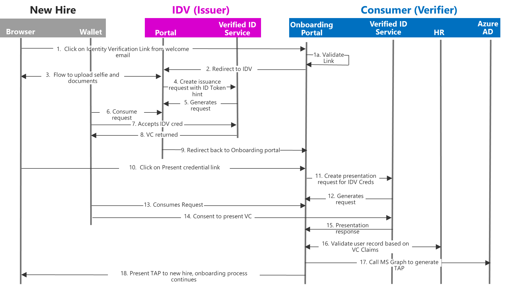

# Onboard new remote employees using ID verification

Enterprises onboarding users face significant challenges onboarding remote users who are not yet inside the trust boundary. Microsoft Entra Verified ID can help customers facing these scenarios because it can use government issued ID based attestations as a way to establish trust. 

## When to use this pattern

- You have a modern Human resources (HR) system with API support. 
- Your HR system allows programmatic integration to query the HR system to do a reliable matching of user profiles.
- Your organization has already started their passwordless journey.

## Solution

1. A custom portal for new employee onboarding.

2. A backend job provides new hires with a uniquely identifiable link to the employee onboarding portal from (A) that represents the new hire’s specific process. For this use case, the account for the new hire should already be provisioned in Microsoft Entra ID. Consider using [Lifecycle Workflows](../governance/what-are-lifecycle-workflows.md) as the triggering point of this flow.

3. New hires select the link to the portal in (A) above and are guided through a wizard-like experience:
  1. New Hires are redirected to acquire a verified ID from the Identity verification partner (also referred to IDV. To learn more about the identity verification partners: <https://aka.ms/verifiedidisv>)
  2. New Hires present the Verified ID acquired in Step 1
  3. System receives the claims from identity verification partner, looks up the user account for the new hire and performs the validation.
  4. System executes the onboarding logic to locate the Microsoft Entra account of the user, and [generate a temporary access pass using MS Graph](/graph/api/resources/temporaryaccesspassauthenticationmethod?view=graph-rest-1.0&preserve-view=true).

## Issues and considerations

- The link used to initiate the process needs to meet some criteria:
    - The link should be specific to each remote employee.
    - The link should be valid for only a short period of time. 
    - It should become invalid after a user finishes going through the flow.
    - The link should be designed to correlate to a unique HR record identifier
- A Microsoft Entra account should be pre-created for every user. The account should be used as part of the site's request validation process.
- Administrators frequently deal with discrepancies between users' information held in a company's IT systems, like human resource applications or identity management solutions, and the information the users provide. For example, an employee might have “James” as their first name but their profile has their name as “Jim”. For those scenarios:
   1. At the beginning of the HR process, candidates must use their name exactly as it appears in government issued documents. Taking this approach simplifies validation logic.
   1. Design validation logic to include attributes that are more likely to have an exact match against the HR system. Common attributes include street address, date of birth, nationality, national/regional identification number (if applicable), in addition to first and last name.
   1. As a fallback, plan for human review to work through ambiguous/non-conclusive results. This process might include temporarily storing the attributes presented in the VC, phone call with the user, etc.
- Multinational organizations, may need to work with different identity proofing partners based on the region of the user.
- Assume that the initial interaction between the user and the onboarding partner is untrusted. The onboarding portal should generate detailed logs for all requests processed that could be used for auditing purposes.

## Additional resources

- Public architecture document for generalized account onboarding: [Plan your Microsoft Entra Verified ID verification solution](plan-verification-solution.md#account-onboarding)
