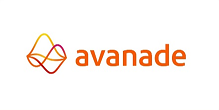
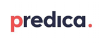

# Microsoft Entra Verified ID Services and solution partners

Our Services and solutions partner network extends and accelerates Microsoft Entra Verified ID adoption. Service partners offer advisory, implementation, integration and managed service capabilities that can help you build seamless end-user experiences using Verified ID.

## Services and solution partner list

You could select a partner from the list and build seamless end-user experiences for onboarding, secure access to critical services, self-service and custom business application scenarios. If you're a Services or solution Partner and would like to be considered into Microsoft Entra Verified ID partner documentation, submit your application [request](https://forms.microsoft.com/r/AGVsXmf4EZ)

| Services and solution partner | Website |
|:-------------------------|:--------------|
|  | [Secure Personally Identifiable Information | AffinitiQuest](https://affinitiquest.io/) |
|  | [Avanade Microsoft Entra Verified ID Consulting Services](https://appsource.microsoft.com/marketplace/consulting-services/avanadeinc.ava_entra_verified_id_fy23?exp=ubp8) |
|  | [Credivera: Digital Identity Solutions | Verifiable Credentials](https://www.credivera.com/) |
|  | [Decentralized Identity | Condatis](https://condatis.com/technology/decentralized-identity/) |
|  | [Digital Identity - Connect with DXC](https://dxc.com/us/en/services/security/digital-identity) |
|  | [Virtual Onboarding with Verified ID](https://idramp.com/virtual-onboarding-with-ms-entra-verified-id/) [Eradicate passwords with Verified ID](https://idramp.com/eradicate-passwords-with-verified-id-orchestration/) [Integrated identity orchestration with Verified ID](https://idramp.com/entra-verified-id-integrated-identity-orchestration/) [Zero Trust collaboration with Verified ID](https://idramp.com/protected-virtual-meetings/) [Azure Marketplace Verified ID offering](https://azuremarketplace.microsoft.com/en-us/marketplace/apps/idrampinc1682537450107.idramp-orchestration?tab=Overview) |
|  | [CTC's SELMID offering](https://ctc-insight.com/selmid) |
|  | [Verified ID - Formula5](https://formula5.com/accelerator-for-microsoft-entra-verified-id/) [Azure Marketplace Verified ID offering](https://azuremarketplace.microsoft.com/marketplace/consulting-services/formulaconsultingllc1668008672143.verifiable_credentials_formula5-preview?tab=Overview&flightCodes=d12a14cf40204b39840e5c0f114c1366) |
|  | [Connect with Kocho. See Verified Identity in Action](https://kocho.co.uk/contact-us/) [See Verified Identity in Action](https://kocho.co.uk/verified-id-in-action/) |
|  | [Verified ID - Predica Group](https://www.predicagroup.com/en/verified-id/) |
|  | [Sphereon supports customers on Microsoft's Microsoft Entra Verified ID](https://sphereon.com/sphereon-supports-microsofts-entra-verified-id/) |
|  | [Microsoft Entra Verified ID - UNIFY Solutions](https://unifysolutions.net/entra/verified-id/) |
|  | [Microsoft Entra Verified ID - WhoIAM](https://www.whoiam.ai/product/microsoft-entra-verified-id/#:~:text=Verifiable%20credentials%20are%20identity%20attestations%2C%20such%20as%20proof,obtain%20and%20manage%20their%20verified%20credentials.%20Let%E2%80%99s%20Talk) |

## Next steps

Select a partner in the table to learn about their Microsoft Entra Verified ID services offerings, what kind of use cases were deployed and how they can support you.
