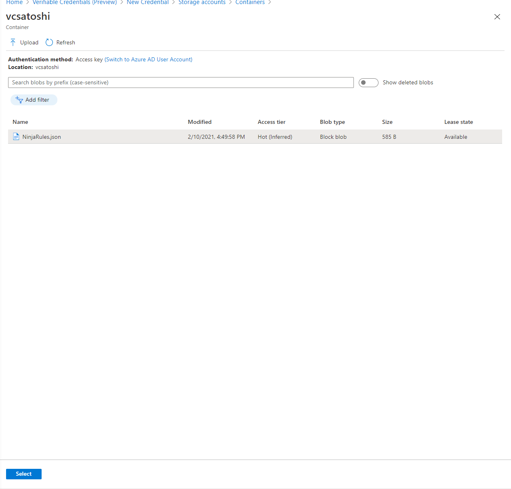
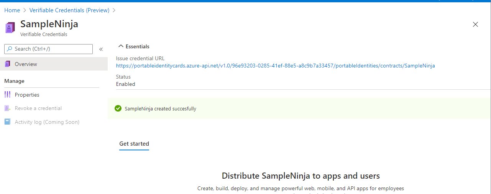
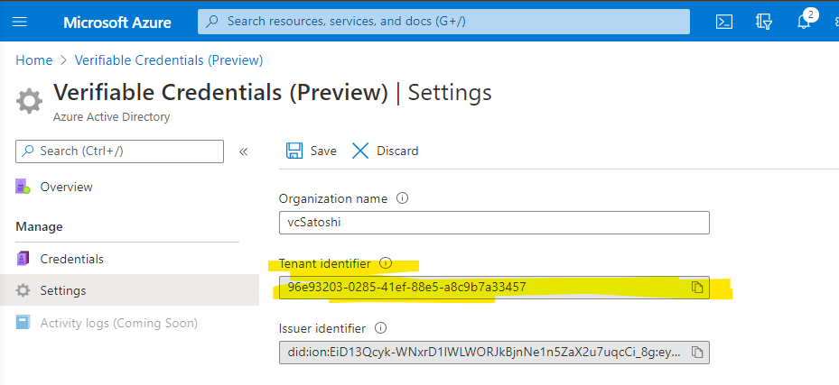
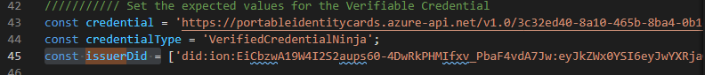

# Create Sample Ninja Credential in your Issuer

Now that we have our Verifiable Credentials service set up in Azure Active Directory (AAD). Let's use the Sample Code's Ninja Credential and use that with our Issuer. 

## Create the Rules and Display Files

Open up Visual Studio Code and create the Rules JSON file with the following modifications. Save it as SampleNinjaRules.json so we can differentiate it in the future.

### Rules File

```json
{
  "attestations": {
    "idTokens": [
      {
        "mapping": {
          "firstName": { "claim": "given_name" },
          "lastName": { "claim": "family_name" }
        },
        "configuration": "https://didplayground.b2clogin.com/didplayground.onmicrosoft.com/B2C_1_sisu/v2.0/.well-known/openid-configuration",
        "client_id": "8d5b446e-22b2-4e01-bb2e-9070f6b20c90",
        "redirect_uri": "vcclient://openid"
      }
    ]
  },
  "validityInterval": 2592000,
  "vc": {
    "type": ["VerifiedCredentialNinja"]
  }
}
```

Create another file for the Display file and save it as 'display-example.json'. You don't need to change anything. For more information on display file customization options follow the how-to article [custom Verifiable Credential design](credential-design.md).

```json
{
  "default": {
    "locale": "en-US",
    "card": {
      "title": "Verified Credential Ninja",
      "issuedBy": "Ninja VC",
      "backgroundColor": "#000000",
      "textColor": "#ffffff",
      "logo": {
        "uri": "https://didcustomerplayground.blob.core.windows.net/public/ninja-icon.png",
        "description": "Ninja Logo"
      },
      "description": "Use your verified credential ninja card to prove to anyone that you know all about verifiable credentials."
    },
    "consent": {
      "title": "Do you want to get your Verified Credential Ninja card?",
      "instructions": "Sign in with your account to get your card."
    },
    "claims": {
      "vc.credentialSubject.firstName": {
        "type": "String",
        "label": "First name"
      },
      "vc.credentialSubject.lastName": {
        "type": "String",
        "label": "Last name"
      }
    }
  }
}
```

## Create a storage account

We need a storage account to hold the rule and display files we created in the previous step.

For this set of tutorials create a storage account using the following options:

- **Name:**  A unique name
- **Account kind:** Storage V2 (Why did we choose this? is this required
- **Performance:** Standard
- **Replication:** Locally redundant  (IS THERE A REASON FOR THIS? WHAT WOULD BE THE RECOMMENDATION FOR PRODUCTION? GEO REDUNDANT? )
- **Location:** (US) EAST US
- **Resource group:** Choose the same resource group we used in earlier tutorials (**vc-resource-group**)

For detailed steps you can review the [Create a storage account](../../storage/common/storage-account-create.md?tabs=azure-portal) article.


Once that you have a storage account we need to create a Container.

- name 
- Public access level: Private (no anonymous access)


Now select your new container and upload the Rules file you created earlier. Once it hs been uploaded, click on the rules file and press Select at the bottom. 




## Create the Ninja Credential VC

- Select **Credentials** from the Verifiable Credentials preview page.

    

- Choose **Create a credential**
- Under Credential Name, add the name Ninja Credential. This name is not shown to the user and is only for managing your Verifiable Credentials. 


Select rules file upload. 


You should now be brought back to the New Credential Flow and its time to select the Display blob file. Follow the same pattern as before. 

Once that is complete press Create in the New Credential flow. 

:::info
**ISSUE** if you created a new blob storage you will see an error. Wait 10 minutes and try again.
::::

## Credential URL

Now that your Credential has been created, lets copy the Credential URL and run it in the browser to see if it works.  



https://portableidentitycards.azure-api.net/v1.0/96e93203-0285-41ef-88e5-a8c9b7a33457/portableIdentities/contracts/SampleNinja

```json=
{
  "id": "SampleNinja",
  "display": {
    "locale": "en-US",
    "contract": "https://portableidentitycards.azure-api.net/v1.0/96e93203-0285-41ef-88e5-a8c9b7a33457/portableIdentities/contracts/SampleNinja",
    "card": {
      "title": "Verified Credential Ninja",
      "issuedBy": "Microsoft",
      "backgroundColor": "#000000",
      "textColor": "#ffffff",
      "logo": {
        "uri": "https://didcustomerplayground.blob.core.windows.net/public/ninja-icon.png",
        "description": "Ninja Logo"
      },
      "description": "Use your verified credential ninja card to prove to anyone that you know all about verifiable credentials."
    },
    "consent": {
      "title": "Do you want to get your Verified Credential Ninja card?",
      "instructions": "Sign in with your account to get your card."
    },
    "claims": {
      "vc.credentialSubject.firstName": {
        "type": "String",
        "label": "First name"
      },
      "vc.credentialSubject.lastName": {
        "type": "String",
        "label": "Last name"
      }
    },
    "id": "display"
  },
  "input": {
    "credentialIssuer": "https://portableidentitycards.azure-api.net/v1.0/96e93203-0285-41ef-88e5-a8c9b7a33457/portableIdentities/card/issue",
    "issuer": "did:ion:EiD13Qcyk-WNxrD1lWLWORJkBjnNe1n5ZaX2u7uqcCi_8g:eyJkZWx0YSI6eyJwYXRjaGVzIjpbeyJhY3Rpb24iOiJyZXBsYWNlIiwiZG9jdW1lbnQiOnsicHVibGljS2V5cyI6W3siaWQiOiJzaWdfMjVlNDgzMzEiLCJwdWJsaWNLZXlKd2siOnsiY3J2Ijoic2VjcDI1NmsxIiwia3R5IjoiRUMiLCJ4IjoibDBWV0ZlemMxVmNEeHphRmk5R20tMWRaeTItNjlEcXlJOXNHb3NwT2pwcyIsInkiOiJZMFg4TDh5SHVoOVNhb2hDLW1jUzFGbkhicXRzNmlDNDhYdXlGQm11MHdnIn0sInB1cnBvc2VzIjpbImF1dGhlbnRpY2F0aW9uIiwiYXNzZXJ0aW9uTWV0aG9kIl0sInR5cGUiOiJFY2RzYVNlY3AyNTZrMVZlcmlmaWNhdGlvbktleTIwMTkifV0sInNlcnZpY2VzIjpbeyJpZCI6ImxpbmtlZGRvbWFpbnMiLCJzZXJ2aWNlRW5kcG9pbnQiOnsib3JpZ2lucyI6WyJodHRwczovL3Zjc2F0b3NoaS5jb20vIl19LCJ0eXBlIjoiTGlua2VkRG9tYWlucyJ9XX19XSwidXBkYXRlQ29tbWl0bWVudCI6IkVpQzd3MFJLd19rTGpxejdkUzFWR0VWWmttYmpDazdsUFJCR21aZXBaN0p5NXcifSwic3VmZml4RGF0YSI6eyJkZWx0YUhhc2giOiJFaUFBYVphRllaMEtRRGdYQnlxRm9WNldLY2J4Wmp4YXNMbmhTWk9OV2ZGMU93IiwicmVjb3ZlcnlDb21taXRtZW50IjoiRWlEbnotLXQ5RWFyc1pBdEJBOWo5THNJWXJvVlNPdTNLcDBLanJGdEFiM1Z4dyJ9fQ",
    "attestations": {
      "idTokens": [
        {
          "id": "https://didplayground.b2clogin.com/didplayground.onmicrosoft.com/B2C_1_sisu/v2.0/.well-known/openid-configuration",
          "encrypted": false,
          "claims": [
            {
              "claim": "given_name",
              "required": false,
              "indexed": false
            },
            {
              "claim": "family_name",
              "required": false,
              "indexed": false
            }
          ],
          "required": false,
          "configuration": "https://didplayground.b2clogin.com/didplayground.onmicrosoft.com/B2C_1_sisu/v2.0/.well-known/openid-configuration",
          "client_id": "8d5b446e-22b2-4e01-bb2e-9070f6b20c90",
          "redirect_uri": "vcclient://openid"
        }
      ]
    },
    "id": "input"
  }
}
```

## Update Contract URL in Sample

Open your Issuer Sample code app.js file. 

Update the constant 'credential' with your new contract URL. 

```
/////////// Set the expected values for the Verifiable Credential
const credential = 'https://portableidentitycards.azure-api.net/v1.0/96e93203-0285-41ef-88e5-a8c9b7a33457/portableIdentities/contracts/SampleNinja';
const credentialType = ['VerifiedCredentialNinja'];
```

In the terminal, run your node app.

```
$ node ./app.js
```

Open up your url from ngrok and test issuing the VC to yourself.

>[!IMPORTANT]
> If you haven't done DNS Binding we are experiencing and failure and this is not working. Need to make sure Nithya's fix is in both iOS and Android.


## Test Verifying the VC with Sample Code

Open up Settings in the Verifiable Credentials blade in Azure portal. Copy the Issuer identifier.



Now open up your app.js file in your Verifier Sample code. 

Set the constant issuerDid to your issuer identifier. (Tenant identifier right? so could we say that to match the interface?)



Now run your verifier app and present the VC.

Here are those instructions if you forgot [Run Verifier Sample](https://hackmd.io/px5WVtuDTSuQIRKgvmLjAg)

## Next steps

Now that you have the sample code issuing a VC by your issuer, lets jump into the next section where you use your own identity provider to gate who can get the VC.

[Tutorial - Hook up your IDP to a new Verifiable Credential, use contract uri in Sample](tutorial-sample-app-your-idp.md)