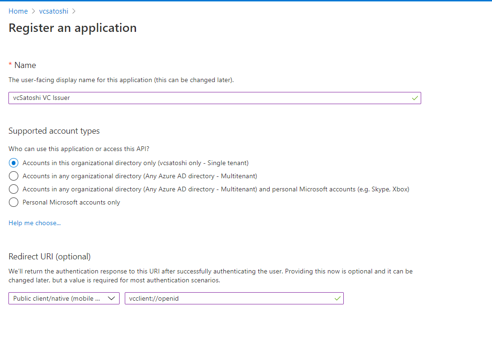
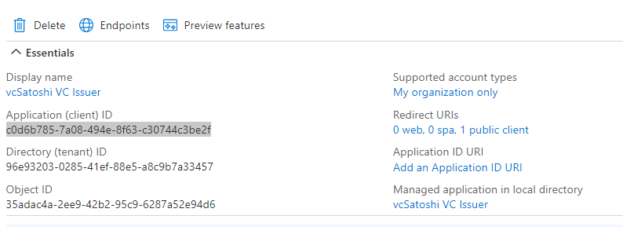
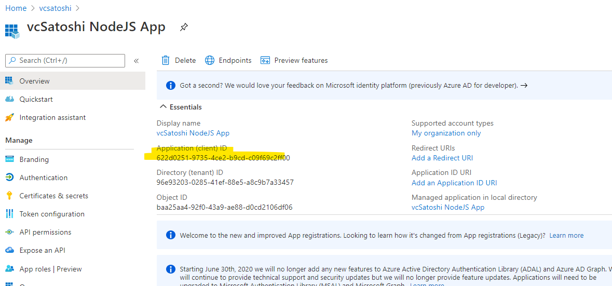
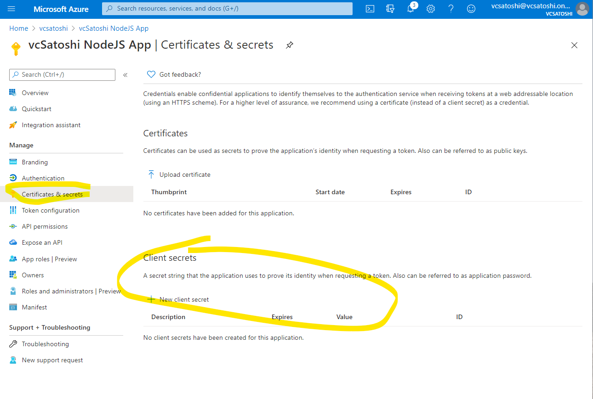
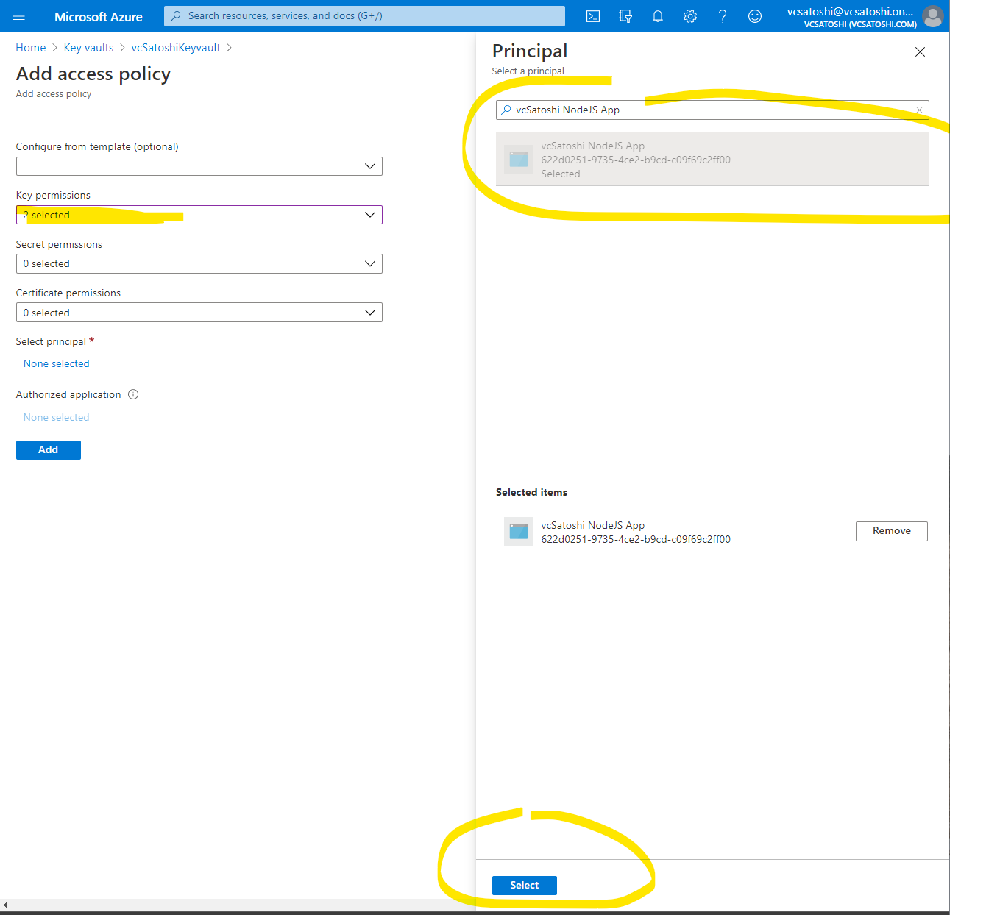

# Tutorial - Hook up your IDP to a new Verifiable Credential, create node app to talk with key vault

Now that you have your Azure tenant set up with the Verifiable Credential service, we will walk you through changing the configuration in your local sample code to your own Verifiable Credential service we set up in the previous section. 

In this article you will learn how to:

- Connect your identity provider
- Create the Ninja Credential Rules and Display File
- Upload Rules and Display files
- Set up Issuer service to Azure Key Vault
- Update Sample Code with your tenant

## Connect your IDP 

In the sample, in order to get issued the Ninja Verifiable Credential the user needed to log into their IDP. All Verifiable Credentials are not required to have an IDP login, we will cover creating other types of requirements for Verifiable Credentials in the How To section.

The Authenticating of an ID Token allows users to prove who they are before receiving their credential. When a user successfully logs in, your identity provider will returns a security token that contains claims about the user. The issuer service then transforms these security tokens and their claims into Verifiable Credentials.

Any identity provider that supports the OpenID Connect protocol is supported. Examples of supported identity providers include Azure Active Directory, and Azure AD B2C. This article contains the details of the OpenID Connect protocol used during the credential issuing process.


To issue the Ninja Verifiable Credential, you need to provide the issuer service with the configuration details of your OpenID compliant identity provider. 

### Register the Verifiable Credential Issuer service 

To issue a Verifiable Credential, you need to provide the issuer service with the [configuration](https://didproject.azurewebsites.net/docs/issuer-openid.html) details of your OpenID compliant identity provider.

Register the Verifiable Credential issuer service as an application in your identity provider and obtain a client ID. Instructions are available for registering an application with [Azure AD](https://docs.microsoft.com/azure/active-directory/develop/quickstart-register-app) or [Azure AD B2C](https://docs.microsoft.com/azure/active-directory-b2c/tutorial-register-applications). When registering, use the values below.

- Name: "Tenant VC Issuer"
- Suported account types: Accounts in this organizational directory only
- Redirect URI: vcclient://openid



Now that you've completed registering the application, write down the Application (client) ID. You need this value later.



Now select the Endpoints button and copy the OpenID Connect metadata document URI. You will need this for the next section. 


## Your IDP with the Ninja Credential 

Now let's create a new Ninja credential with your own IDP. 

Replace the client_id and configuration with the two objects we copied in the previous section. 

Configuration equates to the OpenID Connect metadata document URI.

:::info
**ISSUE** By using the Oauth 2.0 endpoint we can only include first and last name from our IDP. For this portion of the tutorial that is ok for now. Check out the Customize ID token claims for more information. 
::::

```json=
{
  "attestations": {
    "idTokens": [
      {
        "mapping": {
          "firstName": { "claim": "given_name" },
          "lastName": { "claim": "family_name" }
        },
        "configuration": "https://didplayground.b2clogin.com/didplayground.onmicrosoft.com/B2C_1_sisu/v2.0/.well-known/openid-configuration",
        "client_id": "8d5b446e-22b2-4e01-bb2e-9070f6b20c90",
        "redirect_uri": "vcclient://openid"
      }
    ]
  },
  "validityInterval": 2592000,
  "vc": {
    "type": ["VerifiedCredentialNinja"]
  }
}
```

## Create new VC with this rules file and old display file

Follow same instructions from before and get the contract URL.

Save the contract URL, we will need that in the next section. 

```
https://portableidentitycards.azure-api.net/v1.0/96e93203-0285-41ef-88e5-a8c9b7a33457/portableIdentities/contracts/MyIDPNinja
```

## Set up your node app with access to Key Vault

### Register node app

To authenticate a credential issuance request to the user, the issuer website will use your cryptographic keys in Azure Key Vault. To access Azure Key Vault, your website will need a client ID and client secret that can be used to authenticate to Azure Key Vault.


Copy down your Application (client) ID as you will need this later to update your Sample Node app.

```
622d0251-9735-4ce2-b9cd-c09f69c2ff00
```




### Generate a client secret

- Certificates & secrets
- New client secret
- Add description: "Node app client secret"
- Expires: in 1 year

Copy down the SECRET as you will need this to update your Sample Node app. 

:::info
**ISSUE** YOU HAVE ONE SHOT TO COPY DOWN THE SECRET. THEN THE SECRET IS ONE WAY HASHED. DON'T COPY THE ID.
::::

```
tP1WN~872_4GQR42nGL~GAgx__ASKdAbp6
```




After creating your application and client secret in Azure AD, you need to grant the application permission to perform operations on your Key Vault. This enables the website to access and use the private keys that are stored in Key Vault.

- Go to Key Vault.
- Access Policies on left nav
- Create new
- Key permissions: Get, Sign
- Select Principle: copy in the name you generated earlier. Select it.
- Press Add

Don't forget to press SAVE.



## Summary and next steps

You should have created a new VC that has your own IDP and copied the contract URL. You should have also generated a Client ID for the node app along with a client secret. We will need these values in the next section to turn your Sample code to start using your own keys from key vault.


