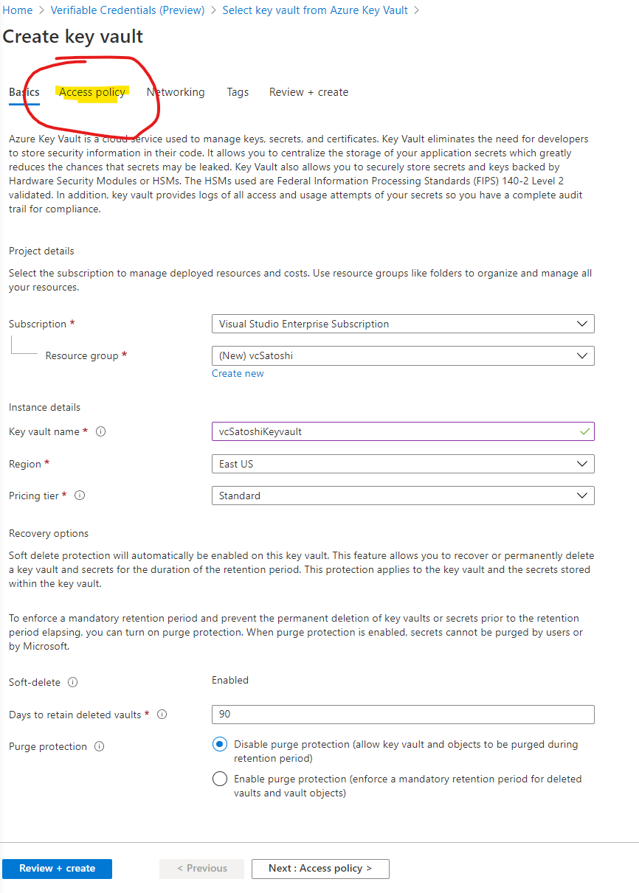
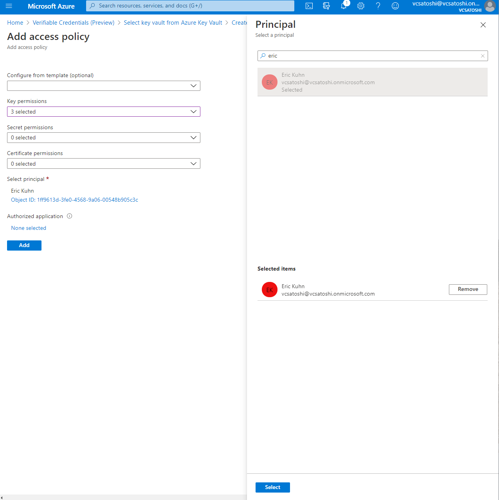

# Set up Verifiable Credentials in Azure

In this article:

1. Requirements to issue credentials
2. Create your directory
3. Set up Azure Key Vault

Building on the work we did getting the Sample code running on your own machine. Now we will set up your own Issuer and Verifier tenant with Azure AD. In a few simple steps, you can configure Azure AD to produce the same Ninja credential from the Sample code, but issued by your tenants DID.

## Prerequisites

To issue Verifiable Credentials, you need the following services.

- Complete the Getting Started Guide
- An Azure account
- Azure AD with a premium license
- An instance of Azure Key Vault where you have rights to create keys and secrets
- Access to  Azure Blob storage that you can use to create containers and blobs
- Any identity provider that supports the OpenID Connect standard for federation. Examples include Azure AD and Azure AD B2C. More detail is available in Credential Structure.

## Create your directory

To get started, you first need an Azure AD tenant. In the world of Verifiable Credentials, your Azure AD tenant will represent your organization. When your tenant is enabled for the Verifiable Credentials preview, it will be assigned a decentralized identifier (DID) and be equipped with an issuer service for issuing credentials. Any credential you issue will be issued by your tenant and its DID. You will also use the DID when verifying Verifiable Credentials (VCs). At this time, the Verifiable Credentials preview also requires an Azure AD Premium license.

- Use an existing Azure AD tenant, or [create a tenant](aa6cee96-1a85-4601-a641-92f2fa3a9222) if you do not already have one. Your directory does not need to be populated with user accounts; the tenant can be empty. 
- Activate a [free trial](https://azure.microsoft.com/trial/get-started-active-directory/) of Azure AD Premium P1 or P2 in your tenant. If you have already purchased Azure AD Premium in your tenant, no action is required.

At this point, your tenant has been successfully enabled for the Verifiable Credentials preview. Continue onto the next section to set up your credential issuer service.

## Set up Verifiable Credentials Preview

Search for Verifiable Credentials and you see the blade.

### Business Name

This is how you will reference your business within the Verifiable Credential service. This will not be customer facing.

### Domain

The domain entered will be added to a service endpoint in your DID document. Microsoft Authenticator and other VC Wallets will validate that your DID is linked to your domain and display to the user a Verified symbol or tell the user this is an untrusted session. The domain is what binds your DID to something tangible that the user may know about your business. See the example Presentation screen below. 

## Key Vault

In the Verifiable Credentials preview, you have complete control and management of the cryptographic keys your tenant will use to digitally sign Verifiable Credentials.

To issue and verify credentials, you must provide Azure AD with access to your own instance of Azure Key Vault. 

If you have not created a Key Vault yet, continue by choosing 'select key vault'.

>[!NOTE]
> Each Key Vault transaction will incur a cost to your Azure subscription. Review the Key Vault pricing details here.

## Create a Key Vault

- Subscription: choose your Azure subscription you want Key Vault to bill.
- Resource Group: Create a new resource group with a name that is helpful for you to identify as part of the Verifiable Credential service. 
- Key vault name: Create a Key Vault name with a name that is helpful for you to identify as part of the Verifiable Credential service. 
- Region: East US (Recommendation)
- Pricing Tier: Standard (Recommendation)
- Days to retain deleted vaults: 90 (Recommendation)
- Purge Protection: Disable (Recommendation)

## Key Vault Access Policy for Verifiable Credentials Admin

In order for the Verifiable Credential service get started, we need an access policy so the Admin can create your keys, have the ability to delete if you opt out and sign in order to create the domain binding Verifiable Credential.

While creating your Key Vault, select Access policy to complete this action. You can always create this later as well. 

Under Key permissions select the following:

- Create: Opt in to the Verifiable Credential service and create your keys for the DID
- Delete: Opting out of the Verifiable Credential service will do a soft delete on your DID keys
- Sign: We will create a Verifiable Credential for your linked domain that was asked for in the previous screen. 

Select a principle, which should be your user account.

>[!IMPORTANT]
> During the Verifiable Credentials preview, keys and secrets created in your vault should not be modified once created. Deleting, disabling, or updating your keys and secrets will invalidate any credentials issued in the future. Do not modify your keys or secrets during the preview.

## Next Steps

Once you've selected the Key Vault and pressed the continue button, you will be dropped into the Create Credential flow. If you want to complete the credential, please go to this [tutorial.](tutorial-create-samplecard-your-issuer.md)

