# Using the Microsoft Authenticator with Verified ID

[!INCLUDE [Verifiable Credentials announcement](../../../includes/verifiable-credentials-brand.md)]

In this tutorial, you learn how to install the Microsoft Authenticator app and use it for the first time with Verified ID. You use the public end to end demo webapp to issue a verifiable credential to the Authenticator and present verifiable credentials from the Authenticator.

In this article, you learn how to:

> [!div class="checklist"]
>
> - Install Microsoft Authenticator on your mobile device
> - Use the Microsoft Authenticator for the first time
> - Issue a verifiable credential from the public end to end demo webapp to the Authenticator
> - Present a verifiable credential from the Authenticator to the public end to end demo webapp
> - View activity details of when and where you've presented your verifiable credentials
> - Delete a verifiable credential from your Authenticator

## Install Microsoft Authenticator on your mobile device

If you already have Microsoft Authenticator installed, you can skip this section. If you need to install it, follow these instructions, but make sure you install **Microsoft Authenticator** and not another app with the name Authenticator, as there are multiple apps sharing that name.

- On iPhone, open the [App Store](https://support.apple.com/HT204266) app and search for **Microsoft Authenticator** and install the app.
    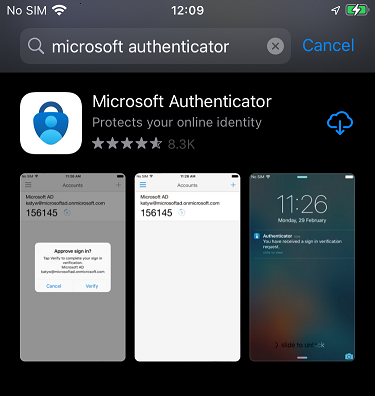

- On Android, open the [Google Play](https://play.google.com/about/howplayworks/) app and search for **Microsoft Authenticator** and install the app.
    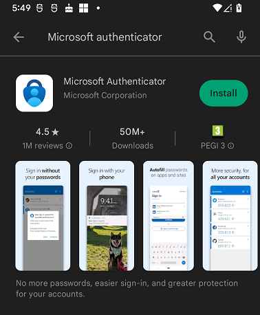

## Use the Microsoft Authenticator for the first time

Using the Authenticator for the first time presents a set of screens that you have to navigate through in order to be ready to work with Verified ID.

1. Open the Authenticator app and press **Accept** on the first screen.

    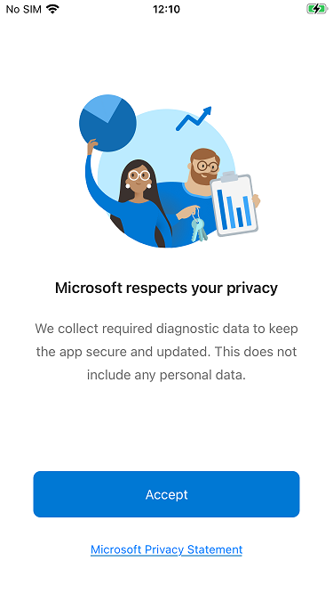

2. Select your choice of sharing app usage data and press **Continue**.

    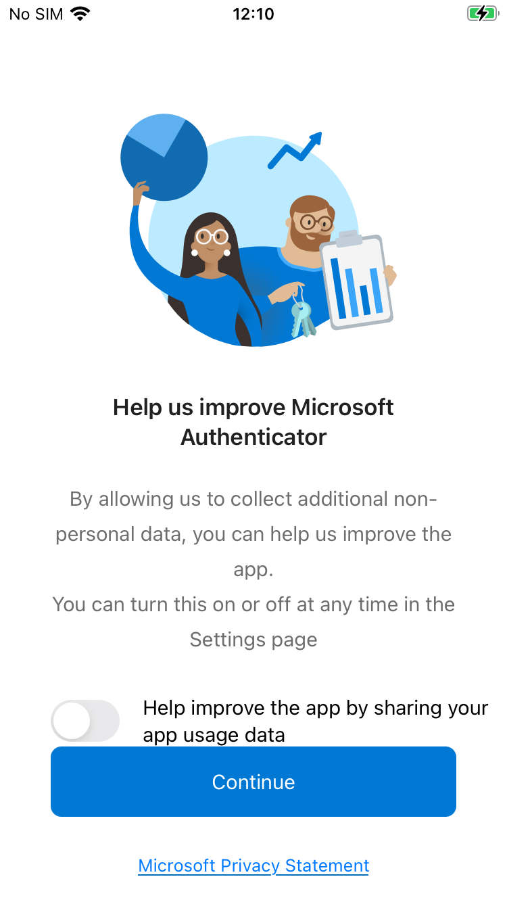

3. Press **Skip** in the upper right corner of the screen asking you to **Sign in with Microsoft**.

    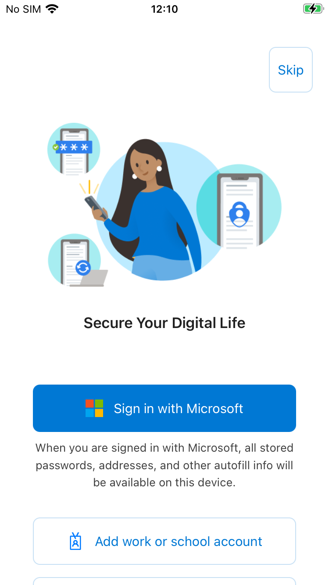

## Issue a verifiable credential

When the Microsoft Authenticator app is installed and ready, you use the public end to end demo webapp to issue your first verifiable credential onto the Authenticator.

1. Open [end to end demo](https://woodgroveemployee.azurewebsites.net/) in your browser
    1. Enter your First Name and Last Name and press **Next**
    1. Select **Verify with True Identity**
    1. Click **Take a selfie** and **Upload government issued ID**. The demo uses simulated data and you don't need to provide a real selfie or an ID. 
    1. Click **Next** and **OK**
2. Open your Microsoft Authenticator app
3. Select **Verified IDs** in the lower right corner on the start screen
4. Select **Scan QR code** button. This screen only shows if you have no verifiable credential cards in the app.

    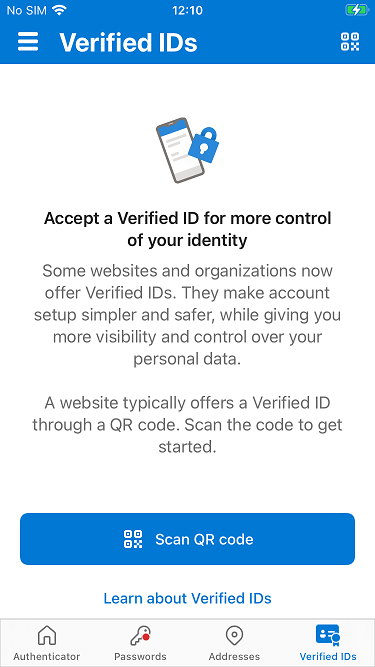

5. If this is the first time you scan a QR code, the mobile device notifies you that the Authenticator is trying to access the camera. Select **OK** to continue scanning the QR code.

    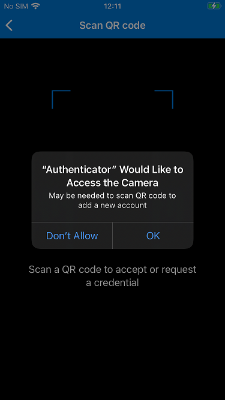

6. Scan the QR code and enter the pin code in the Authenticator and select **Next**. The pin code is shown in the browser page.

    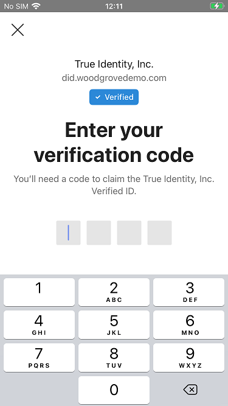

7. Select **Add** to add the verifiable credential card to the Authenticator wallet.

    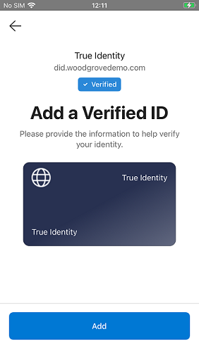

8. Select **Return to Woodgrove** in the browser

Note the following.

- After you've scanned the QR code, the Authenticator displays who the issuing party is for the verifiable credential. In the above screenshots, you can see that it's **True Identity** and that the issuance request comes from a verified domain **did.woodgrovedemo.com**. As a user, it is your choice if you trust this issuing party.
- Not all issuance requests involve a pin code. It's up to the issuing party to decide to include the use of a pin code.
- The purpose of using a pin code is to add an extra level of security of the issuance process so only you, the intended recipient, can issue the verifiable credential.
- The demo displays the pin code in the browser page next to the QR code. In a real world scenario, the pin code wouldn't be displayed there, but instead be given to you in some alternate way, like in an email or an SMS text message.

## Present a verifiable credential

In learning how to present a verifiable credential, you continue where you left off above. Here, you'll present the True Identity verifiable credential to the demo webapp. Make sure you have a **True Identity** verifiable credential in the Authenticator before continuing.

1. If you're continuing where you left off, select **Access personalized portal** in the end to end demo webapp. If you have the True Identity verifiable credential in the Authenticator but closed the browser, then first select **I've been verified** in the [end to end](https://woodgroveemployee.azurewebsites.net/verification) demo webapp and then select **Access personalized portal**. Selecting  **Access personalized portal** will present a QR code in the webpage.
2. Open your Microsoft Authenticator app
3. Select **Verified IDs** in the lower right corner on the start screen
4. Press the **QR code symbol** in the top right corner to turn on the camera and scan the QR code.
5. Select **Share** in the Authenticator to present the verifiable credential to the end to end demo webapp.

    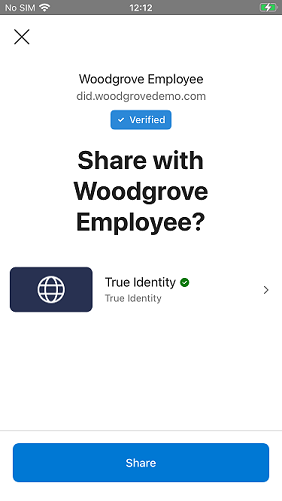

6. In the browser, click the  **Continue onboarding** button

Note the following.

- After you've scanned the QR code, the Authenticator will display who the verifying party is for the verifiable credential. In the above screenshots, you can see that it is **True Identity** and that the issuance request comes from a verified domain **did.woodgrovedemo.com**. As a user, it is your choice if you trust this party and want to share your credential with them.
- If the presentation request does not match any of the verifiable credentials you have in the Authenticator, you get a message that you haven't the credentials requested.
- If the presentation request matches multiple verifiable credentials you have in the Authenticator, you are asked to pick the one you want to share.
- If you have an expired verifiable credential that matches the presentation request, you get a message that it's expired and you can't share the credentials requested.

## Continue onboarding in the end to end demo

The end to end demo continues with onboarding you as a new employee to the Woodgrove company. Continuing with the demo repeats the process of issuance and presentation in the Authenticator. Follow these steps to continue the onboarding process.

### Issue yourself a Woodgrove employee verifiable credential

1. Select **Retrieve my Verified ID** in the browser. This displays a QR code in the webpage.
1. Press the **QR code symbol** in the top right corner of the Authenticator to turn on the camera
1. Scan the QR code and enter the pin code in the Authenticator and select **Next**. The pin code is shown in the browser page. 
1. Select **Add** to add the verifiable credential card to the Authenticator wallet.

### Use your Woodgrove employee verifiable credential to get a laptop

1. Select **Visit Proseware** in the browser.
1. Select **Access discounts** in the browser.
1. Select **Verify my Employee Credential** in the browser.
1. Press the **QR code symbol** in the top right corner of the Authenticator to turn on the camera and scan the QR code.
1. Select **Share** in the Authenticator to present the verifiable credential to the **Proseware** webapp.
1. Notice that a Woodgrove employee discounts are applied to the prices when Proseware have verified your credentials.

## View activity details of when and where you have presented your verifiable credentials

The Microsoft Authenticator keeps records of the activity for your verifiable credentials.
If you select a credential card and then switch to view **Activity**, you see the activity list for your credential sorted in most recently used order. For your True Identity card, you see two entries, where the first is when it was issued and the second that the credential was shared with Woodgrove.

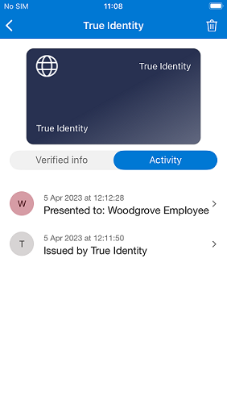

## Delete a verifiable credential from your Authenticator

You can delete a verifiable credential from the Microsoft Authenticator.
Click on the credential card you want to delete to view its details. Then click on the trash can in the upper right corner and confirm the deletion prompt.

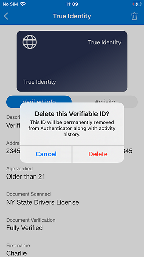

Deleting a verifiable credential from the Authenticator is an irrevocable process and there is no recycle bin to bring it back from. If you have deleted a credential, you must go through the issuance process again.

## How do I see the version number of the Microsoft Authenticator app

1. On iPhone, click on the three vertical bars in top left corner
1. On Android, click on the three vertical dots in the top right corner
1. Select “Help” to display your version number

## How to provide diagnostics data to a Microsoft Support representative

If during a Microsoft support case you are asked to provide diagnostics data from the Microsoft Authenticator app, follow these steps.

1. On iPhone, click on the three vertical bars in top left corner
1. On Android, click on the three vertical dots in the top right corner
1. Select “Send Feedback” and then “Having trouble?”
1. Select “Select an option” and select “Verified IDs”
1. Enter some text in the “Describe the issue” textbox
1. Click “Send” on iPhone or the arrow on Android in the top right corner

## Next steps

Learn how to [configure your tenant for Microsoft Entra Verified ID](verifiable-credentials-configure-tenant.md).
