# Issue Azure AD Verifiable Credentials from an Application (preview)

In this tutorial, you run a sample application from your local machine that connects to your Azure Active Directory (Azure AD) tenant. Using the application, you are going to issue a Verified Credential Expert Card and verify it.

In this article, you learn how to:

> [!div class="checklist"]
>
> - Setup an Azure Blob storage for storing your Verifiable Credentials configuration files.
> - Create and upload your Verifiable Credential configuration files.
> - Create the Verified Credential Expert Card in Azure.
> - Gather credentials and environment details to setup the sample application.
> - Download the sample application code to your local machine.
> - Update the sample application with your Verified Credentials Expert Card and environment details.
> - Run the sample application and issue your first Verified Credentials Expert Card.
> - Verify your Verified Credentials Expert Card.

The following diagram illustrates the Azure AD verifiable credentials architecture and the component you configure.

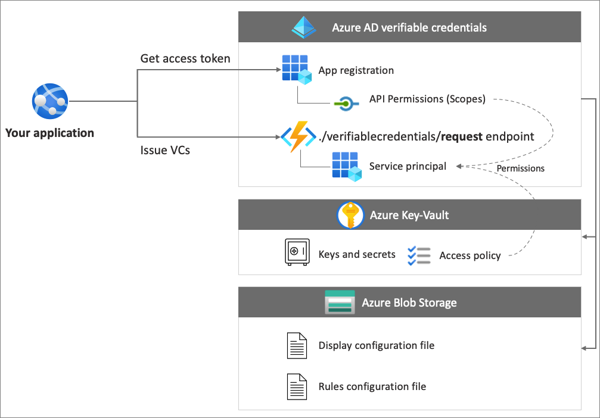

## Prerequisites

- Before you start, it's important to [Setup a tenant for Azure AD Verifiable Credential](https://tbd-link-to-the-tenant-config-article/).
- To clone the repository that hosts the sample app, install [GIT](https://git-scm.com/downloads)
- [Visual Studio Code](https://code.visualstudio.com/Download), or similar code editor
- [.NET 5.0](https://dotnet.microsoft.com/download/dotnet/5.0)
- [NGROK](https://ngrok.com/) free.
- A mobile device with Microsoft Authenticator
  - Android version 6.2108.5654 or higher installed.
  - iOS version 6.5.82 or higher installed.

## Create a storage account

Azure Blob storage is Microsoft's object storage solution for the cloud. Azure AD verifiable credentials service uses [Azure Blob Storage](/azure/storage/blobs/storage-blobs-introduction) to store the verifiable credentials configuration files when issuing verifiable credentials.

Create and configure your Azure Blob Storage by following these steps:

1. If you don't have Azure Blob Storage account, [Create a storage account](/azure/storage/common/storage-account-create).
1. After you created the storage account, create a container. In the left menu for the storage account, scroll to the **Data storage** section, then select **Containers**.
1. Select the **+ Container** button.
1. Type a **Name** for your new container. The container name must be lowercase, must start with a letter or number, and can include only letters, numbers, and the dash (-) character. For example, *vc-container*.
1. Set the **Public access level** to **Private** (no anonymous access).
1. Select **Create**.  

    The following screenshot shows how to create a container:  

   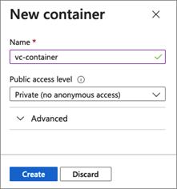

## Grant access to the container

After you create your container, grant the signed-in user the correct role assignment so they can access the files in Storage Blob.

1. Select the *vc-container* from the list of containers.

1. From the menu, select **Access control (IAM)**.

1. Select **+ Add,** then select **Add role assignment**

     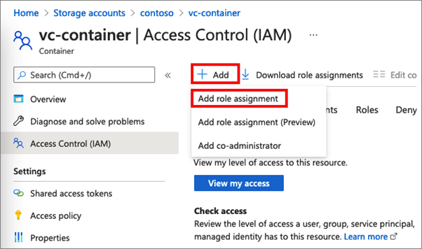

1. In the **Add role assignment** page:

    1. For the **Role**, select **Storage Blob Data Reader**.

    1. For the **Assign access to**, select **User, group, or service
        principal**

    1. Then, search the account that you're using to perform these steps and
        select it.

        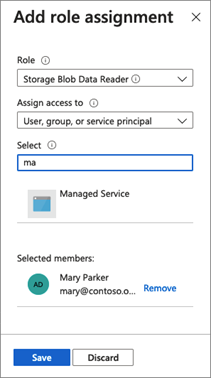

>[!IMPORTANT]
>By default, container creators get the Owner role assigned. The Owner role isn't enough on its own. Your account needs the Storage Blob Data Reader role. For more information, see [Use the Azure portal to assign an Azure role for access to blob and queue data](/azure/storage/blobs/assign-azure-role-data-access).

### Upload the configuration files

Azure AD Verifiable Credentials service uses two JSON configuration files, the rules and display files. 

- The rules file describes important properties of verifiable credentials. In particular, it describes the claims that subjects (users) need to provide before a verifiable credential is issued for them. 
- The display file controls the branding of the credential and styling of the claims.

In this section, you upload a sample rules and display files to your storage. For more information on how to customize these files, see [How to customize your verifiable credentials](credential-design.md).

To upload the configuration files, follow these steps:

1. Copy the following JSON and save the content into a file called, VerifiedCredentialExpertDisplay.json.

    ```json
    {
      "default": {
        "locale": "en-US",
        "card": {
          "title": "Verified Credential Expert",
          "issuedBy": "Microsoft",
          "backgroundColor": "#2E4053",
          "textColor": "#ffffff",
          "logo": {
            "uri": "https://didcustomerplayground.blob.core.windows.net/public/VerifiedCredentialExpert_icon.png",
            "description": "Verified Credential Expert Logo"
          },
          "description": "Use your verified credential to prove to anyone that you know all about verifiable credentials."
        },
        "consent": {
          "title": "Do you want to get your Verified Credential?",
          "instructions": "Sign in with your account to get your card."
        },
        "claims": {
          "vc.credentialSubject.firstName": {
            "type": "String",
            "label": "First name"
          },
          "vc.credentialSubject.lastName": {
            "type": "String",
            "label": "Last name"
          }
        }
      }
    }
    ```

1. Copy the following JSON and save the content into a file called VerifiedCredentialExpertRules.json. The following Verifiable Credential defines a couple of simple claims in it: firstName and lastName.

    ```json
    {
      "attestations": {
        "idTokens": [
          {
            "id": "https://self-issued.me",
            "mapping": {
              "firstName": { "claim": "$.given_name" },
              "lastName": { "claim": "$.family_name" }
            },
            "configuration": "https://self-issued.me",
            "client_id": "",
            "redirect_uri": ""
          }
        ]
      },
      "validityInterval": 2592001,
      "vc": {
        "type": [ "VerifiedCredentialExpert" ]
      }
    }
    ```
    
1. In the Azure portal, navigate to the Azure Blob Storage container [you created](#create-a-storage-account).

1. In the left menu, select **Containers** to show a list of blobs it contains. Then select the **vc-container** that you created earlier.

1. Select the **Upload** button to open the upload blade and browse your local file system to find a file to upload. Select the **VerifiedCredentialExpertDisplay.json** and **VerifiedCredentialExpertRules.json** files. Then select **Upload** to upload the files to your container.

## Create the verifiable credential expert card in Azure

In this step, you create the Verifiable Credential Expert Card using Azure AD Verifiable Credentials. After creating a verified credential, your Azure AD tenant can issue this credential to users that initiate a verifiable credential issuance process.

1. Using the [Azure portal](https://portal.azure.com/) main search input, search for **verifiable credentials**. Then, select **Verifiable Credentials (Preview)**.
1. After you [set up your tenant](verifiable-credentials-configure-tenant.md), the option to **Create a new credential** screen should appear. If it’s not opened, or you want to create more credentials, in the left menu, select **Credentials**. Then select **+ Credential**.
1. In the create a new credential page, do the following:

    1. For the credential **Name**, enter **VerifiedCredentialExpert**. This name is used in the portal to identify your verifiable credentials. It's included as part of the verifiable credentials contract.

    1. Select your Azure AD **Subscription** where you created the Azure Blob Storage.

    1. Under the **Display file**, **Select display file**. In the Storage accounts section, select the **vc-container**. Then select the **VerifiedCredentialExpertDisplay.json** file and click **Select**.

    1. Under the **Rules file**, **Select rules file**. In the Storage accounts section, select the **vc-container**. Then select the **VerifiedCredentialExpertRules.json** file, and click **Select**.

    The following screenshot demonstrates how to create a new credential:

    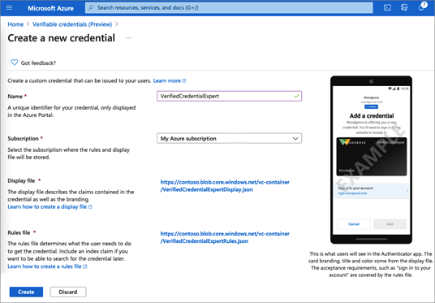

1. On the Create a new credential screen, select **Create**.

## Gather credentials and environment details to set up your sample application

Now that you have a new credential, you are going to gather some information about your environment and the credential that you created. You use these pieces of information when you set up your sample application.

1. From the verifiable credentials, select **Credentials**, then from the list of credentials, select the VerifiedCredentialExpert you created earlier.

    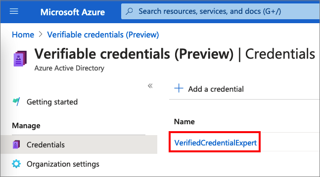

1. Copy the **Issue credential URL**. This URL is the combination of the rules and display files. It's the URL that Authenticator evaluates before it displays to the user verifiable credential issuance requirements. Record it for later use.

1. Copy the **Decentralized Identifier** and record it for later.

1. Copy your **Tenant ID** and record it for later. The following screenshot demonstrates how to copy the required values:

    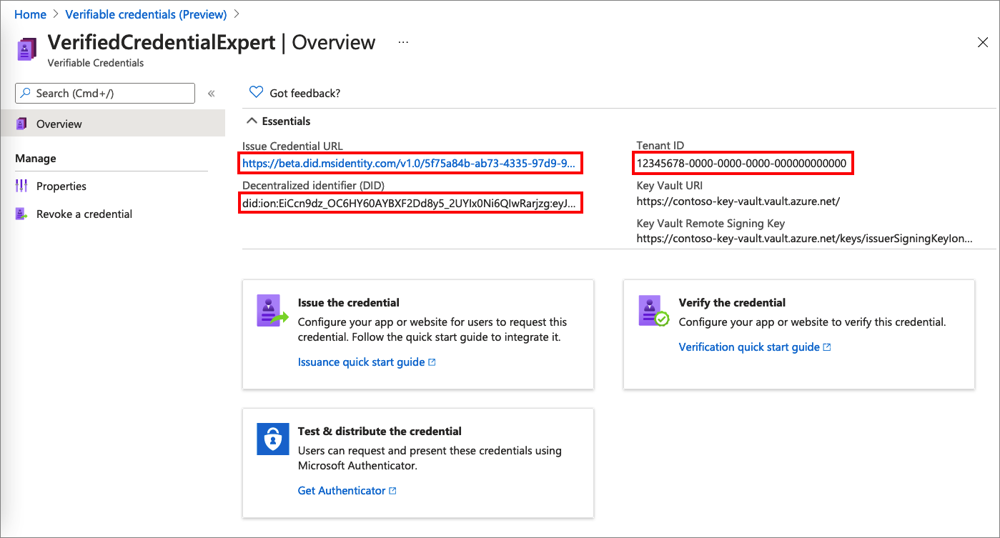

## Download the sample code

The sample application is available in .NET and the code is maintained in a GitHub repository. Download our sample code from GitHub [here](https://github.com/Azure-Samples/active-directory-verifiable-credentials-dotnet), or clone the repository to your local machine:


```bash
git clone git@github.com:Azure-Samples/active-directory-verifiable-credentials-dotnet.git
```

## Configure the verifiable credentials app

Create a client secret for the registered application you created. The sample application uses the client secret to prove its identity when it requests tokens.

1. Navigate to the **App registrations** page that is located inside **Azure Active Directory**

1. Select the **verifiable-credentials-app** application you created earlier.

1. Select the name to go into the App registrations details

1. Copy the **Application (client) ID** and store it for later.  

     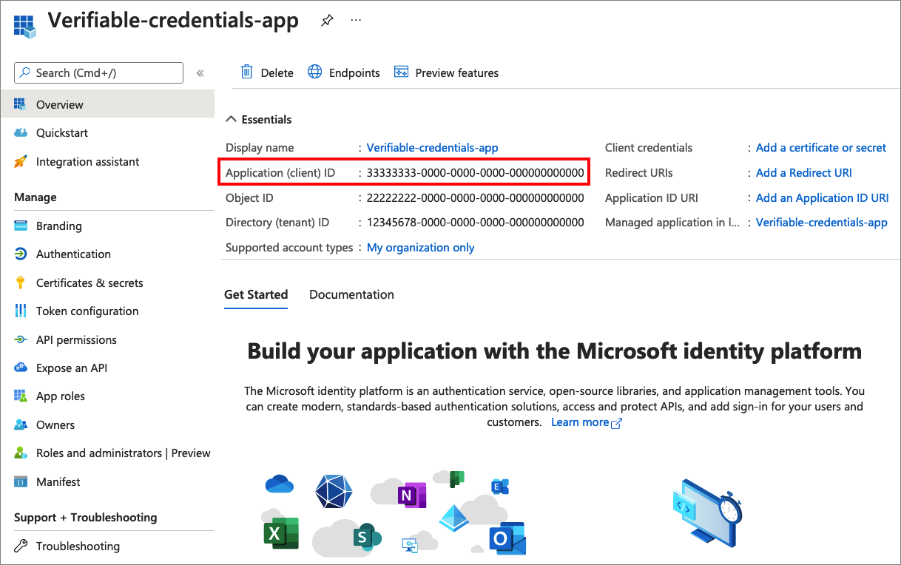

1. While in the App registration details, from the main menu, under **Manage**, select **Certificates & secrets.**

1. Select **New client secret**

    1. In the **Description** box, enter a description for the client secret (for example, **vc-sample-secret**).

    1. Under **Expires**, select a duration for which the secret is valid, for example 6 month, and then select **Add**.

    1. Record the secret's **Value**. You'll use this value for configuration in a later step. The secret’s value will not be displayed again, and is not retrievable by any other means, record it as soon as it is visible.

At this point, you should have all the required information that you need to set up your sample application.

## Update the Sample Application

Now you'll make modifications to the sample app's issuer code to update it with your verifiable credential URL. This step allows you to issue verifiable credentials by using your own tenant.

1. Under the *active-directory-verifiable-credentials-dotnet-main* folder, open Visual Studio Code and select the project inside **1.asp-net-core-api-idtokenhint** folder.

1. Under the project root folder, open the appsettings.json file. This file contains information about your Azure AD verifiable credentials. Update the following properties with the information that you have previously recorded during in the steps above

    1. **Tenant ID:** your tenant ID
    1. **Client ID:** your Client ID
    1. **Client Secret**: your client secret
    1. **IssuerAuthority**: Your Decentralized Identifier
    1. **VerifierAuthority**: Your Decentralized Identifier
    1. **Credential Manifest**: Your Issue Credential URL

1. Save the *appsettings.json* file.

The following JSON demonstrates a complete appsettings.json file

```json
{
  "AppSettings": {
    "Endpoint": "https://beta.did.msidentity.com/v1.0/{0}/verifiablecredentials/request",
    "VCServiceScope": "bbb94529-53a3-4be5-a069-7eaf2712b826/.default",
    "Instance": "https://login.microsoftonline.com/{0}",

    "TenantId": "12345678-0000-0000-0000-000000000000",
    "ClientId": "33333333-0000-0000-0000-000000000000",
    "ClientSecret": "123456789012345678901234567890",
    "CertificateName": "[Or instead of client secret: Enter here the name of a certificate (from the user cert store) as registered with your application]",
    "IssuerAuthority": "did:ion:EiCcn9dz_OC6HY60AYBXF2Dd8y5_2UYIx0Ni6QIwRarjzg:eyJkZWx0YSI6eyJwYXRjaGVzIjpbeyJhY3Rpb24iOiJyZXBsYWNlIiwiZG9jdW1lbnQiOnsicHVibGljS2V5cyI6W3siaWQiOiJzaWdfN2U4MmYzNjUiLCJwdWJsaWNLZXlKd2siOnsiY3J2Ijoic2VjcDI1NmsxIiwia3R5IjoiRUMiLCJ4IjoiaUo0REljV09aWVA...",
    "VerifierAuthority": " did:ion:EiCcn9dz_OC6HY60AYBXF2Dd8y5_2UYIx0Ni6QIwRarjzg:eyJkZWx0YSI6eyJwYXRjaGVzIjpbeyJhY3Rpb24iOiJyZXBsYWNlIiwiZG9jdW1lbnQiOnsicHVibGljS2V5cyI6W3siaWQiOiJzaWdfN2U4MmYzNjUiLCJwdWJsaWNLZXlKd2siOnsiY3J2Ijoic2VjcDI1NmsxIiwia3R5IjoiRUMiLCJ4IjoiaUo0REljV09aWVA...",
    "CredentialManifest":  "https://beta.did.msidentity.com/v1.0/12345678-0000-0000-0000-000000000000/verifiableCredential/contracts/VerifiedCredentialExpert"
  }
}
```

## Issuing your first Verified Expert Card

Now you are ready to issue your first Verified Expert Card by running the sample application.

1. From Visual Studio Code, run the Verifiable_credentials_DotNet project. Or from the command shell, run the following commands:

    ```bash
    cd active-directory-verifiable-credentials-dotnet/1. asp-net-core-api-idtokenhint  dotnet build "asp-net-core-api-idtokenhint.csproj" -c Debug -o .\\bin\\Debug\\netcoreapp3.  dotnet run
    ```

1. In another terminal, run the following command. This command runs the [ngrok](https://ngrok.com/) to set up a URL on 3000 and make it publicly available on the internet.

    ```bash
    ngrok http 3000
    ```

    >[!NOTE]
    > On some computers you may need to run the command in this format `./ngrok http 3000`

1. Open the HTTPS URL generated by ngrok.

     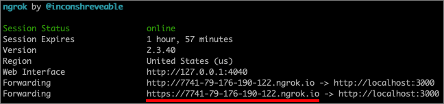

1. From a web browser, select **Get Credential**.

     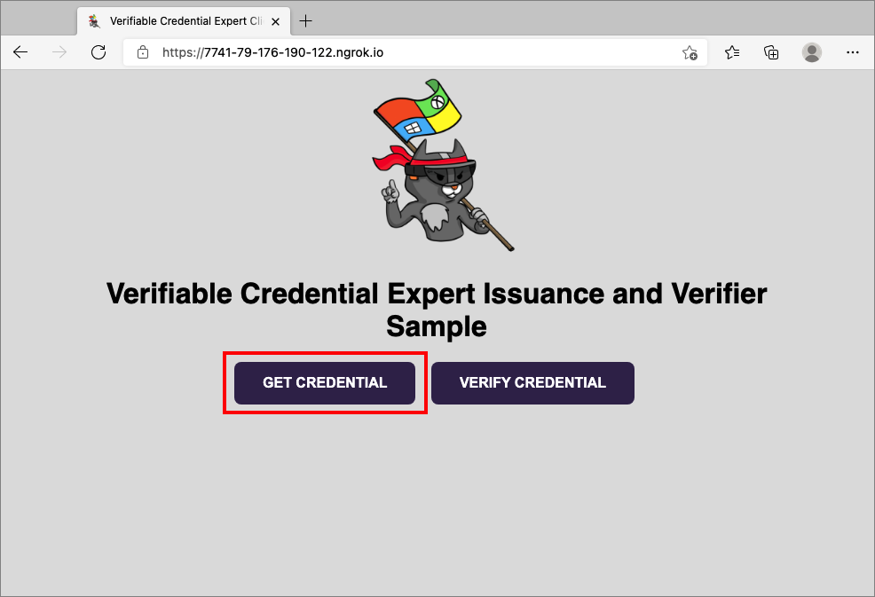

1. Using your mobile device, scan the QR code with the Authenticator app. You can also scan the QR code directly from your camera, which will open the Authenticator app for you.

    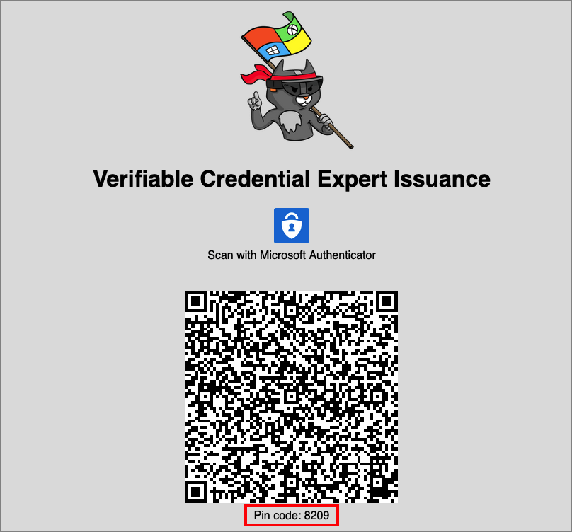

1. At this time, you will see a warning message about this app or website may be risky, select **Advanced**.

     

1. At the risky website warning, select **Proceed anyways (unsafe)**. You are seeing this warning because your domain is not linked to your DID. To verify your domain, follow the guidance in [Link your domain to your Decentralized Identifier (DID)](how-to-dnsbind.md) article. For this tutorial, you can skip the domain registration, and select **Proceed anyways (unsafe).**

     

1. You will be prompted to enter a PIN code that is displayed in the screen where you scanned the QR code. The PIN is use add an extra layer of protection to the issuance payload. The PIN code is randomly generated every time an issuance QR code is displayed.

     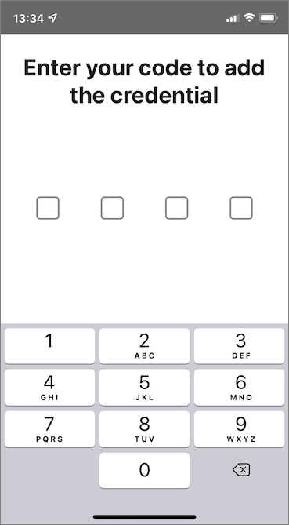

1. After entering the PIN number, the **Add a credential** screen is displayed. Notice at the top of the screen, you can see a red **Not verified** message. This warning is related to the domain validation mentioned above.

1. Select **Add** to accept your new verifiable credential.

    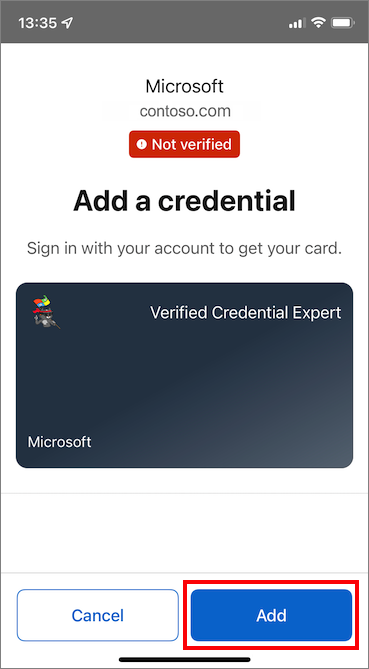

1. Congratulations! You now have a verified credential expert verifiable credential.

    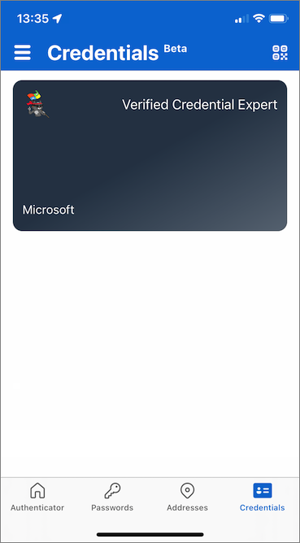

Go back to the sample app. It shows you that a credential successfully issued.

  

## Verifying the Verified Expert Card

Now you are ready to verify your Verified Expert Card by running the sample application again.

1. Hit the back button in your browser to return to the sample app home page.

1. Select **Verify credentials**.  

   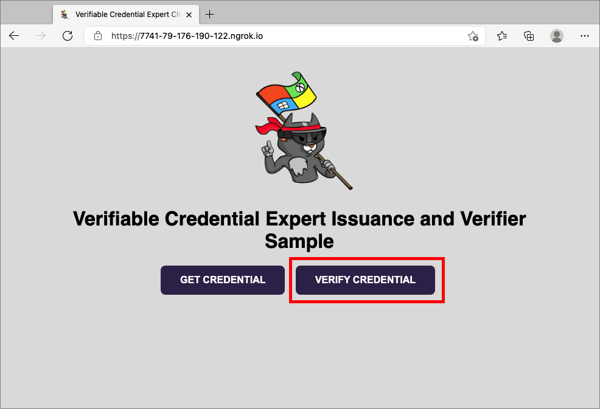

1. Using the authenticator app, scan the QR code, or scan it directly from your mobile camera.

1. When you see the warning message about this app or website may be risky, select **Advanced**. Then select **Proceed anyways (unsafe)**.

1. Approve the presentation request by selecting **Allow**.

    

1. After you approve the presentation request, you can see that the request has been approved. You can also check the log. To see the log, select the verifiable credential:  

    

1. Then select **Recent history**.  

    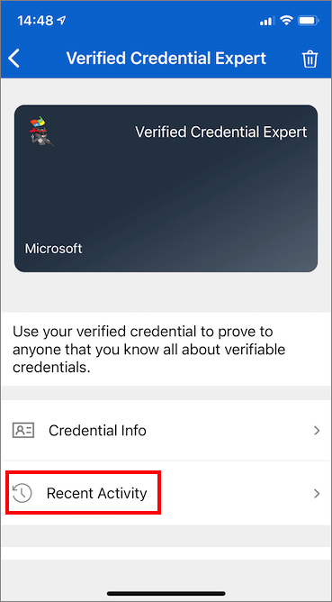

1. The **Recent Activity** shows you the recent activities of your verifiable credential.

    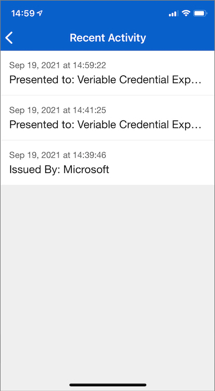

1. Got back to the sample app. It shows you that the presentation of the verifiable credentials received.  
    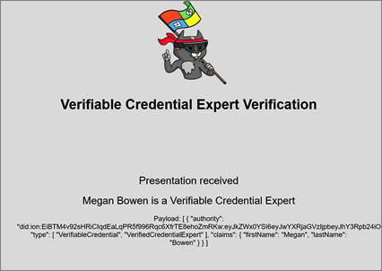

## Verifiable Credential names 

Your verifiable credential contains **Megan Bowen** for the first name and last name values in the credential. These values were hardcoded in the sample application and were added to the verifiable credential at the time of issuance in the payload. 

Under real case scenarios, your application will pull the user details from an identity provider. The following code snippet shows where the name is set in the sample application. In a follow-up example, we will show you how to inject the values directly from your identity provider into the verifiable credential.

```csharp
//file: IssuerController.cs
[HttpGet("/api/issuer/issuance-request")]
public async Task<ActionResult> issuanceRequest()
  {
    ...

    // Here you could change the payload manifest and change the first name and last name.
    payload["issuance"]["claims"]["given_name"] = "Megan";
    payload["issuance"]["claims"]["family_name"] = "Bowen";
    ...
}
  ```

## Next steps

In this article, you learned how to:

> [!div class="checklist"]
> * Configure your Azure AD verifiable credentials service
> * Issue and verify credentials using the same Azure AD tenant

In the [next step](verifiable-credentials-configure-verifier.md) you learn how third parties application, also known as relying party application can verify your credentials with their own Azure AD tenant verifiable credentials API service.
