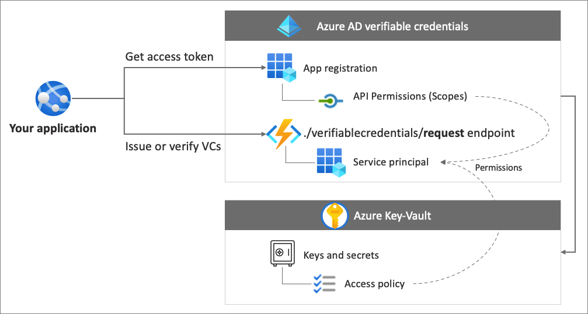
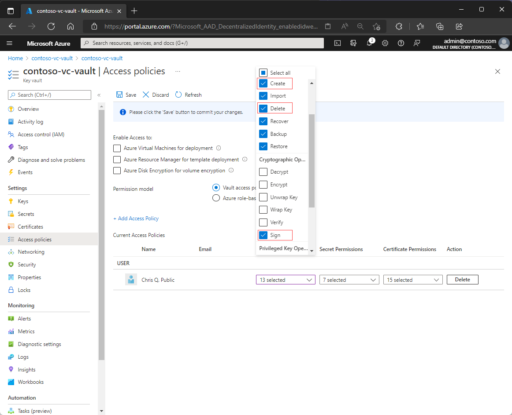
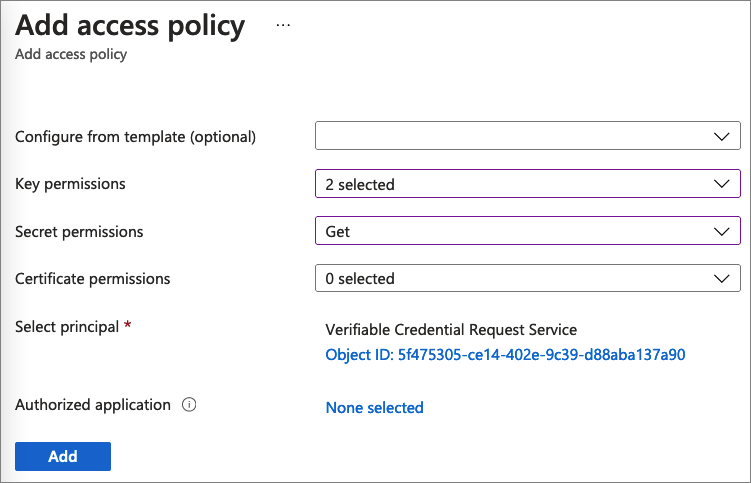
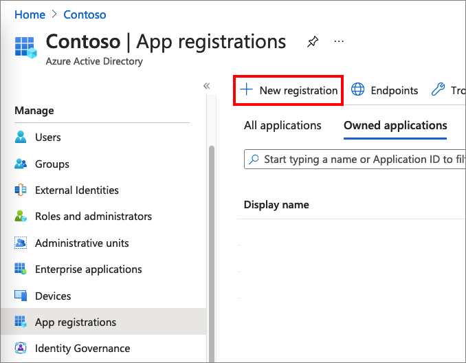
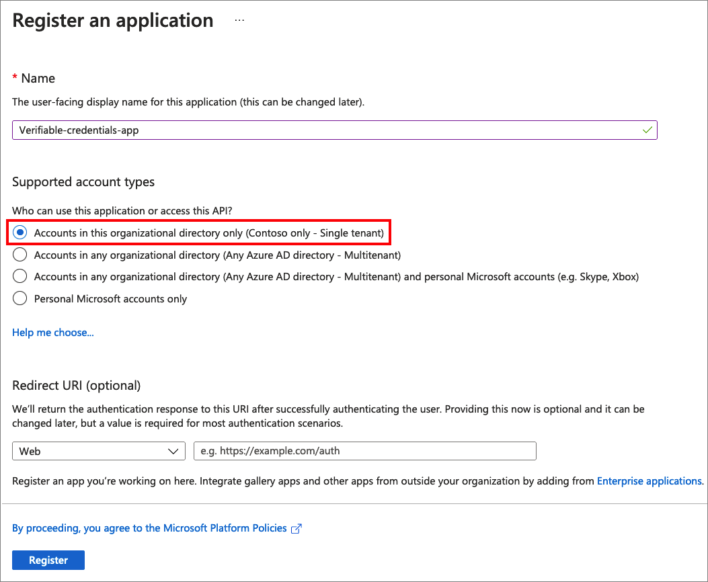
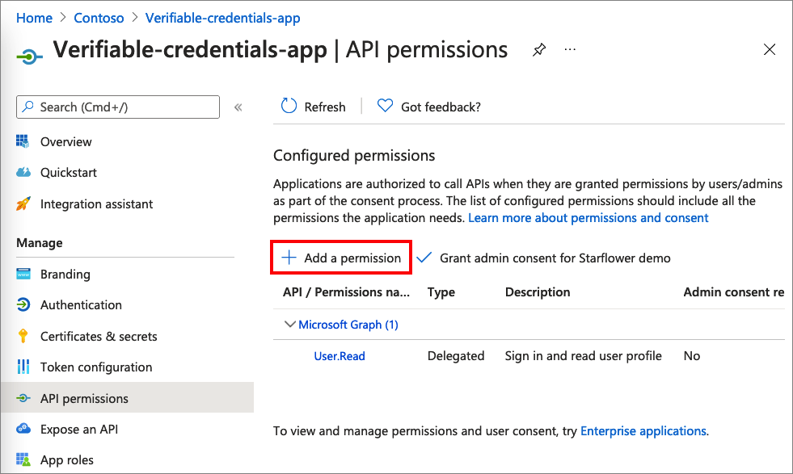
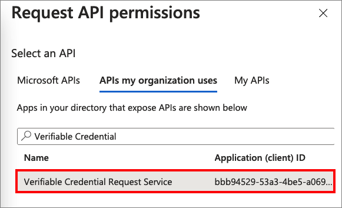
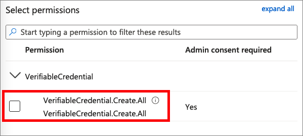
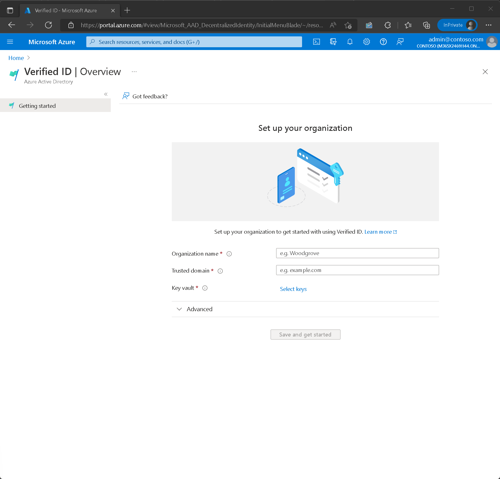

# Configure your tenant for Azure AD Verifiable Credentials (preview)

Azure Active Directory (Azure AD) Verifiable Credentials service allows you to issue and verify credentials. To be able to issue, verify credentials (or both), follow the guidance in this tutorial.

In this tutorial, we go over the steps needed to configure your Azure AD tenant so it can use Azure AD Verifiable Credentials.

In this article, you learn how to:

> [!div class="checklist"]
>
> - Setup a Service Principal
> - Create an Azure Key Vault
> - Register an application in Azure AD
> - Setup Verifiable Credentials Preview Service

The following diagram illustrates the Azure AD verifiable credentials architecture and the component you configure.



## Prerequisites

- If you don't have Azure subscription, create [one for free](https://azure.microsoft.comfree/?WT.mc_id=A261C142F).
- Sign up for [Azure Active Directory Premium editions](../../active-directory/fundamentals/active-directory-get-started-premium.md)
subscription in your tenant.
- The [Global Administrator](../../active-directory/roles/permissions-reference.md#global-administrator) permission for the directory you want to configure.
- Have [PowerShell](/powershell/scripting/install/installing-powershell) 7.0.6 LTS-x64, PowerShell 7.1.3-x64, or higher installed.

## Step 1. Set up a Service Principal

Create a Service Principal for the Request Service API. The service API is the Microsoft service that you use to issue or verify Azure AD Verifiable Credentials.

To create the service principle:

1. Run the following PowerShell commands. These commands install the AzureAD Module (if not already installed), and import the [AzureAD module](/powershell/azure/install-az-ps#installation). If you run into any issues installing the module, see the [Install the Azure Az PowerShell module](/powershell/azure/install-az-ps#installation) article.

    ```powershell
    if ((Get-Module -ListAvailable -Name "AzureAD") -eq $null) {  Install-Module "AzureAD" -Scope CurrentUser }  Import-Module AzureAD
    ```

1. Run the following PowerShell command to connect to your Azure AD tenant. Replace the \<*your-tenant-ID*> with your [Azure AD tenant ID](../../active-directory/fundamentals/active-directory-how-to-find-tenant.md).

    ```powershell
    Connect-AzureAD -TenantId <your-tenant-ID>
    ```

1. Run the following command in the same PowerShell session. The AppId "bbb94529-53a3-4be5-a069-7eaf2712b826" refers to the Verifiable Credentials Microsoft service.

    ```powershell
    New-AzureADServicePrincipal -AppId "bbb94529-53a3-4be5-a069-7eaf2712b826" -DisplayName "Verifiable Credential Request Service" 
    ```

## Step 2. Create a Key Vault

[Azure Key Vault](/azure/key-vault/general/basic-concepts) is a cloud service that enables the secure storage and access of secrets and keys. Your Verifiable
Credentials service stores public and private keys in Azure Key Vault. These keys are used to sign and verify credentials.

If you don't have an instance of Azure Key Vault, follow these steps to create a key vault using the Azure portal.

>[!NOTE]
>By default, the account that creates the key vault is the only one with access. The verifiable credential service needs access to the key vault. The key vault must be configured with an access policy that allows the account used during configuration to **create keys**, **delete keys** if you opt out, and permission to **Sign** to create the domain binding for the verifiable credential service. If you use the same account while testing, modify the default policy to grant the account **Sign** permission, in addition to the default permissions granted to vault creators.

### Step 2.1 Set Access Policies for the Key Vault

After onboarding the Azure Verifiable Credentials service, the service generates a set of keys used to provide message security. These keys are stored in key vault. Whether you issue or verify a key set is still used for signing, updating, and recovering verifiable credentials.

A Key Vault [access policy](/azure/key-vault/general/assign-access-policy) defines whether a given security principal, can perform operations on Key Vault secrets, and keys. Set access policies in your Azure Key Vault for both the administrator account of the Azure AD Verifiable Credentials service, and for the Request Service API principal you created.

1. In the [Azure portal](https://portal.azure.com/), navigate to the **Key Vault** you use for this tutorial.

1. Under **Settings**, select **Access policies**.

1. In the **Add access policies** page, under **USER** select the account you use to follow this tutorial.

1. For the **Key permissions**, verify that the following permissions are selected. **Create, Delete**, and **Sign**. By default, Create and Delete are already enabled. Sign should be the only key permission you need to update.
    
    The following screenshot shows how to configure the admin access policy.

    

1. To save the changes, select **Save**.

1. Select **+ Add Access Policy** to add permission to the service principal of the Verifiable Credential Request Service.

1. In the **Add access policy** page

    1. For the **Key permissions**, select **Get** and **Sign** .

    1. For the **Secret permissions**, select **Get**.

    1. For the **Select principal**, select the **Verifiable Credential Request Service**.

    1. Select **Add**.  
        
       The following screenshot demonstrates how to add an access policy for the verifiable Credential Request Service. 
    
       

1. Select **Save** to save the new policy you created.

## Step 3. Register an application in Azure AD

Azure AD Verifiable Credentials request service needs to be able to get access tokens for issuance and verifier. To get access tokens, register a web application and grant API permission for the API Verifiable Credential Request Service that you set up in the previous step.

1. Sign in to the [Azure portal](https://portal.azure.com/) with your administrative account.

1. If you have access to multiple tenants, select the **Directory + subscription** :::image type="icon" source="media/verifiable-credentials-configure-tenant/portal-directory-subscription-filter.png" border="false"::: icon. Then, search for and select your **Azure Active Directory**.

1. Under **Manage**, select **App registrations**, then select **New registration**.  

   

1. Enter a display **Name** for your application. For example, **verifiable-credentials-app**.

1. For the **Supported account types**, select **Accounts in this organizational directory only (Default Directory only - Single tenant)**.

1. Select **Register** to create the application.
  
   The following screenshot shows how to register the application.

   

### 3.1 Grant permissions to get access tokens

In this step, you grant permissions to the Verifiable Credential Request Service principal created in [step 1](#step-1-set-up-a-service-principal).

To add the required permissions, follow these steps:

1. Stay in the **verifiable-credentials-app** application details page. Select **API permissions**, and then select **Add a permission**.
    
    

1. Select **APIs my organization uses**.

1. Search for the service principle that you created earlier **Verifiable Credential Request Service**, and select it.
    
    

1. Choose **Application Permission** and expand **VerifiableCredential.Create.All**.

    

1. Select **Add permissions**.

1. Select **Grant admin consent for \<your tenant name\>.**

## Step 4. Set up Verifiable Credentials Preview service

Azure AD Verifiable Credentials service safeguards your organization with a seamless decentralized identity solution. For issuers, Azure AD provides a service that they can customize and use to issue their own verifiable credentials. For verifiers, the Verifiable credential services provide a free to use REST API service that makes it easy to request and accept verifiable credentials in your apps and services.

To set up your Azure AD verifiable credentials, follow these steps:

1. In the [Azure portal](https://portal.azure.com/), search for **verifiable credentials**. Then, select **Verifiable Credentials (Preview)**.

1. From the left menu, select **Getting started**.

1. Set up your organization by providing the following information:

    1. **Organization name**: Enter a name to reference your business within Verifiable Credentials. This value isn't customer facing.

    1. **Domain**: Enter a domain that's added to a service endpoint in your DID document. The domain is what binds your DID to something tangible that the user might know about your business. Microsoft Authenticator and other digital wallets use this information to validate that your DID is linked to your domain. If the wallet can verify the DID, it displays a verified symbol. If the wallet is unable to verify the DID, it informs the user that the credential was issued by an organization it couldn't validate.   
            
        >[!IMPORTANT]
        > The domain can't be a redirect. Otherwise, the DID and domain can't be linked. Make sure to use HTTPS for the domain e.g. <https://contoso.com>.

    1. **Key vault**: Enter the name of the key vault that you created earlier.

1. Select **Save and create credential**.  
    
    The following screenshot shows how to set up the verifiable credentials:  
    
    

## Next steps

- [Learn how to issue Azure AD Verifiable credentials from a web application](verifiable-credentials-configure-issuer.md).
- [Learn how to verify Azure AD Verifiable credentials](verifiable-credentials-configure-verifier.md).
