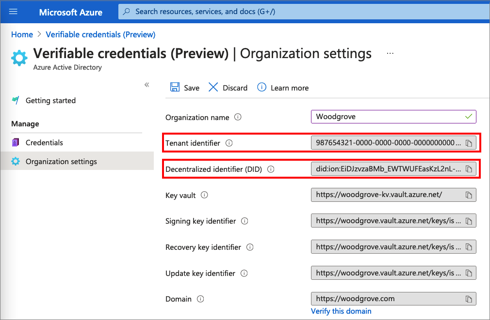
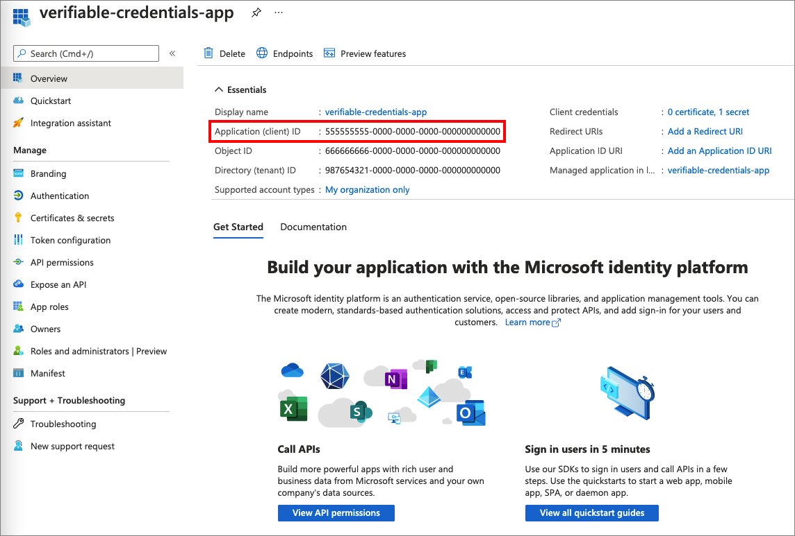
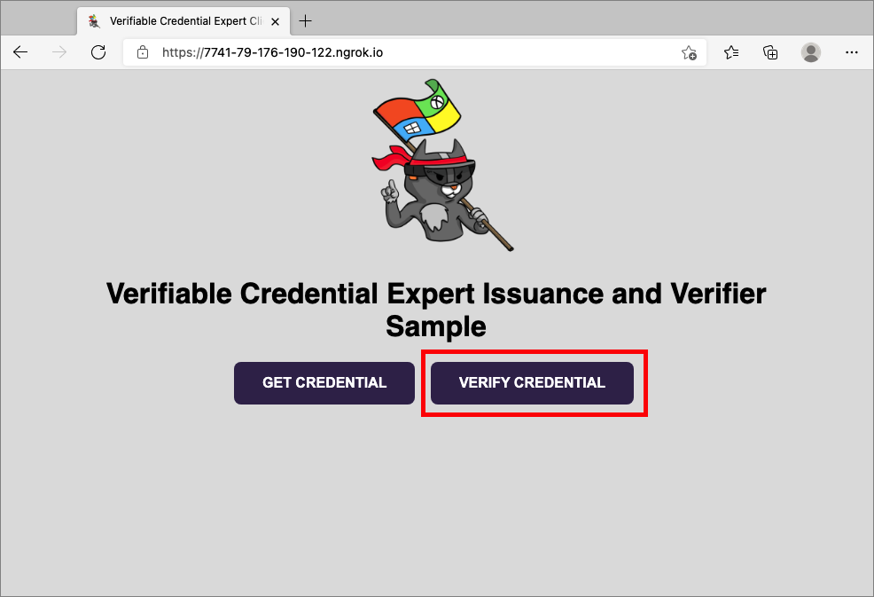
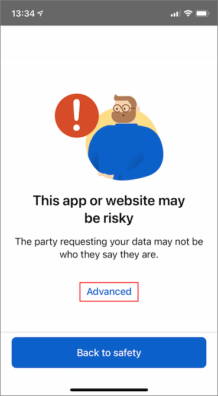
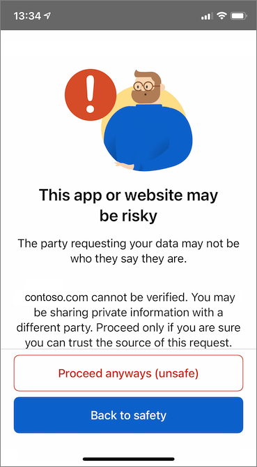
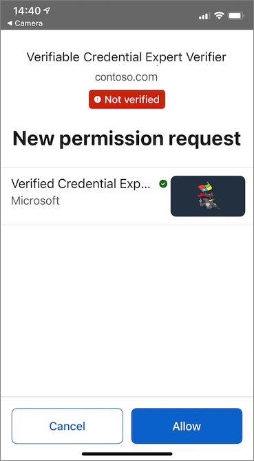
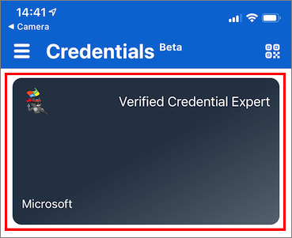

# Configure Azure AD Verifiable credentials verifier (preview)

In the [previous tutorial](verifiable-credentials-configure-issuer.md), you learn how to issue and verify credentials using the same Azure Active Directory (Azure AD) tenant. In this tutorial, you go over the steps needed to present and verify your first verifiable credential: a Verified Credential expert card.

As a verifier, you unlock privileges to subjects that possess Verified Credential Expert cards. In this tutorial, you run a sample application from your local machine that asks you to present a Verified Credential Expert Card, and then verifies it.

In this article, you learn how to:

> [!div class="checklist"]
>
> - Download the sample application code to your local machine
> - Setup Azure AD Verifiable Credentials on your Azure AD tenant
> - Gather credentials and environment details to setup your sample application and update the sample application with your Verified Credentials Expert Card details
> - Run the sample application and initiate a verifiable credential issuance process

## Prerequisites

- Before you start, it's important to [Setup a tenant for Azure AD Verifiable credentials](verifiable-credentials-configure-tenant.md)
- You need [GIT](https://git-scm.com/downloads) installed If you want to clone the repository that hosts the sample app,
- [Visual Studio Code](https://code.visualstudio.com/Download) or similar code editor
- [.NET 5.0](https://dotnet.microsoft.com/download/dotnet/5.0)
- [NGROK](https://ngrok.com/) free.
- A mobile device with Microsoft Authenticator
  - Android version 6.2108.5654 or higher installed.
  - iOS version 6.5.82 or higher installed.

## Gather tenant details to set up your sample application

Now that you set up your Azure AD verifiable credentials service, you are going to gather some information about your environment and the verifiable credentials you set. You use these pieces of information when you set up your sample application.

1. From the verifiable credentials, select **Organization settings**.
1. Copy the **Tenant identifier** and record it for later.
1. Copy the **Decentralized Identifier** and record it for later.

The following screenshot demonstrates how to copy the required values:



## Download the sample code

The sample application is available in .NET and the code is maintained in a GitHub repository. Download our sample code from the [GitHub repo](https://github.com/Azure-Samples/active-directory-verifiable-credentials-dotnet), or clone the repository to your local machine:

```bash
git clone git@github.com:Azure-Samples/active-directory-verifiable-credentials-dotnet.git 
```

## Configure the verifiable credentials app

Create a client secret for the registered application you created. The sample application uses the client secret to prove its identity when it requests tokens.

1. Navigate to the **App registrations** page that is located inside **Azure Active Directory**

1. Select the *verifiable-credentials-app* application you created earlier.

1. Select the name to go into the **App registrations details**

1. Copy the **Application (client) ID** and store it for later. 

    

1. While in the App registration details, from the main menu, under **Manage**, select **Certificates & secrets**.

1. Select **New client secret**

    1. In the **Description** box, enter a description for the client secret (for example, vc-sample-secret).

    1. Under **Expires**, select a duration for which the secret is valid, for example 6 month, and then select **Add**.

    1. Record the secret's **Value**. You'll use this value for configuration in a later step. The secret’s value will not be displayed again, and is not retrievable by any other means, record it as soon as it is visible.

At this point, you should have all the required information that you need to set up your sample application.

## Update the Sample Application

Now you'll make modifications to the sample app's issuer code to update it with your verifiable credential URL. This step allows you to issue verifiable credentials by using your own tenant.

1. In the *active-directory-verifiable-credentials-dotnet-main* directory, open Visual Studio Code and select the project inside the *1. asp-net-core-api-idtokenhint* directory.

1. Under the project root folder, open the appsettings.json file. This file contains information about your Azure AD verifiable credentials. Update the following properties with the information that you have previously recorded during in the steps above

    1. **Tenant ID**: your tenant ID
    1. **Client ID**: your Client ID
    1. **Client Secret**: your client secret
    1. **VerifierAuthority**: Your Decentralized Identifier
    1. **CredentialManifest**: Your Issue Credential URL

1. Save the *appsettings.json* file.

The following JSON demonstrates a complete appsettings.json file:

```json
{

 "AppSettings": {
   "Endpoint": "https://beta.did.msidentity.com/v1.0/{0}/verifiablecredentials/request",
   "VCServiceScope": "bbb94529-53a3-4be5-a069-7eaf2712b826/.default",
   "Instance": "https://login.microsoftonline.com/{0}",
   "TenantId": "987654321-0000-0000-0000-000000000000",
   "ClientId": "555555555-0000-0000-0000-000000000000",
   "ClientSecret": "123456789012345678901234567890",
   "VerifierAuthority": "did:ion:EiDJzvzaBMb_EWTWUFEasKzL2nL-BJPhQTzYWjA_rRz3hQ:eyJkZWx0YSI6eyJwYXRjaGVzIjpbeyJhY3Rpb24iOiJyZXBsYWNlIiwiZG9jdW1lbnQiOnsicHVibGljS2V5cyI6W3siaWQiOiJzaWdfMmNhMzY2YmUiLCJwdWJsaWNLZXlKd2siOnsiY3J2Ijoic2VjcDI1NmsxIiwia3R5IjoiRUMiLCJ4IjoiZDhqYmduRkRGRElzR1ZBTWx5aDR1b2RwOGV4Q2dpV3dWUGhqM0N...",
   "CredentialManifest": " https://beta.did.msidentity.com/v1.0/987654321-0000-0000-0000-000000000000/verifiableCredential/contracts/VerifiedCredentialExpert"
 }
}
```

## Run and test the sample app

Now you are ready to present and verify your first Verified Expert Card by running the sample application.

1. From Visual Studio Code, run the Verifiable_credentials_DotNet project. Or from the command shell, run the following commands:

    ```bash
    cd active-directory-verifiable-credentials-dotnet/1. asp-net-core-api-idtokenhint  dotnet build "asp-net-core-api-idtokenhint.csproj" -c Debug -o .\bin\Debug\netcoreapp3.1  
    dotnet run
    ```

1. In another terminal, run the following command. This command runs the [ngrok](https://ngrok.com/) to set up a URL on 3000 and make it publicly available on the internet.

    ```bash
    ngrok http 3000 
    ```
    
    >[!NOTE]
    > On some computers you may need to run the command in this format `./ngrok http 3000`

1. Open the HTTPS URL generated by ngrok.

    

1. From the web browser, select **Verify Credential**.

    

1. Using the Authenticator app, scan the QR code, or scan it directly from your mobile camera.

1. At the **This app or website may be risky** warning message, select **Advanced**. You are seeing this warning because your domain is not verified. To verify your domain, follow the guidance in Link your domain to your Decentralized Identifier (DID) article. For this tutorial, you can skip the domain registration.  

    
    

1. At the risky website warning, select **Proceed anyways (unsafe)**.  
 
    

1. Approve the request by selecting **Allow**.

    

1. After you approve the request, you can see that the request has been approved. You can also check the log. To see the log, select the verifiable credential:

    

1. Then select **Recent Activity**.  

    

1. The **Recent Activity** shows you the recent activities of your verifiable credential.

    

1. Go back to the sample app. It shows you that the presentation of the verifiable credentials received.

    

## Next steps

Learn [how to customize your verifiable credentials](credential-design.md)
