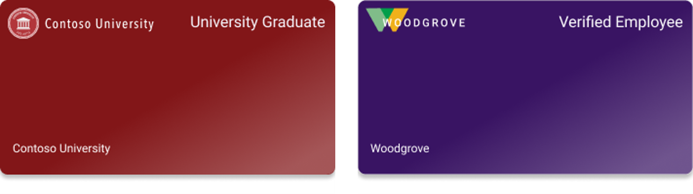
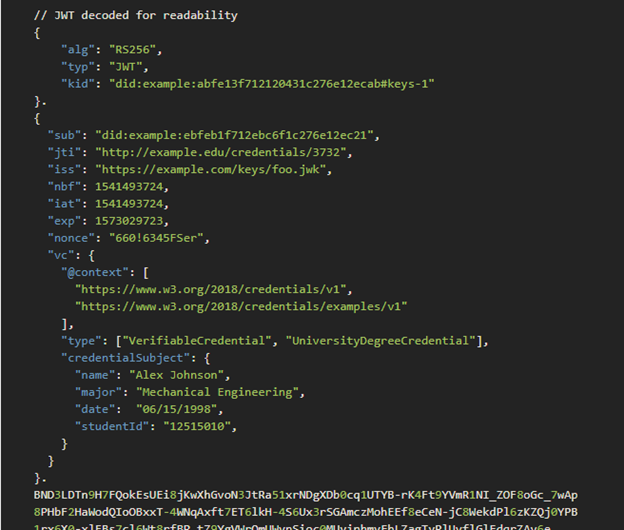
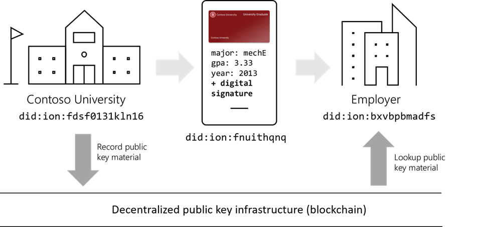

# What is Azure Verifiable Credentials?

Welcome to the developer documentation for Verifiable Credentials at Microsoft. Verifiable credentials are a new way to exchange verified information about people, organizations, and more. Verifiable credentials put people in control of their personal information, enabling more trustworthy digital experiences while respecting people's privacy.  Verifiable Credentials allow you to validate information about people, organizations, and things. 

> [!VIDEO https://youtu.be/embed/Whc9Im-U0Wg]
> [!VIDEO https://youtu.be/embed/r20hCF9NbTo]

What are Verifiable Credentials?

This article introduces Verifiable Credentials and gives an overview of the technical components involved in Verifiable Credentials exchanges.

## Issuers, subjects, and verifiers

Verifiable Credentials allow you to validate information about people, organizations, and things. We will introduce Verifiable Credentials using an example where a student's digital diploma is used to apply for a job.

Every Verifiable Credential is created by an **issuer**. An issuer is the organization or entity that asserts information about a **subject** to which a credential is issued. In our example, the University is the issuer who issues a credential to the student, the subject.

Verifiable Credentials contain attributes about the subjects to which they are issued. The student's field of study, year of graduation, and grade point average are examples of simple attributes that might be included. When a subject receives their Verifiable Credentials, they become the **holder** for that credential which they store in their wallet - a mobile application on the student's device.

When the student applies for a job, the employer requests access to view the student's digital diploma. The employer is the verifier who will verify the information contained in the diploma before offering the student a job.

## Verifiable Credentials

Verifiable Credentials are based on an open standard developed in the W3C known as [Verifiable Credentials](https://www.w3.org/TR/vc-data-model/). A Verifiable Credential that is represented as a JSON Web Token (JWT) has an expected structure:

This standard makes it easy for credentials to be "portable" across organizational boundaries. A credential issued by a university can be verified by any employer, bank, or any other organization that accepts the Verifiable Credential standard. Similarly, an employer can accept diplomas from any university that issues credentials according to the standard. The Verifiable Credential standard facilitates an open ecosystem of credentials that can be easily verified by any interested party.

## Digital signatures and decentralized identifiers

To protect their security and integrity, Verifiable Credentials are digitally signed by the issuer. When a verifier receives a Verifiable Credential, they are able to verify the signature of the credential to ensure it has been issued by the real issuer and that it hasn't been tampered with. The verifier therefore requires access to the issuer's public keys.

The public key infrastructure required to verify Verifiable Credentials is provided by another W3C standard known as [decentralized identifiers](https://w3c.github.io/did-core/).

Each issuer, subject, and verifier creates a unique identifier, and associates a set of public keys to their identifier. The issuer's public keys are made publicly available, so that any verifier can validate Verifiable Credentials produced by the issuer.

## Next Steps

- One
- Two

