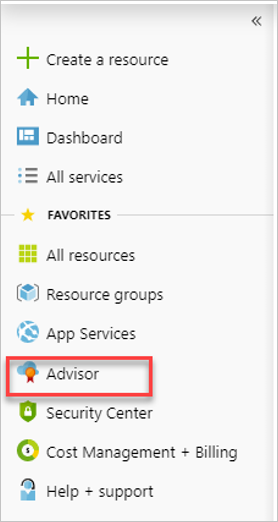
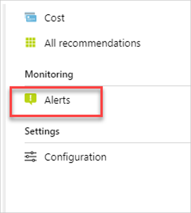
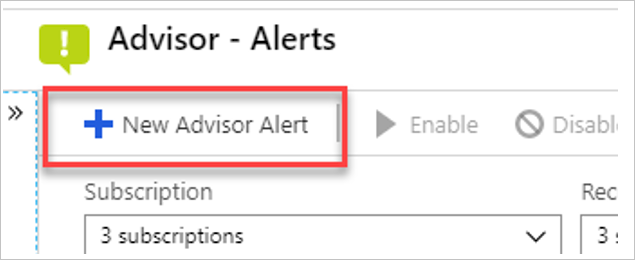
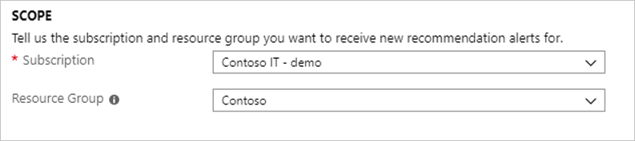
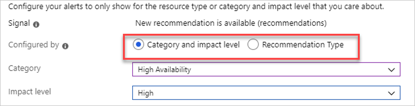
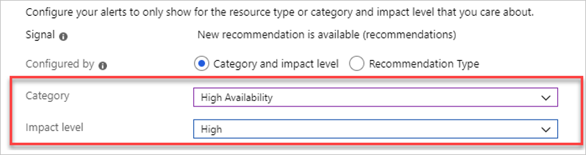
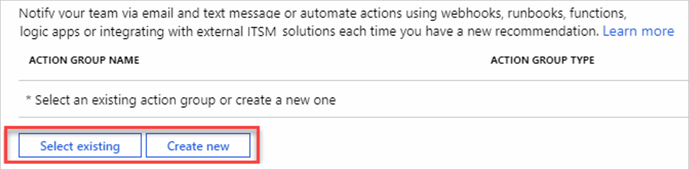
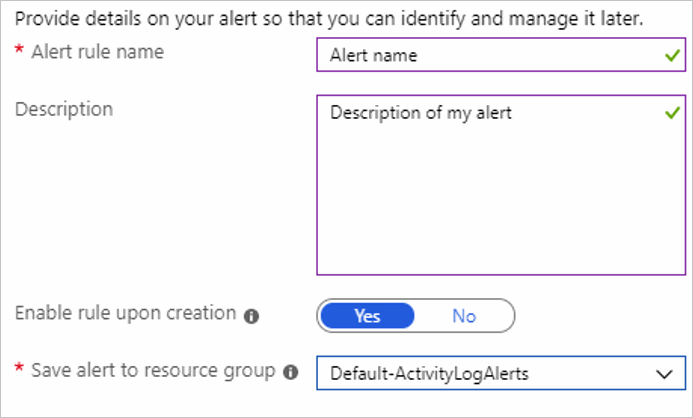

# Create Azure Advisor alerts on new recommendations using the Azure portal 

This article shows you how to set up an alert for new recommendations from Azure Advisor using the Azure portal. 

Whenever Azure Advisor detects a new recommendation for one of your resources, an event is stored in [Azure Activity log](https://docs.microsoft.com/azure/azure-monitor/platform/activity-logs-overview). You can set up alerts for these events from Azure Advisor using a recommendation-specific alerts creation experience. You can select a subscription and optionally a resource group to specify the resources that you want to receive alerts on. 

You can also determine the types of recommendations by using these properties:

* Category
* Impact level
* Recommendation type

You can also configure the action that will take place when an alert is triggered by:  

* Selecting an existing action group
* Creating a new action group

To learn more about action groups, see [Create and manage action groups](../azure-monitor/platform/action-groups.md).

> [!NOTE] 
> Advisor alerts are currently only available for High Availability, Performance, and Cost recommendations. Security recommendations are not supported. 

## Create alert rule
1. In the **portal**, select **Azure Advisor**.

    

2. In the **Monitoring** section of the left menu, select **Alerts**. 

    

3. Select **New Advisor Alert**.

    

4. In the **Scope** section, select the subscription and optionally the resource group that you want to be alerted on. 

    

5. In the **Condition** section, select the method you want to use for configuring your alert. If you want to alert for all recommendations for a certain category and/or impact level, select **Category and impact level**. If you want to alert for all recommendations of a certain type, select **Recommendation type**.

    

6. Depending on the Configure by option that you select, you will be able to specify the criteria. If you want all recommendations, just leave the remaining fields blank. 

    

7. In the **action groups** section, select **Add existing** to use an action group you already created or select **Create new** to set up a new [action group](https://docs.microsoft.com/azure/azure-monitor/platform/action-groups). 

    

8. In the Alert details section, give your alert a name and short description. If you want your alert to be enabled, leave **Enable rule upon creation** selection set to **Yes**. Then select the resource group to save your alert to. This will not impact the targeting scope of the recommendation. 

    


## Configure recommendation alerts to use a webhook
This section shows you how to configure Azure Advisor alerts to send recommendation data through webhooks to your existing systems. 

You can set up alerts to be notified when you have a new Advisor recommendation on one of your resources. These alerts can notify you through email or text message, but they can also be used to integrate with your existing systems through a webhook. 


### Using the Advisor recommendation alert payload
If you want to integrate Advisor alerts into your own systems using a webhook, you will need to parse the JSON payload that is sent from the notification. 

When you set up your action group for this alert, you select if you would like to use the common alert schema. If you select the common alert schema, your payload will look like: 

```json
{  
   "schemaId":"azureMonitorCommonAlertSchema",
   "data":{  
      "essentials":{  
         "alertId":"/subscriptions/<subid>/providers/Microsoft.AlertsManagement/alerts/<alerted>",
         "alertRule":"Webhhook-test",
         "severity":"Sev4",
         "signalType":"Activity Log",
         "monitorCondition":"Fired",
         "monitoringService":"Activity Log - Recommendation",
         "alertTargetIDs":[  
            "/subscriptions/<subid>/resourcegroups/<resource group name>/providers/microsoft.dbformariadb/servers/<resource name>"
         ],
         "originAlertId":"001d8b40-5d41-4310-afd7-d65c9d4428ed",
         "firedDateTime":"2019-07-17T23:00:57.3858656Z",
         "description":"A new recommendation is available.",
         "essentialsVersion":"1.0",
         "alertContextVersion":"1.0"
      },
      "alertContext":{  
         "channels":"Operation",
         "claims":"{\"http://schemas.xmlsoap.org/ws/2005/05/identity/claims/emailaddress\":\"Microsoft.Advisor\"}",
         "caller":"Microsoft.Advisor",
         "correlationId":"8554b847-2a72-48ef-9776-600aca3c3aab",
         "eventSource":"Recommendation",
         "eventTimestamp":"2019-07-17T22:28:54.1566942+00:00",
         "httpRequest":"{\"clientIpAddress\":\"0.0.0.0\"}",
         "eventDataId":"001d8b40-5d41-4310-afd7-d65c9d4428ed",
         "level":"Informational",
         "operationName":"Microsoft.Advisor/recommendations/available/action",
         "properties":{  
            "recommendationSchemaVersion":"1.0",
            "recommendationCategory":"Performance",
            "recommendationImpact":"Medium",
            "recommendationName":"Increase the MariaDB server vCores",
            "recommendationResourceLink":"https://portal.azure.com/#blade/Microsoft_Azure_Expert/RecommendationListBlade/source/ActivityLog/recommendationTypeId/a5f888e3-8cf4-4491-b2ba-b120e14eb7ce/resourceId/%2Fsubscriptions%<subscription id>%2FresourceGroups%2<resource group name>%2Fproviders%2FMicrosoft.DBforMariaDB%2Fservers%2F<resource name>",
            "recommendationType":"a5f888e3-8cf4-4491-b2ba-b120e14eb7ce"
         },
         "status":"Active",
         "subStatus":"",
         "submissionTimestamp":"2019-07-17T22:28:54.1566942+00:00"
      }
   }
}
  ```

If you do not use the common schema, your payload looks like the following: 

```json
{  
   "schemaId":"Microsoft.Insights/activityLogs",
   "data":{  
      "status":"Activated",
      "context":{  
         "activityLog":{  
            "channels":"Operation",
            "claims":"{\"http://schemas.xmlsoap.org/ws/2005/05/identity/claims/emailaddress\":\"Microsoft.Advisor\"}",
            "caller":"Microsoft.Advisor",
            "correlationId":"3ea7320f-c002-4062-adb8-96d3bd92a5f4",
            "description":"A new recommendation is available.",
            "eventSource":"Recommendation",
            "eventTimestamp":"2019-07-17T20:36:39.3966926+00:00",
            "httpRequest":"{\"clientIpAddress\":\"0.0.0.0\"}",
            "eventDataId":"a12b8e59-0b1d-4003-bfdc-3d8152922e59",
            "level":"Informational",
            "operationName":"Microsoft.Advisor/recommendations/available/action",
            "properties":{  
               "recommendationSchemaVersion":"1.0",
               "recommendationCategory":"Performance",
               "recommendationImpact":"Medium",
               "recommendationName":"Increase the MariaDB server vCores",
               "recommendationResourceLink":"https://portal.azure.com/#blade/Microsoft_Azure_Expert/RecommendationListBlade/source/ActivityLog/recommendationTypeId/a5f888e3-8cf4-4491-b2ba-b120e14eb7ce/resourceId/%2Fsubscriptions%2F<subscription id>%2FresourceGroups%2F<resource group name>%2Fproviders%2FMicrosoft.DBforMariaDB%2Fservers%2F<resource name>",
               "recommendationType":"a5f888e3-8cf4-4491-b2ba-b120e14eb7ce"
            },
            "resourceId":"/subscriptions/<subscription id>/resourcegroups/<resource group name>/providers/microsoft.dbformariadb/servers/<resource name>",
            "resourceGroupName":"<resource group name>",
            "resourceProviderName":"MICROSOFT.DBFORMARIADB",
            "status":"Active",
            "subStatus":"",
            "subscriptionId":"<subscription id>",
            "submissionTimestamp":"2019-07-17T20:36:39.3966926+00:00",
            "resourceType":"MICROSOFT.DBFORMARIADB/SERVERS"
         }
      },
      "properties":{  
 
      }
   }
}
```

In either schema, you can identify Advisor recommendation events by looking for **eventSource** is `Recommendation` and **operationName**  is `Microsoft.Advisor/recommendations/available/action`.

Some of the other important fields that you may want to use are: 

* *alertTargetIDs* (in the common schema) or *resourceId* (legacy schema)
* *recommendationType*
* *recommendationName*
* *recommendationCategory*
* *recommendationImpact*
* *recommendationResourceLink*


## Manage your alerts 

From Azure Advisor, you can edit, delete, or disable and enable your recommendations alerts. 

1. In the **portal**, select **Azure Advisor**.

    

2. In the **Monitoring** section of the left menu, select **Alerts**.

    

3. To edit an alert, click on the Alert name to open the alert and edit the fields you want to edit.

4. To delete, enable, or disable an alert, click on the ellipse at the end of the row and then select the action you would like to take.
 

## Next steps
- Get an [overview of activity log alerts](../azure-monitor/platform/alerts-overview.md), and learn how to receive alerts.
- Learn more about [action groups](../azure-monitor/platform/action-groups.md).
