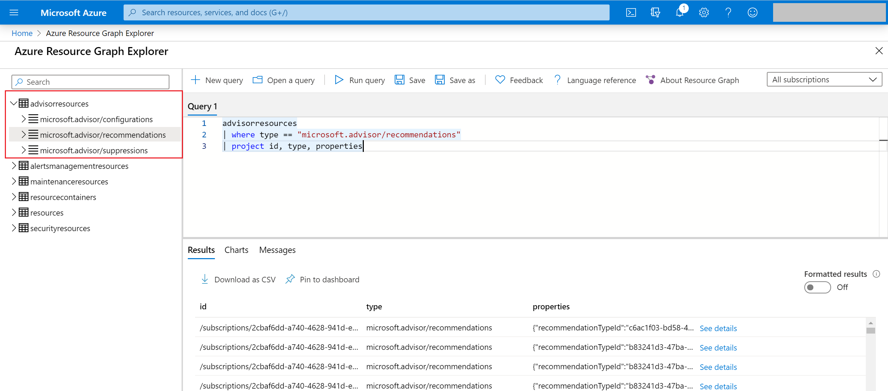

# Query for Advisor data in Resource Graph Explorer (Azure Resource Graph)

Advisor resources are now onboarded to [Azure Resource Graph](https://azure.microsoft.com/features/resource-graph/). This lays foundation to many at-scale customer scenarios for Advisor recommendations. Few scenarios that were not possible before to do at scale and now can be achieved using Resource Graph are:
* Gives capability to perform complex query for all your subscriptions in Azure portal
* Recommendations summarized by category types ( like high availability, performance)  and impact types (high, medium, low)
* All recommendations for a particular recommendation type
* Impacted resource count by recommendation category

  

## Advisor resource types in Azure Graph

Available Advisor resource types in [Resource Graph](https://docs.microsoft.com/azure/governance/resource-graph/):
There are 3 resource types available for querying under Advisor resources. Here is the list of the resources that are now available for querying in Resource Graph.
* Microsoft.Advisor/configurations
* Microsoft.Advisor/recommendations
* Microsoft.Advisor/suppressions

These resource types are listed under a new table named as AdvisorResources, which you can also query in the Resource Graph Explorer in Azure portal.

## Next steps

For more information about Advisor recommendations, see:
* [Introduction to Azure Advisor](advisor-overview.md)
* [Get started with Advisor](advisor-get-started.md)
* [Advisor Cost recommendations](advisor-cost-recommendations.md)
* [Advisor Performance recommendations](advisor-performance-recommendations.md)
* [Advisor Security recommendations](advisor-security-recommendations.md)
* [Advisor Operational Excellence recommendations](advisor-operational-excellence-recommendations.md)
* [Advisor REST API](https://docs.microsoft.com/rest/api/advisor/)
