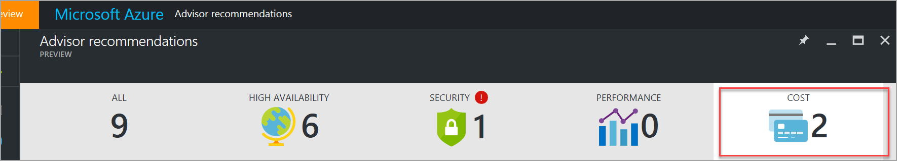
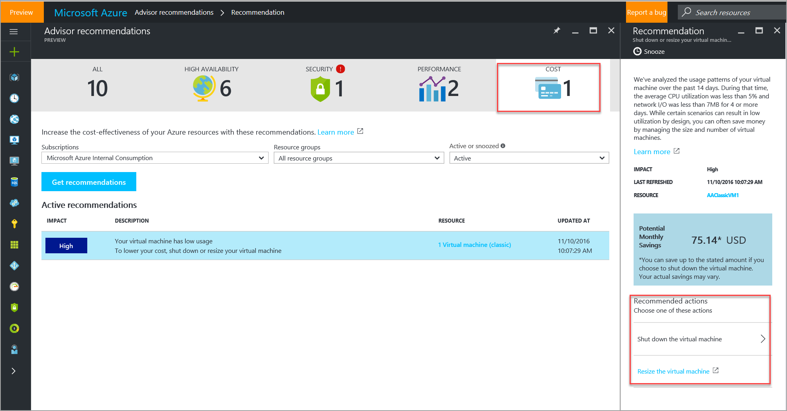
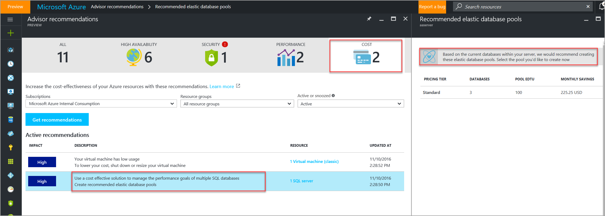

# Advisor Cost recommendations

Advisor helps you optimize and reduce your overall Azure spend by identifying idle and underutilized resources. You can get cost recommendations from the **Cost** tab on the Advisor dashboard.

## Optimize virtual machine spend by resizing underutilized instances 
Although certain application scenarios can result in low utilization by design, you can often save money by managing the size and number of your virtual machines. Advisor monitors your virtual machine usage for 14 days and then identifies low-utilization virtual machines. Virtual machines whose CPU utilization is 5 percent or less and network usage is 7 MB or less for four or more days are considered low-utilization virtual machines.

Advisor shows you the estimated cost of continuing to run your virtual machine, so that you can choose to shut it down or resize it.  

## Use a cost effective solution to manage performance goals of multiple SQL databases
Advisor identifies SQL server instances that can benefit from creating elastic database pools. Elastic database pools provide a simple, cost-effective solution to manage the performance goals of multiple databases that have varying usage patterns. For more information about Azure elastic pools, see [What is an Azure Elastic pool?](https://azure.microsoft.com/en-us/documentation/articles/sql-database-elastic-pool/).

## How to access cost recommendations in Azure Advisor

1. Sign in to the [Azure portal](https://portal.azure.com).

2. In the left pane, click **More services**.

3. In the service menu pane, under **Monitoring and Management**, click **Azure Advisor**.  
 The Advisor dashboard is displayed.

4. On the Advisor dashboard, click the **Cost** tab.

5. Select the subscription for which you want to receive recommendations, and then click **Get recommendations**.

> [!NOTE]
> To access Advisor recommendations, you must first *register your subscription* with Advisor. A subscription is registered when a *subscription Owner* launches the Advisor dashboard and clicks the **Get recommendations** button. This is a *one-time operation*. After the subscription is registered, you can access Advisor recommendations as *Owner*, *Contributor*, or *Reader* for a subscription, a resource group, or a specific resource.

## Next steps

To learn more about Advisor recommendations, see:
* [Introduction to Advisor](advisor-overview.md)
* [Get Started](advisor-get-started.md)
* [Advisor Performance recommendations](advisor-cost-recommendations.md)
* [Advisor High Availability recommendations](advisor-cost-recommendations.md)
* [Advisor Security recommendations](advisor-cost-recommendations.md)
