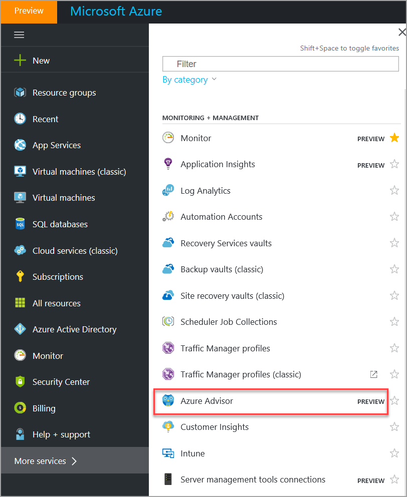
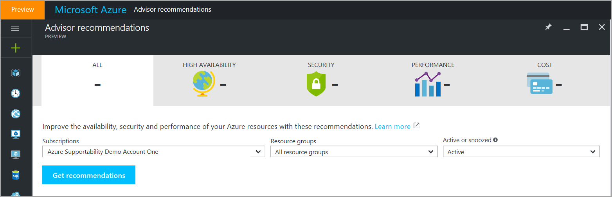
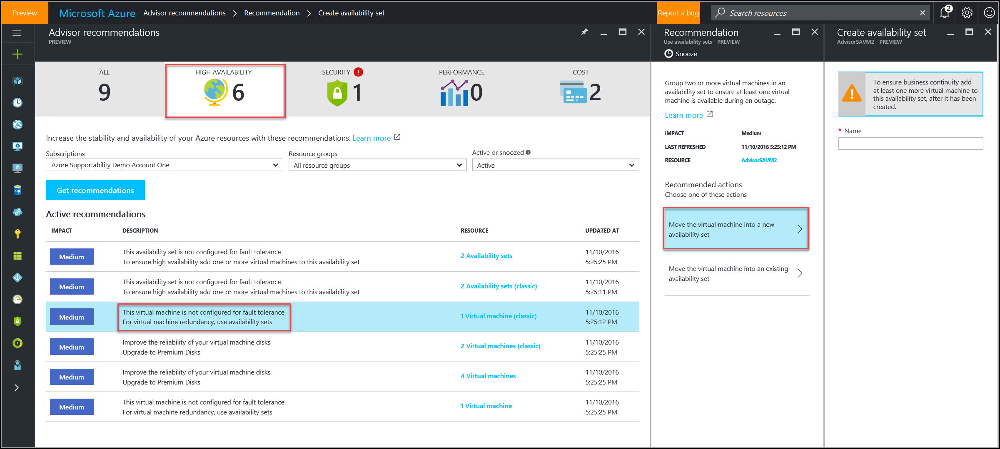
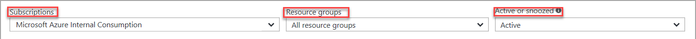
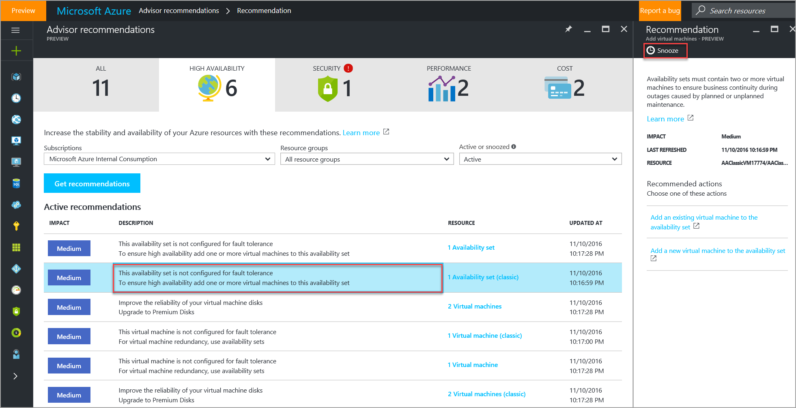

# Get Started with Azure Advisor

 This topic provides instructions to access Advisor using the Azure portal, get recommendation details, search for recommendations, and how to refresh recommendations.

## How to get Azure Advisor recommendations using the Azure portal

1. Sign in into the [Azure portal](https://portal.azure.com).
2. In the left-navigation pane, click **More services**, and then in the service menu pane, scroll down to **Monitoring and Management**, and then click **Azure Advisor**. This launches the Advisor dashboard. 
3. On the Advisor dashboard, select the subscription for which you’d like to receive recommendations.
   > [!NOTE]
   > The Advisor dashboard displays recommendations related to resources where you have been assigned the role of **Owner, Contributor, or Reader to the subscription** that the resource belongs to.  

4. To get Advisor recommendations, on the Advisor dashboard, do one of the following:
  1. To get recommendations for improvements in all categories of Azure resources, click the **All** tab, and then click **Get Recommendations**.    
  2. To get security recommendations for your Azure resources, click the **Security** tab, and then click **Get Recommendations**.
  3. To get high availability recommendations for your Azure resources, click the **High Availability** tab, and then click **Get Recommendations**.
  4. To get performance recommendations for your Azure resources, click the **Performance** tab, and then click **Get Recommendations**.
  5. To get recommendations to optimize the cost of your Azure resources, click the **Cost** tab, and then click **Get Recommendations**.
 
   

  

## How to get recommendation details

The **Recommendation** blade in Azure Advisor offers additional information about the Advisor recommendation. 

1. Sign into the Azure portal, and then launch Azure Advisor.
2. On the Advisor recommendations dashboard, click**Get Recommendation**.
3. From the list of recommendations, click a recommendation that you want to review in detail. This launches the recommendation details blade.
3. Review the information on the recommendation details blade, and learn about the actions that you can perform to take advantage of an opportunity or resolve an issue.
  
  

### How to search for recommendations

You can search for recommendations for a particular subscription, resource type, or resource status. You can also search for recommendations containing a specific phrase.

1. Sign into the Azure portal, and then launch Azure Advisor.
2. Search for recommendations by filtering for subscriptions, resource groups, and recommendation status (**Active** or **Snoozed**).
3. Click **Get recommendations** to get a list of Advisor recommendations based on your search filters.

### How to snooze recommendations

1. Sign into the Azure portal, and then launch Azure Advisor.
2. Click**Get Recommendation**, and then from the list of recommendations, click a recommendation.
3. On the **Recommendation** blade, click **Snooze**.

 

## Next Steps

See these resources to learn more about Azure Advisor:
-  [Introduction to Advisor](advisor-overview.md)
-  [Advisor FAQs](advisor-faqs.md)
-  [Advisor High Availability Recommendations](advisor-high-availability-recommendations.md)
-  [Advisor Security Recommendations](advisor-security-recommendations.md)
-  [Advisor Performance Recommendations](advisor-performance-recommendations.md)
-  [Advisor Cost Recommendations](advisor-performance-recommendations.md)
