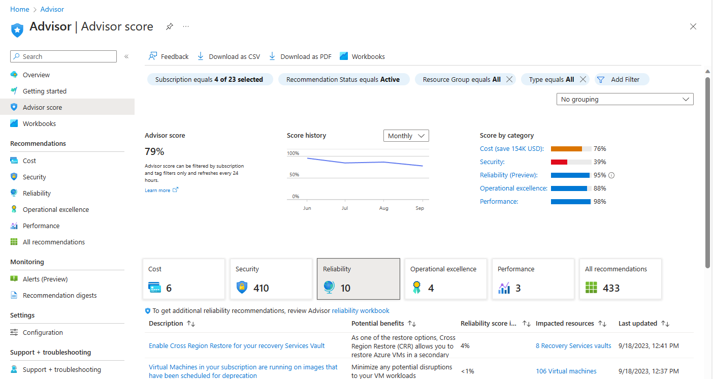
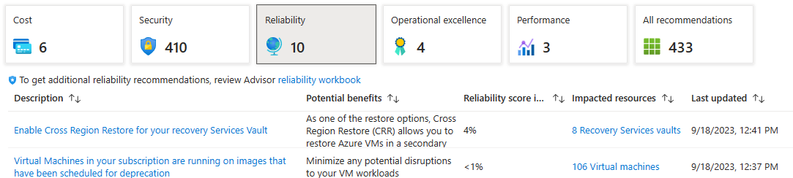
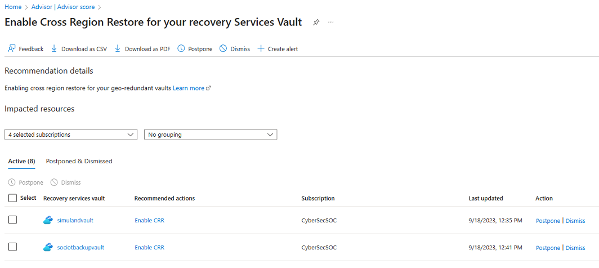
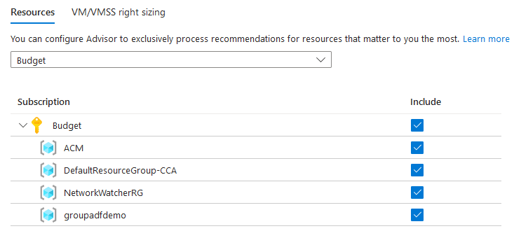

# Get started with Azure Advisor

Learn how to access Advisor through the Azure portal, configure Advisor settings, and get and manage recommendations.

> [!NOTE]
> Azure Advisor automatically runs in the background to find newly created resources. It can take up to 24 hours to provide recommendations on those resources.

## Get recommendations

To see your Advisor score for the selected subscriptions, sign in to the [Azure portal](https://portal.azure.com) and open [Advisor](https://aka.ms/azureadvisordashboard). The Advisor **Score** page opens by default. 

    

* Each tile represents a category of recommendations for the selected subscriptions.  

* To get recommendations for a specific category, click one of the tiles: **Cost**, **Security**, **Reliability**, **Operational Excellence**, or **Performance**. To view a list of all recommendations for all categories, click the **All recommendations** tile. By default, the **Cost** tile is selected.

* You can filter the display using the buttons at the top of the page:
   * **Subscription**: Choose **All** for Advisor recommendations on all subscriptions. Alternatively, select specific subscriptions. Apply changes by clicking outside of the button.
   * **Recommendation Status**: **Active** (recommendations that you have not postponed or dismissed, the default), **Postponed or Dismissed**. Apply changes by clicking outside of the button.
   * **Resource Group**: Choose **All** (the default) or specific resource groups. Apply changes by clicking outside of the button.
   * **Type**: Choose **All** (the default) or specific resources. Apply changes by clicking outside of the button.
   * **Commitments**: Applicable only to cost recommendations. Adjust your subscription **Cost** recommendations to reflect your committed **Term (years)** and chosen **Look-back period (days)**. Apply changes by clicking **Apply**.*
   * For more advanced filtering, click **Add filter**.

* The **Commitments** button lets you adjust your subscription **Cost** recommendations to reflect your committed **Term (years)** and chosen **Look-back period (days)**.

* To download your recommendations from the **Score** or any **Recommendations** page, click **Download as CSV** or **Download as PDF** on the action bar at the top. The download option respects any filters you have applied to Advisor.  If you select the download option while viewing a specific recommendation category or recommendation, the downloaded summary only includes information for that category or recommendation.

## Get recommendation details and solution options

View recommendation details – such as the recommended actions and impacted resources – and the solution options, including postponing or dismissing a recommendation.

1. To display a specific list of recommendations, click a category tile. The following screenshot shows the **Reliability** tile selected.

    

1. To review details of a recommendation, including the affected resources, click the **Description** link for it. The following screenshot shows a **Reliability** tile recommendation details page.

   
   
1. To take see action details, click a **Recommended actions** link. The Azure page where you can act opens. Alternatively, open a page to the affected resources to take the recommended action (the two pages may be the same). The recommendation may necessitate you learning more about the affected configuration; to do so, open the **Learn more** link on the recommended action page, or at the top of the recommendations details page.

1.   You can postpone the recommendation.

   

   You cannot dismiss the recommendation without certain privileges. For information on permissions, see [Advisor Cost recommendations](permissions.md).

## Manage subscriptions and Advisor rules

You can choose to include or exclude specific subscriptions for Advisor recommendations. You can also set Advisor compute rules.

> [!NOTE]
> To change subscriptions or Advisor compute rules, you must be a subscription Owner.  If you do not have the required permissions, the option is disabled in the user interface. For information on permissions, see [Advisor Cost recommendations](permissions.md).

### Resources (subscriptions)

1. From any Azure Advisor page, click **Configuration** in the left navigation pane. The Advisor **Configuration** page opens with the default **Resources** tab selected. 

    

1. Uncheck any subscriptions you do not want to receive Advisor recommendations for, click **Apply**. The page refreshes.

### VM/VMSS right sizing

You can adjust the average CPU utilization rule and the look back period on a per-subscription basis. Doing this requires specialized knowledge. 

Advisor monitors your virtual machine usage for 7 days by default, and then identifies low-utilization virtual machines (VMs). Virtual machines are considered low-utilization if their CPU utilization is 5% or less and their network utilization is less than 2%, or if the current workload can be accommodated by a smaller virtual machine size.

The CPU utilization rule can be set to 5%, 10%, 15%, 20%, or 100%(Default). In case the trigger is selected as 100%, it will present recommendations for virtual machines with less than 5%, 10%, 15%, and 20% of CPU utilization. You can also select how far back in historical data, the look back, you want to analyze: 7 days (default), 14, 21, 30, 60, or 90 days.

1. Select the subscriptions you’d like to adjust the average CPU utilization rule for, and then click **Edit**. Not all subscriptions can be edited for VM/VMSS right sizing.

1. Select the desired average CPU utilization value and click **Apply**. It can take up to 24 hours for the new settings to be reflected in recommendations.

   

## Next steps

To learn more about Advisor, see:

- [Introduction to Azure Advisor](advisor-overview.md)
- [Advisor Reliability recommendations](advisor-high-availability-recommendations.md)
- [Advisor Security recommendations](advisor-security-recommendations.md)
- [Advisor Performance recommendations](advisor-performance-recommendations.md)
- [Advisor Cost recommendations](advisor-cost-recommendations.md)
- [Advisor Operational Excellence recommendations](advisor-operational-excellence-recommendations.md)
