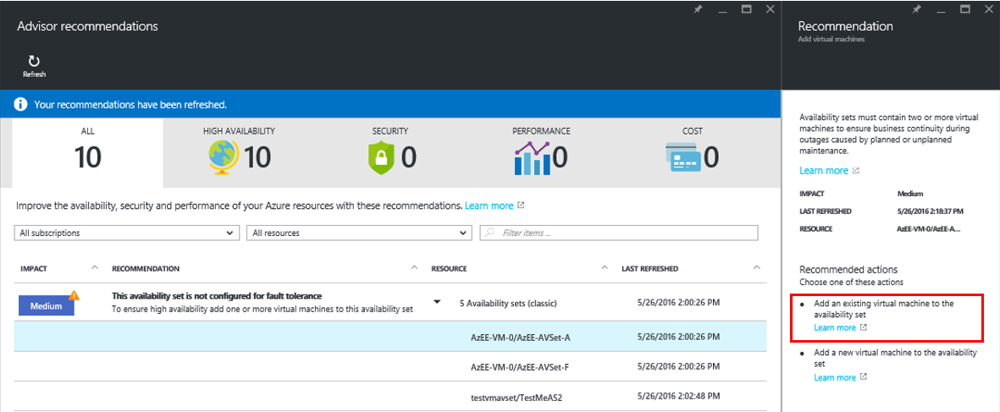
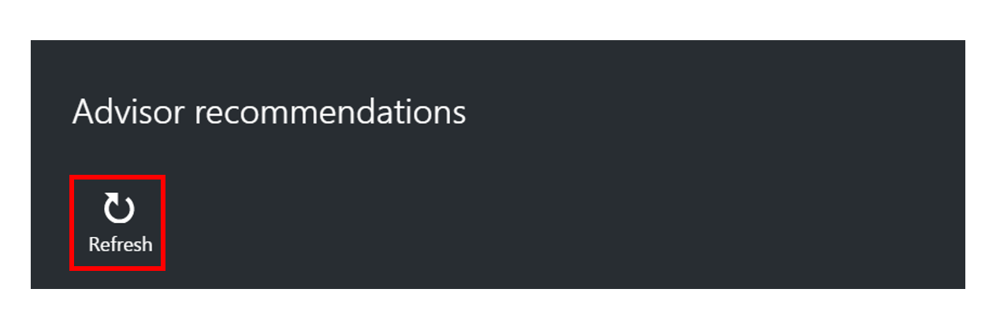
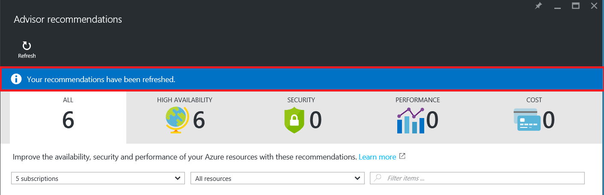

<properties
   pageTitle="Azure Advisor | Microsoft Azure"
   description="Get started with Azure Advisor."
   services="advisor"
   documentationCenter=""
   authors="kumudd"
   manager="carmonm"
   editor="" />
<tags
   ms.service="advisor"
   ms.devlang="na"
   ms.topic="article"
   ms.tgt_pltfrm="na"
   ms.workload="na"
   ms.date="11/16/2016"s
   ms.author="kumudd" />

# Get Started with Azure Advisor

 This topic provides instructions to access Advisor using the Azure portal, get recommendation details, search for recommendations, and how to refresh recommendations.

## How to access Azure Advisor

1. Sign in into the Azure portal <TBD:Add link>.
2. You can launch the advisor using one of the following methods:
  1. Click the Advisor icon as shown:
    <TBD: Add screenshot>
  2. Select **Browse**, and then type **Advisor** in the menu filter to launch the Advisor dashboard.
3. On the Advisor dashboard, select the subscription for which you’d like to receive recommendations.

> [AZURE.IMPORTANT]
> The Advisor dashboard will display recommendations related to resources where you have been assigned the role of Owner, Contributor, or Reader to the subscription that the resource belongs to.

## How to access Advisor recommendations using the Azure portal

To access Advisor recommendations, click [here ](https://portal.azure.com/?Microsoft_Azure_Expert=true#blade/Microsoft_Azure_Expert/AdvisorBlade). This launches the Advisor dashboard.

> [AZURE.IMPORTANT]
> If your subscription is not enabled to use > Advisor, an “Access denied” message or an HTTP 403 response occurs. Please [contact us](mailto:azexpsupport@microsoft.com) to resolve this issue.

## How to get recommendation details

You can click on a recommendation to learn more about it. This displays the recommendation blade.

The recommendation blade offers additional information about the business issue or opportunity, including a pointer to documentation describing relevant details. It also contains information about actions you can perform to take advantage of an opportunity or resolve an issue.

Advisor offers recommendations with ***inline actions*** or ***documentation links***. Clicking on an inline action will take you through a “guided user journey” to implement it. Clicking on a documentation link will point you to documentation descrbing how you can manually implement the action.

**A recommendation with an inline action**

**A recommendation with documentation links**

### How to search for recommendations

You can search for recommendations for a particular subscription, resource type, or resource. You can also search for recommendations containing a specific phrase.

### How to refresh recommendations

By default, Advisor will scan and analyze resources across all your subscriptions every 24 hours and “**generate**” or “**refresh**” recommendations. You can click on the Refresh link in the Advisor dashboard to execute this action sooner if you prefer.

> [AZURE.IMPORTANT]
> **RBAC permissions:** You can refresh recommendations for resources where you have been assigned the role of **Owner or Contributor to the subscription** that the resource belongs to.

Recommendation generation/refresh is a complex, resource intensive operation. It can take more than a few minutes to complete. The time taken varies based on the number of subscriptions you have access to, and the number of resources in each subscription. After you click the Refresh link, the Advisor dashboard displays a banner indicating recommendations are being refreshed. When the refresh operation is complete, the Advisor dashboard display a banner indicating the refresh operation has been completed. Recommendations can be refreshed every 10 minutes.

**Dashboard banner when recommendation generation/refresh is in progress**

**Dashboard banner when recommendation generation/refresh is complete**

## Get Advisor recommendations using REST APIs
This sections discusses how to get Advisor recommendations and recommendation details using REST APIs.
### Get Advisor recommendations using REST APIs

To access cached recommendations, submit a **GET** request to the following URL:

**https://management.azure.com/subscriptions/&lt;SubID&gt;/providers/Microsoft.Advisor/recommendations?api-version=2016-05-09-preview **

where **&lt;SubID&gt;** is the subscription ID

> [AZURE.NOTE]
> **RBAC permissions:** You can get recommendations for resources where you have been assigned the role of **Owner, Contributor, or Reader to the subscription** that the resource belongs to.

### Get Advisor recommendation details using REST APIs

To access details of a particular recommendation, submit a **GET** request to the following URL:

**https://management.azure.com/&lt;RecommendationID&gt;?api-version=2016-05-09-preview **

where **&lt;RecommendationID&gt;** is the full resource id of the recommendation returned from get recommendations call

> [AZURE.NOTE]
> **RBAC permissions:** You can get recommendations for resources where you have been assigned the role of **Owner, Contributor, or Reader to the subscription** that the resource belongs to.

## Related

-  [Introduction to Advisor](advisor-overview.md)
-  [Advisor FAQs](advisor-FAQs.md)
-  [Advisor High Availability Recommendations](advisor-high-availability-recommendations.md)
-  [Advisor Security Recommendations](advisor-security-recommendations.md)
-  [Advisor Performance Recommendations](advisor-performance-recommendations.md)
-  [Advisor Cost Recommendations](advisor-performance-recommendations.md)
