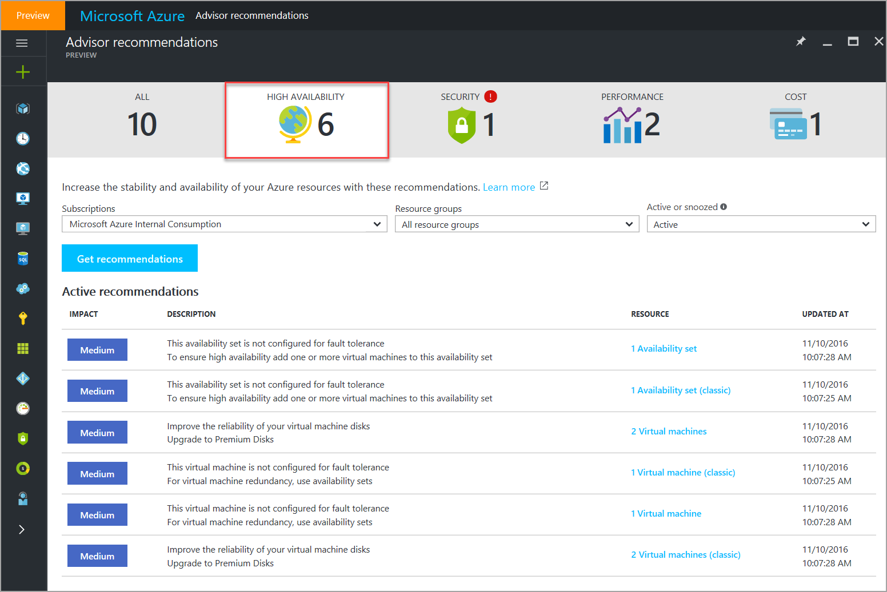
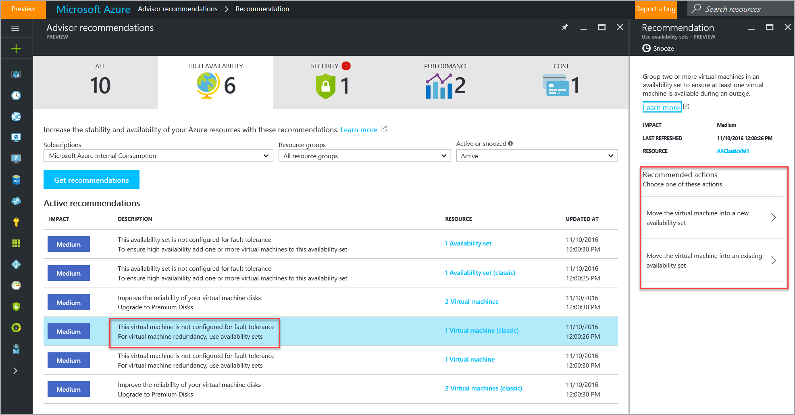
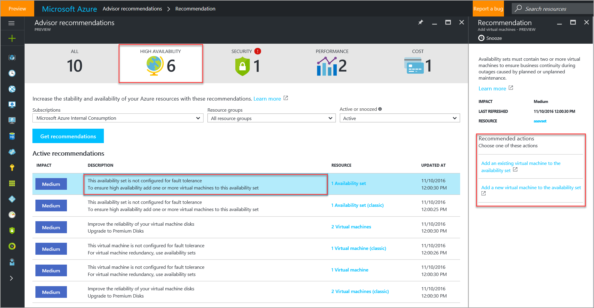
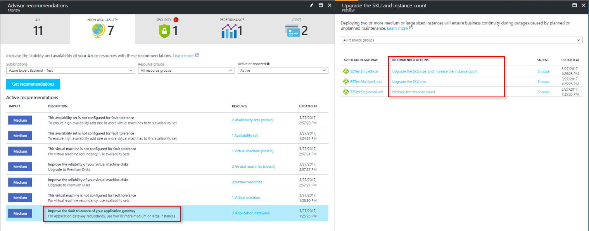
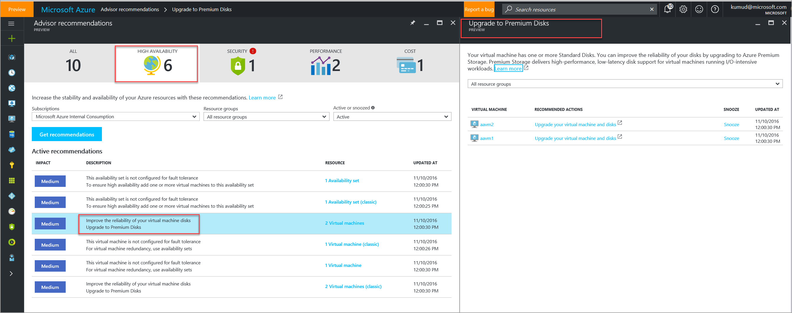
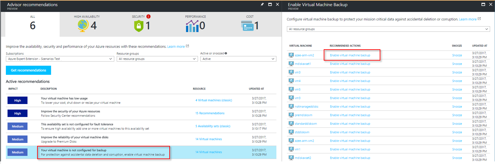

# Advisor High Availability recommendations

Azure Advisor helps you ensure and improve the continuity of your business-critical applications. You can get high availability recommendations by Advisor from the **High Availability** tab of the Advisor dashboard.

## Ensure virtual machine fault tolerance

Advisor identifies virtual machines that are not part of an availability set and recommends moving them into an availability set. To provide redundancy to your application, we recommend that you group two or more virtual machines in an availability set. This configuration ensures that during either a planned or unplanned maintenance event, at least one virtual machine is available and meets the Azure virtual machine SLA. You can choose either to create an availability set for the virtual machine or to add the virtual machine to an existing availability set.

> [!NOTE]
> If you choose to create an availability set, you must add at least one more virtual machine into it. We recommend that you group two or more virtual machines in an availability set to ensure that at least one machine is available during an outage.

## Ensure availability set fault tolerance 

Advisor identifies availability sets that contain a single virtual machine and recommends adding one or more virtual machines to it. To provide redundancy to your application, we recommend that you group two or more virtual machines in an availability set. This configuration ensures that during either a planned or unplanned maintenance event, at least one virtual machine is available and meets the Azure virtual machine SLA. You can choose either to create a virtual machine or to use an existing virtual machine, and to add it to the availability set.  

## Ensure application gateway fault tolerance
To ensure the business continuity of mission-critical applications that are powered by application gateways, Advisor identifies application gateway instances that are not configured for fault tolerance, and it suggests remediation actions that you can take. Advisor identifies medium or large single-instance application gateways, and it recommends adding at least one more instance. It also identifies single- or multi-instance small application gateways and recommends migrating to medium or large SKUs. Advisor recommends these actions to ensure that your application gateway instances are configured to satisfy the current SLA requirements for these resources.

## Improve the performance and reliability of virtual machine disks

Advisor identifies virtual machines with standard disks and recommends upgrading to premium disks.
 
Azure Premium Storage delivers high-performance, low-latency disk support for virtual machines that run I/O-intensive workloads. Virtual machine disks that use premium storage accounts store data on solid-state drives (SSDs). For the best performance for your application, we recommend that you migrate any virtual machine disks requiring high IOPS to premium storage. 

If your disks do not require high IOPS, you can limit costs by maintaining them in standard storage. Standard storage stores virtual machine disk data on hard disk drives (HDDs) instead of SSDs. You can choose to migrate your virtual machine disks to premium disks. Premium disks are supported on most virtual machine SKUs. However, in some cases, if you want to use premium disks, you might need to upgrade your virtual machine SKUs as well.

## Protect your virtual machine data from accidental deletion
Advisor identifies virtual machines where backup is not enabled, and it recommends enabling backup. Setting up virtual machine backup ensures the availability of your business-critical data and offers protection against accidental deletion or corruption.

## Access high availability recommendations in Advisor

1. Sign in to the [Azure portal](https://portal.azure.com).

2. In the left pane, click **More services**.

3. In the service menu pane, under **Monitoring and Management**, click **Azure Advisor**.  
 The Advisor dashboard is displayed.

4. On the Advisor dashboard, click the **High Availability** tab, and then select the subscription for which you want to receive recommendations.

> [!NOTE]
> To access Advisor recommendations, you must first *register your subscription* with Advisor. A subscription is registered when a *subscription Owner* launches the Advisor dashboard and clicks the **Get recommendations** button. This is a *one-time operation*. After the subscription is registered, you can access Advisor recommendations as *Owner*, *Contributor*, or *Reader* for a subscription, a resource group, or a specific resource.

## Next steps

For more information about Advisor recommendations, see:
* [Introduction to Azure Advisor](advisor-overview.md)
* [Get started with Advisor](advisor-get-started.md)
* [Advisor Cost recommendations](advisor-performance-recommendations.md)
* [Advisor Performance recommendations](advisor-performance-recommendations.md)
* [Advisor Security recommendations](advisor-security-recommendations.md)

