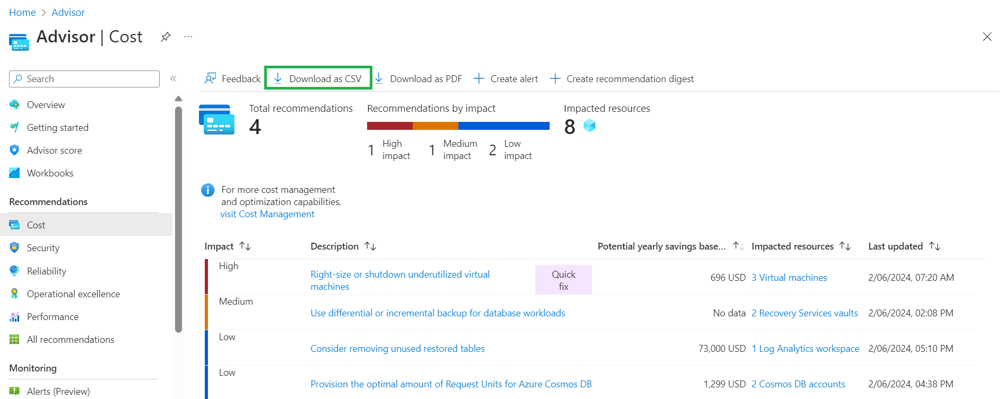

# Calculate cost savings

This article provides guidance on how to calculate total cost savings in Azure Advisor. 

## Export cost savings for recommendations

To calculate aggregated potential yearly savings, follow these steps: 

1. Sign in to the [**Azure portal**](https://portal.azure.com).

1. Search for and select [**Advisor**](https://aka.ms/azureadvisordashboard) from any page.\
The Advisor **Overview** page opens.

1. Export cost recommendations by navigating to the **Cost** tab on the left navigation menu and choosing **Download as CSV**.

1. Use the cost savings amount for each recommendation to calculate aggregated potential yearly savings.

    

> [!NOTE]
> Different types of cost savings recommendations are generated using overlapping datasets (for example, VM rightsizing/shutdown, VM reservations and savings plan recommendations all consider on-demand VM usage). As a result, resource changes (e.g., VM shutdowns) or reservation/savings plan purchases will impact on-demand usage, and the resulting recommendations and associated savings forecast. 

## Understand cost savings

Azure Advisor provides recommendations for resizing/shutting down underutilized resources, purchasing compute reserved instances, and savings plans for compute.

These recommendations contain one or more calls-to-action and forecasted savings from following the recommendations. Recommendations should be followed in a specific order: rightsizing/shutdown, followed by reservation purchases, and finally, the savings plan purchase. This sequence allows each step to impact the subsequent ones positively.

For example, rightsizing or shutting down resources reduces on-demand costs immediately. This change in your usage pattern essentially invalidates your existing reservation and savings plan recommendations, as they were based on your pre-rightsizing usage and costs. Updated reservation and savings plan recommendations (and their forecasted savings) should appear within three days. 

The forecasted savings from reservations and savings plans are based on actual rates and usage, while the forecasted savings from rightsizing/shutdown are based on retail rates. The actual savings may vary depending on the usage patterns and rates. Assuming there are no material changes to your usage patterns, your actual savings from reservations and savings plan should be in line with the forecasts. Savings from rightsizing/shutdown vary based on your actual rates. This is important if you intend to track cost savings forecasts from Azure Advisor.
