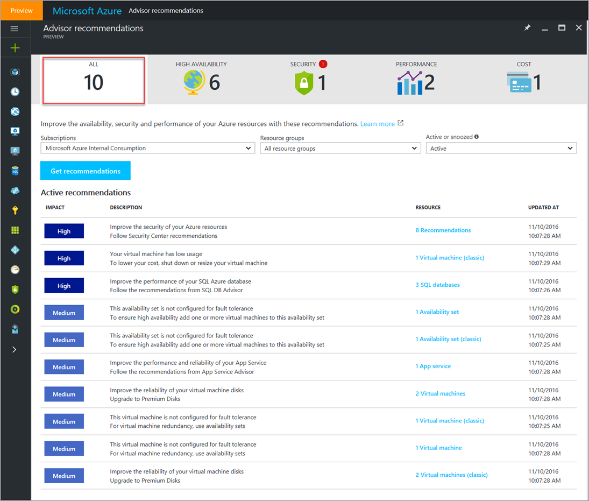

# Introduction to Azure Advisor

Learn about Azure Advisor and its key capabilities, and get answers to frequently asked questions.

## What is Advisor?
Advisor is a personalized cloud consultant that helps you follow best practices to optimize your Azure deployments. It analyzes your resource configuration and usage telemetry and then recommends solutions that can help you improve the cost effectiveness, performance, high availability, and security of your Azure resources.

With Advisor, you can:
* Get proactive, actionable, and personalized best practices recommendations. 
* Improve the performance, security, and high availability of your resources, as you identify opportunities to reduce your overall Azure spend.
* Get recommendations with proposed actions inline.

You can access Advisor through the [Azure portal](https://aka.ms/azureadvisordashboard). Sign in to the [portal](https://portal.azure.com), select **Browse**, and then scroll to **Azure Advisor**. The Advisor dashboard displays personalized recommendations for a selected subscription. 

The recommendations are divided into four categories: 

* **High Availability**: To ensure and improve the continuity of your business-critical applications. For more information, see [Advisor High Availability recommendations](advisor-high-availability-recommendations.md).

* **Security**: To detect threats and vulnerabilities that might lead to security breaches. For more information, see [Advisor Security recommendations](advisor-security-recommendations.md).

* **Performance**: To improve the speed of your applications. For more information, see [Advisor Performance recommendations](advisor-performance-recommendations.md).

* **Cost**: To optimize and reduce your overall Azure spend. For more information, see [Advisor Cost recommendations](advisor-cost-recommendations.md).

  

> [!NOTE]
> To access Advisor recommendations, you must first *register your subscription* with Advisor. A subscription is registered when a *subscription Owner* launches the Advisor dashboard and clicks the **Get recommendations** button. This is a *one-time operation*. After the subscription is registered, you can access Advisor recommendations as *Owner*, *Contributor*, or *Reader* for a subscription, a resource group, or a specific resource.

You can click a recommendation to learn more about it. You can also learn about actions that you can perform to take advantage of an opportunity or resolve an issue. 

Advisor offers recommendations with inline actions or documentation links. Clicking an inline action takes you through a “guided user journey” to implement it. Clicking a documentation link points you to documentation that describes how to manually implement the action. 

Advisor updates recommendations hourly. If you don’t intend to take immediate action on a recommendation, you can snooze it for a specified time period or dismiss it. 

## Frequently asked questions

### How do I access Advisor?
You can access Advisor through the [Azure portal](https://aka.ms/azureadvisordashboard). Sign in to the [portal](https://portal.azure.com), select **Browse**, and then scroll to **Azure Advisor**. The Advisor dashboard displays personalized recommendations for a selected subscription. 

You can also view Advisor recommendations through the virtual machine resource blade. Choose a virtual machine, and then scroll to Advisor recommendations in the menu. 

### What permissions do I need to access Advisor?

To access Advisor recommendations, you must first *register your subscription* with Advisor. A subscription is registered when a *subscription Owner* launches the Advisor dashboard and clicks the **Get recommendations** button. This is a *one-time operation*. After the subscription is registered, you can access Advisor recommendations as *Owner*, *Contributor*, or *Reader* for a subscription, a resource group, or a specific resource.

### How often are Advisor recommendations updated?

Advisor recommendations are updated hourly.

### What resources does Advisor provide recommendations for?

Advisor provides recommendations for virtual machines, availability sets, application gateways, App Services, SQL servers, SQL databases, and Redis Cache.

### Can I snooze or dismiss a recommendation?

To snooze or dismiss a recommendation, click the **Snooze** button or link. You can specify a snooze time period or select **Never** to dismiss the recommendation.

## Next steps

To learn more about Advisor recommendations, see:

* [Get started with Advisor](advisor-get-started.md)
* [Advisor High Availability recommendations](advisor-high-availability-recommendations.md)
* [Advisor Security recommendations](advisor-security-recommendations.md)
* [Advisor Performance recommendations](advisor-performance-recommendations.md)
* [Advisor Cost recommendations](advisor-cost-recommendations.md)
