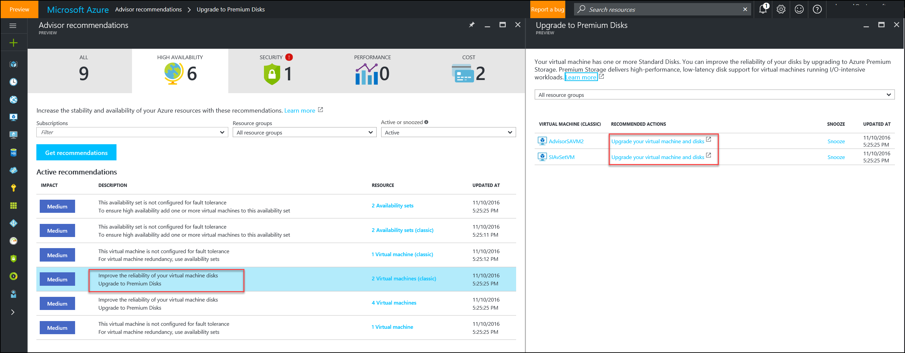
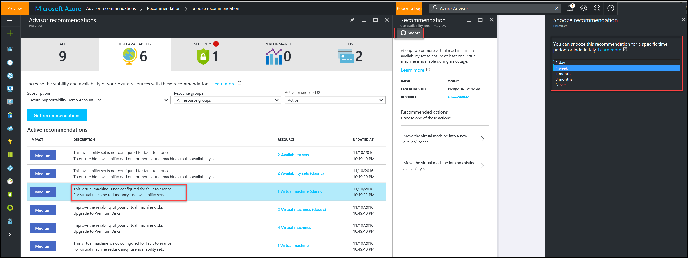

# Introduction to Azure Advisor

## What is Azure Advisor?
Azure Advisor is a personalized cloud consultant that helps you follow best practices to optimize your Azure deployments. It analyzes your resource configuration and usage telemetry to detect risks and potential issues. It then recommends solutions to help improve the performance, security, and high availability of your resources while looking for opportunities to reduce your overall Azure spend.

## Introductory walkthrough

You can access Advisor through the [Azure portal](https://aka.ms/azureadvisordashboard). Sign into the [portal](https://portal.azure.com), select **Browse**, and then scroll to **Azure Advisor**. 

  

On the Azure Advisor dashboard, you can select a subscription that you want to receive recommendations for. The Advisor dashboard then displays surface personalized recommendations for your deployment, by scanning and analyzing resources for that subscription.

The recommendations are divided into four categories:

-   **High Availability** – to ensure and improve the continuity of your business-critical applications

-   **Security** – to detect threats and vulnerabilities that could lead to potential security breaches

-   **Performance** – to enhance the speed of your applications

-   **Cost** – to optimize and reduce your overall Azure spend

  

You can click on a recommendation to learn additional information about it. You can also learn about actions you can perform to take advantage of an opportunity or resolve an issue. 

> [!NOTE]
> The Advisor dashboard displays recommendations related to resources where you have been assigned the role of **Owner, Contributor, or Reader to the subscription** that the resource belongs to.

Advisor offers recommendations with inline actions or documentation links. Clicking an inline action takes you through a “guided user journey” to implement it. Clicking a documentation link points you to the documentation that describes how you can manually implement the action. 

Here's an example of a documentation link in the Advisor recommendation blade:

Here's an example of inline action in the Advisor recommendation blade:

After you’ve implemented a recommended action, the recommendation remains visible in the dashboard for a while. Advisor updates recommendations on an hourly basis.  If you don’t intend to take an immediate action, you can snooze a recommendation for a period. You can also dismiss a recommendation (choose **snooze** and select **Never**)

## Next steps

See these resources to learn more about Advisor recommendations:
-  [Advisor FAQs](advisor-faqs.md)
-  [Get Started with Advisor](advisor-get-started.md)
-  [Advisor High Availability Recommendations](advisor-high-availability-recommendations.md)
-  [Advisor Security Recommendations](advisor-security-recommendations.md)
-  [Advisor Performance Recommendations](advisor-performance-recommendations.md)
-  [Advisor Cost Recommendations](advisor-performance-recommendations.md)
