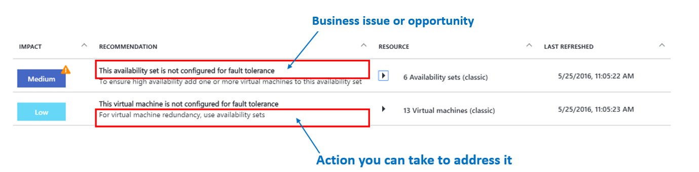

<properties
   pageTitle="Azure Advisor | Microsoft Azure"
   description="Use Azure advisor to optimize your Azure deployments."
   services="advisor"
   documentationCenter=""
   authors="kumudd"
   manager="carmonm"
   editor="" />
<tags
   ms.service="advisor"
   ms.devlang="na"
   ms.topic="article"
   ms.tgt_pltfrm="na"
   ms.workload="na"
   ms.date="11/16/2016"
   ms.author="kumudd" />

# Introduction to Azure Advisor

## What is Azure Advisor?
Azure Advisor is a personalized cloud consultant that helps you follow best practices to optimize your Azure deployments. It analyzes your resource configuration and usage telemetry to detect risks and potential issues. It then recommends solutions to help improve the performance, security and high availability of your resources while looking for opportunities to reduce your overall Azure spend.

## Key capabilities
<TBD - Add capability content here.>

## Advisor recommendations types

The Advisor dashboard surfaces personalized recommendations for your deployment, by scanning and analyzing resources for that subscription. The recommendations are divided into four categories:

-   **High Availability** – to ensure and improve business continuity

-   **Security** – to detect threats and vulnerabilities that may lead to potential security breaches

-   **Performance** – to enhance and boost your system performance

-   **Cost** – to reduce your overall Azure spend

> [AZURE.NOTE]
> The Advisor dashboard displays recommendations related to resources where you have been assigned the role of **Owner, Contributor, or Reader to the subscription** that the resource belongs to.

<TBD: Add new screenshot>

  

The Advisor dashboard displays a summarized list of recommendations. For each recommendation, you can view the following information:

-   **Impact** - The business impact and risk addressed by the recommendation. This will have one of the following values:

|Impact value| Description  |
|---------------------------------------------------------|------------------------------------------------------------------------------------------------------------------------------------------------------------------------------------------------------------------------|
|   | This recommendation addresses a ***high business impact, high risk*** issue. Implement this recommendation to help resolve an existing problem that can significantly impede the health of your business application.      |
|  | This recommendation addresses a ***high business impact*** opportunity. Implement this recommendation to notably improve the performance, high availability, or security of your resource, or help you save money.    |
|  | This recommendation addresses a ***medium business impact, medium risk*** issue. Implement this recommendation to resolve a potential problem that can moderately impede the health of your business application.       |
|  | This recommendation addresses a ***medium business impact*** opportunity. Implement this recommendation to substantially improves the performance, high availability, or security of your resource, or help save money. |
|  | The recommendation addresses a ***low business impact*** opportunity. Implement this recommendation to improve the performance, high availability, or security of your resource, or help save money.                   |

-   **Recommendation** – A description of the potential issue or business opportunity, and an action that you can take to address it.
<TBD: Add new screenshot>

    

-   **Resource** – The resource the recommendation applies to. Advisor groups recommendations that apply to multiple resources.
<TBD: Add new screenshot>

  

-   **Last updated** – The last time Advisor checked if the recommendation was applicable or the last time Advisor refreshed the recommendation. See Refresh recommendations <add link> for more information.

## Related

-  [Advisor FAQs](advisor-FAQs.md)
-  [Get Started with Advisor](advisor-get-started.md)
-  [Advisor High Availability Recommendations](advisor-high-availability-recommendations.md)
-  [Advisor Security Recommendations](advisor-security-recommendations.md)
-  [Advisor Performance Recommendations](advisor-performance-recommendations.md)
-  [Advisor Cost Recommendations](advisor-performance-recommendations.md)
