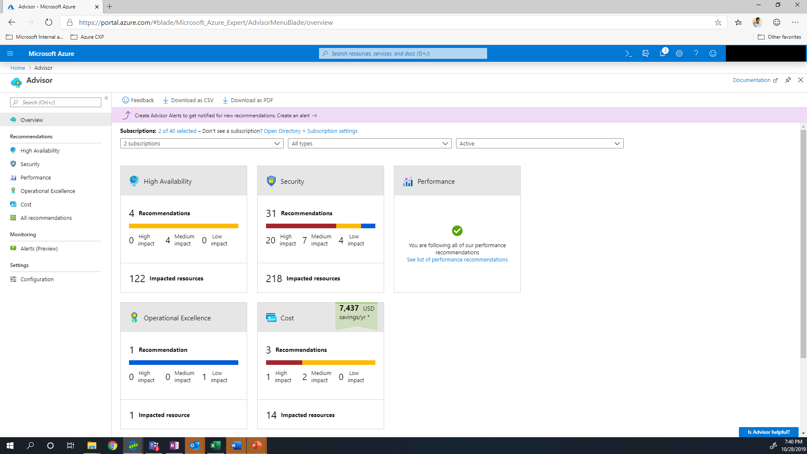
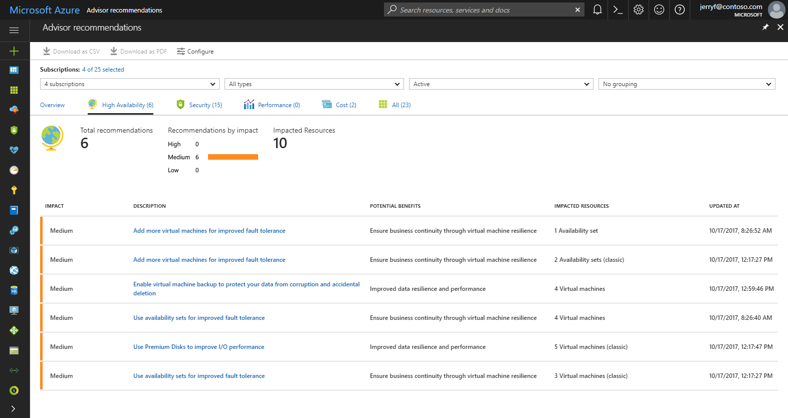

# Introduction to Azure Advisor

Learn about the key capabilities of Azure Advisor and get answers to frequently asked questions.

## What is Advisor?
Advisor is a personalized cloud consultant that helps you follow best practices to optimize your Azure deployments. It analyzes your resource configuration and usage telemetry and then recommends solutions that can help you improve the cost effectiveness, performance, high availability, and security of your Azure resources.

With Advisor, you can:
* Get proactive, actionable, and personalized best practices recommendations. 
* Improve the performance, security, and high availability of your resources, as you identify opportunities to reduce your overall Azure spend.
* Get recommendations with proposed actions inline.

You can access Advisor through the [Azure portal](https://aka.ms/azureadvisordashboard). Sign in to the [portal](https://portal.azure.com), locate **Advisor** in the navigation menu, or search for it in the **All services** menu.

The Advisor dashboard displays personalized recommendations for all your subscriptions.  You can apply filters to display recommendations for specific subscriptions and resource types.  The recommendations are divided into four categories: 

* **High Availability**: To ensure and improve the continuity of your business-critical applications. For more information, see [Advisor High Availability recommendations](advisor-high-availability-recommendations.md).
* **Security**: To detect threats and vulnerabilities that might lead to security breaches. For more information, see [Advisor Security recommendations](advisor-security-recommendations.md).
* **Performance**: To improve the speed of your applications. For more information, see [Advisor Performance recommendations](advisor-performance-recommendations.md).
* **Cost**: To optimize and reduce your overall Azure spending. For more information, see [Advisor Cost recommendations](advisor-cost-recommendations.md).

  

You can click a category to display the list of recommendations within that category, and select a recommendation to learn more about it.  You can also learn about actions that you can perform to take advantage of an opportunity or resolve an issue.

 

Select the recommended action for a recommendation to implement the recommendation.  A simple interface will open that enables you to implement the recommendation or refer you to documentation that assists you with implementation.  Once you implement a recommendation, it can take up to a day for Advisor to recognize that.

If you do not intend to take immediate action on a recommendation, you can postpone it for a specified time period or dismiss it.  If you do not want to receive recommendations for a specific subscription or resource group, you can configure Advisor to only generate recommendations for specified subscriptions and resource groups.

## Frequently asked questions

### How do I access Advisor?
You can access Advisor through the [Azure portal](https://aka.ms/azureadvisordashboard). Sign in to the [portal](https://portal.azure.com), locate **Advisor** in the navigation menu, or search for it in the **All services** menu.

You can also view Advisor recommendations through the virtual machine resource interface. Choose a virtual machine, and then scroll to Advisor recommendations in the menu. 

### What permissions do I need to access Advisor?
 
You can access Advisor recommendations as *Owner*, *Contributor*, or *Reader* of a subscription.

### What resources does Advisor provide recommendations for?

Advisor provides recommendations for Application Gateway, App Services, availability sets, Azure Cache, Azure Data Factory, Azure Database for MySQL, Azure Database for PostgreSQL, Azure Database for MariaDB, Azure ExpressRoute, Azure Cosmos DB, Azure public IP addresses, SQL Data Warehouse, SQL servers, storage accounts, Traffic Manager profiles, and virtual machines.

Azure Advisor also includes your recommendations from [Azure Security Center](https://docs.microsoft.com/azure/security-center/security-center-recommendations) which may include recommendations for additional resource types.

### Can I postpone or dismiss a recommendation?

To postpone or dismiss a recommendation, click the **Postpone** link. You can specify a postpone period or select **Never** to dismiss the recommendation.

## Next steps

To learn more about Advisor recommendations, see:

* [Get started with Advisor](advisor-get-started.md)
* [Advisor High Availability recommendations](advisor-high-availability-recommendations.md)
* [Advisor Security recommendations](advisor-security-recommendations.md)
* [Advisor Performance recommendations](advisor-performance-recommendations.md)
* [Advisor Cost recommendations](advisor-cost-recommendations.md)
