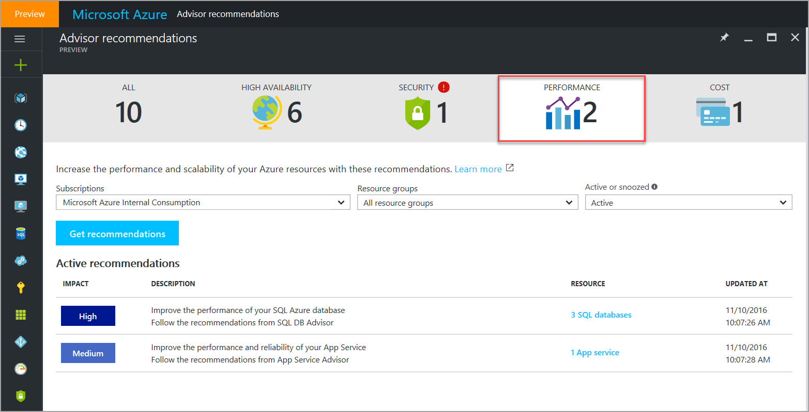
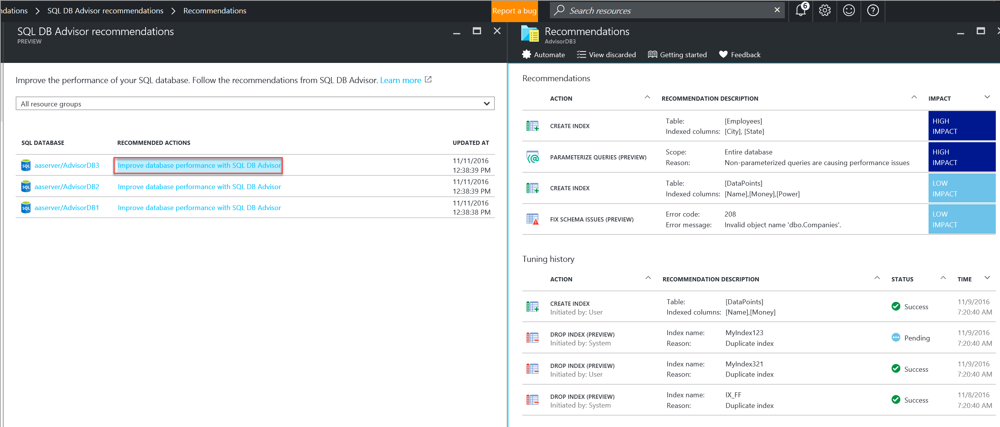

# Advisor Performance recommendations

Advisor performance recommendations help enhance and improve the speed and responsiveness of your business-critical applications. You can get performance recommendations using Advisor from the **Performance** tab of the Advisor dashboard.

## SQL database recommendations

Advisor provides you with a consistent, consolidated view of recommendations for all your Azure resources. It integrates with SQL Database Advisor to bring you recommendations for improving the performance of your SQL Azure database. SQL Database Advisor assesses the performance of your SQL Azure databases by analyzing your usage history. It then offers recommendations that are best suited for running your database’s typical workload. 

> [!NOTE]
> To get recommendations a database must have about a week of usage, and within that week there must be some consistent activity. SQL Database Advisor can more easily optimize for consistent query patterns than it can for random spotty bursts of activity.

For more information about SQL database advisor, see [SQL Database Advisor](https://azure.microsoft.com/en-us/documentation/articles/sql-database-advisor/).

## Redis Cache recommendations

Azure Advisor identifies Redis Cache instances where performance may be adversely impacted by high memory usage, server load, network bandwidth, or large number of client connections. It also provides best practices recommendations to avoid potential issues. For more information about Redis Cache recommendations, see [Redis Cache Advisor](https://azure.microsoft.com/en-us/documentation/articles/cache-configure/#redis-cache-advisor).

## App Services recommendations

Azure Advisor integrates best practices recommendations for improving your App Services experience and discovering relevant platform capabilities. Examples of App Services recommendations are:
- detection of instances where memory or CPU resources are exhausted by app runtimes with mitigation options
- detection of instances where collocating resources like web apps and databases can improve performance and lower cost. 

For more information about App Services recommendations, see [Best Practices for Azure App Service](https://azure.microsoft.com/en-us/documentation/articles/app-service-best-practices/).

## How to access Performance recommendations in Advisor

1. Sign in into the [Azure portal](https://portal.azure.com).
2. In the left-navigation pane, click **More services**, in the service menu pane, scroll down to **Monitoring and Management**, and then click **Azure Advisor**. This launches the Advisor dashboard. 
3. On the Advisor dashboard, click the **Performance** tab, and select the subscription for which you’d like to receive recommendations.

> [!NOTE]
> Advisor generates recommendations for subscriptions where you are assigned the role of **Owner, Contributor, or Reader**.

## Next steps

See these resources to learn more about Advisor recommendations:

-  [Introduction to Advisor](advisor-overview.md)
-  [Get started with Advisor](advisor-get-started.md)
-  [Advisor High Availability recommendations](advisor-high-availability-recommendations.md)
-  [Advisor Security recommendations](advisor-security-recommendations.md)
-  [Advisor Cost recommendations](advisor-performance-recommendations.md)
