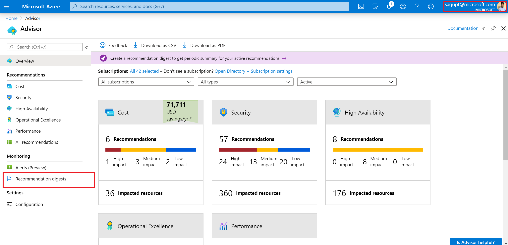
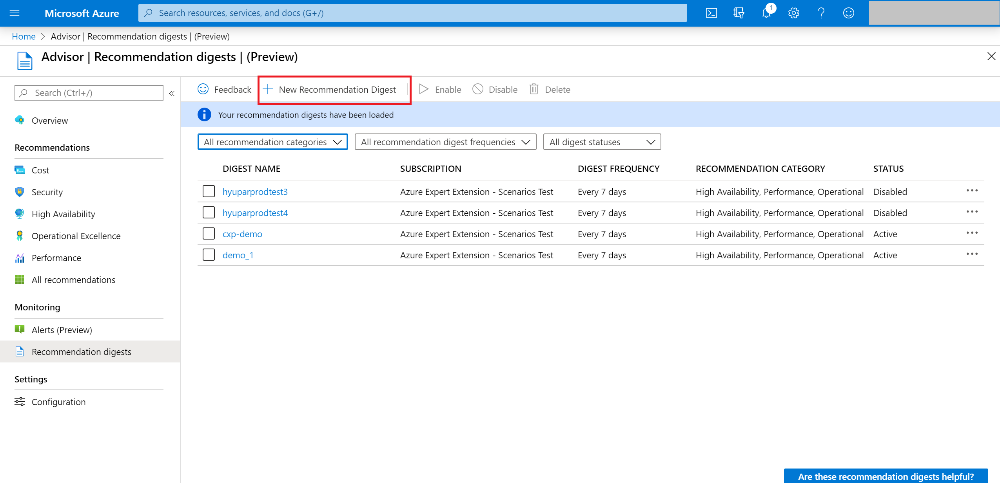
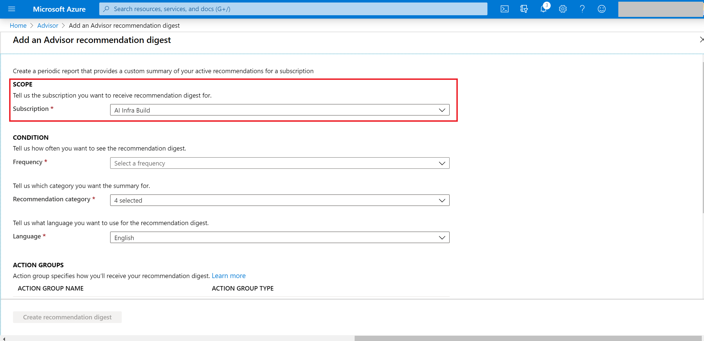
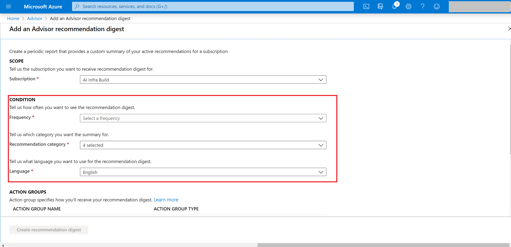
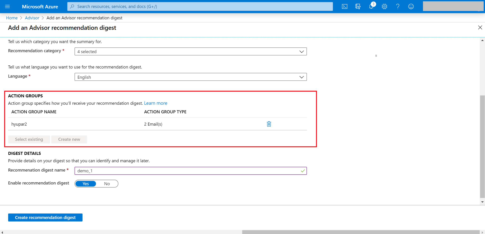
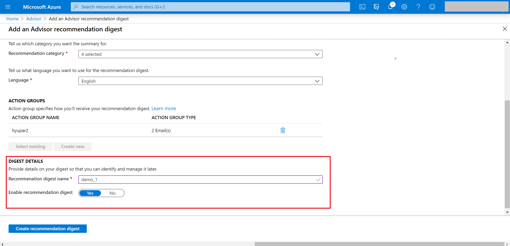

---

title: Recommendations digest for Azure Advisor
description: Get periodic summary for your active recommendations
ms.topic: article
ms.date: 03/16/2020
ms.author: sagupt

---

# Configure periodic summary for recommendations

Advisor **recommendations digest** provides an easy and proactive way to stay on top of your active recommendations, across different categories. The feature provide the ability to configure periodic notifications for the summary of all your active recommendations, across different categories. You can choose your desired channel for notifications like email, sms or any other. 
This article shows you how to set-up a **recommendations digest** for your Advisor recommendations.

## Setting-up your recommendations digest 

The **recommendations digest** creation experience helps you configure the summary. You can select below parameters for configurations:
1. Category: We have recommendation categories like cost, high availability, performance and operational excellence *(the capability is not available for security recommendations yet)*
2. Frequency of digest: This can be weekly, bi-weekly and monthly.
3. Action Group: You can either select an existing action group or create a new action group.To learn more about action groups, see [Create and manage action groups](https://docs.microsoft.com/azure/azure-monitor/platform/action-groups).
4. Language for the digest
5. Recommendation digest name: You can use a user-friendly string to better track and monitor the digests.

## Steps to create recommendations digest in Azure portal

Here are the steps to create **Recommendations Digest:**
* **Step 1:** In the Azure portal, go to **Advisor** and under **Monitoring** section and select **Recommendations digest** 

   

* **Step 2:** Select **New recommendations digest** from the top bar as below:

   

* **Step 3:** In the **scope** section, select the **subscription** for your digest

* **Step 4:** In the **condition** section, select the configurations like **category**, **frequency** and **language**

   

* **Step 5:** In the **action group** section, select the **action group** for the digest. You can learn more here - [Create and manage action groups](https://docs.microsoft.com/azure/azure-monitor/platform/action-groups)

   

* **Step 6:** In this final section for **digest details**, you can assign a name and state to your recommendations digest. 

Press **Create recommendations digest** to complete the set-up.

   

## Next steps

For more information about Advisor recommendations, see:
* [Introduction to Azure Advisor](advisor-overview.md)
* [Get started with Advisor](advisor-get-started.md)
* [Advisor Cost recommendations](advisor-cost-recommendations.md)
* [Advisor Performance recommendations](advisor-performance-recommendations.md)
* [Advisor Security recommendations](advisor-security-recommendations.md)
* [Advisor Operational Excellence recommendations](advisor-operational-excellence-recommendations.md)
* [Advisor REST API](https://docs.microsoft.com/rest/api/advisor/)
