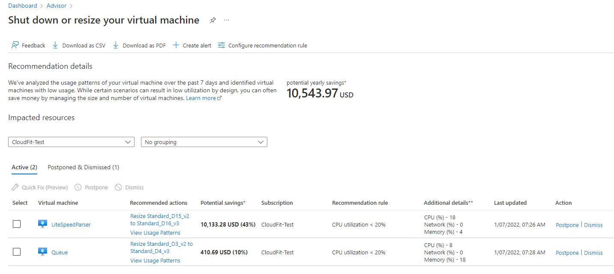

# What's new in Azure Advisor?

Learn what's new in the service. These items may be release notes, videos, blog posts, and other types of information. Bookmark this page to stay up to date with the service.
## May 2023
### Service retirement workbook

It is important to be aware of the upcoming Azure service and feature retirements to understand their impact on your workloads and plan migration. The [Service Retirement workbook](https://portal.azure.com/#view/Microsoft_Azure_Expert/AdvisorMenuBlade/~/workbooks) provides a single centralized resource level view of service retirements and helps you assess impact, evaluate options, and plan migration. 
The workbook includes 35 services and features planned for retirement. You can view planned retirement dates, list and map of impacted resources and get information to make the necessary actions.

To learn more, visit [Prepare migration of your workloads impacted by service retirements](advisor-how-to-plan-migration-workloads-service-retirement.md).

## April 2023

### VM/VMSS right-sizing recommendations with custom lookback period

Customers can now improve the relevance of recommendations to make them more actionable, resulting in additional cost savings. 
The right sizing recommendations help optimize costs by identifying idle or underutilized virtual machines based on their CPU, memory, and network activity over the default lookback period of seven days. 
Now, with this latest update, customers can adjust the default look back period to get recommendations based on 14, 21, 30, 60, or even 90 days of use. The configuration can be applied at the subscription level. This is especially useful when the workloads have biweekly or monthly peaks (such as with payroll applications). 

To learn more, visit [Optimize virtual machine (VM) or virtual machine scale set (VMSS) spend by resizing or shutting down underutilized instances](advisor-cost-recommendations.md#optimize-virtual-machine-vm-or-virtual-machine-scale-set-vmss-spend-by-resizing-or-shutting-down-underutilized-instances).

## May 2022

### Unlimited number of subscriptions
It is easier now to get an overview of optimization opportunities available to your organization – no need to spend time and effort to apply filters and process subscription in batches.

To learn more, visit [Get started with Azure Advisor](advisor-get-started.md).

### Tag filtering

You can now get Advisor recommendations scoped to a business unit, workload, or team. Filter recommendations and calculate scores using tags you have already assigned to Azure resources, resource groups and subscriptions. Apply tag filters to:

* Identify cost saving opportunities by business units
* Compare scores for workloads to optimize critical ones first

To learn more, visit [How to filter Advisor recommendations using tags](advisor-tag-filtering.md).

## January 2022

[**Shutdown/Resize your virtual machines**](advisor-cost-recommendations.md#optimize-virtual-machine-vm-or-virtual-machine-scale-set-vmss-spend-by-resizing-or-shutting-down-underutilized-instances) recommendation was enhanced to increase the quality, robustness, and applicability.

Improvements include:  

1. Cross SKU family series resize recommendations are now available.  

1. Cross version resize recommendations are now available. In general, newer versions of SKU families are more optimized, provide more features, and have better performance/cost ratios than older versions. 

3. For better actionability, we updated recommendation criteria to include other SKU characteristics such as accelerated networking support, premium storage support, availability in a region, inclusion in an availability set, etc. 

Read the [How-to guide](advisor-cost-recommendations.md#optimize-virtual-machine-vm-or-virtual-machine-scale-set-vmss-spend-by-resizing-or-shutting-down-underutilized-instances) to learn more.
